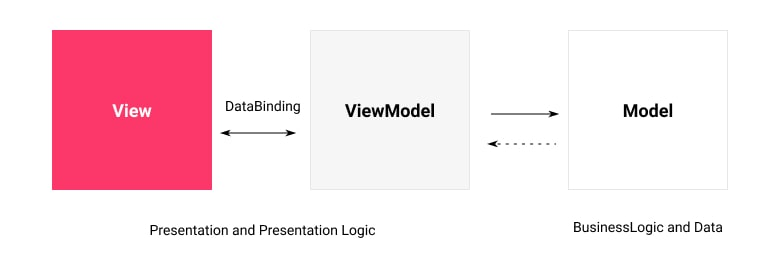
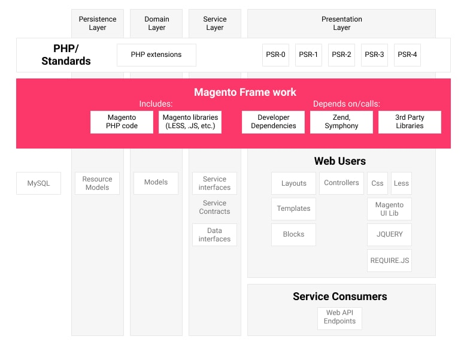

1 - Magento Architecture & Customisation Techniques
===================================================

1.0 What is a module?
---------------------

### Magento module overview

> A module is a logical group - that is, a directory containing
> blocks, controllers, helpers, models - that are related to a specific business feature. In
> keeping with Magento's commitment to optimal modularity, a module encapsulates one
> feature and has minimal dependencies on other modules.
>
> Modules and themes are the
> units of customization in Magento. Modules provide business features, with supporting logic,
> while themes strongly influence user experience and storefront appearance. Both components
> have a life cycle that allows them to be installed, deleted, and disabled. From the
> perspective of both merchants and extension developers, modules are the central unit of
> Magento organization.
>
> The Magento Framework provides a set of core logic: PHP code,
> libraries, and the basic functions that are inherited by the modules and other
> components

> Magento 2’s module-based architecture keeps that module’s files in one folder. This makes discovery of the functionality pertaining to that module easier.Modules live in one of two places:
>
>  • `app/code/MyVendor/MyModule`
>
>  • `vendor/vendor-name/module-name`


1.1 Describe Magento's module-based architecture
------------------------------------------------


Magento 2 modules are realised with MVVM architecture:





MVVM has three layers:

1.  Model - The Model contains the
            application's business logic and depends on an associated class—the
            ResourceModel – for database access. Models depend on service contracts to
            disclose their functionality to other application layers.
2.  View - The View is both
            structure and layout of what is seen on a screen – the actual HTML. This is
            achieved in the PHTML files distributed with modules. Such files are associated with
            each ViewModel in the Layout XML files, sometimes referred to as binders. The layout
            files can as well assign JavaScript files to be used on the final page.
3.  ViewModel -The ViewModel works
            together with the Model layer and exposes only necessary information to the View layer.
            In Magento 2, this is handled by the module's Block classes. Note that this was
            usually part of the Controller role of an MVC system. On MVVM, the controller is only
            responsible for handling the user flow, meaning that it receives requests and either
            tells the system to render a view or to redirect the user to another route.





Magento 2 architecture consists of 4 layers:

1.  Presentation Layer - Presentation Layer is the top layer that contains view elements
            (layouts, blocks, templates) and controllers.
Presentation Layer usually calls the
            service layer using service contracts. But, depending on the implementation, it may
            cross over with the business logic.
2.  Service Layer - Service layer is the layer between presentation and domain layers.
            It executes service contracts, which are implemented as PHP interfaces. Service
            contracts allow you to add or change the business logic resource model using the
            dependency injection file (di.xml). The service layer is also used to provide API access
            (REST / SOAP or other modules). The service interface is declared in the / API namespace
            of the module.
Data (entity) interface is declared inside / Api / Data. Data
            entities are the structures of data passed to and returned from service
            interfaces.
3.  Domain Layer - The domain layer is responsible for business logic that does not
            contain information about resources and the database. Also, the domain layer may include
            the implementation of service contracts. Each data model at the domain layer level
            depends on the resource model, which is responsible for the database access.
4.  Persistence Layer - The persistence layer describes a resource model that is responsible
            for retrieving and modifying data in a database using CRUD requests.
It also
            implements additional features of business logic, such as data validation and the
            implementation of database functions.


**Describe Module Registration**

How to register a Module - registration.php


```php
<?php
use Magento\Framework\Component\ComponentRegistrar;

ComponentRegistrar::register(
    ComponentRegistrar::MODULE,
    '<MY_VENDOR>\<MY_MODULE>',
    __DIR__
);
```


How to register a Language Package - registration.php


```php
<?php

use Magento\Framework\Component\ComponentRegistrar;

ComponentRegistrar::register(
    ComponentRegistrar::LANGUAGE,
    '<MY_VENDOR>\<MY_PACKAGE>',
    __DIR__
);

```


How to register a Theme - registration.php

```php
<?php

use Magento\Framework\Component\ComponentRegistrar;
    ComponentRegistrar::register(ComponentRegistrar::THEME,
    '<MY_AREA>/<MY_VENDOR>/<MY_THEME>',
    __DIR__
);
```


Register using composer.json autoload/files[] = "registration.php"


```json
{
    "name": "<MY_VENDOR>/<MY_MODULE>",
    "autoload": {
        "psr-4": {
            "MY\MODULE\": ""
        },
        "files": [
            "registration.php"
        ]
    }
}
```

registration.php search paths

Magento searches the following paths for registration:

*   app/code/*/*/cli_commands.php,registration.php
*   app/design/*/*/*/registration.php
*   app/i18n/*/*/registration.php
*   lib/internal/*/*/registration.php
*   lib/internal/*/*/*/registration.php

**What stage does registration occur?**

In composer - vendor/autoload.php:


```json
"autoload": {
    "files": [
        "app/etc/NonComposerComponentRegistration.php"
    ],
}
```

Not in composer - app/etc/NonComposerComponentRegistration.php:


```php
<?php

use Magento\Framework\Component\ComponentRegistrar;

ComponentRegistrar::register(
    ComponentRegistrar::MODULE,
    'Magento_Backend',
    __DIR__
);
```

**Describe module limitations? What side effects can come from this Interaction?**

Minimization of software dependencies is a cornerstone of Magento architecture. Based on this principle there are several logical limitations:

*   One module is responsible only for one feature.
*   Module dependencies on other modules must be declared
            explicitly.
*   Excluding or disabling a module should not disable another
            module.
*   Not all classes can be overridden with modules.


**How do different modules interact with each other?**


Magento 2 is PSR-4 compliant. As a main principle of module
                            interaction Magento 2 declares a [Dependency Injection](#h.9ofwnl5q9fnf) pattern and [Service
                                Contracts](https://devdocs.magento.com/guides/v2.3/extension-dev-guide/service-contracts/service-contracts.html&sa=D&ust=1609223264432000&usg=AOvVaw3Ed4_xgfeNaY3n4LjKlqbi).


Service Contracts


Magento 2 is PSR-4 compliant. As a main principle of module
                            interaction Magento 2 declares a dependency injection pattern and [Service
                                Contracts](https://devdocs.magento.com/guides/v2.3/extension-dev-guide/service-contracts/service-contracts.html&sa=D&ust=1609223264433000&usg=AOvVaw3FCs8IA6_CgCxPpmLJc36B). At the most basic level they are sets of PHP
                            interfaces that define certain elements of a module. The Service Contract approach has a lot
                            of benefits:


*   Easy to switch concrete implementation (this is done by setting
    a preference for the interface in the dependency injection configuration files
    etc/di.xml)
*   Consistency over versions
*   Clear public API of the classes
*   Easier unit testing


It's important to know what a Service Contract is and how it interacts with other modules. A Service Contract is a design pattern consisting of a set of PHP interfaces that are defined for a module, typically in the `<module_dir>/Data` directory which would house your Data Interfaces.

Data Interfaces define functions that return information about data entities such as search results, set validation rules and return validation results. You must define the data interfaces for a service contract in the Api/Data subdirectory of a module e.g. Customer module are in the app/code/Magento/Customer/Api/Data subdirectory.

[More info here](https://devdocs.magento.com/guides/v2.3/extension-dev-guide/service-contracts/design-patterns.html&sa=D&ust=1609223264435000&usg=AOvVaw2RT5AqHcc9eKc9fF2vhFDt).

Area Scope


One of the important parts of module interaction is a Magento area.
                            All components operate with the system and other components in the scope of default areas.


Magento has 5 areas types:

| Area code | Entry point | Directory path |Details
| --- | --- | --- | --- |
| `adminhtml` | `index.php` or `pub/index.php` | `<theme_dir>/app/design/adminhtml` | Code for components you'll see while working in the Admin panel |
| `frontend` | `index.php` or `pub/index.php` |  `<theme_dir>/app/design/frontend` | The storefront (or frontend) contains template and layout files that define the appearance of your storefront |
| `base` | `index.php` or `pub/index.php` | `<theme_dir>/app/design/base` OR `<theme_dir>/Magento_Checkout/layout/override/base/` | Used as a fallback for files absent in adminhtml and frontend areas |
| `crontab` | `cron.php` | `cron.php` | CRON schedule tasks |
| `webapi_rest` |  `index.php` or `pub/index.php` | `https://<magento.host>/rest/V1/products/:sku` |  The REST area has a front controller that understands how to do URL lookups for REST-based URLs |
| `webapi_soap` | `index.php` or `pub/index.php` | WSDL: `https://<magento.host>/soap/<optional_store_code>?wsdl&services=<service_name_1>,<service_name_2>`| The XML SOAP area for API returning SOAP format. |
| `graphql` | `index.php` or `pub/index.php` | `https://<magento.host>/graphql` | An alternative to REST and SOAP web APIs for frontend development Mainly used for B2C use cases including: Reorders, Inventory Management store pickups, Order history for logged in customers, Replace product-specific mutations that add, products to a cart with a single mutation that can handle all product types, Gift wrapping and messages, Saved payment methods |

Module dependencies


Modules can contain dependencies upon these software components:

*   Other Magento modules.
*   PHP extensions.
*   Third party libraries.


1.2 Describe Magento's directory structure
------------------------------------------

**Determine how to locate different types of files in Magento. Where are the files containing JavaScript, HTML, and PHP located?**

* `view/{area}/web/js`
* `view/{area}/web/template`
* `view/{area}/web/css`
* `view/{area}/requirejs-config.js`
* `view/{area}/layout`
* `view/{area}/templates`
* `lib/` - Some supporting JS and CSS files are found here.

> **Where**
>
> * `{area}` = Application Area code e.g. `frontend` or `adminhtml`


**How do you find the files responsible for certain functionality?**

Common directories of a module:


* `Api` - The /Api folder stores the contracts for modules that contain specific actions that can be reliably utilized from various places in the app.
    * `Api/Data` - This folder contains interfaces that represent data. Examples of this would be a Product interface, a Category interface or a Customer interface. The concrete implementations of these interfaces usually do little more than provide getters and setters for data (a.k.a Data Transfer Objects).
* `Block` - PHP view
                            classes as part of Model View Controller(MVC) vertical implementation of module
                            logic.
* `Console` - Console CLI
                            commands
* `Controller` - PHP
                            controller classes as part of MVC vertical implementation of module logic.
    * `Controller/Adminhtml` - Admin
                            controllersCron - Cron job
                            classes
* `Cron` - This folder is the standard place for storing actions that are executed on a schedule (cron job).
* `etc` - Configuration
                            files; in particular, `module.xml`, which is required.
* `Helper` - Helpers
* `i18n` - Localization files in CSV format (languages)
* `Model` - PHP model classes as part of MVC
                            vertical implementation of module logic.
    * `Model/ResourceModel` - Database
                            interactionsObserver - Event
                            listeners
* `Observer` - Event Listeners. When Magento fires an event, listeners that are attached to it are called. This decouples the system.
* `Plugin` - Contains any
                            needed plug-ins.
* `Setup` -
                            Classes for module database structure and data setup which are invoked when installing or
                            upgrading.
* `Test` - Unit Tests
                            tests
* `Ui` - UI component
                            classes, forms, grid etc
* `view` - View files, including static view files, design templates, email
                            templates, and layout files:
  * `view/{area}/email`
  * `view/{area}/layout`
  * `view/{area}/templates`
  * `view/{area}/ui_component`
  * `view/{area}/ui_component/templates`
  * `view/{area}/web`
  * `view/{area}/web/template`
  * `view/{area}/requirejs-config.js`


You do not have to memorise all this, the important thing to understand is that when you are produced a file or directory name, you understand what it's purpose is for.

* Magento root app directory location `<magento_install_dir>/app`:

* Modules - `app/code`.

* Storefront themes - `app/design/frontend`.

* Admin themes - `app/design/adminhtml`.

* Language packages - use `app/i18n`.

* Or (via composer): `<magento_install_dir>/vendor`


**What files are required when creating a module?**


* `registration.php`: Among other things, this file specifies the directory in which
                            the component is installed by vendors in production environments. By default, composer
                            automatically installs components in the /vendor directory. For more information, see
                            Component registration.

* `etc/module.xml`: This file specifies basic information about the component such
                            as the components dependencies and its version number. This version number is used to
                            determine schema and data updates when bin/magento setup:upgrade is
                            run.

* `composer.json`: Specifies component dependencies and other metadata. For more
                            information, see Composer integration.


1.3 Utilize configuration XML and variables scope
-------------------------------------------------

**Determine how to use configuration files in Magento. Which configuration files correspond to different features and functionality?**


* [`acl.xml`](#h.gk6g5dbgvggm) - Restricting menu
                            actions, resource title, sortadminhtml/rules/payment_{country}.xml -
                            PayPaladdress_formats.xml
address_types.xml - format code and title only[cache.xml](#h.d3c5w1uvsp70) - Create custom cache type, name, instance - e.g. full_page=Page
                            Cachecatalog_attributes.xml - Contains the list of attributes that serve different purposes.
                            catalog_category, catalog_product, unassignable, used_in_autogeneration, quote_item
                            *[communication.xml](#h.c0x3qack8ych) - Queue Consumer
* [`config.xml`](#h.glpavwxvxuhd) - Adminhtml menus default values
* [`crontab.xml`](#h.nzp3v0np709e) - CRON tasks group[], job instance, method, schedule
* [`cron_groups.xml`](#h.nzp3v0np709e) - Grouping
                            / split processes
* [`di.xml`](#h.9ofwnl5q9fnf) - preferences,
                            plugins, virtual types


* [`db_schema.xml`](#h.iqvl9uln4170) - Declarative setup declares what the database structure should
                            be.
* [`eav_attributes.xml`](#h.wm8oeat9wvdw) - EAV
                            attribute configuration: locked entity attributes (global, unique etc.)
* email_templates.xml - Specifies email templates that are used in Magento. The template id is the concatenated XML-style path to where in system configuration template is specified.
* [`events.xml`](#h.y2lezqicnwxl) -
                            Define an Observers: shared, disabled *export.xml - Add new column to exports
* [`extension_attributes.xml`](#h.15bsya8yrb45) -
                            Extension attributes, for, attribute code, attribute typefieldset.xml - Magento UI Object copying, e.g.
                            customer address copy firstname lastname with
* `import.xml` - same as export but
                            import
* [`indexer.xml`](#h.xa0vtkhng9ut) - Create a new
                            indexer class, view_id, title, description
* [integration.xml](#h.t252zlddzc3r)

    * [`integration/api.xml`](#h.85qnykcohlui) -
                            Defines which API resources the integration has access to.
    * [`integration/config.xml`](#h.pbacdg8dooea) - An
                            Integrations pre-configured with default values.
* [`menu.xml`](#h.gk6g5dbgvggm) - Admin main left menu
* [`module.xml`](#h.n1343l3gk3km) - (required) Defines a module: version, sequence
* [`mview.xml`](#h.2m5sw7piaq5j) - Indexes, React to MySQLtriggers - scheduled updates, subscribe to
                            table changes, indexer model
* `page_types.xml`
* [`payment.xml`](#h.ctho0c6bcdkk) - Declaring a
                            new Payment Method: groups, method allow_multiple_addresspdf.xml - renders by type (invoice,
                            shipment, credit memo) and product typeproduct_types.xml - Create a new product
                            type. label, model instance, index priority, (?) custom attributes, (!) composable
                            typesproduct_options.xml


* [`queue.xml`](https://devdocs.magento.com/guides/v2.4/extension-dev-guide/message-queues/queue-migration.html&sa=D&ust=1609223264462000&usg=AOvVaw3OB1YP_nd35xQiu2i7KxN9) - (deprecated) Old way of defining a new Queue consumer [see
                                this article](https://devdocs.magento.com/guides/v2.4/extension-dev-guide/message-queues/queue-migration.html&sa=D&ust=1609223264463000&usg=AOvVaw3PMNONHbowdtWoeZa0GGUF) on how to upgrade this.


* [`queue_consumer.xml`](#h.bokyb17e6arz) - Where we define the consumer parameters. It's also possible to declare a
                            handler class in this file.


* [`queue_topology.xml`](#h.qakz6upsjogv) - Defines the message routing rules and declares queues and exchanges.


* [`queue_publisher.xml`](#h.yx5eensvx7ac) - Send a message to a message bus without knowing who is interested in the
                            message.
* `resources.xml`
* [`routes.xml`](#h.39aby0sbkm32) - Map a Controller to a
                            Route. Creating a new Router
                            (when module/action/method doesn't fit).
* [`sales.xml`](#h.6bmvxvofcj95) - Define totals for entities (quote, order, invoice, credit
                            memo)search_engine.xml -
search_request.xml - Elastic search
                            related: index, dimensions, queries, filters, aggregations, bucketssections.xml - action route placeholder
                            -> invalidate customer sections
* [`system.xml`](#h.op69p944prs) - adminhtml menu
                            system configvalidation.xml - Regex validation entity, rules, constraints ->
                            classview.xml - vars by
                            module
* `view.xml` - Similar to `config.xml` but used for specifying default values for design configuration.
* [`webapi.xml`](#h.2lcvcwr56aq) - Create new API
                            route, method, service class and method, resourceswidget.xml - class, email compatible,
                            image, ttl (?), label, description, parameterszip_codes.xml
* `widget.xml` - Configures widgets to be used in products, CMS pages, and CMS blocks.


1.4 Demonstrate how to use dependency injection
-----------------------------------------------

**Describe Magento's dependency injection approach and architecture.**


> Dependency Injection is a design pattern that allows an object A
> to declare its dependencies to an external object B that supplies those dependencies. The
> dependencies declared by A are usually class interfaces and the dependencies B provides are
> concrete implementations for those interfaces. This allows for loose coupling of code
> because object A no longer needs to be concerned with initializing its own dependencies.
> Object B decides which implementations to provide to object A based on a configuration or
> desired behavior.


This is probably very useful to memorise as this question is more general programming related but also a big part of core Magento 2

**Identify how to use DI configuration files for customizing Magento?**

> Magento loads `di.xml` files and merges them all together from the
                            following stages:
*   Initial master file (`<magento_install_dir>/app/etc/di.xml`)
*   Global (`<module_dir>/etc/di.xml`)
*   Area-specific (`<module_dir>/etc/{area}/di.xml`)

Plugins
> Plugins allow you to wrap another class’ public functions, add a before method to modify the input arguments, or add an after method to modify the output. These will be discussed more in the next section.Example: `vendor/magento/module-catalog/etc/di.xml` (search for “plugins”)

Preferences
> Preferences are used to substitute entire classes. They can also be used to specify a concrete class for an interface. If you create a service contract for a repository in your /Api folder and a concrete class in /Model, you can create a preference like:

```xml
<preference for="MyVendor\MyModule\Api\PromotionRepositoryInterface" type="MyVendor\MyModule\Model\PromotionRepository" />
```

Virtual Types
> A virtual type allows the developer to create an instance of an existing class that has custom constructor arguments. This is useful in cases where you need a “new” class only because the constructor arguments need to be changed.This is used frequently in Magento to reduce redundant PHP classes.

Argument Preferences / Constructor Arguments
> It is possible to modify what objects are injected into specific classes by targeting the name of the argument to associate it with the new class.Now, with Magento 2, you can inject your custom class into any other classes constructor in di.xmlExample:

```xml
<config xmlns:xsi="http://www.w3.org/2001/XMLSchema-instance"-xsi:noNamespaceSchemaLocation="urn:magento:framework:ObjectManager/etc/config.xsd">
    <type name="MyVendor\ProductPromoter\Algorithms\Primary">
        <arguments>
            <argument name="basedOn" xsi:type="string">sort_order</argument>
        </arguments>
    </type>
</config>
```

**How are objects realized in Magento?**


> They are instantiated via the:

*   Object manager
*   Arguments via Dependency Injection


**Where would you set sensitive settings?**


* Shared config: `app/etc/config.php`
* Sensitive config:
                            `app/etc/env.php`


**Why is it important to have a centralized process creating object instances?**

> Through the Dependency inversion principle, Using interfaces in
> your code reduces the risk of incompatibility bugs when Magento changes the underlying
> implementation of those interfaces. It also avoids the inheritance, which means that
> applications become more flexible. In this, you don't need to think about the child
> classes when changing the parent one.


This is probably very useful to memorise as this question is more general programming related but also a big part of Magento 2

**How can you override a native class, inject your class into another object, and use other techniques available in di.xml (such as virtualTypes)?**


Using a DI preference from a custom module:

Preference `di.xml`
```xml
<preference for="" type="" />
```

> For `<virtualType>` Inject your class into another object: use a `<type/>` entry with a `<argument xsi:type="object">\Path\To\Your\Class</argument>` entry in the `<arguments/>` node.

Preferences in the di.xml are very commonly used.

1.5 Demonstrate ability to use plugins
--------------------------------------

**Demonstrate how to design complex solutions using the plugin's life cycle.**

> There are three types of plugins in magento: **around, before and after interceptors**. Classes, abstract classes and interfaces
> that are implementations of or inherit from classes that have plugins will also inherit plugins from the parent class. For example, if you create a plugin for `Magento\Catalog\Block\Product\AbstractProduct`, plugin methods will be called for all child classes, such as `Magento\Catalog\Block\Product\View`,`Magento\Catalog\Block\Product\ProductList\Upsell` and so on...


The important thing to remember here is that plugins' life cycles are based before, around and after the overriding method.

An around plugin should only be when the execution of the before and after plugins must be suppressed.

**How do multiple plugins interact, and how can their execution order be controlled?**

> The `sortOrder` property controls how your plugin interacts with other plugins on the same class.


**How do you debug a plugin if it doesn't work?**


> Magento automatically generates an Interceptor class for the
> plugin target and store it in the generated\code directory. If it's not working then
> this will not have been created in which you may need to compile DI or check the logs for
> errors.


**Identify strengths and weaknesses of plugins. What are the limitations of using plugins for customization? In which cases should plugins be avoided?**

> Plugins only work on public methods for any classes or interfaces. So plugins CANNOT be used on following:

1.  Final methods
2.  Final classes
3.  Non-public methods
4.  Class methods (such as static methods)
5.  _construct
6.  Virtual types
7.  Objects that are instantiated before Magento\Framework\Interception is bootstrapped


> Plugins are useful to modify the input, output, or execution of
> an existing method. Plugins are also best to be avoided in situations where an event
> observer will work. Events work well when the flow of data does not have to be
> modified.
> Around-plugins SHOULD only be used when behavior of an original method is
> supposed to be substituted in certain scenarios, they increase stack traces and affect
> performance. Used improperly, an around plugin can prevent the system from functioning. They
> can also make understanding what is going on by reading source code hard (spooky action at a
> distance).


Important and useful.

1.6 Configure event observers and scheduled jobs
------------------------------------------------

### Observers

Events are dispatched by modules when certain actions are triggered. In addition to its own events, Magento allows you to create your own events that can be dispatched in your code. When an event is dispatched, it can pass data to any observers configured to watch that event.

**Demonstrate how to configure observers. How do you make your observer only active on the frontend or backend?**

> Observers can be configured in the events.xml file. It can be global and specific to either front-end or back-end. The structure goes as follows within your Module:
*   `<module>/etc`
*   `<module>/etc/frontend`
*   `<module>/etc/adminhtml`

I've seen many questions about events.xml and area codes appear before in the past exam questions


Observers have the following properties:

*   name (required) - Name of the observer for the event
            definition
*   instance (required) - Class name of the observer
*   disabled - Is observer active or not (Default: false)

*   shared - Class lifestyle (Default: false)


Events dispatch by Magento\Framework\Event\Manager class that implement Magento\Framework\Event\ManagerInterface interface:
```php
$this->eventManager->dispatch('cms_page_prepare_save', ['page' => $model, 'request' => $this->getRequest()]);
```


### CRONtab

**Demonstrate how to configure a scheduled job. Which parameters are used in configuration, and how can configuration interact with server configuration?**

CRON group


> A cron group is a logical group that enables you to easily run cron
> for more than one process at a time. Most Magento modules use the default cron group. Each
> group is run on a separate PHP process.
> To declare new group and specify settings, create `<module>/etc/cron_groups.xml` file (store view scope):

```xml
<?xml version="1.0"?>

<config xmlns:xsi="http://www.w3.org/2001/XMLSchema-instance" xsi:noNamespaceSchemaLocation="urn:magento:module:Magento_Cron:etc/cron_groups.xsd">
    <group id="default">
        <schedule_generate_every>15</schedule_generate_every>
        <schedule_ahead_for>20</schedule_ahead_for>
        <schedule_lifetime>15</schedule_lifetime>
        <history_cleanup_every>10</history_cleanup_every>
        <history_success_lifetime>10080</history_success_lifetime>
        <history_failure_lifetime>10080</history_failure_lifetime>
        <use_separate_process>0</use_separate_process>
    </group>
</config>
```

CRON tab

> `crontab.xml` file is used to execute an action on schedule. This file always located in the <module>/etc/

Parameters used:

```xml
<?xml version="1.0"?>

<config>
    <group id="default">
        <job name="indexer_clean_all_changelogs" instance="Magento\Indexer\Cron\ClearChangelog" method="execute">
            <schedule>0 * * * *</schedule>
        </job>
    </group>
</config>
```

You won't be expected to write this off-by-heart but it will pay to understand it's required parameters

* `update/cron.php` - NOT used any more since 2.1
* `bin/magento setup:cron:run` - only used during installation
* `bin/magento cron:run` [–-group=] - the main cron run command
* `pub/cron.php` [--group=] in a web browser, protect with basic auth
* You can also override the schedule times of CRON groups via the admin in: __Admin > Stores > Configuration > Advanced > System > Cron (Scheduled * Tasks)__


All the times are in minutes.

**Identify the function and proper use of automatically available events, for example *_load_after, etc.**


Load, Save, Delete on Model, Flat Collections & EAV Collections before + after:
```
model_load_before,
{$_eventPrefix}_load_before
model_load_after,
{$_eventPrefix}_load_after
model_save_commit_after,
{$_eventPrefix}_save_commit_after
model_save_before,
{$_eventPrefix}_save_before
model_save_after,
{$_eventPrefix}_save_after
model_delete_before,
{$_eventPrefix}_delete_before
model_delete_after,
{$_eventPrefix}_delete_after
model_delete_commit_after,
{$_eventPrefix}_delete_commit_after
core_collection_abstract_load_before,
{_eventPrefix}_load_before
core_collection_abstract_load_after,
{_eventPrefix}_load_after
eav_collection_abstract_load_before
```


 Just remember that core events such as the above will feature _before and _after suffixes

1.7 Utilize the CLI
-------------------

**Describe the usage of bin/magento commands in the development cycle. Which commands are available?**

`php bin/magento`
```
Magento CLI 2.4.2-p1

Usage:
  command [options] [arguments]

Options:
  -h, --help            Display this help message
  -q, --quiet           Do not output any message
  -V, --version         Display this application version
      --ansi            Force ANSI output
      --no-ansi         Disable ANSI output
  -n, --no-interaction  Do not ask any interactive question
  -v|vv|vvv, --verbose  Increase the verbosity of messages: 1 for normal output, 2 for more verbose output and 3 for debug

Available commands:
  help                                                 Display help for a command
  list                                                 List commands
 admin
  admin:user:create                                    Creates an administrator
  admin:user:unlock                                    Unlock Admin Account
 app
  app:config:dump                                      Create dump of application
  app:config:import                                    Import data from shared configuration files to appropriate data storage
  app:config:status                                    Checks if config propagation requires update
 braintree
  braintree:migrate                                    Migrate stored cards from a Magento 1 database
 cache
  cache:clean                                          Cleans cache type(s)
  cache:disable                                        Disables cache type(s)
  cache:enable                                         Enables cache type(s)
  cache:flush                                          Flushes cache storage used by cache type(s)
  cache:status                                         Checks cache status
 catalog
  catalog:images:resize                                Creates resized product images
  catalog:product:attributes:cleanup                   Removes unused product attributes.
 cms
  cms:wysiwyg:restrict                                 Set whether to enforce user HTML content validation or show a warning instead
 config
  config:sensitive:set                                 Set sensitive configuration values
  config:set                                           Change system configuration
  config:show                                          Shows configuration value for given path. If path is not specified, all saved values will be shown
 cron
  cron:install                                         Generates and installs crontab for current user
  cron:remove                                          Removes tasks from crontab
  cron:run                                             Runs jobs by schedule
 customer
  customer:hash:upgrade                                Upgrade customer's hash according to the latest algorithm
 deploy
  deploy:mode:set                                      Set application mode.
  deploy:mode:show                                     Displays current application mode.
 dev
  dev:di:info                                          Provides information on Dependency Injection configuration for the Command.
  dev:profiler:disable                                 Disable the profiler.
  dev:profiler:enable                                  Enable the profiler.
  dev:query-log:disable                                Disable DB query logging
  dev:query-log:enable                                 Enable DB query logging
  dev:source-theme:deploy                              Collects and publishes source files for theme.
  dev:template-hints:disable                           Disable frontend template hints. A cache flush might be required.
  dev:template-hints:enable                            Enable frontend template hints. A cache flush might be required.
  dev:template-hints:status                            Show frontend template hints status.
  dev:tests:run                                        Runs tests
  dev:urn-catalog:generate                             Generates the catalog of URNs to *.xsd mappings for the IDE to highlight xml.
  dev:xml:convert                                      Converts XML file using XSL style sheets
 dotdigital
  dotdigital:connector:automap                         Auto-map data fields
  dotdigital:connector:enable                          Add Dotdigital API credentials and enable the connector
  dotdigital:migrate                                   Migrate data into email_ tables to sync with Engagement Cloud
  dotdigital:sync                                      Run syncs to populate email_ tables before importing to Engagement Cloud
  dotdigital:task                                      Run dotdigital module tasks on demand
 downloadable
  downloadable:domains:add                             Add domains to the downloadable domains whitelist
  downloadable:domains:remove                          Remove domains from the downloadable domains whitelist
  downloadable:domains:show                            Display downloadable domains whitelist
 encryption
  encryption:payment-data:update                       Re-encrypts encrypted credit card data with latest encryption cipher.
 i18n
  i18n:collect-phrases                                 Discovers phrases in the codebase
  i18n:pack                                            Saves language package
  i18n:uninstall                                       Uninstalls language packages
 indexer
  indexer:info                                         Shows allowed Indexers
  indexer:reindex                                      Reindexes Data
  indexer:reset                                        Resets indexer status to invalid
  indexer:set-dimensions-mode                          Set Indexer Dimensions Mode
  indexer:set-mode                                     Sets index mode type
  indexer:show-dimensions-mode                         Shows Indexer Dimension Mode
  indexer:show-mode                                    Shows Index Mode
  indexer:status                                       Shows status of Indexer
 info
  info:adminuri                                        Displays the Magento Admin URI
  info:backups:list                                    Prints list of available backup files
  info:currency:list                                   Displays the list of available currencies
  info:dependencies:show-framework                     Shows number of dependencies on Magento framework
  info:dependencies:show-modules                       Shows number of dependencies between modules
  info:dependencies:show-modules-circular              Shows number of circular dependencies between modules
  info:language:list                                   Displays the list of available language locales
  info:timezone:list                                   Displays the list of available timezones
  info:unirgy:list-modules                             List installed licenses
 inventory
  inventory:reservation:create-compensations           Create reservations by provided compensation arguments
  inventory:reservation:list-inconsistencies           Show all orders and products with salable quantity inconsistencies
 inventory-geonames
  inventory-geonames:import                            Download and import geo names for source selection algorithm
 maintenance
  maintenance:allow-ips                                Sets maintenance mode exempt IPs
  maintenance:disable                                  Disables maintenance mode
  maintenance:enable                                   Enables maintenance mode
  maintenance:status                                   Displays maintenance mode status
 media-content
  media-content:sync                                   Synchronize content with assets
 media-gallery
  media-gallery:sync                                   Synchronize media storage and media assets in the database
 module
  module:config:status                                 Checks the modules configuration in the 'app/etc/config.php' file and reports if they are up to date or not
  module:disable                                       Disables specified modules
  module:enable                                        Enables specified modules
  module:status                                        Displays status of modules
  module:uninstall                                     Uninstalls modules installed by composer
 newrelic
  newrelic:create:deploy-marker                        Check the deploy queue for entries and create an appropriate deploy marker.
 queue
  queue:consumers:list                                 List of MessageQueue consumers
  queue:consumers:start                                Start MessageQueue consumer
 remote-storage
  remote-storage:sync                                  Synchronize media files with remote storage.
 sampledata
  sampledata:deploy                                    Deploy sample data modules for composer-based Magento installations
  sampledata:remove                                    Remove all sample data packages from composer.json
  sampledata:reset                                     Reset all sample data modules for re-installation
 security
  security:recaptcha:disable-for-user-forgot-password  Disable reCAPTCHA for admin user forgot password form
  security:recaptcha:disable-for-user-login            Disable reCAPTCHA for admin user login form
 setup
  setup:backup                                         Takes backup of Magento Application code base, media and database
  setup:config:set                                     Creates or modifies the deployment configuration
  setup:db-data:upgrade                                Installs and upgrades data in the DB
  setup:db-declaration:generate-patch                  Generate patch and put it in specific folder.
  setup:db-declaration:generate-whitelist              Generate whitelist of tables and columns that are allowed to be edited by declaration installer
  setup:db-schema:upgrade                              Installs and upgrades the DB schema
  setup:db:status                                      Checks if DB schema or data requires upgrade
  setup:di:compile                                     Generates DI configuration and all missing classes that can be auto-generated
  setup:install                                        Installs the Magento application
  setup:performance:generate-fixtures                  Generates fixtures
  setup:rollback                                       Rolls back Magento Application codebase, media and database
  setup:static-content:deploy                          Deploys static view files
  setup:store-config:set                               Installs the store configuration. Deprecated since 2.2.0. Use config:set instead
  setup:uninstall                                      Uninstalls the Magento application
  setup:unirgy:add-license                             Add Unirgy license
  setup:unirgy:check-updates                           Check for module updates
  setup:unirgy:update-reinstall                        Update - reinstall unirgy modules
  setup:upgrade                                        Upgrades the Magento application, DB data, and schema
 store
  store:list                                           Displays the list of stores
  store:website:list                                   Displays the list of websites
 theme
  theme:uninstall                                      Uninstalls theme
 varnish
  varnish:vcl:generate                                 Generates Varnish VCL and echos it to the command line
 yotpo
  yotpo:reset                                          Reset Yotpo sync flags &/or configurations
  yotpo:sync                                           Sync Yotpo manually (reviews module)
  yotpo:update-metadata                                Manually send platform metadata to Yotpo
```

> Modes: default, developer, production. MAGE-MODE env variable

```bash
bin/magento deploy:mode:show
bin/magento deploy:mode:set {mode} [-s|--skip-compilation]
```


Ambiguous question, there are many commands in bin/magento - this answer assumes the command `bin/magento deploy:mode:show`

**How are commands used in the development cycle?**


> During DI compilation `bin/magento setup:di:compile`. Code compilation includes the following (in no particular order):

*   Application code generation (factories, proxies)
*   Area configuration aggregation (optimized dependency
        injection configurations per area) see generated/metadata
*   Interceptor generation (optimized code generation of
        interceptors)
*   Interception cache generation
*   Repositories code generation (generated code for
        APIs)
*   Service data attributes generation (generated extension
        classes for data objects)
*   Running setup:di:compile places the app into a special
        mode

**Demonstrate an ability to create a deployment process. How does the application behave in different deployment modes, and how do these behaviors impact the deployment approach for PHP code, frontend assets, etc?**

Default mode

* Symlinks are established in the `pub/static` folder. These are linked from files in the `app/code` or `app/design` folders.
* Exceptions are not displayed to the user (making development very difficult). They are logged in `var/log`.
* Static files are generated on the fly and are symlinked into the `var/view_preprocessed` folder.

Developer mode

* Symlinks are established in the `pub/static` folder. These are linked from files in the `app/code` or `app/design` folders.
* Errors are shown to the user and logging is verbose. Caution: debug logging is disabled by default even in developer mode.
* Magento automatically builds code for plugins (interceptors), factories, etc. as it does in the other modes.
* Slow performance.

Production mode

* Max speed, no errors, no file generation: admin can't enable/disable cache types
* Exceptions are not displayed to the user (making development very difficult). They are logged in `var/log`.
* Static assets not created dynamically, must be deployed via CLI such like: `php bin/magento setup:static-content:deploy -f en_AU en_US`


I think it's important to remember the pros and cons of each mode, this image displays it nicely.

1.8 Demonstrate the ability to manage the cache
-----------------------------------------------

**Describe cache types and the tools used to manage caches.**


| Cache type "friendly" name | Cache type code name | Description |
| --- | --- | --- |
| Configuration | `configuration` | Magento collects configuration from all modules, merges it, and saves the merged result to the cache. This cache also contains store-specific settings stored in the file system and database. Clean or flush this cache type after modifying configuration files. |
| Layout | `layout` | Compiled page layouts (that is, the layout components from all components).Clean or flush this cache type after modifying layout files. |
| Block HTML output | `block_html` | HTML page fragments per block. Clean or flush this cache type after modifying the view layer.
| Collections data | `collections` | Results of database queries. If necessary, Magento cleans up this cache automatically, but third-party developers can put any data in any segment of the cache. Clean or flush this cache type if your custom module uses logic that results in cache entries that Magento cannot clean. |
| DDL | `db_ddl` | Database schema. If necessary, Magento cleans up this cache automatically, but third-party developers can put any data in any segment of the cache. Clean or flush this cache type after you make custom changes to the database schema. (In other words, updates that Magento does not make itself.) One way to update the database schema automatically is using the [`bin/magento setup:db-schema:upgrade`](https://devdocs.magento.com/guides/v2.2/install-gde/install/cli/install-cli-subcommands-db.html&sa=D&ust=1609223264497000&usg=AOvVaw11ISXilTr222oUPOaex6ti) command. |
| Entity attribute value (EAV) | `eav` | Metadata related to EAV attributes (for example, store labels, links to related PHP code, attribute rendering, search settings, and so on). You should not typically need to clean or flush this cache type. |
| Page cache | `full_page` | Generated HTML pages. If necessary, Magento cleans up this cache automatically, but third-party developers can put any data in any segment of the cache. Clean or flush this cache type after modifying code level that affects HTML output. It's recommended to keep this cache enabled because caching HTML improves performance significantly. |
| Reflection | `reflection` | Removes a dependency between the Webapi module and the Customer module. |
| Translations | `translate` |  Merged translations from all modules. |
| Integration configuration | `config_integration` |  Compiled integrations. Clean or flush this cache after changing or adding integrations. |
| Integration API configuration | `config_integration_api` | Compiled integration APIs. |
| Web services configuration | `config_webservice` | Web API structure. |


 I wouldn't think you'd be expected to remember this, these cache types are available in the admin but it might pay to understand roughly what each cache type does when presented with the "friendly" name. Just try to remember: Store module configuration / Layout declaration / Block template HTML output / Translations / Full Page Cache (FPC) / Database Queries.

**How do you add dynamic content to pages served from the full page cache?**

*   Mark any block cacheable="false" in layout.xml - renders whole page uncacheable. Example =
            checkout.
*   Disable caching in controller using headers:

```php
$page->setHeader(
    'Cache-Control',
    'no-store, no-cache, must-revalidate, max-age=0',
    true
);
```

*   NOTE: deprecated Marking block property isScopePrivate
            - will be loaded via AJAX
*   ESI when Varnish enabled, set TTL. For example: Megamenu
            blocks from common extensions.
*   Configure page variations - extend http context, more
            cached versions of same page - store view, customer group, language, currency, is logged
            in Magento\Framework\App\Http\Context::getVaryString - So when you are not logged in,
            all guests receive a cached version of the page. When you add a product to cart the
            query string changes which renders another variation.
*   Magento 2 [JSComponents](#h.kg229a1fn1nm) for FPC
            hole-punching.
*   Magento 2 [Dynamic Blocks](#h.db4onextldi8).


**Describe how to operate with cache clearing. How would you clean the cache?**

Via CLI


``` bash
bin/magento setup:upgrade
bin/magento setup:db-schema:upgrade
bin/magento cache:disable
bin/magento cache:clean
bin/magento cache:clean full_page
bin/magento cache:flush
bin/magento cache:flush full_page
bin/magento index:reindex
```

Via Admin


> **Admin > System > Tools > Cache Management**


**In which case would you refresh (clean) cache vs flush cache storage?**

> When you clean cache, it deletes all items from enabled Magento cache types only. Disabled cache types are not cleaned.
> When you flush cache, you remove all cache records in storage. It might affect other processes applications that are using the same storage.
> Re-indexing also clears cache.
> Performing a `bin/magento setup:upgrade` also clears cache.


Important to know the difference between cache clean and cache flush.

**Describe how to clear the cache programmatically.**


Remove cached data by identifier:
```php
Magento\Framework\App\CacheInterface::remove(string $identifier);
```

Clean cached data by specific tag:
```php
Magento\Framework\App\CacheInterface::clean(array $tags = []);
```

 Rather than remembering this class name. Remember 2 things:

1.  Cache is part of Magento_Framework module so it's very core.
2.  Magento likes you to inject interface dependencies thanks to it's automatic type hint allowing the system to search for a <preference> class.

Thus "Magento" "Framework" "Cache" "Interface".

**What mechanisms are available for clearing all or part of the cache?**


Admin
> **Admin > System > Tools > Cache Management**


CLI
```bash
bin/magento cache:clean
bin/magento cache:clean full_page
bin/magento cache:flush
bin/magento cache:flush full_page
```

Events

> Dispatch a "clean_cache_by_tags" event with
> parameters of the object you want to clear from the cache. Example:
> Magento\Framework\Model\AbstractModel (afterSave, afterDelete methods)


```php
<?php

......

public function afterSave()
{
    $this->cleanModelCache();
    $this->_eventManager->dispatch('model_save_after', ['object' => $this]);
    $this->_eventManager->dispatch('clean_cache_by_tags', ['object' => $this]);
    $this->_eventManager->dispatch($this->_eventPrefix . '_save_after', $this->_getEventData());
    $this->updateStoredData();
    return $this;
}

public function cleanModelCache()
{
    $tags = $this->getCacheTags();
    if ($tags !== false) {
        /** @var Magento\Framework\App\CacheInterface */
        $this->_cacheManager->clean($tags);
    }
    return $this;
}

```

**Describe Cache Types. How would you create your own Cache Type?**

> Caching is the storage of data for future retrieval / usage. It's designed to speed up future requests. Or is it a way to mask poorly optimised code...


Magento uses caching to quickly display Categories, Products, and CMS
                            pages. Full-page caching in particular improves response time and reduces the load on the
                            server. Without caching, each page might need to run blocks of code and retrieve information
                            from the database. However, with full-page caching enabled, a fully-generated page can be
                            read directly from the cache.

Magento recommends that Varnish Cache be used as the
                            caching applications and only in a production environment.

Cached content can be used
                            to process the requests from similar types of visits. As a result, pages shown to a casual
                            visitor might differ from those shown to a customer. For the purposes of caching, each visit
                            is one of three types:


*   Non-sessioned - During a non-sessioned visit, a shopper views pages, but does not interact with the store. The
            system caches the content of each page viewed and serves them to other non-sessioned
            shoppers.
*   Sessioned - During a sessioned
            visit, shoppers who interact with the store -- through activities such as comparing
            products or adding products to the shopping cart -- are assigned a session ID. Cached
            pages that are generated during the session are used only by that shopper during the
            session.
*   Customer - Customer sessions are
            created for those who have registered for an account with your store and shop while
            logged in to their accounts. During the session, customers can be presented with special
            offers, promotions, and prices that are based on their assigned customer group.


Creating your own cache type

#### cache.xml

> A cache type enables you to specify what is cached and enables
> merchants to clear that cache type using the Cache Management page in the Magento Admin. See
> above for all available cache types. The following is an example for demonstration purposes only


`<module_dir>/etc/cache.xml`
```xml
<?xml version="1.0"?>

<config xmlns:xsi="http://www.w3.org/2001/XMLSchema-instance" xsi:noNamespaceSchemaLocation="urn:magento:framework:Cache/etc/cache.xsd">
    <type name="example_cache_type" translate="label,description" instance="MyVendor\MyModule\Model\Cache\Type\Example">
        <label>Example Cache Type</label>
        <description>Example of how to create a cache type using declarative schema</description>
    </type>
</config>
```

Cache Type example:

`MyVendor\MyModule\Model\Cache\Type\Example`
```php
<?php

namespace MyVendor\MyModule\Model\Cache\Type;

use Zend_Cache;
use Magento\Framework\App\ObjectManager;
use Magento\Framework\App\Cache\Type\FrontendPool;
use Magento\Framework\App\Cache\TypeListInterface;
use Magento\Framework\Cache\Frontend\Decorator\TagScope;
use Magento\PageCache\Model\Cache\Type as FullPageCache;

/** Admin > System > Cache Management > Cache type: "Example Cache Type" */
class Example extends TagScope
{
    /** @var string Cache type code unique among all cache types */
    const TYPE_IDENTIFIER = 'example';

    /** @var string The tag name that limits the cache cleaning scope within a particular tag */
    const CACHE_TAG = 'example';

    /** @var FullPageCache */
    private $fullPageCache;

    /** @var TypeListInterface */
    protected $typeList;

    /**
     * @param FrontendPool $cacheFrontendPool
     * @param TypeListInterface $typeList
     */
    public function _construct(
        FrontendPool $cacheFrontendPool,
        TypeListInterface $typeList

    ) {
        parent::_construct(
            $cacheFrontendPool->get(self::TYPE_IDENTIFIER),
            self::CACHE_TAG
        );
        $this->typeList = $typeList;
    }

    /**
     * WARNING: Use this method lightly as the whole site can be affected here without hole-punching.
     * @return FullPageCache
     */

    private function getFullPageCache(): FullPageCache
    {
        if (!$this->fullPageCache) {
            $this->fullPageCache = ObjectManager::getInstance()->get(FullPageCache::class);
        }
        return $this->fullPageCache;
    }

    public function cleanByTags(array $postRelatedProductIds): bool
    {
        $tags = [];
        foreach ($postRelatedProductIds as $postRelatedProductId) {
            $tags[] = static::CACHE_TAG . '_' . $postRelatedProductId;
        }
        return $this->clean(Zend_Cache::CLEANING_MODE_MATCHING_TAG, $tags);
    }

    public function cleanTag(): bool
    {
        return $this->clean(Zend_Cache::CLEANING_MODE_MATCHING_TAG, [static::CACHE_TAG]);
    }
}

```


> Finally, this can be outputted somewhere in any block class that
> implements Magento\Framework\DataObject\IdentityInterface this way
> you will see such tags (ex, ex_1) in the request headers of any page that renders this block
> such as:

```bash
curl -I -k https://example.localhost/my-example-page/

HTTP/2 200
x-magento-tags: store,cms_b,cms_b_footer-top-content,cms_b_footer-middle-logo,cms_b_footer-middle-newsletter,cms_b_footer-middle-link,cms_b_footer-payment-logo,cms_b_footer-bottom-copyright,cms_b_footer-bottom-braintrees,cms_b_header-top-wrapper,aw_blog_category_sidebar,cms_b_0,ex,ex_1
```

> When you clean caches by tag (i.e. `MyVendor\MyModule\Model\Cache\Type\Example::cleanTag`) then any page matching these tag types will be purged.


> Block class example implementing Magento\Framework\DataObject\IdentityInterface

```php
<?php

namespace MyVendor\MyModule\Block;

use Magento\Framework\View\Element\Template;
use Magento\Framework\DataObject\IdentityInterface;
use MyVendor\MyModule\Model\Cache\Type\Example;

class Example extends Template implements IdentityInterface
{
    public function getIdentities()
    {
        $identities = [Example::CACHE_TAG];
        foreach ($this->getSomeIds() as $id) {
            $identities[] = Example::CACHE_TAG . '_' . $id;
        }
        return $identities;
    }
}

```

**What is the difference between full_page Cache (FPC) and the other cache types?**


There are 3 common terms:
1.  Cold Cache - When there's nothing stored for
            retrieval.
2.  Warm Cache - When content is available for
            retrieval.
3.  Full Page Cache (FPC) - Caching of the entire
            page.


**How would you hole-punch FPC?**

### JavaScript Component


> A JSComponent with AJAX request would be one effective way to by-pass information from being cached and keep output dynamic.
> A JSComponent is a RequireJS module.
> Magento will load these based on JSON given in custom script tags or data-* attributes. The crucial difference is that this module has to return a function. This function will be called with two arguments: the configuration object passed via the JSON, and the element (singular, non-jQuery object) that the component is called on. It is called once per matched element.


First we define RequireJs configuration:

`requirejs-config.js`
```js
var config = {
    map: {
        '*': {
            exampleJsComponent: 'MyVendor_MyModule/js/model/example'
        }
    }
};
```

>Next we declare our JSComponent using XML Layout declarative schema.
>For the purpose of this example, the product view page has been chosen as this would be an
> example of a cached page (unlike checkout).

`catalog_product_view.xml`
```xml
<page xmlns:xsi="http://www.w3.org/2001/XMLSchema-instance" layout="1column" xsi:noNamespaceSchemaLocation="urn:magento:framework:View/Layout/etc/page_configuration.xsd">
    <body>
        <referenceContainer name="product.info.main">
            <block class="Magento\Catalog\Block\Product\View" name="example" template="MyVendor_MyModule::product/view/example.phtml">
                <arguments>
                    <argument name="jsLayout" xsi:type="array">
                        <item name="types" xsi:type="array"/>
                        <item name="components" xsi:type="array">
                            <item name="exampleJsComponent" xsi:type="array">
                                <item name="component" xsi:type="string">exampleJsComponent</item>
                                <item name="config" xsi:type="array">
                                    <item name="template" xsi:type="string">'MyVendor_MyModule/view/example</item>
                                </item>
                            </item>
                        </item>
                    </argument>
                </arguments>
            </block>
        </referenceContainer>
    </body>
</page>
```


> Next we specify custom script tags with JSON of which to load this RequireJs Module.


`MyVendor_MyModule::product/view/example.phtml`
```html
<?php

/**
 * @var \Magento\Catalog\Block\Product\View $block
 * @var \Magento\Catalog\Model\Product $_product
 */
$_product = $block->getProduct();
?>

<script type="text/javascript">
    window.example = (window.example) ? window.example : {};
    window.example.uri = "https://jsonplaceholder.typicode.com/todos/1";
    window.example.title = "<?= $_product->getName(); ?> ?>";
</script>

<div id="example" data-bind="scope:'exampleJsComponent'">
    <!-- ko template: getTemplate() --><!-- /ko -->
    <script type="text/x-magento-init">
    {
        "#example": {
            "Magento_Ui/js/core/app":  <?= /* @escapeNotVerified */ $block->getJsLayout(); ?>
        }
    }
    </script>
</div>
```

> Now for the meaty part, the JSComponent itself with the AJAX Request.


`MyVendor_MyModule/js/model/example`

```js
define(
    [
        'ko',
        'jquery',
        'uiComponent',
        'mage/cookies'
    ],
    function (
        ko,
        $,
        Component
    ) {
        'use strict';

        const PRODUCT_DATA = window.exampleData;

        return Component.extend({

            /**
             * @var {Object}
             */
            description: ko.observable(PRODUCT_DATA.description),

            /**
             * @var {Object}
             */
            title: ko.observable(PRODUCT_DATA.title),

            /**
             * @var {Object}
             */

            defaults: {
                template: 'MyVendor_Module/view/example'
            },

            /**
             * Constructor
             */

            initialize: function () {

                this._super();
                $(document).ready(() => this.ready());

                return this;
            },

            /**
             * DOM Loaded
             */
            ready: function () {

                this.ajaxRequest(
                    {},
                    PRODUCT_DATA.uri
                ).then(
                    (response) => {
                        this.description(response);
                    }
                ).catch(
                    (err) => {
                        console.error(err);
                    }
                );
            },

            /**
            * @param {Object|JSON} data
            * @param {String} uri
            * @return {Promise}
            */
            ajaxRequest: function (data, uri) {

                data['form_key'] = $.mage.cookies.get('form_key');
                const contentType = (data instanceof Object) ? "application/x-www-form-urlencoded; charset=UTF-8" : "application/json; charset=UTF-8";
                return new Promise((resolve, reject) => {

                    $.ajax({
                        url: uri,
                        type: 'POST',
                        dataType: "json",
                        contentType: contentType,
                        showLoader: true,
                        data: data,
                        timeout: 30000,
                        success: (data, textStatus, jQxhr) => {
                            resolve(data);
                        },
                        error: (jqXhr) => {
                            reject(jqXhr);
                        }
                    });
                });
            }
        });
    }
);
```

> Finally, the template file which was defined in both the XML Layout and JSComponent

`MyVendor_Module/view/example`
```html
<strong data-bind="text: title"></strong>
<p data-bind="text: description"></p>
```

### Magento Dynamic Blocks (Magento enterprise/commerce only).


> Dynamic Blocks are rich, interactive content that is driven by logic from [Price Rules](#h.5wkclkkw15ho) and [Customer Segments](https://docs.magento.com/user-guide/marketing/customer-segments.html&sa=D&ust=1609223264553000&usg=AOvVaw1wyY9x_gmS7G01s_Yx-eAH).


They can be created via the Admin:
> **Admin > Content > Elements > Dynamic Blocks**


[More information on Dynamic Blocks here](https://docs.magento.com/user-guide/cms/dynamic-blocks.html&sa=D&ust=1609223264554000&usg=AOvVaw30Kq-Ec3OfDFsYQ7ld07Tg)