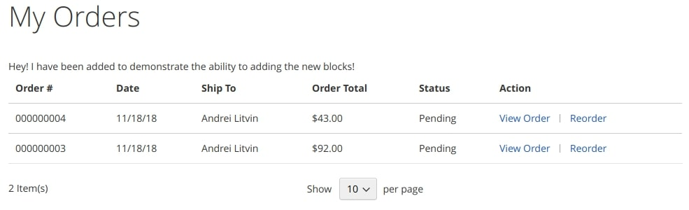

10 - Customer Management
========================

10.1 Demonstrate ability to customize My Account
------------------------------------------------

**Describe how to customize the "My Account" section.**

> Magento_Customer module is responsible for the user account functioning. If you need to modify in some way the user account (for instance, add new elements, delete the existing ones or change the position of blocks), you need to modify the Magento_Customer module components.
>
> We can do this via the following ways:

*   [Create A Storefront Theme](https://devdocs.magento.com/guides/v2.4/frontend-dev-guide/themes/theme-create.html&sa=D&ust=1609223266250000&usg=AOvVaw2t16x04YpZnZUGweZfJOP7) then [apply & configure it](https://devdocs.magento.com/guides/v2.4/frontend-dev-guide/themes/theme-apply.html&sa=D&ust=1609223266251000&usg=AOvVaw1QcmFf_qO5ciuHbJGsNtDR). Alternatively you can use an existing one theme (Magento/blank for example) Or even [Create a Module](#h.8r6t4fakpxnh).
*   Create a folder in the theme `Magento_Customer/layout`, or (if using a custom Module): `<module_dir>/view/frontend/layout`
*   The following layout files are available for customisation:

    *   `customer_account_confirmation.xml`
    *   `customer_account_createpassword.xml`
    *   `customer_account_create.xml`
    *   `customer_account_edit.xml`
    *   `customer_account_forgotpassword.xml`
    *   `customer_account_index.xml`
    *   `customer_account_login.xml`
    *   `customer_account_logoutsuccess.xml`
    *   `customer_account.xml`
    *   `customer_address_form.xml`
    *   `customer_address_index.xml`
    *   `default.xml` (all pages)

Main thing to remember here are: `customer_account_*.xml` layout update handles and default.xml Where these layouts go (Theme / Module) is more outta scope for this question.

**How do you add a menu item?**

> To add a new menu item, add the following instruction into customer_account.xml file specifically. For example:

```xml
<referenceBlock name="customer_account_navigation">
    <block class="Magento\Customer\Block\Account\SortLinkInterface" name="customer-account-navigation-address-link">
        <arguments>
            <argument name="label" xsi:type="string" translate="true">My awesome menu item</argument>
            <argument name="path" xsi:type="string">path/i/need</argument>
            <argument name="sortOrder" xsi:type="number">100</argument>
        </arguments>
    </block>
</referenceBlock>
```

> We add a new block of the interface instance `Magento\Customer\Block\Account\SortLinkInterface` (or a concrete class that implements it) class and pass the menu arguments:

*   `label` (name)
*   `page` (link)
*   `sortOrder` (position)

> As a result, a new menu item will appear in the user menu:


> To delete the existing menu item, apply the following instruction in your customer_account.xml:

```xml
<referenceBlock name="name-of-the-link-to-remove" remove="true" />
```

> Finally, when we need to change the block order, we can modify the sortOrder argument value. For example, let us make the Wishlist section the first menu item:

```xml
<referenceBlock name="customer-account-navigation-wish-list-link">
    <arguments>
        <argument name="sortOrder" xsi:type="number">500</argument>
    </arguments>
</referenceBlock>
```
Following the rule above here of just remembering the layout name: customer_account_*.xml you apply common sense and if presented with a customer_account.xml option in the exam - this looks correct to edit the Customer Account page.

**How would you customize the "Order History" page?**

> To customize My Orders page, modify the layout-file sales_order_history.xml of the Magento_Sales module. For this, create a sales_order_history.xml file and place it in our theme at the following path: Magento_Sales/layout/. Then, apply any instructions, provided in Magento 2 for layout customization. For example, let us add a text block before the orders list:

```xml
<referenceContainer name="sales.order.history.info">
    <block class="Magento\Framework\View\Element\Text" name="my_text">
        <arguments>
            <argument name="text" xsi:type="string">Hey! I have been added to demonstrate the ability to adding the new blocks!</argument>
        </arguments>
    </block>
</referenceContainer>
```

> As a result, on the My Orders page in the user account we will see the following text:



> To modify the order table contents (for example, add a new column), we need to override the `vendor/magento/module-sales/view/frontend/templates/order/history.phtml` template.

This one is a tad mis-leading as it's actually within the `Magento_Sales` sales module rather than `Magento_Customer` - as long as you remember this, then `sales_order_history.xml` / `order/history.phtml` layout / templates would appear to make sense.

10.2 Demonstrate ability to customize customer functionality
------------------------------------------------------------

**Describe the customer entity.**

### Customers

> A Customer is its own Magento Entity within the Magento_Customer module.
> Like all Modules, Magento_Customer uses the [Service Contracts](https://devdocs.magento.com/guides/v2.3/extension-dev-guide/service-contracts/service-contracts.html&sa=D&ust=1609223266259000&usg=AOvVaw2KGjEGSyVnYNDGQI08Xl8Z) design pattern to manage (C.R.U.D actions) on the Customers Entity. Here are a few (notable) Repositories:

> Main Customer CRUD interface

```php
Magento\Customer\Api\CustomerRepositoryInterface::save(
    \Magento\Customer\Api\Data\CustomerInterface $customer,
    $passwordHash = null
);
```

> Interface for managing customers accounts

```php
Magento\Customer\Api\AccountManagementInterface::createAccount(
    \Magento\Customer\Api\Data\CustomerInterface $customer,
    $password = null,
    $redirectUrl = ''
);
```

> Customer Address CRUD interface
```php
Magento\Customer\Api\AddressRepositoryInterface::save(
    \Magento\Customer\Api\Data\AddressInterface $address
);
```

> Main Customer Address Data Interface

```php
Magento\Customer\Api\Data\AddressInterface::getCountryId();
```

> Interface For Managing Customer Groups.

```php
Magento\Customer\Api\GroupRepositoryInterface::save(
    \Magento\Customer\Api\Data\GroupInterface $group
);
```

> Customer Group Data Interface

```php
Magento\Customer\Api\Data\GroupInterface::getTaxClassId();
```

> Interface For Managing Customer Groups

```php
Magento\Customer\Api\GroupManagementInterface::getDefaultGroup(
    $storeId = null
);
```

> Interface For System Configuration Operations For Customer Groups

```php
Magento\Customer\Api\CustomerGroupConfigInterface::setDefaultCustomerGroup(
    int $id
);
```

> Interface For Getting Attributes Metadata (Note that this interface should not be used directly, use its children).

```php
Magento\Customer\Api\MetadataInterface::getAttributes();
```

> Customer Attribute Metadata Interface

```php
Magento\Customer\Api\Data\AttributeMetadataInterface::getIsUsedInGrid();
```

Main thing to remember here is that the Magento_Customer module is responsible for the Customer Entity. Within this module are repositories that conform to the [Service Contract](https://devdocs.magento.com/guides/v2.3/extension-dev-guide/service-contracts/service-contracts.html&sa=D&ust=1609223266265000&usg=AOvVaw2QEerRAv1hfxHcgYE6cZC6) design pattern which create injectable repositories for the following entities: Customer, Customer Address, Customer Groups.

| Database Table: `customer_entity` | Notable Columns | Description |
| --- | --- | --- |
| Core Customer Properties | `entity_id` - int(10), `website_id` - smallint(5), `created_at` - timestamp, `updated_at` - timestamp, email - varchar(255), `group_id` - smallint(5), `increment_id` - varchar(50), `store_id` - smallint(5), `is_active` - decimal(12,4), `disable_auto_group_change` - smallint(5), `created_in` - varchar(255) | `entity_id`: used all over the code and is the global identifier. `email`: The customer's email address. `is_active`: Used for status. `increment_id`: Changing the initial customer increment id (if you want it different from default). `group_id`: The ID of the customer group where the customer is assigned. `disable_auto_group_change` Determines if customer groups can be dynamically assigned during [](https://docs.magento.com/user-guide/tax/vat-validation.html&sa=D&ust=1609223266269000&usg=AOvVaw1LhR3NMIt-SJ1xCmzH32MB) [VAT ID validation](https://docs.magento.com/user-guide/tax/vat-validation.html&sa=D&ust=1609223266269000&usg=AOvVaw1LhR3NMIt-SJ1xCmzH32MB). `created_in`: The store view where the account was created. |
| Customer Properties | `prefix` - varchar(40), `firstname` - varchar(255), `middlename` - varchar(255), `lastname` - varchar(255), `suffix` - varchar(40), `dob` - `date`, `taxvat` - varchar(50), `confirmation` - varchar(64), `default_billing` - int(10), `default_shipping` - int(10), `failures_num` - smallint(6), `first_failure` - timestamp, `lock_expires` - timestamp | `prefix`: Any prefix that is used with the customer name.(Mr., Ms., Mrs., Dr., etc.). `firstname`: The first name of the customer. `middlename`: The middle name or middle initial of the customer. `lastname`: The last name of the customer. `suffix`: Any suffix that is used with the customer name. (Jr., Sr., Esquire, etc.). `dob`: The customer's date of birth. `taxvat`: The [Value Added Tax (VAT)](https://docs.magento.com/user-guide/tax/vat.html&sa=D&ust=1609223266275000&usg=`AOvVaw2IrzV3sr_zb0qGTszTbjrV`) ID that is assigned to the customer. The default label of this attribute is "VAT Number". The VAT number field is always present in all shipping and billing customer addresses when viewed from the Admin, but is not a required field. `gender`: The customer gender. `default_billing`: The user selected default Billing Address ID `default_shipping`: The user selected default Shipping Address ID |

[More information on Customers here](https://docs.magento.com/user-guide/stores/attributes-customer.html&sa=D&ust=1609223266278000&usg=AOvVaw2oivunhnbBQMDCY90HW5Pb)

(Magento commerce/enterprise only) It is worth mentioning that in Magento Commerce you are able to add/edit Customer Attributes via Admin > Stores > Attributes > Customer

### Customer Address Attributes

| Database Table: `customer_address_entity` | Notable Columns | Description |
| --- | --- | --- |
| Core Customer Address Properties | `entity_id` - int(10), `parent_id` - int(10), `created_at` - timestamp, `updated_at` - timestamp, `is_active` - smallint(5) | `entity_id`: used all over the code and is the global identifier. `is_active`: Used for status. If value = 0, then it won't appear in the checkout for the customer. `increment_id`: Changing the initial customer increment id (if you want it different from default). `parent_id`: The ID of the customer.
| Customer Address Properties | `city` - varchar(255), `company` - varchar(255), `country_id` - varchar(255), `fax` - varchar(255), `firstname` - varchar(255), `lastname` - varchar(255), `middlename` - varchar(255), `postcode` - varchar(255), `prefix` - varchar(40), `region` - varchar(255), `region_id` - int(10), `street` - text, `suffix` - varchar(40), `telephone` - varchar(255), `vat_id` - varchar(255), `vat_is_valid` - int(10), `vat_request_date` - varchar(255), `vat_request_id` - varchar(255), `vat_request_success` - int(10) | `country_id`: Two-letter country code in ISO_3166-2 format. `region`: e.g. Queensland (part of Magento\Customer\Api\Data\RegionInterface class). `region_id`: The middle name or middle initial of the customer. `postcode`: Zipcode. `vat_id`: The [Value Added Tax (VAT)](https://docs.magento.com/user-guide/tax/vat.html&sa=D&ust=1609223266285000&usg=AOvVaw0coHcdWFT_M-1U70VZ94Is) ID that is assigned to the customer. The default label of this attribute is "VAT Number". The VAT number field is always present in all shipping and billing customer addresses when viewed from the Admin, but is not a required field. |
| Unused columns | `increment_id` - varchar(50) | |

[More information on Customer Address here](https://docs.magento.com/user-guide/stores/attributes-customer-address.html&sa=D&ust=1609223266286000&usg=AOvVaw0yclXlWq1FZq0qgRmknLgp) & [here](https://devdocs.magento.com/compliance/privacy/pi-data-reference-m2.html&sa=D&ust=1609223266286000&usg=AOvVaw3twE6Mmh_Rcjp8-c-Vy6Ho).

It's worth noting that much information is duplicated here (customer information) as well as address information being duplicated in the sales_order_address table. This follows the data de-normalisation approach and is used because each serves different purposes. For example: if a customer removes and address then it should not then be removed from any previous orders.

(Magento commerce/enterprise only) It is also worth mentioning that in Magento Commerce you are able to add/edit Customer Address Attributes via Admin > Stores > Attributes > Customer Address

**Describe how to add or modify customer attributes.**

> To create a new customer attribute, we can use Data Setup script in the form of a Create a Customer [Data Patch](#h.fb7s5a4nvxv9):

```php
<?php

namespace MyVendor\MyModule\Setup\Patch\Data;

use Magento\Customer\Model\Customer;
use Magento\Customer\Setup\CustomerSetupFactory;
use Magento\Eav\Model\Entity\Attribute\SetFactory;
use Magento\Eav\Api\AttributeRepositoryInterface;
use Magento\Framework\Exception\NoSuchEntityException;
use Magento\Framework\Setup\Patch\DataPatchInterface;
use Magento\Framework\Setup\ModuleDataSetupInterface;
use Magento\Framework\Setup\Patch\PatchRevertableInterface;

class DummyDataPatch implements DataPatchInterface, PatchRevertableInterface
{
    /** @var CustomerSetupFactory */
    private $customerSetupFactory;

    /** @var SetFactory */
    private $attributeSetFactory;

    /** @var ModuleDataSetupInterface */
    private $moduleDataSetup;

    /** @var AttributeRepositoryInterface */
    private $attributeRepository;

    public function __construct(
        ModuleDataSetupInterface $moduleDataSetup,
        CustomerSetupFactory $customerSetupFactory,
        AttributeRepositoryInterface $attributeRepository,
        SetFactory $attributeSetFactory
    ) {
        $this->moduleDataSetup = $moduleDataSetup;
        $this->customerSetupFactory = $customerSetupFactory;
        $this->attributeSetFactory = $attributeSetFactory;
        $this->attributeRepository = $attributeRepository;
    }

    /**
     * {@inheritdoc}
     */
    public function apply()
    {
        $setup = $this->moduleDataSetup->getConnection()->startSetup();
        $customerSetup = $this->customerSetupFactory->create(['setup' => $setup]);
        try {
            $attribute = $this->attributeRepository->get(Customer::ENTITY, 'my_new_attribute');
        } catch (NoSuchEntityException $e) {
            // Good, it doesn't exist. Create it.
            $customerSetup->addAttribute(Customer::ENTITY, 'my_new_attribute', [
                'type' => 'varchar',
                'label' => 'My new attribute',
                'input' => 'text',
                'required' => false,
                'visible' => true,
                'user_defined' => true,
                'system' => false,
                'used_in_forms' => [
                    'adminhtml_customer',
                    'adminhtml_checkout',
                    'checkout_register',
                    'customer_account_create',
                    'customer_account_edit',
                ]
            ]);
        }

        $this->moduleDataSetup->getConnection()->endSetup();
    }

    /**
     * {@inheritdoc}
     */
    public static function getDependencies()
    {
        return [];
    }

    public function revert()
    {
        // Revert operations here
        $customerSetup = $this->customerSetupFactory->create(['setup' => $setup]);
        try {
            $attribute = $this->attributeRepository->get(Customer::ENTITY, 'my_new_attribute');
            if ($attribute) {
                $customerSetup->removeAttribute(Customer::ENTITY, $attribute->getAttributeCode());
            }
        } catch (NoSuchEntityException $e) {
            // Good, it doesn't exist. No need to revert.
        }
    }

    /**
     * {@inheritdoc}
     */
    public function getAliases()
    {
        return [];
    }
}
```

> Customer attributes can be displayed in different forms, which are set in the used_in_forms array parameter.
>
> The list of forms can be found in customer_form_attribute table list available are:

*   `adminhtml_checkout`
*   `adminhtml_customer`
*   `adminhtml_customer_address`
*   `checkout_register`
*   `customer_account_create`
*   `customer_account_edit`
*   `customer_address_edit`
*   `customer_register_address`

> To modify the attribute, use `Magento\Customer\Setup\CustomerSetupFactory` or `Magento\Eav\Api\AttributeRepositoryInterface` if you want to get it by Attribute Code:

`Magento\Customer\Setup\CustomerSetupFactory`
```php
$customerSetup = $this->customerSetupFactory->create(['setup' => $setup]);
$customerSetup->updateAttribute(\Magento\Customer\Model\Customer::ENTITY, 'new_attribute', 'visible', false);
```

`Magento\Eav\Api\AttributeRepositoryInterface`
```php
$attribute = $this->attributeRepository->get(Customer::ENTITY, 'my_new_attribute');
$attribute->setData('used_in_forms', ['adminhtml_customer']);
$this->attributeRepository->save($attribute);
```

**How would you extend the customer entity using the extension attributes mechanism?**

> Module developers can not modify API Data interfaces, described in core Magento 2, but the majority of the modules have the [Extension Attributes](#h.aqe3c923mrz4) mechanism. [Extension Attributes](#h.aqe3c923mrz4) are set and stored separately from the data object of the initial class, so everything, connected with data storage and extraction, must be realized by the developer himself.

Please refer to the [Extension Attributes](#h.aqe3c923mrz4) section for more information.

**Describe how to customize the customer address. How would you add another field into the customer address?**

> Magento has a standard set of attributes for the Customer Address entity, stored in customer_address_entity table ([see above](#h.l7dt83731myl) for the main columns of this table). Other attributes of the address need to be added as EAV attributes. They will work via Custom Attributes.
>
> To add new fields into the Customer Address entity, please do the following:

1.  Create an EAV attribute using `Magento\Customer\Setup\CustomerSetupFactory`. [Please see the Data Patch in the previous question above](#h.l7dt83731myl) for more information on how to achieve this.

**Describe customer groups and their role in different business processes. What is the role of customer groups? What functionality do they affect?**

Customer Groups

> User/Customer Groups allow you to categorise Users and provide certain functionality based on their groups, these functions include:

*   Modify taxes based on Customer Groups.
*   Different catalog product pricing based on Customer Groups (tiered prices for example).
*   Create [Catalog Price Rules](#h.y3a3xjg08db) specific to certain Customer Groups
*   Create [Cart/Sales Price Rules](#h.9it0avmbiyyv) specific to certain Customer Groups
*   Create [Cart/Sales Price Rules](#h.9it0avmbiyyv) based on [Customer Segments](https://docs.magento.com/user-guide/marketing/customer-segments.html&sa=D&ust=1609223266306000&usg=AOvVaw14L718FqVeQ1ioscj0DJU_) (Magento Enterprise/Commerce only feature).
*   Separate their rights/permissions at the storefront side such as disabling guest checkout in Stores > Settings > Configuration > Sales > Checkout > Checkout Options
*   Filter grid by Customer Groups in the Admin.

> There are the following default user groups:

*   NOT LOGGED IN
*   General
*   Wholesale
*   Retailer

> NOT LOGGED IN is the only user group that you can not delete (same as you can not delete the default registered users group, but, in contrast to NOT LOGGED IN, it is not static, which means it can be modified). NOT LOGGED IN is assigned to all the visitors without a session and determines the type of shopping cart (guest cart). General is the default group for the newly registered users.

[Customer Segments](https://docs.magento.com/user-guide/marketing/customer-segments.html&sa=D&ust=1609223266309000&usg=AOvVaw2LmfpaspHl9m-GdIwLJ3OG) allow you to dynamically display content and promotions to specific customers, based on properties such as customer address, order history, shopping cart contents, and so on. You can optimize marketing initiatives based on targeted segments with shopping cart price rules. You can also generate reports and export the list of targeted customers. Because customer segment information is constantly refreshed, customers can become associated and dissociated from a segment as they shop in your store. NOTE: This is not specific to Customer Groups but a useful feature to add here.

Company Accounts (Magento B2B feature only)

> On top of **Customer Groups** is also **Company Accounts**
>
> A **Company Account** can be set up to reflect the structure of the business. Initially, the company structure includes only the company administrator, but can be expanded to include teams of users. The users can be associated with teams or organized within a hierarchy of divisions and subdivisions within the company.
>
>
> **Company Accounts** can be set up from the storefront OR from the Admin via: Admin > Customers > Companies.
>
> By default, the ability to create company accounts from the storefront is enabled. If allowed in the configuration, a visitor to the store can request to open a company account.
>
> After the company account is approved, the company administrator can set up the company structure and users with various levels of permission.

NOTE: This is not specific to Company Accounts but a useful feature to add here.

**Describe Magento functionality related to VAT.**

> Magento is a built-in functionality for working with VAT. VAT depends on the seller's country and buyer's address. When a downloadable product is purchased, VAT depends solely on the delivery destination.

**How do you customize VAT functionality?**

> To configure [Value Added Tax](https://docs.magento.com/user-guide/tax/vat.html&sa=D&ust=1609223266314000&usg=AOvVaw2m0N3wThO3aMxl1R9vcFsf) (VAT), you can navigate to the following path:
>
> **Admin > Stores > Configuration > General > General > Store Information**
>
> VAT Number: this is where you set the seller's VAT number.


> **Admin > Customers > All Customers > Edit: Customer**
>
> Account Information
>
> Tax/VAT Number: If applicable, the tax number or value-added tax number that is assigned to the customer
>
> Addresses
>
> VAT Number: If applicable, the value-added tax number that is associated with a specific billing or shipping address of the customer. For the sale of [](https://docs.magento.com/user-guide/tax/eu-place-of-supply.html&sa=D&ust=1609223266317000&usg=AOvVaw1Wn5M7ae1vk1XUadd6LszX) [digital goods](https://docs.magento.com/user-guide/tax/eu-place-of-supply.html&sa=D&ust=1609223266317000&usg=AOvVaw1Wn5M7ae1vk1XUadd6LszX) within the EU, the amount of the VAT is based on shipping destination.
>
> **Admin > Stores > Configuration > Customers > Customer Configuration**
>
>
> Show VAT Number on Storefront: Determines if the customer VAT Number field is included in the Address Book that is available in the customer account.
>
> Default Value for Disable Automatic Group Changes Based on VAT ID:
>
> VAT ID is an internal identifier for the VAT Number of the customer when used in VAT Validation. During [](https://docs.magento.com/user-guide/tax/vat-validation.html&sa=D&ust=1609223266318000&usg=AOvVaw34MEAbLuB_e7HrNUfU3J56) [VAT Validation](https://docs.magento.com/user-guide/tax/vat-validation.html&sa=D&ust=1609223266318000&usg=AOvVaw34MEAbLuB_e7HrNUfU3J56), Magento confirms that the number matches the [](http://ec.europa.eu/taxation_customs/vies/&sa=D&ust=1609223266319000&usg=AOvVaw2526GcJFWHdE9agT_j1ZrO) [European Commission](http://ec.europa.eu/taxation_customs/vies/&sa=D&ust=1609223266319000&usg=AOvVaw2526GcJFWHdE9agT_j1ZrO) database. Customers can be automatically assigned to one of the four default customer groups based on the validation results.
>
> For the correct functioning of VAT in Magento, you should set the Customer Groups and create Tax rules and rates. Tax can be applied separately to Products and Customers with Product Tax Classes and Customer Tax Classes (Admin > Stores > Taxes > Tax Rules); you can also create taxes for certain areas with Tax Zones and Rates (Stores > Taxes > Tax Zones and Rates).
>
> To modify Tax, apply `sales_quote_collect_totals_before` event that calculates the order's total cost.

In short, VAT is customised via the Admin on both Store/Website and a Customer level configuration.