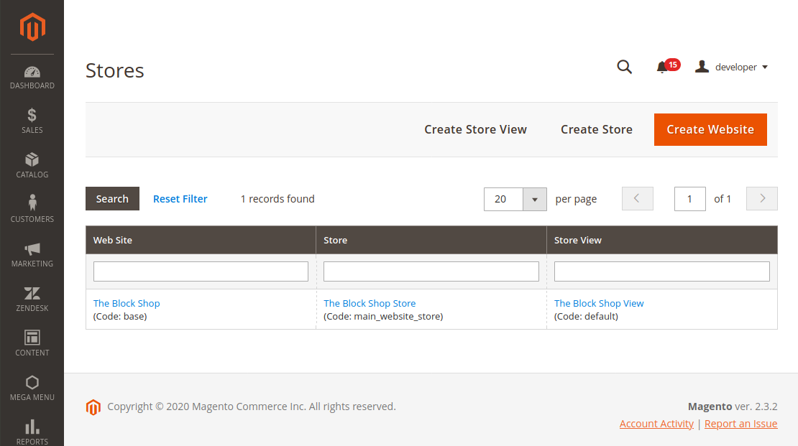

11 - Multi-store & Multi-website Scopes
=======================================

11.1 Describe Multi-store & Multi-website functionality
-------------------------------------------------------

**Outline all the available Magento scopes, what are the scopes available in a standard Magento install?**

> Magento 2 has a 4-level hierarchy: Global, Website, Store (Store Group) & Store View.

**What is the difference between Magento 2 website, store, and store view?**

Global

> This is the highest level in the Magento pyramid. Here you can set the only 3 options that will be the same for all stores:

1.  Stock - configure the main product settings.
2.  Price - define the same price for the products in all stores.
3.  Buyers - Merge all store customer data into one big database for all websites.

Global

> Global values are values that are out-of-the-box if the user has not specified. These values are usually defined within a modules `etc/config.xml`.
>
> By default, a vanilla Magento install features:

1. System configurations (dependent on their scope in declarative schema `showInDefault`, `showInWebsite`, `showInStore`) available in *Admin > Stores > Configuration*.
2. No Products
3. No Customers
4. 1 Root Category + 1 Default Category without any products
5. 1 Tax Rule: "Taxable goods", 3 Tax Zones / Rates: US-CA. A Non-taxable goods class is also available.
6. 1 Website, 1 Store (Store group), 1 Store View.

Website

> With one Magento base, you can design various websites, for example, hats.com and pants.com. The following can be configured per Website:

1.  Separate Payment methods.
2.  Separate Shipping methods.
3.  A totally separate Product base - products are required to be assigned to websites individually. They can have different prices / currencies / attribute values etc.
4.  Separate tax classes.
5.  Separate (base) currencies.
6.  Separate Customer base - It's up to you whether your customers can log in to all shops with the same credentials.
7.  System configurations (dependent on their scope in declarative schema `showInDefault`, `showInWebsite`, `showInStore`) available in *Admin > Stores > Configuration*. Mostly all configurations are configurable at this level.

> For each website, you can create multiple stores, but all the information will be gathered in one admin panel.

Store (Store Group)

> It's possible to create several stores on one Magento 2 website. The following can be configured per Store:

1.  Different Root Categories which allows for different products to be assigned.

> The following *CANNOT* be configured per Store:

1.  All the stores within one website share the same customer accounts.
2.  All stores share Shipping Methods.
3.  All stores share Tax Rates / Zones.
4.  All stores share Product stock.
5.  All stores share Product prices.
6.  All currencies are identical for all the stores.
7.  System configurations available in *Admin > Stores > Configuration*.
8.  EAV attributes across entities Customer (including Customer Address), Products, Categories cannot be configured on a Store Group level.


Store View

> And finally, for every store, you can create several store views. The following can be configured per Store View:

1.  Different languages.
2.  Different currencies.
3.  Different design themes
4.  Certain Product EAV attributes can be different such as name, or tax class (dependent on their `is_global` / `scope` / `is_user_defined` properties).
5.  Different Category EAV attributes (such as name, or URL key).
6.  System configurations (dependent on their scope in declarative schema `showInDefault`, `showInWebsite`, `showInStore`) available in *Admin > Stores > Configuration*.

> The following CANNOT be configured per Store View:

1.  All store views within one website share the same customer accounts.
2.  All store views share Shipping Methods.
3.  All store views share Tax Rates / Zones.
4.  All store views share Product stock.
5.  All store views share Product prices.
6.  All store views share the same Root Category.
7.  All currencies are identical for all the store views.

[Here is more information on the subject with infographics!](https://docs.magento.com/user-guide/configuration/scope.html)

[Here is some information regarding Scope System Configuration](https://devdocs.magento.com/guides/v2.4/config-guide/prod/config-reference-systemxml.html)


**How do you create a new Website, Store & Store View?**

> **Admin > Stores > Settings > All Stores**



**How do you set up a new Website?**

For the purpose of this question we shall assume you are running an Nginx Webserver with PHP-FPM and will specifically focus on the multi-website aspect of the configuration.

```perl
server {
        listen 80;
        server_name mydomain.com;
        set $MAGE_ROOT <MY_MAGENTO_WEBROOT>;
        index index.php;
        root $MAGE_ROOT/pub;
        set $MAGE_CODE default;
        location / {
                try_files $uri $uri/ /index.php$is_args$args;
        }
        include /etc/nginx/defaults/magento2.conf;
}
server {
        listen 80;
        server_name myotherdomain.com;
        set $MAGE_ROOT <MY_MAGENTO_WEBROOT>;
        index index.php;
        root $MAGE_ROOT/pub;
        set $MAGE_CODE other;
        location / {
                try_files $uri $uri/ /index.php$is_args$args;
        }
        include /etc/nginx/defaults/magento2.conf;
}
```

**How do you set up a new subfolder Website?**

For the purpose of this question we shall assume you are running an Nginx Webserver with PHP-FPM and will specifically focus on the multi-website aspect of the configuration.

```perl
server {
    listen 80;
    server_name mydomain.com;
    set $MAGE_ROOT <MY_MAGENTO_WEBROOT>;
    index index.php;
    root $MAGE_ROOT/pub;

    location /cn/ {
        set $code my_project_cn_store;
        rewrite / /cn/index.php;
        try_files $uri $uri/ /cn/index.php$is_args$args;
    }

    location /us/ {
        set $code my_project_us_store;
        rewrite / /us/index.php;
        try_files $uri $uri/ /us/index.php$is_args$args;
    }

    location / {
        set $code default;
        try_files $uri $uri/ /index.php$is_args$args;
    }

    include /etc/nginx/defaults/magento2.conf;
}
```

`/pub/us/index.php`
```php
<?php

use Magento\Framework\App\Bootstrap;
use Magento\Framework\App\Filesystem\DirectoryList;

try {
    require __DIR__ . '/../../app/bootstrap.php';
} catch (\Exception $e) {
    echo
<<<HTML
    <div style="font:12px/1.35em arial, helvetica, sans-serif;">
        <div style="margin:0 0 25px 0; border-bottom:1px solid #ccc;">
            <h3 style="margin:0;font-size:1.7em;font-weight:normal;text-transform:none;text-align:left;color:#2f2f2f;">Autoload error</h3>
        </div>
        <p>{$e->getMessage()}</p>
    </div>
HTML;
    exit(1);
}
$params = $_SERVER;
$params[\Magento\Store\Model\StoreManager::PARAM_RUN_CODE] = 'my_project_us_website';
$params[\Magento\Store\Model\StoreManager::PARAM_RUN_TYPE] = 'website';
$params[Bootstrap::INIT_PARAM_FILESYSTEM_DIR_PATHS] = [
    DirectoryList::PUB => [DirectoryList::URL_PATH => ''],
    DirectoryList::MEDIA => [DirectoryList::URL_PATH => 'media'],
    DirectoryList::STATIC_VIEW => [DirectoryList::URL_PATH => 'static'],
    DirectoryList::UPLOAD => [DirectoryList::URL_PATH => 'media/upload'],
];
$bootstrap = Magento\Framework\App\Bootstrap::create(BP, $params);

/** @var Magento\Framework\App\Http $app */
$app = $bootstrap->createApplication(Magento\Framework\App\Http::class);
$bootstrap->run($app);

```

'`my_project_us_website`'; must match the Website code in Admin > Stores > All Stores

'`my_project_us_store`'; must match the Store code in Admin > Stores > All Stores