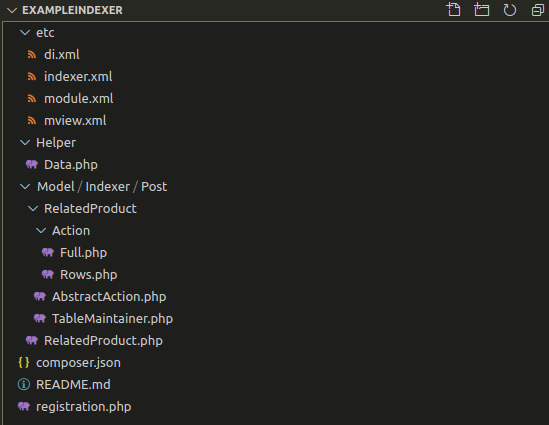

12 - Index Management
=====================

**Describe Index Management. How would you create your own Indexer?**

> An index collects, parses and stores data to facilitate fast and accurate information retrieval which saves repeatedly making complex calculations. Magento utilities indexers due to its wide range of features and complex/large data sets.
>
> By default Magento indexes the following:

*   Product Prices
*   Product Inventory
*   Product Attribute Data
*   Product Category Associations

Indexer could be considered a form of [caching](#h.s3rfn71t3q6i) but, where data is transformed during the process.

[Excellent Indexer Guide Here](https://docs.google.com/presentation/d/e/2PACX-1vRQioOtIvVz8WGa5XTOGmWsu0t6rjUhDQdUGdmss62YZuTJSEV1lwkefBRKGKKxSFTA5k2P5oki_A2t/pub%23slide%3Did.g587a946c8a_2_51&sa=D&ust=1609223266338000&usg=AOvVaw0ceVngmq-G5XpF5QnfZXbi)

> Creating an indexer

> The structure of an indexer might look something like:



> Only the necessaries will be covered here:

#### `indexer.xml`

```xml
<?xml version="1.0"?>
<config xmlns:xsi="http://www.w3.org/2001/XMLSchema-instance" xsi:noNamespaceSchemaLocation="urn:magento:framework:Indexer/etc/indexer.xsd">
    <indexer id="example_entity" view_id="example_entity" class="MyVendor\MyModule\Model\Indexer\Example\Index" shared_index="catalog_product_price">
        <title translate="true">An Example Indexer</title>
        <description translate="true">An example indexer for the purpose of the Magento exam notes</description>
    </indexer>
</config>
```

| Attribute | Required | Description |
| --- | --- | --- |
| `id` | Yes | A unique indexer ID |
| `class` | No | The class that processes indexer methods (executeFull, executeList, executeRow) |
| `primary` | No | The source provider |
| `shared_index` | No | Use this option to improve performance if your indexer is related to another indexer. In this example, if the Catalog Product Price index needs to be reindexed |
| `view_id` | No | The ID of the view element that is defined in the mview.xml configuration file. |


> An indexer process can also have the following optional parameters:

| Parameter | Description |
| --- | --- |
| `description` | The description of indexer to be displayed on the System > Tools > Index Management page. |
| `fieldset` | Describes the fields, source, and data provider of the flat index table. |
| `saveHandler` | An extension point. The class for processing (deleting, saving, updating) items when indexing. |
| `structure` |  The class that processes (creates, removes) flat index tables. |
| `title` | The title of indexer to be displayed on the System > Tools > Index Management page. |

#### `mview.xml`

> Add the `mview.xml` configuration file in the etc module directory, where you declare the following:

*   Indexer view ID
*   Indexer class
*   The database tables the indexer tracks
*   What column data is sent to the indexer


> All Mview declarations related to a module should be declared in one file.

```xml
<?xml version="1.0" encoding="UTF-8"?>
<config xmlns:xsi="http://www.w3.org/2001/XMLSchema-instance" xsi:noNamespaceSchemaLocation="urn:magento:framework:Mview/etc/mview.xsd">
    <view id="example_entity" class="MyVendor\MyModule\Model\Indexer\Example\Index" group="indexer">
        <subscriptions>
            <table name="catalog_product_entity" entity_column="entity_id" />
            <table name="catalog_product_entity_int" entity_column="entity_id" />
            <table name="catalog_product_entity_text" entity_column="entity_id" />
            <table name="catalog_product_entity_decimal" entity_column="entity_id" />
            <table name="catalog_product_entity_varchar" entity_column="entity_id" />
        </subscriptions>
    </view>
</config>
```

| Attribute | Required | Description |
| `view` | Yes | The new materialized view to be declared of which have attributes: `id` = the ID of this new view. `class` = The model class object to call. `group` = Which CRON group this falls under (usually indexer).|
| `subscriptions` | No |  This places database triggers for your new view when the following tables are updated. `<subscriptions>` take: `<table>` - `name` = The name of the table, `entity_column` =  that table's entity ID column to use. |

> `MyVendor\MyModule\Model\Indexer\Example\Index`

> The main indexer class implements the following interfaces:

*   `Magento\Framework\Mview\ActionInterface`
*   `Magento\Framework\Indexer\ActionInterface`

> And therefore must have the following methods:

*   `execute` - Used by mview, allows process indexer in the "Update on schedule" mode
*   `executeFull` - Will take all of the data and reindex Will run when reindex via command line or [Update on Save](#h.wndwlsqudpgx). Should take into account all entities in the system.
*   `executeList` - Works with a set of entity changed (may be massaction)
*   `executeRow` - Works in runtime for a single entity using plugins ([Update On Schedule](#h.n9r64sdphflm)).

Only need to remember this, the following is for demonstration purposes only.

Example:
```php
<?php

namespace MyVendor\MyModule\Model\Indexer\Example;

use Magento\Framework\App\ObjectManager;
use Magento\Framework\Indexer\CacheContext;
use Magento\Framework\Indexer\IndexerRegistry;
use Magento\Framework\Mview\ActionInterface as MviewActionInterface;
use Magento\Framework\Indexer\ActionInterface as IndexerActionInterface;
use MyVendor\MyModule\Api\Data\ExampleInterface;

class Index implements MviewActionInterface, IndexerActionInterface
{
    /**
     * Indexer ID in configuration
     * @var string
     */
    const INDEXER_ID = 'my_indexer';

    /**
     * Indexer main table
     * @var string
     */
    const BLOG_PRODUCT_POST_INDEX_TABLE = 'my_indexer_idx';

    /**
     * Indexer temporary table for dimension
     * @var string
     */
    const BLOG_PRODUCT_POST_TMP_TABLE = 'my_indexer_tmp';

    /**
     * @var CacheContext
     * @since 1.0.1
     */
    protected $cacheContext;

    /** @var Example\Action\FullFactory */
    protected $fullActionFactory;

    /** @var Example\Action\RowsFactory */
    protected $rowsActionFactory;

    /** @var IndexerRegistry */
    protected $indexerRegistry;

    /**
     * @param Example\Action\FullFactory $fullActionFactory
     * @param Example\Action\RowsFactory $rowsActionFactory
     * @param IndexerRegistry $indexerRegistry
     */
    public function __construct(
        Example\Action\FullFactory $fullActionFactory,
        Example\Action\RowsFactory $rowsActionFactory,
        IndexerRegistry $indexerRegistry
    ) {
        $this->fullActionFactory = $fullActionFactory;
        $this->rowsActionFactory = $rowsActionFactory;
        $this->indexerRegistry = $indexerRegistry;
    }

    /**
     * Used by mview, allows process indexer in the "Update on schedule" mode
     */
    public function execute($ids)
    {
        // Used by mview, allows you to process multiple blog posts in the "Update on schedule" mode
        $this->executeAction($ids);
        $this->registerEntities($ids);
    }

    /**
     * Will take all of the data and reindex
     * Will run when reindex via command line
     * Should take into account all blog posts in the system
     */
    public function executeFull()
    {
        /** @var Example\Action\Full $action */
        $action = $this->fullActionFactory->create();
        $action->execute();
        $this->registerTags();
    }

    /**
     * Works with a set of entity changed (may be massaction)
     */
    public function executeList(array $ids)
    {
        // Works with a set of blog posts (mass actions and so on)
        $this->executeAction($ids);
    }

    /**
     * Works in runtime for a single entity using plugins
     */
    public function executeRow($id)
    {
        // Works in runtime for a single blog post using plugins
        $this->executeAction([$id]);
    }

    /**
     * Add entities to cache context
     * @param int[] $ids
     * @return void
     * @since 1.0.1
     */
    protected function registerEntities($ids)
    {
        $this->getCacheContext()->registerEntities(ExampleInterface::CACHE_TAG, $ids);
    }

    /**
     * Add tags to cache context
     * @return void
     * @since 1.0.1
     */
    protected function registerTags()
    {
        $this->getCacheContext()->registerTags([ExampleInterface::CACHE_TAG]);
    }

    /**
     * Execute action for single entity or list of entities
     * @param int[] $ids
     * @return $this
     */
    protected function executeAction($ids)
    {
        $ids = array_unique($ids);
        $indexer = $this->indexerRegistry->get(static::INDEXER_ID);

        /** @var Example\Action\Rows $action */
        $action = $this->rowsActionFactory->create();
        if ($indexer->isWorking()) {
            $action->execute($ids, true);
        }
        $action->execute($ids);

        return $this;
    }

    /**
     * Get cache context
     * @return CacheContext
     * @since 1.0.1
     */
    protected function getCacheContext(): CacheContext
    {
        if (!($this->cacheContext instanceof CacheContext)) {
            return ObjectManager::getInstance()->get(CacheContext::class);
        } else {
            return $this->cacheContext;
        }
    }
}
```

> In this example, Full reindexes and Row indexes have been separated into their own object


`MyVendor\MyModule\Model\Indexer\Example\Action\Full`
```php


<?php

declare(strict_types=1);

namespace MyVendor\MyModule\Model\Indexer\Example\Action;

use Magento\Indexer\Model\ProcessManager;
use Magento\Store\Model\Store;
use Magento\Catalog\Model\Config;
use Magento\Catalog\Model\Product;
use Magento\Framework\DB\Select;
use Magento\Framework\App\ObjectManager;
use Magento\Framework\EntityManager\MetadataPool;
use Magento\Framework\Indexer\BatchProviderInterface;
use Magento\Framework\Exception\CouldNotSaveException;
use Magento\Framework\Exception\CouldNotDeleteException;
use Magento\Framework\DB\Query\Generator as QueryGenerator;
use MyVendor\MyModule\Helper\Data as Helper;
use MyVendor\MyModule\Api\Data\ExampleInterface;
use MyVendor\MyModule\Model\Indexer\Example\AbstractAction;
use MyVendor\MyModule\Model\Indexer\Example\TableMaintainer;
use MyVendor\MyModule\Model\ResourceModel\Example as ResourceModel;

/**
 * Class Full reindex action
 * @SuppressWarnings(PHPMD.CouplingBetweenObjects)
 */
class Full extends AbstractAction
{
    /**
     * Row count to process in a batch
     * @var int
     */
    private $batchRowsCount;

    /** @var Config */
    protected $config;

    /** @var BatchProviderInterface */
    private $batchProvider;

    /**
     * @param Config $config
     * @param Helper $helper
     * @param ResourceModel $resource
     * @param TableMaintainer $tableMaintainer
     * @param QueryGenerator|null $queryGenerator
     * @param BatchProviderInterface|null $batchProvider
     * @param MetadataPool|null $metadataPool
     * @param int|null $batchRowsCount
     * @param ProcessManager $processManager
     * @SuppressWarnings(PHPMD.ExcessiveParameterList)
     */
    public function __construct(
        Config $config,
        Helper $helper,
        ResourceModel $resource,
        TableMaintainer $tableMaintainer,
        QueryGenerator $queryGenerator = null,
        BatchProviderInterface $batchProvider = null,
        MetadataPool $metadataPool = null,
        $batchRowsCount = null,
        ProcessManager $processManager = null
    ) {
        parent::__construct(
            $config,
            $helper,
            $resource,
            $tableMaintainer,
            $queryGenerator,
            $metadataPool,
            $processManager
        );
        $objectManager = ObjectManager::getInstance();
        $this->batchRowsCount = $batchRowsCount;
        $this->batchProvider = $batchProvider ?: $objectManager->get(BatchProviderInterface::class);
    }

    /** {@inheritdoc} */
    public function execute(array $entityIds = [], bool $useTmpTables = false): AbstractAction
    {
        if ($this->isEnabled()) {
            $userFunctions = [];
            // $this->createTables();
            foreach ($this->storeManager->getStores() as $store) {
                $userFunctions[$store->getId()] = function () use ($store) {
                    if ($this->getIndexTable((int) $store->getId()) !== $this->resource->getMainTable()) {
                        $batchCount = ($this->batchRowsCount && is_array($this->batchRowsCount) && isset($this->batchRowsCount["configurable"]))
                            ? (int) $this->batchRowsCount["configurable"]
                            : static::RANGE_PRODUCT_STEP;

                        $batchQueries = $this->prepareSelectsByRange(
                            $this->getAllProducts($store),
                            ExampleInterface::ENTITY_COLUMN_PRODUCT_ID,
                            $batchCount
                        );

                        /** @var Select $select */
                        foreach ($batchQueries as $select) {
                            if (!empty($entityIds)) {
                                $select->where(
                                    $this->connection->prepareSqlCondition(
                                        'aw.' . ExampleInterface::ENTITY_COLUMN_PRODUCT_ID,
                                        ['in' => $entityIds]
                                    )
                                );
                            }
                            $products = $this->connection->fetchAll($select);
                            if ($products && is_array($products) && !empty($products)) {
                                foreach ($products as $product) {
                                    $this->reindex($store, $product);
                                }
                            }
                        }
                    } else {
                        print(__("Performing full re-index as queues are empty... Please wait a while." . PHP_EOL));
                        $products = $this->connection->fetchAll($this->getAllProducts($store));
                        if ($products && is_array($products) && !empty($products)) {
                            foreach ($products as $product) {
                                $this->reindex($store, $product);
                            }
                        }
                    }
                };
            }
            $this->processManager->execute($userFunctions);
        } else {
            $this->logger->warning(
                __("[%1] WARNING: will not reindex, module is disabled", static::class)
            );
        }

        return $this;
    }

    /** {@inheritdoc} */
    protected function reindex(Store $store, array $postExampleData): void
    {
        $action = 'update/insert';
        $rowsAffected = 0;
        if (
            !isset($postExampleData[ExampleInterface::ENTITY_COLUMN_PRODUCT_ID])
            || !isset($postExampleData[ExampleInterface::ENTITY_COLUMN_BLOG_POST_ID])
            || !isset($postExampleData[ExampleInterface::ENTITY_COLUMN_STORE_ID])
        ) {
            return;
        }

        /** @var Product $product */
        $product = $this->productRepository->getById($postExampleData[ExampleInterface::ENTITY_COLUMN_PRODUCT_ID]);
        $postExampleData[ExampleInterface::ENTITY_COLUMN_PRICE] = $this->calculateProductPrice($product);
        $postExampleData[ExampleInterface::ENTITY_COLUMN_URL] = $product->getProductUrl();
        $postExampleData[ExampleInterface::ENTITY_COLUMN_IS_AVAILABLE] = $product->isAvailable();
        $postExampleData[ExampleInterface::ENTITY_COLUMN_IMAGE_URL] = $this->getProductImageFullUrl($product);

        $select = $this->resource->getConnection()
            ->select()
            ->from($this->resource->getMainTable())
            ->where(
                $this->resource->getConnection()->prepareSqlCondition(
                    ExampleInterface::ENTITY_COLUMN_PRODUCT_ID,
                    ['eq' => $postExampleData[ExampleInterface::ENTITY_COLUMN_PRODUCT_ID]]
                )
            )->where(
                $this->resource->getConnection()->prepareSqlCondition(
                    ExampleInterface::ENTITY_COLUMN_BLOG_POST_ID,
                    ['eq' => $postExampleData[ExampleInterface::ENTITY_COLUMN_BLOG_POST_ID]]
                )
            )->where(
                $this->resource->getConnection()->prepareSqlCondition(
                    ExampleInterface::ENTITY_COLUMN_STORE_ID,
                    ['eq' => (int)$postExampleData[ExampleInterface::ENTITY_COLUMN_STORE_ID]]
                )
            );

        $postExample = $this->resource->getConnection()->fetchRow($select);
        if ($postExample) {
            $action = 'update';
            $rowsAffected = (int)$this->resource->getConnection()->update(
                $this->resource->getMainTable(),
                $postExampleData,
                [
                    ExampleInterface::ENTITY_COLUMN_PRODUCT_ID . ' = ?' => (int)$postExampleData[ExampleInterface::ENTITY_COLUMN_PRODUCT_ID],
                    ExampleInterface::ENTITY_COLUMN_BLOG_POST_ID . ' = ?' => (int)$postExampleData[ExampleInterface::ENTITY_COLUMN_BLOG_POST_ID],
                    ExampleInterface::ENTITY_COLUMN_STORE_ID . ' = ?' => (int)$postExampleData[ExampleInterface::ENTITY_COLUMN_STORE_ID]

                ]
            );
            $rowsAffected = ($rowsAffected === 0) ? 1 : $rowsAffected; // Updates don't always change rows if the data is the same, for by-pass CouldNotSaveException here.
        } else {
            $action = 'insert';
            $rowsAffected = (int)$this->resource->getConnection()->insert(
                $this->resource->getMainTable(),
                $postExampleData
            );
        }

        if ($rowsAffected === 0) {
            throw new CouldNotSaveException(
                __(
                    "[%1] ERROR: Could not %2 Post Related Product %3 for Post %4 of Store %5",
                    static::class,
                    $action,
                    (int)$postExampleData[ExampleInterface::ENTITY_COLUMN_PRODUCT_ID],
                    (int)$postExampleData[ExampleInterface::ENTITY_COLUMN_BLOG_POST_ID],
                    (int)$postExampleData[ExampleInterface::ENTITY_COLUMN_STORE_ID]
                )
            );
        } else if (
            $this->removeIndexEntry(
                (int)$postExampleData[ExampleInterface::ENTITY_COLUMN_STORE_ID],
                (int)$postExampleData[ExampleInterface::ENTITY_COLUMN_BLOG_POST_ID],
                (int)$postExampleData[ExampleInterface::ENTITY_COLUMN_PRODUCT_ID]
            ) === 0
        ) {
            $this->logger->warning(
                __(
                    "[%1] WARNING: Could not remove Post Related Product %2 for Post %3 of Store %4",
                    static::class,
                    (int)$postExampleData[ExampleInterface::ENTITY_COLUMN_PRODUCT_ID],
                    (int)$postExampleData[ExampleInterface::ENTITY_COLUMN_BLOG_POST_ID],
                    (int)$postExampleData[ExampleInterface::ENTITY_COLUMN_STORE_ID]
                )
            );
        }
    }

    /**
     * Create the store tables
     * @todo add tableMaintainer functionality for dimension
     * @return void
     */
    private function createTables(): void
    {
        foreach ($this->storeManager->getStores() as $store) {
            $this->tableMaintainer->createTablesForStore((int)$store->getId());
        }
    }
}
```

`MyVendor\MyModule\Model\Indexer\Example\Action\Rows`
```php
<?php

namespace MyVendor\MyModule\Model\Indexer\Example\Action;

use Magento\Store\Model\Store;
use Magento\Catalog\Model\Product;
use Magento\Framework\Exception\CouldNotSaveException;
use Magento\Framework\Exception\CouldNotDeleteException;
use MyVendor\MyModule\Api\Data\ExampleInterface;
use MyVendor\MyModule\Model\Indexer\Example\AbstractAction;

class Rows extends AbstractAction
{
    /** {@inheritdoc} */
    public function execute(array $entityIds = [], bool $useTmpTables = false): AbstractAction
    {
        if ($this->isEnabled()) {
            $userFunctions = [];
            foreach ($this->storeManager->getStores() as $store) {
                $userFunctions[$store->getId()] = function () use ($store, $entityIds) {

                    $select = $this->getAllProducts($store);
                    $select->where(
                        $this->connection->prepareSqlCondition(
                            'aw.' . ExampleInterface::ENTITY_COLUMN_PRODUCT_ID,
                            ['in' => $entityIds]
                        )
                    );
                    $products = $this->connection->fetchAll($select);
                    if ($products && is_array($products) && !empty($products)) {
                        foreach ($products as $product) {
                            $this->reindex($store, $product);
                        }
                    }
                };
            }

            $this->processManager->execute($userFunctions);
        } else {
            $this->logger->warning(
                __("[%1] WARNING: will not reindex, module is disabled", static::class)
            );
        }
        return $this;
    }

    /** {@inheritdoc} */
    protected function reindex(Store $store, array $postExampleData): void
    {
        $action = 'update/insert';
        $rowsAffected = 0;
        if (
            !isset($postExampleData[ExampleInterface::ENTITY_COLUMN_PRODUCT_ID])
            || !isset($postExampleData[ExampleInterface::ENTITY_COLUMN_BLOG_POST_ID])
            || !isset($postExampleData[ExampleInterface::ENTITY_COLUMN_STORE_ID])
        ) {
            return;
        }

        /** @var Product $product */
        $product = $this->productRepository->getById($postExampleData[ExampleInterface::ENTITY_COLUMN_PRODUCT_ID]);
        $postExampleData[ExampleInterface::ENTITY_COLUMN_PRICE] = $this->calculateProductPrice($product);
        $postExampleData[ExampleInterface::ENTITY_COLUMN_URL] = $product->getProductUrl();
        $postExampleData[ExampleInterface::ENTITY_COLUMN_IS_AVAILABLE] = $product->isAvailable();
        $postExampleData[ExampleInterface::ENTITY_COLUMN_IMAGE_URL] = $this->getProductImageFullUrl($product);

        $select = $this->resource->getConnection()
            ->select()
            ->from($this->resource->getMainTable())
            ->where(
                $this->resource->getConnection()->prepareSqlCondition(
                    ExampleInterface::ENTITY_COLUMN_PRODUCT_ID,
                    ['eq' => $postExampleData[ExampleInterface::ENTITY_COLUMN_PRODUCT_ID]]
                )
            )->where(
                $this->resource->getConnection()->prepareSqlCondition(
                    ExampleInterface::ENTITY_COLUMN_BLOG_POST_ID,
                    ['eq' => $postExampleData[ExampleInterface::ENTITY_COLUMN_BLOG_POST_ID]]
                )
            )->where(
                $this->resource->getConnection()->prepareSqlCondition(
                    ExampleInterface::ENTITY_COLUMN_STORE_ID,
                    ['eq' => (int)$postExampleData[ExampleInterface::ENTITY_COLUMN_STORE_ID]]
                )
            );

        $postExample = $this->resource->getConnection()->fetchRow($select);
        if ($postExample) {
            $action = 'update';
            $rowsAffected = (int)$this->resource->getConnection()->update(
                $this->resource->getMainTable(),
                $postExampleData,
                [
                    ExampleInterface::ENTITY_COLUMN_PRODUCT_ID . ' = ?' => (int)$postExampleData[ExampleInterface::ENTITY_COLUMN_PRODUCT_ID],
                    ExampleInterface::ENTITY_COLUMN_BLOG_POST_ID . ' = ?' => (int)$postExampleData[ExampleInterface::ENTITY_COLUMN_BLOG_POST_ID],
                    ExampleInterface::ENTITY_COLUMN_STORE_ID . ' = ?' => (int)$postExampleData[ExampleInterface::ENTITY_COLUMN_STORE_ID]

                ]
            );
            $rowsAffected = ($rowsAffected === 0) ? 1 : $rowsAffected; // Updates don't always change rows if the data is the same, for by-pass CouldNotSaveException here.
        } else {
            $action = 'insert';
            $rowsAffected = (int)$this->resource->getConnection()->insert(
                $this->resource->getMainTable(),
                $postExampleData
            );
        }

        if ($rowsAffected === 0) {
            throw new CouldNotSaveException(
                __(
                    "[%1] ERROR: Could not %2 Post Related Product %3 for Post %4 of Store %5",
                    static::class,
                    $action,
                    (int)$postExampleData[ExampleInterface::ENTITY_COLUMN_PRODUCT_ID],
                    (int)$postExampleData[ExampleInterface::ENTITY_COLUMN_BLOG_POST_ID],
                    (int)$postExampleData[ExampleInterface::ENTITY_COLUMN_STORE_ID]
                )
            );
        } else if (
            $this->removeIndexEntry(
                (int)$postExampleData[ExampleInterface::ENTITY_COLUMN_STORE_ID],
                (int)$postExampleData[ExampleInterface::ENTITY_COLUMN_BLOG_POST_ID],
                (int)$postExampleData[ExampleInterface::ENTITY_COLUMN_PRODUCT_ID]
            ) === 0
        ) {
            throw new CouldNotDeleteException(
                __(
                    "[%1] ERROR: Could not remove Post Related Product %2 for Post %3 of Store %4",
                    static::class,
                    (int)$postExampleData[ExampleInterface::ENTITY_COLUMN_PRODUCT_ID],
                    (int)$postExampleData[ExampleInterface::ENTITY_COLUMN_BLOG_POST_ID],
                    (int)$postExampleData[ExampleInterface::ENTITY_COLUMN_STORE_ID]
                )
            );
        }
    }

    /** {@inheritdoc} */
    protected function isRangingNeeded(): bool
    {
        return false;
    }
}
```

`MyVendor\MyModule\Model\Indexer\Example\AbstractAction`
```php
<?php

namespace MyVendor\MyModule\Model\Indexer\Example;

use Exception;
use Zend_Db_Expr;
use Psr\Log\LoggerInterface;
use Magento\Store\Model\Store;
use Magento\Store\Model\StoreManagerInterface;
use Magento\Catalog\Model\Config;
use Magento\Catalog\Model\Product;
use Magento\Catalog\Helper\ImageFactory;
use Magento\Catalog\Model\Product\Visibility;
use Magento\Catalog\Api\Data\ProductInterface;
use Magento\GroupedProduct\Model\Product\Type\Grouped;
use Magento\ConfigurableProduct\Model\Product\Type\Configurable;
use Magento\Bundle\Model\Product\Type as Bundle;
use Magento\Catalog\Api\ProductRepositoryInterface;
use Magento\Catalog\Model\Product\Attribute\Source\Status;
use Magento\Indexer\Model\ProcessManager;
use Magento\Framework\DB\Select;
use Magento\Framework\App\ObjectManager;
use Magento\Framework\EntityManager\MetadataPool;
use Magento\Framework\DB\Adapter\AdapterInterface;
use Magento\Framework\DB\Query\BatchIteratorInterface;
use Magento\Framework\Exception\CouldNotSaveException;
use Magento\Framework\Exception\CouldNotDeleteException;
use Magento\Framework\DB\Query\Generator as QueryGenerator;
use MyVendor\MyModule\Api\Data\ExampleInterface;
use MyVendor\MyModule\Helper\Data as Helper;
use MyVendor\MyModule\Model\Indexer\Example\TableMaintainer;
use MyVendor\MyModule\Model\ResourceModel\Example as ResourceModel;

/**
 * Class AbstractAction
 * @api
 * @SuppressWarnings(PHPMD.CouplingBetweenObjects)
 * @since 1.0.1
 */
abstract class AbstractAction
{
    /**
     * Chunk size for product
     * @var int
     */
    const RANGE_PRODUCT_STEP = 1000000;

    /**
     * The old Aheadworks Blog Post Related Products index table name
     * @var string
     */
    const INDEXER_NAME = 'example_entity';

    /**
     * The new main Blog Post Related Products index table name
     * @var string
     */
    const MAIN_INDEX_TABLE = 'example_entity_idx';

    /**
     * Index table column Product ID
     * @var string
     */
    const COLUMN_PRODUCT_ID = 'product_id';

    /**
     * Index table column Blog Post ID
     * @var string
     */
    const COLUMN_POST_ID = 'post_id';

    /**
     * Index table column Store ID
     * @var string
     */
    const COLUMN_STORE_ID = 'store_id';

    /**
     * Cached all product select by store id
     * @var Select[]
     */
    protected $productsSelects = [];

    /** @var MetadataPool */
    protected $metadataPool;

    /** @var LoggerInterface */
    protected $logger;

    /** @var TableMaintainer */
    protected $tableMaintainer;

    /** @var ResourceModel */
    protected $resource;

    /** @var StoreManagerInterface */
    protected $storeManager;

    /** @var AdapterInterface */
    protected $connection;

    /** @var QueryGenerator */
    protected $queryGenerator;

    /** @var Config */
    protected $config;

    /** @var ImageFactory */
    protected $imageHelperFactory;

    /** @var ProductRepositoryInterface */
    protected $productRepository;

    /** @var ProcessManager */
    protected $processManager;

    /** @var Helper */
    protected $helper;

    /**
     * @param Config $config
     * @param Helper $helper
     * @param ResourceModel $resource
     * @param TableMaintainer $tableMaintainer
     * @param QueryGenerator|null $queryGenerator
     * @param MetadataPool|null $metadataPool
     * @param ProcessManager|null $processManager
     */
    public function __construct(
        Config $config,
        Helper $helper,
        ResourceModel $resource,
        TableMaintainer $tableMaintainer,
        QueryGenerator $queryGenerator = null,
        MetadataPool $metadataPool = null,
        ProcessManager $processManager = null
    ) {
        $this->config = $config;
        $this->helper = $helper;
        $this->resource = $resource;
        $this->tableMaintainer = $tableMaintainer;
        $this->logger = $this->helper->getLogger();
        $this->connection = $resource->getConnection();
        $this->storeManager = $this->helper->getStoreManager();
        $this->productRepository = $this->helper->createProductRepository();
        $this->queryGenerator = $queryGenerator ?: ObjectManager::getInstance()->get(QueryGenerator::class);
        $this->metadataPool = $metadataPool ?: ObjectManager::getInstance()->get(MetadataPool::class);
        $this->processManager = $processManager ?: ObjectManager::getInstance()->get(ProcessManager::class);
    }

    /**
     * Run full reindex
     * @param array $entityIds
     * @param bool $useTmpTables
     * @return $this
     */
    abstract public function execute(array $entityIds = [], bool $useTmpTables = false): AbstractAction;

    /**
     * Run reindexation
     * @param Store $store
     * @param array $postExampleData
     * @return void
     * @throws CouldNotSaveException
     * @throws CouldNotDeleteException
     */
    abstract protected function reindex(Store $store, array $postExampleData): void;

    /**
     * Return validated table name
     * @param string|string[] $table
     * @return string
     */
    protected function getTable($table)
    {
        return $this->resource->getTable($table);
    }

    /**
     * Return the relvent index table name to work from. Since we are re-writing the current blog indexers,
     * this depends on a number of factors: if the old index table still has rows then use this, else use the
     * new. If new is empty and we are fully re-indexing, get main entity table.
     * @todo Temp tables, Table maintainer
     * @param int $storeId
     * @return string
     * @since 1.0.1
     */
    protected function getIndexTable(int $storeId): string
    {
        $conn = $this->connection;
        $t = $conn->getTableName(static::MAIN_INDEX_TABLE);
        if ($this->areTempTablesNeeded()) {
            $t = $this->tableMaintainer->getMainReplicaTable($storeId);
        } else if ($this->isTableMaintainerNeeded()) {
            $t = $this->tableMaintainer->getMainTable($storeId);
        }
        return $t;
    }

    /** @return bool */
    protected function isEnabled(): bool
    {
        return $this->helper->isEnabled();
    }

    /** @return mixed */
    protected function getConfigValue(string $configField, string $scope = null)
    {
        return $this->helper->getConfigValue($configField, $scope);
    }

    /**
     * Check whether select ranging is needed
     * @return bool
     */
    protected function isRangingNeeded(): bool
    {
        return true;
    }

    /**
     * Check whether select ranging is needed
     * @todo add functionality to handle this
     * @return bool
     */
    protected function areTempTablesNeeded(): bool
    {
        return false;
    }

    /**
     * Check whether multiple tables for multiple stores is needed
     * @todo add functionality to handle this
     * @return bool
     */
    protected function isTableMaintainerNeeded(): bool
    {
        return false;
    }

    /**
     * Return selects cut by min and max
     * @param Select $select
     * @param string $field
     * @param int $range
     * @return Select[]
     */
    protected function prepareSelectsByRange(
        Select $select,
        string $field,
        int $range = self::RANGE_PRODUCT_STEP
    ) {
        if ($this->isRangingNeeded()) {
            $iterator = $this->queryGenerator->generate(
                $field,
                $select,
                $range,
                BatchIteratorInterface::NON_UNIQUE_FIELD_ITERATOR
            );

            $queries = [];
            foreach ($iterator as $query) {
                $queries[] = $query;
            }
            return $queries;
        }
        return [$select];
    }

    /**
     * Get select for all products
     * @param Store $store
     * @return Select
     * @throws Exception when metadata not found for ProductInterface
     */
    protected function getAllProducts(Store $store)
    {
        if (!isset($this->productsSelects[$store->getId()])) {
            $table = $this->getIndexTable($store->getId());
            $statusAttributeId = $this->config->getAttribute(Product::ENTITY, 'status')->getId();
            $visibilityAttributeId = $this->config->getAttribute(Product::ENTITY, 'visibility')->getId();
            $nameAttributeId = $this->config->getAttribute(Product::ENTITY, 'name')->getId();
            $priceAttributeId = $this->config->getAttribute(Product::ENTITY, 'price')->getId();
            $urlAttributeId = $this->config->getAttribute(Product::ENTITY, 'url_key')->getId();
            $imgAttributeId = $this->config->getAttribute(Product::ENTITY, 'image')->getId();
            $metadata = $this->metadataPool->getMetadata(ProductInterface::class);
            $linkField = $metadata->getLinkField();
            $blogPostColumn = ($table === $this->resource->getMainTable())
                ? ExampleInterface::ENTITY_COLUMN_BLOG_POST_ID
                : static::COLUMN_POST_ID;

            $select = $this->connection
                ->select()
                ->from(
                    ['aw' => $table],
                    []
                )->joinLeft(
                    ['cp' => $this->getTable('catalog_product_entity')],
                    'cp.entity_id = aw.' . static::COLUMN_PRODUCT_ID,
                    []
                )->joinInner(
                    ['cpw' => $this->getTable('catalog_product_website')],
                    'cpw.product_id = cp.entity_id',
                    []
                )->joinInner(
                    ['cpsd' => $this->getTable('catalog_product_entity_int')],
                    'cpsd.' . $linkField . ' = cp.' . $linkField . ' AND cpsd.store_id = 0' . ' AND cpsd.attribute_id = ' . $statusAttributeId, // Default store
                    []
                )->joinLeft(
                    ['cpss' => $this->getTable('catalog_product_entity_int')],
                    'cpss.' . $linkField . ' = cp.' . $linkField . ' AND cpss.attribute_id = cpsd.attribute_id' . ' AND cpss.store_id = ' . $store->getId(), // Store specific
                    []
                )->joinInner(
                    ['cpvd' => $this->getTable('catalog_product_entity_int')],
                    'cpvd.' . $linkField . ' = cp.' . $linkField . ' AND cpvd.store_id = 0' . ' AND cpvd.attribute_id = ' . $visibilityAttributeId, // Default store
                    []
                )->joinLeft(
                    ['cpvs' => $this->getTable('catalog_product_entity_int')],
                    'cpvs.' . $linkField . ' = cp.' . $linkField . ' AND cpvs.attribute_id = cpvd.attribute_id ' . ' AND cpvs.store_id = ' . $store->getId(), // Store specific
                    []
                )->joinLeft(
                    ['cptn' => $this->getTable('catalog_product_entity_varchar')],
                    'cptn.' . $linkField . ' = cp.' . $linkField . ' AND cptn.attribute_id = ' . $nameAttributeId . ' AND cptn.store_id = 0', // Default store
                    []
                )->joinLeft(
                    ['cptns' => $this->getTable('catalog_product_entity_varchar')],
                    'cptns.' . $linkField . ' = cp.' . $linkField . ' AND cptns.attribute_id = cptn.attribute_id AND cptns.store_id = ' . $store->getId(), // Store specific
                    []
                )->joinLeft(
                    ['cpdp' => $this->getTable('catalog_product_entity_decimal')],
                    'cpdp.' . $linkField . ' = cp.' . $linkField . ' AND cpdp.attribute_id = ' . $priceAttributeId . ' AND cpdp.store_id = 0', // Default store
                    []
                )->joinLeft(
                    ['cpdps' => $this->getTable('catalog_product_entity_decimal')],
                    'cpdps.' . $linkField . ' = cp.' . $linkField . ' AND cpdps.attribute_id = cpdp.attribute_id AND cpdps.store_id = ' . $store->getId(), // Store specific
                    []
                )->joinLeft(
                    ['cpvu' => $this->getTable('catalog_product_entity_varchar')],
                    'cpvu.' . $linkField . ' = cp.' . $linkField . ' AND cpvu.attribute_id = ' . $urlAttributeId . ' AND cpvu.store_id = 0', // Default store
                    []
                )->joinLeft(
                    ['cpvus' => $this->getTable('catalog_product_entity_varchar')],
                    'cpvus.' . $linkField . ' = cp.' . $linkField . ' AND cpvus.attribute_id = cpvu.attribute_id AND cpvus.store_id = ' . $store->getId(), // Store specific
                    []
                )->joinLeft(
                    ['cpvi' => $this->getTable('catalog_product_entity_varchar')],
                    'cpvi.' . $linkField . ' = cp.' . $linkField . ' AND cpvi.attribute_id = ' . $imgAttributeId . ' AND cpvi.store_id = 0', // Default store
                    []
                )->joinLeft(
                    ['cpvis' => $this->getTable('catalog_product_entity_varchar')],
                    'cpvis.' . $linkField . ' = cp.' . $linkField . ' AND cpvis.attribute_id = cpvi.attribute_id AND cpvis.store_id = ' . $store->getId(), // Store specific
                    []
                )->where(
                    'cpw.website_id = ?',
                    $store->getWebsiteId()
                )->where(
                    $this->connection->getIfNullSql('cpss.value', 'cpsd.value') . ' = ?',
                    Status::STATUS_ENABLED
                )->where(
                    $this->connection->getIfNullSql('cpvs.value', 'cpvd.value') . ' IN (?)',
                    [
                        Visibility::VISIBILITY_IN_CATALOG,
                        Visibility::VISIBILITY_IN_SEARCH,
                        Visibility::VISIBILITY_BOTH
                    ]
                )->where(
                    $this->connection->prepareSqlCondition(
                        'aw.' . static::COLUMN_STORE_ID,
                        ['in' => [0, $store->getId()]]
                    )
                )
                ->group(
                    'cp.entity_id'
                )->columns(
                    [
                        ExampleInterface::ENTITY_COLUMN_SKU => 'cp.sku',
                        ExampleInterface::ENTITY_COLUMN_BLOG_POST_ID => 'aw.' . $blogPostColumn,
                        ExampleInterface::ENTITY_COLUMN_PRODUCT_ID => 'aw.' . static::COLUMN_PRODUCT_ID,
                        ExampleInterface::ENTITY_COLUMN_STORE_ID => new Zend_Db_Expr(
                            $this->connection->getIfNullSql('aw.' . static::COLUMN_STORE_ID, 0)
                        ),
                        ExampleInterface::ENTITY_COLUMN_NAME => new Zend_Db_Expr(
                            $this->connection->getIfNullSql('cptns.value', 'cptn.value')
                        ),
                        ExampleInterface::ENTITY_COLUMN_PRICE => new Zend_Db_Expr(
                            $this->connection->getIfNullSql('cpdps.value', 'cpdp.value')
                        ),
                        ExampleInterface::ENTITY_COLUMN_URL => new Zend_Db_Expr(
                            $this->connection->getIfNullSql('cpvus.value', 'cpvu.value')
                        ),
                        ExampleInterface::ENTITY_COLUMN_IMAGE_URL => new Zend_Db_Expr(
                            $this->connection->getIfNullSql('cpvis.value', 'cpvi.value')
                        )
                    ]
                );

            $this->productsSelects[$store->getId()] = $select;
        }

        return $this->productsSelects[$store->getId()];
    }

    /**
     * Remove entry from index table once data has been reindexed
     * @return int
     */
    protected function removeIndexEntry(int $storeId, int $postId, int $productId): int
    {
        $r = 1;
        $t = $this->getIndexTable($storeId);
        if ($t !== $this->resource->getMainTable()) {
            $where = [
                $this->connection->prepareSqlCondition(static::COLUMN_POST_ID, ['eq' => $postId]),
                $this->connection->prepareSqlCondition(static::COLUMN_PRODUCT_ID, ['eq' => $productId]),
                $this->connection->prepareSqlCondition(static::COLUMN_STORE_ID, ['eq' => $storeId])
            ];
            $r = (int)$this->connection->delete($this->getIndexTable($storeId), implode(' AND ', $where));
        }
        return $r;
    }

    /**
     * @param ProductInterface $product
     * @return string
     */
    protected function getProductImageFullUrl(ProductInterface $product): string
    {
        return $this->helper->getProductImageFullUrl($product);
    }

    /**
     * @param Product $product
     * @return float
     */
    protected function calculateProductPrice(ProductInterface $product): float
    {
        $price = (float) $product->getPrice();
        switch ($product->getTypeId()) {
            case Grouped::TYPE_CODE:

                /** @var \Magento\GroupedProduct\Pricing\Price\FinalPrice  */
                $priceInfo = $product->getPriceInfo()->getPrice('final_price');
                $price = $priceInfo->getMinProduct()->getFinalPrice();
            case Configurable::TYPE_CODE:

                /** @var \Magento\ConfigurableProduct\Pricing\Price\ConfigurableRegularPrice */
                $priceInfo = $product->getPriceInfo()->getPrice('regular_price');
                $price = $priceInfo->getMinRegularAmount()->getValue();
                break;
            case Bundle::TYPE_CODE:

                /** @var \Magento\Bundle\Pricing\Price\BundleRegularPrice */
                $priceInfo = $product->getPriceInfo()->getPrice('final_price');
                $price = $priceInfo->getMinimalPrice()->getValue();
                break;
            default:
                return (float) $product->getFinalPrice();
        }
        return $price;
    }
}
```

TODO

*   Table Maintainers
*   Temporary Tables
*   Flat Tables

**Describe the Materialized View pattern?**

> **MView** stands for **Materialized View** which is a snapshot of the database at a point in time.
>
> **Materialized View (mview)** Allows tracking database changes for a certain entity (product, category and so on) and running change handler.
>
> Mview emulates the materialized view technology for **MySQL using triggers** and separate materialization process (provides executing PHP code instead of SQL queries, which allows materializing multiple queries).`Indexers are costly to run, especially when there is traffic on category pages, customers place orders whilst admins save products etc.
>
> *Example:*
> On product save the cache gets invalidated (off topic). In case of stock indexer, before it ends the execution, it sends the entity ids affected as cache tags to be cleaned (full page cache type).
>
> Product **creates a changelog** in the change handler which creates a backlog in indexers such as catalog_category_product, catalog_product_category, catalog_product_attribute, catalog_product_price etc. This informs the indexers that updates to the [EAV](#h.915l1avejvsh) need to be made for specific products.
>
> The state of the mview can be seen in the mview_state database table which holds different current versions of each indexer.

**What is the difference between Index On Save and Index On Schedule?**

### Update On Save

> Indexers are run immediately after entities are saved. E.g. when a product is saved in the admin. This sounds fine but...
> When you save a product Magento recalculates every single product on the storefront. Worse still, refreshing the index will clear the Full Page Cache (FPC) which affects all pages.

### Update On Schedule

> Indexers are run via a scheduled task (CRON) which by default runs every minute. When a product is saved in the admin it will run the indexing in the background. It aims to remedy the problems with Update On Save by jsut indexing the data that has changed

You should almost always have indexers set to Update On Schedule if you don't wish to affect FPC and therefore your site's performance.