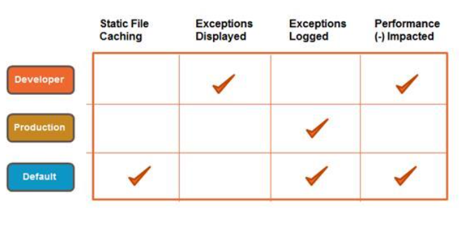

2 - Request Flow Processing
============================

2.0 Identify the steps for application initialization.
------------------------------------------------------

**What is [app/bootstrap.php](https://github.com/magento/magento2/blob/2.2-develop/app/bootstrap.php&sa=D&ust=1609223264555000&usg=AOvVaw0Srn64dGW6XbRge8k-JR_B) used for?**

> Production Mode: `pub/index.php` (entry point) in the site root or in pub/index.php.
> Developer mode: `index.php` (entry point in the website root).
> To run the Magento application, the following actions are implemented in `index.php`:

*   Include `app/bootstrap.php` which performs essential initialization routines, such as:
*   Initializing the error handler.
*   Initializing the autoloader.
*   Creates the Object Manager and basic shared services that are used everywhere and are affected by the environment. The environment parameters are injected properly into these objects.
*   Asserts that maintenance mode is not enabled; otherwise, terminates.
*   Asserts that the Magento application is installed; otherwise, terminates.
*   Setting profiling options
*   Setting the default timezone (UTC).
*   Create an instance of `Magento\Framework\App\Bootstrap`.
*   Create a Magento application instance (`Magento\Framework\AppInterface`).
*   Starts the Magento application

*   Any uncaught exception during application launch is automatically passed back to Magento in the catchException() method which you can use to handle the exception. The latter must return either true or false:

*   If true: Magento handled the exception successfully. No need to do anything else.
*   If false (or any other empty result): Magento did not handle the exception. The bootstrap object performs the default exception handling subroutine.

*   Sends the response provided by the application object.

A bootstrap is the program that initializes the operating system (OS) during startup. For Magento, it performs essential initialization routines, such as error handling, initializing the autoloader, setting profiling options, setting the default timezone, and other PHP config such as precision.

**What is [`Magento\Framework\App\Bootstrap`](https://github.com/magento/magento2/blob/2.2-develop/lib/internal/Magento/Framework/App/Bootstrap.php&sa=D&ust=1609223264558000&usg=AOvVaw10IOOWs76ZlVZZ8NT6niNs) used for?**

1.  Configure autoloader (composer) - PSR-4 prepend `generation\Magento`
2.  Calls object manager->create
3.  Set error handlers
4.  Assert maintenance
5.  Assert installed
6.  Starts the Magento application - bootstrap->createApplication()

> Response = application->launch()
> Response->sendResponse()
> On error: application->catchException
> On missed error:

* Developer mode: prints exception trace
* Production mode: log, message "An error has happened during application run. See exception log for details."

 Bootstrap run logic uses the following algorithm to run the Magento application:

1.  Initializes the error handler.
2.  Creates the object manager and basic shared services that are used everywhere and are affected by the environment. The environment parameters are injected properly into these objects.
3.  Asserts that maintenance mode is not enabled; otherwise, terminates.
4.  Asserts that the Magento application is installed; otherwise, terminates.
5.  Starts the Magento application.

**What are the following classes responsible for?**


| Class Namespace | Entry Point | Description |
|---|---|---|
| `Magento\Framework\App\Http` | `index.php`, `pub/index.php` | Loads config area by front name then dispatches event: `controller_front_send_response_before `|
| `Magento\Framework\App\Cron` | `pub/cron.php` | Config area "crontab" loads, then translations, then dispatches events. |
| `Magento\MediaStorage\App\Media` | `pub/get.php` | Accesses `/media/*` directory when using DB image storage or a physical file doesn't exist. |
| `Magento\Framework\App\StaticResource` | `pub/static.php` | In production/developer mode: get static asset by URL path `$area/$resource/$file` for example: `static/version1603322088/frontend/MyVendor/MyTheme/en_AU/jquery.min.js`. Also loads configuration by params and sends a file in response. In default mode: If file doesn't exist, generate it in class: `Magento\Framework\View\Asset\File::assetPublisher->publish` - materialize (copy/symlink) file if doesn't exist. |
| `Magento\Indexer\App\Indexer` | `index.php`, `pub/index.php` | Regenerate all indexers - In Magento module `Magento_Indexer`. |

Indexing is how Magento transforms data such as products and categories, to improve the performance. Original data entered to the system. Dictionaries are organized in [](http://en.wikipedia.org/wiki/Database_normalization&sa=D&ust=1609223264565000&usg=AOvVaw1Jl6Aj9LdVy7N4c-3iMHs0) [normal form](http://en.wikipedia.org/wiki/Database_normalization&sa=D&ust=1609223264566000&usg=AOvVaw3vcjAK-xbCrTaxEEi9mKRo) (data duplication) to facilitate maintenance (updating the data).

Without indexing, Magento would have to calculate the price of every product on the fly, taking into account shopping [Cart Price Rules](#h.x0kvcqk03fp8), [Bundle Product](#h.41g7zcfrlmri) pricing, discounts, [tier pricing](#h.cw5qpmek3sj4), etc. Loading the price for a product would take a long time, possibly resulting in cart abandonment

Magento\Backend\App\UserConfig

Application for managing user configuration - module-backend

2.1 Utilize modes and application initialization
------------------------------------------------

**How would you design a customization that should act on every request and capture output data regardless of the controller?**

Event: controller_front_send_response_before

**Describe how to use Magento modes. What are the pros and cons of using developer mode/production mode?**

php bin/magento deploy:mode:set production|developer|default



Developer Mode

*   Static file materialization is not enabled (not symlinked or generated on the fly).
*   Uncaught exceptions displayed in the browser
*   Exceptions thrown in error handler, not logged
*   System logging in var/report, highly detailed.

Production Mode

*   Deployment phase on the production system; highest performance
*   Exceptions are not displayed to the user -- written to logs only.
*   This mode disables static file materialization (not symlinked or generated on the fly).
*   The Magento docroot can have read-only permissions.

Default Mode

*   Used when no other mode is specified
*   Hides exceptions from the user and writes them to log files
*   Static file materialization is enabled.
*   Not recommended / not optimized for production: caching impacts performance negatively.

**When do you use default mode?**

> As its name implies, default mode is how Magento operates if no other mode is specified. Default mode enables you to deploy the Magento application on a single server without changing any settings. However, default mode is not as optimized for production as is production mode.
> In addition to [deployment processes above](#h.ape23zglcfl2)

**How do you enable/disable maintenance mode?**

```bash
php bin/magento maintenance:enable
php bin/magento maintenance:disable
```

**Describe front controller responsibilities. In which situations will the front controller be involved in execution, and how can it be used in the scope of customizations?**

*   Front controller is only used in HTTP applications - pub/index.php i.e not used in CLI or API.
*   Used in "frontend", "adminhtml", "webapi_rest", "webapi_soap" areas.
*   It Gathers all routers (injected into the constructor using DI).
*   Finds a matching controller/router.
*   Obtains the generated HTML for the response object.

> Front controller is the first step (entry point) for processing the flow of requests. Basically, the front controller controls all the other controllers. In Magento 2 it collects routes, matches the controllers, and receives the HTML generated for the response object (converting the query to a result). It is not used in areas such as the crontab/console.

Some of these are obvious like "Front controller is only used in HTTP applications" but I think that is what they want to hear. You'll just have to memorise this.

2.2 Demonstrate ability to process URLs in Magento
--------------------------------------------------

**Describe how Magento processes a given URL.**

Front Controller

> Routing in Magento 2 is based on Front Controller Pattern. Front Controller is a design pattern, in which one component is responsible for processing all the incoming requests, redirecting them to the corresponding components, further processing and returning the result to the browser. The FrontController iterates via the available routers and, if the action responsible for the current URL is successfully found, calls the method: `Magento\Framework\App\Action\AbstractAction::dispatch();`

Routers

> All routers in Magento 2 should implement the interface: Magento\Framework\App\RouterInterface and define Magento\Framework\App\RouterInterface::match method. This method is responsible for matching and processing URL requests. In case of a successful match, the router returns the corresponding action instance. When the needed action is not found, the Front Controller is passed to the next router.

> More on the types of Routers Magento has by default in section [2.3 Demonstrate ability to customize request routing](#h.1jz2h7ynseok).


**How do you identify which module and controller corresponds to a given URL? What is necessary to create a custom URL structure?**

```bash
$routeName/$controllerName/$actionName/$param1/$value1/...
```

* `$routeName` = Search all modules routes.xml for the specified router name with the matching ID.
* `$controllerName/$actionName` = Searches that Module router's ‘Controller' directory for the specified class (in camel-case). Modules for this ID are sorted with "before" and "after" attributes in the declarative schema.

**Describe the URL rewrite process and its role in creating user-friendly URLs. How are user-friendly URLs established, and how are they customized?**

Using Router urlrewrite:
```
?____from_store query param, redirects to a new URL if necessary.
```

> Example, on an English store category page /shoes switching to Norwegian store:
> `/no/shoes?___from_store=1`
> A new rewrite for norwegian store redirect to /no/sko (sko = norwegian for shoes)


 Just remember the urlrewrite Router is responsible for user friendly URLs and that you can customise them via the Admin & also by passing the query flag `?____from_store` in the URL.

**Describe how action controllers and results function.**

Controllers

> Controllers in Magento 2 differ from the typical MVC applications' controllers. In MVC applications, controller is a class, while action is the method of this class. In Magento 2, controller is a folder (or php namespace), while action is a class, located in this folder (in this php namespace). The execute method of the action returns the Result object and occasionally processes input POST data.

> All actions inherit the class: [Magento\Framework\App\Action\Action](https://github.com/magento/magento2/blob/2.3/lib/internal/Magento/Framework/App/Action/Action.php%23L91&sa=D&ust=1609223264579000&usg=AOvVaw3LvjP894Vb4ZFtsSSymGM9).

> Each Action should implement one or more Magento\Framework\App\Action\Http HTTPMethodActionInterface to declare which HTTP request methods it can process. The most common ones are:

*   Magento\Framework\App\Action\HttpDeleteActionInterface
*   Magento\Framework\App\Action\HttpGetActionInterface
*   Magento\Framework\App\Action\HttpPostActionInterface
*   Magento\Framework\App\Action\HttpPutActionInterface

Results

> Actions in Magento 2 can return several response types depending on its purpose and desired result. More on this in the next question.

> The following events are fired in [Magento\Framework\App\Action\Action::dispatch](https://github.com/magento/magento2/blob/2.3/lib/internal/Magento/Framework/App/Action/Action.php%23L91&sa=D&ust=1609223264581000&usg=AOvVaw0Bx1OPzG3N3QcyX0TFv7kk):

*   Event: controller_action_predispatch
*   Event: controller_action_predispatch_$routeName, e.g. ..._checkout
*   Event: controller_action_predispatch_$fullActionName, e.g. ..._checkout_cart_index
*   Stop if FLAG_NO_DISPATCH
*   Execute - all action controllers that implement App\Action\Action
*   Stop if FLAG_NO_POST_DISPATCH
*   Event: controller_action_postdispatch_$fullActionName
*   Event: controller_action_postdispatch_$routeName
*   Event: controller_action_postdispatch
*   If action doesn't return result, response object is returned -- action just modifies response object

 Just remember Controllers handle HTTP requests (PUT POST GET DELETE etc) and Results return responses in various formats depending on the desired outcome (see below for various types).

**How do controllers interact with other controllers?**

> A Controller can interact with another via 2 ways:

1. A Redirect, for example Magento\Framework\Controller\Result\Redirect\Factory:
```php
public function __construct(
        Magento\Framework\Controller\Result\Redirect\Factory $resultRedirectFactory
) {
        $this->resultRedirectFactory = $resultRedirectFactory;
}

public function execute()
{
        $result = $this->resultRedirectFactory->create();
        $result->setPath('*/*/index');
        return $result;
}
```
2. A Forward Result, less commonly used. Example
```php
public function __construct(
    Magento\Framework\Controller\Result\Forward\Factory $resultForwardFactory
) {
    $this->resultForwardFactory = $resultForwardFactory;
}

public function execute()
{
    $result = $this->resultForwardFactory->create();
    $result->forward('noroute');
    return $result;
}
```

Just remember Forward Result, Redirect Result.

**How are different response types generated?**

> Action in Magento 2 can return several response types depending on its purpose and desired result. All actions returned results inherit class Magento\Framework\Controller\AbstractResult and can be in the form of:

*   `Magento\Framework\Controller\Result\Json` - A possible implementation of JSON response type (instead of hardcoding `json_encode()` all over the place). An actual for controller actions that serve ajax requests.

*   `Magento\Framework\Controller\Result\Redirect` - In many cases controller actions may result in a redirect so this is a result object that implements all necessary properties of a HTTP redirect.

*   `Magento\Framework\Controller\Result\Forward` - Internally calls the execute method of another action class and does not trigger a new request from the browser. The URL stays the same.

*   `Magento\Framework\Controller\Result\Raw` - A result that contains raw response - may be good for passing through files, returning result of downloads or some other binary contents.

*   `Magento\Framework\View\Result\Page` - A "page" result that encapsulates page type, page configuration and imposes certain layout handles.The framework convention is that there will be loaded a guaranteed handle for "all pages", then guaranteed handle that corresponds to page type and a guaranteed handle that stands for page layout (a wireframe of a page) Page result is a more specific implementation of a generic `Magento\Framework\View\Result\Layout` response.

 Just remember Forward Result, Redirect Result, Page Result & Raw Result.

2.3 Demonstrate ability to customize request routing
----------------------------------------------------

**Describe request routing and flow in Magento.**

Frontend
| Name | Sort order | Description |
| --- | --- | --- |
| [`robots`](https://github.com/magento/magento2/blob/2.2/app/code/Magento/Robots/Controller/Router.php&sa=D&ust=1609223264592000&usg=AOvVaw1t7io0nRyaTo8gasoexM8U) | 10 | Matches request to the robots.txt file |
| [`urlrewrite`](https://github.com/magento/magento2/blob/2.2/app/code/Magento/UrlRewrite/Controller/Router.php&sa=D&ust=1609223264593000&usg=AOvVaw22YRzy-U_ItCidN7DYEXGQ) | 20 | (`Magento\UrlRewrite\Controller\Router`) is responsible for catalog URL rewrites. It uses Url Finder to find the necessary URL in the database, and after that returns the forward just like CMS Router. |
| [`standard`](https://github.com/magento/magento2/blob/2.2/lib/internal/Magento/Framework/App/Router/Base.php&sa=D&ust=1609223264595000&usg=AOvVaw1hhz8s0DW3y1I5uN-lQ0H5) | 30 | A.K.A Base Router: (Magento\Framework\App\Router\Base) sets module front name, controller and action names, controller module and route name if found. Processes standard Magento URLs. |
| [`cms`](https://github.com/magento/magento2/blob/2.2/app/code/Magento/Cms/Controller/Router.php&sa=D&ust=1609223264596000&usg=AOvVaw0YUrT_xasXuzgFLED_Yhnu) | 60 | (`Magento\Cms\Controller\Router`) is used for processing CMS pages. Sets module name to "cms", controller name to "page", action name to "view" and page id depending on the requested page. After that it forwards request but won't dispatch it. This will lead to Front Controller starting the next cycle of router checking, on which Base Router based on the established path will call. |
| [`default`](https://github.com/magento/magento2/blob/2.2/lib/internal/Magento/Framework/App/Router/DefaultRouter.php&sa=D&ust=1609223264598000&usg=AOvVaw1DBtgglBYdbj48Af1bsW3m) | 100 | (`Magento\Framework\App\Router\DefaultRouter`) is used when no other router is able to find the appropriate controller. It's responsible for 404 Page. |


Backend
| Name | Sort order | Description |
| --- | --- | --- |
| [`admin`](https://github.com/magento/magento2/blob/2.2/app/code/Magento/Backend/App/Router.php&sa=D&ust=1609223264601000&usg=AOvVaw1sRf8fxedsrSVDLltAhBeB) | 10 | Matches requests in the Magento admin area |
| [`default`](https://github.com/magento/magento2/blob/2.2/lib/internal/Magento/Framework/App/Router/DefaultRouter.php&sa=D&ust=1609223264602000&usg=AOvVaw1G2Jvo4C4Oriq1WCAPbq4N) | 100 | The default router for the admin area |


**When is it necessary to create a new router or to customize existing routers?**

> Very rarely would you need to create a new router, usually the above routers are fine. Only when the URL structure doesn't fit into the module/controller/action template, e.g. fixed robots.txt or dynamic arbitrary rewrites from DB.

**How do you handle custom 404 pages?**

1.  If the front controller catches `Magento\Framework\Exception\NotFoundException`, it changes the action name "noroute" and continues the loop. E.g. catalog/product/view/id/1 throws NotFoundException. catalog/product/noroute is checked.
2.  If the standard router recognizes the front name but can't find the controller, it tries to find the "noroute" action from the last checked module. E.g. catalog/brand/info controller doesn't exist, so catalog/brand/noroute will be checked.
3.  If all routers didn't match, default controller provides two opportunities:
    *  set default 404 route in admin config web/default/no_route (see: `Magento\Framework\App\Router\NoRouteHandler::process`)
    *  Register custom handler in noRouteHandlerList:
    backend (sortOrder: 10) Magento\Backend\App\Router\NoRouteHandler -> adminhtml/noroute/index
    default (sortOrder: 100) Magento\Framework\App\Router\NoRouteHandler

2.4 Determine the layout initialization process
-----------------------------------------------

**Determine how layout is compiled.**

> Layout XML (layout.xml) is generated by compiling via Dependency Injection. Specifically: all the available handles for each route are built, loaded, generated, configured and returned. In further detail:

1. Core Magento Framework Layout classes are built:
    * `Magento\Framework\View\Layout::build();`
    * `Magento\Framework\View\Layout\Builder::build();`
    * `Magento\Framework\View\Model\Layout\Merge::load();`

2. Handles from the var $handles to the protected field $handles are added. This is how they are generated:
    * A physical theme, based on the current theme, is loaded. Physical is the theme that has a designated folder and which is loaded via registration.php. There are TYPE_PHYSICAL=0, TYPE_VIRTUAL=1, TYPE_STAGING=2 types stored in "theme" table of the database.
    * The search of all *.xml files in the folders layout, page_layout in all enabled modules and current themes.
    * A new xml tag (handle or layout) is added into $layoutStr variable/property.
    * From this xml only necessary handles are loaded.
    * Additional handles from the database are loaded.

3. Layout for the current handles is returned.
4. XML object and configuration generated.

 Just remember that Layout XML (`layout.xml`) is generated by compiling via Dependency Injection, all the available handles for each route is built, loaded, generated, configured and returned in the Magento_Framework module.

**How would you debug your `layout.xml` files and verify that the right layout instructions are used?**


1. You can create an Observer using the layout_generate_blocks_after event to dump out the XML:
```xml
<?xml version="1.0" encoding="UTF-8"?>

<config xmlns:xsi="http://www.w3.org/2001/XMLSchema-instance" xsi:noNamespaceSchemaLocation="urn:magento:framework:Event/etc/events.xsd">
   <event name="layout_generate_blocks_after">
       <observer name="vendor_module_layout_generate_blocks" instance="MyVendor\MyModule\Observer\LayoutGenerateBlockObserver" />
   </event>
</config>
```

```php
public function execute(Observer $observer)
{
    header('Content-Type: text/xml');
    $layoutString = $observer->getEvent()->getLayout()->getXmlString();
    echo '<layouts xmlns:xsi="http://www.w3.org/2001/XMLSchema-instance">' . $layoutString . '</layouts>';
    die;
}
```

2. You can also temporarily dump out the page layout / XML in the execute method of a Controller Action before the return element:

```php
header('Content-Type: text/xml');
$layoutString = $resultPage->getLayout()->getXmlString();
echo '<layouts xmlns:xsi="http://www.w3.org/2001/XMLSchema-instance">' . $layoutString . '</layouts>';
die;
```
This is actually pretty useful to use practically.

**Determine how HTML output is rendered.**

For layout rendering:
*   `Magento\Framework\View\Layout::getOutput()` is called. This method recursively renders every registered _output child element.
*   `Magento\Framework\View\Layout::renderElement`

This is what happens up the tree when you call `getChildHtml()` / `_toHtml()` from your block class.

**How does Magento flush output, and what mechanisms exist to access and customize output?**

> The [Front Controller](#h.1rr8cbug1ad) returns a response to App\Bootstrap by calling Action Controllers. Action Controllers return certain $result which are [specified in section 2.2](#h.39aby0sbkm32). There can be different types of `$result`; for instance:

*  `Magento\Framework\Controller\Result\Raw`
*  `Magento\Framework\Controller\Result\Json`
*  `Magento\Framework\Controller\Result\Redirect`
*  `Magento\Framework\View\Result\Layout`
*  `Magento\Framework\View\Result\Page`

During this process 2 events are fired:

1.  `Magento\Framework\App\Http` event: `controller_front_send_response_before`
2.  `Magento\Framework\View\Element\AbstractBlock::toHtml` event: `view_block_abstract_to_html_after`

> That allows you to modify responses before returning. Depending on the $result type, Magento flushes html output the following way:
1.  [Controller Action](#h.39aby0sbkm32) returns certain $result type (above).
2.  If result is instance of `Magento\Framework\App\Response\HttpInterface`, then the result is returned to the browser
3.  Otherwise, in case result is instance of `Magento\Framework\Controller\ResultInterface`, then:
    *  `$result->renderResult($response)` is called, which calls `$result->applyHttpHeaders($response)` and `$result->render($response)`
    *  Then, `$response->sendResponse()` method is called. The method sends headers and body to the browser.

Just remember that Magento flushes output depending on the result type returned, therefore manipulating the relevant [Controller Action](#h.39aby0sbkm32) would be how you customise output.

Event controller_front_send_response_before seems to pop-up A LOT in the exam notes, I would remember this.

**How do you add new elements to the pages introduced by a given module?**

Module layouts:

```
<module_dir>/view//layouts.xml
<theme_dir>/_/layouts.xml
```

base:
```
empty
```

frontend:
```
 1column - extends empty
 2columns-left - extends 1column
 2columns-right - same as 2columns-left
 3columns - same as 2columns-left
```

adminhtml:
```
 admin-empty
 admin-1column
 admin-2columns-left
```

Remember that the layouts.xml file is responsible for the base column layouts i.e 1column, 2columns-left etc.

**Determine module layout XML schema.**

Schema using `urn:magento:framework:View/Layout/etc/layout_generic.xsd`

| Element | Attributes | Parent of | Description |
| --- | --- | --- | --- |
| `<layout>` | `xsi:noNamespaceSchemaLocation="{path_to_schema}"` | `<container>`, `<update>` | Mandatory element |
| `<update>` | `handle="{name_of_handle_to_include}"` | None | |
| `<container>` | For complete list of attributes, see [](https://devdocs.magento.com/guides/v2.3/frontend-dev-guide/layouts/xml-instructions.html%23fedg_layout_xml-instruc_ex_cont&sa=D&ust=1609223264632000&usg=AOvVaw0xP9WfcYwPmjrhnlVBnK0-) [Layout instructions](https://devdocs.magento.com/guides/v2.3/frontend-dev-guide/layouts/xml-instructions.html%23fedg_layout_xml-instruc_ex_cont&sa=D&ust=1609223264633000&usg=AOvVaw0C1fP3AdUmV7BLrkImmYqK) | `<block>`, `<container>`, `<referenceBlock>`, `<referenceContainer>` | Mandatory element |

This is essentially a basic definition of a page XML layout handle, think of some of the parent/root elements of layout checkout_index_index.xml and you got it.

Schema `page_configuration.xsd`

| Element | Attributes | Parent of | Description |
| --- | --- | --- | --- |
| `<page>` | `layout = {layout}`, `xsi:noNamespaceSchemaLocation="{path_to_schema}"` | `<html>`, `<head>`, `<body>`, `<update>` | Mandatory root element.
| `<html>` | None | `<attribute>` | |
| `<head>` | `name="root"` For complete list of attributes, see [here](https://devdocs.magento.com/guides/v2.3/frontend-dev-guide/layouts/xml-instructions.html%23fedg_layout_xml-instruc_ex_cont&sa=D&ust=1609223264640000&usg=AOvVaw0Sy1hiN8ycGNfJR_NWHrBI). [Layout instructions](https://devdocs.magento.com/guides/v2.3/frontend-dev-guide/layouts/xml-instructions.html%23fedg_layout_xml-instruc_ex_cont&sa=D&ust=1609223264641000&usg=AOvVaw0WKrH13QavLIgsryLCp6Ch) | `<title>`, `<meta>`, `<link>`, `<css>`, `<font>`, `<script>` | Mandatory element |
| `<body>` | None | `<block>`, `<container>`, `<move>`, `<attribute>`, `<referenceBlock>`, `<referenceContainer>`, `<action>` | |
| `<attribute>` | name = {arbitrary_name}, value = {arbitrary_value} | | |
| `<title>` | None | None | Page title |
| `<meta>` | content, charset, http-equiv, name, scheme | None |
| `<link>` | defer, ie_condition, charset, hreflang, media, rel, rev, sizes, src, src_type, target, type | None | |
| `<css>` | defer, ie_condition, charset, hreflang, media, rel, rev, sizes, src, src_type, target, type | None | |
| `<script>` | defer, ie_condition, async, charset, src, src_type, type | None | |

This page_configuration.xsd is essentially just the schema of a standardised HTML document only it's XML format.

layouts.xml - declare available page layouts

| Directory | Sort Order |
| --- | --- |
| `<theme_dir>/<Namespace>_<Module>/layouts.xml` | 1 |
| `<module_dir>/view/<area_code>/layouts.xml` | 2 |

Examples:

*   base:
    *   empty
*   frontend:
    *   1column - extends empty`
    *   2columns-left - extends 1column
    *   2columns-right - same as 2columns-left
    *   3columns - same as 2columns-left`
*   adminhtml:
    *   admin-empty
    *   admin-1column
    *   admin-2columns-left

Schema `page_layout.xsd`
> Page layout declares the wireframe of a page inside the <body> section, for example one-column layout or two-column layout. Allowed layout instructions:

*   [`<container>`](https://devdocs.magento.com/guides/v2.3/frontend-dev-guide/layouts/xml-instructions.html%23fedg_layout_xml-instruc_ex_cont&sa=D&ust=1609223264658000&usg=AOvVaw2Kkck3YgOrzUnrJYS-Fntv)
*   [`<referenceContainer>`](https://devdocs.magento.com/guides/v2.3/frontend-dev-guide/layouts/xml-instructions.html%23fedg_layout_xml-instruc_ex_ref&sa=D&ust=1609223264658000&usg=AOvVaw1mhX4p66cLtYOB5tdzDMJ4)
*   [`<move>`](https://devdocs.magento.com/guides/v2.3/frontend-dev-guide/layouts/xml-instructions.html%23fedg_layout_xml-instruc_ex_mv&sa=D&ust=1609223264659000&usg=AOvVaw05MW2PUfH5BHcLsLzAr_Z8)
*   [`<update>`](https://devdocs.magento.com/guides/v2.3/frontend-dev-guide/layouts/xml-instructions.html%23fedg_layout_xml-instruc_ex_upd&sa=D&ust=1609223264659000&usg=AOvVaw05lwHgwtA5VN1-bEa4jdOS)

Sample page layout: <Magento_Theme_module_dir>/view/frontend/page_layout/2columns-left.xml

**How do you add new elements to the pages introduced by a given module?**

```xml
<block class="module\block\class" template="new module template" ... />
```

Think "block" rather than "element" then this will give you a hint

**Demonstrate the ability to use layout fallback for customizations and debugging.**

```
View\Element\Template::getTemplateFile

            V

View\Element\Template\File\Resolver::getTemplateFileName(template, [module, area]) Caches in memory

            V

View\FileSystem::getTemplateFileName

            V

View\Asset\Repository::updateDesignParams

            V

Detects module by Module_Name::template.phtml, adds default params

            V

Adds default missing params [object themeModel, locale]

            V

View\Design\FileResolution\Fallback\TemplateFile::getFile(area)

            V

View\Design\FileResolution\Fallback\File::getFile

            V

View\Design\FileResolution\Fallback\Resolver\Simple::resolve

            V

View\Design\Fallback\RulePool::getRule

            V

View\Design\FileResolution\Fallback\Resolver\Simple::resolveFile(fileRule)
```


File fallback rule

| Directory | Sort Order | Condition |
| --- | --- | --- |
| `<theme_dir>` | 1 | When missing 'module_name' e.g. "app/design/frontend/Theblockshop/theblockshop" |
| `<theme_dir>/<module_name>/templates` | 2a | When set 'module_name' e.g. "app/design/frontend/Theblockshop/theblockshop/Magento_Checkout" |
| `<module_dir>/view/<area_code>/templates` | 2b | When set 'module_name' e.g. "app/code/Convert/EstimateShipping/view/frontend/templates" |
| <module_dir>/view/base/templates | 2c | When set 'module_name' e.g. "app/code/Convert/EstimateShipping/view/base/templates" |

Just remember the File fallback rule and the class `Magento\Framework\View\Element\Template::getTemplateFile`  - I think it would be cruel if they made you resight class names… There are 1000s

**How do you identify which exact layout.xml file is processed in a given scope?**

* Determine which area is loaded (frontend or adminhtml).
* Locate the layout handle.
* Search through the project to find all XML files with that name.

> Alternatively, add the following code into the [Controller Action](#h.39aby0sbkm32) into the execute method before return:

```php
var_dump($resultPage->getLayout()->getUpdate()->getHandles()); die;
```
Similar to the above question.

**How does Magento treat layout XML files with the same names in different modules?**

> Magento merges the layout xml files into a single one during [Dependency Injection](#h.9ofwnl5q9fnf) (DI) compilation.

> XML of the same file names are merged according to tag names (for example: `<block>`) and the id="" attributes.

> The order in which they merge depend on both the File Fallback rule & Module Sequence. For example:

*   Modules that depend on other modules are merged in Module sequence order: the `<sequence>` tag defined in each `<module_dir>/etc/module.xml`
*   Layout XML files in the theme directory app/design take precedence over those in the app/code directory (Modules).

**Identify the differences between admin and frontend scopes. What differences exist for layout initialization for the admin scope?**

> An area is a logical component that organizes code for optimized request processing. Magento uses areas to streamline web service calls by loading only the dependent code for the specified area. Each of the default areas defined by Magento can contain completely different code on how to process URLs and requests.

Features - These are the functional differences between admin and frontend:

*   ACL permissions - _isAllowed, change static const ADMIN_RESOURCE
*   Base controllers are different
  *   Frontend: `Magento\Framework\App\Action`
  *   Admin: `Magento\Backend\App\AbstractAction`
*   Custom URL model which uses a secret key: key
*   The layout acl block attribute
*   File tree path structures are different:
  *   app/design/adminhtml vs app/design/frontend
  *   `<module_dir>/view/adminhtml` vs `<module_dir>/view/frontend`
*   UIComponents are used in Adminhtml whereas they are not in Frontend.
*   The adminhtml area code (of Magento\Framework\App\Area) includes and allows code needed for store management (using Magento\Framework\App\State) whereas frontend  contains template and layout files that define the appearance of your storefront only.

Scope Properties  -To better answer this particular question and the differences between admin/frontend scopes for layout initialization these are the main differences:

*   Layout area is different when searching file paths:
    *   Admin: adminhtml
    *   Frontend: frontend
*   The default Block classes are different:
    *   Frontend: `Magento\Backend\Block\AbstractBlock`
    *   Frontend: `Magento\Backend\Block\Template`
*   The layout area aclResource support is added for admin, allowing you to connect the resource to a block and hide the block if the user does not have access to the resource.
*   Some extra properties are available in admin
    *   authorization
    *   mathRandom
    *   backendSession
    *   formKey
    *   class nameBuilder
*   Different events are dispatched for example:
    *   Admin: adminhtml_block_html_before - fired only when non-cached render.
    *   Frontend: to compare, event `view_block_abstract_to_html_after` fires even when block loaded from cache
*   [Controller Result](#h.39aby0sbkm32) object has different methods:
    *   setActiveMenu
    *   addBreadcrumb
    *   addContent(block) - moves to 'content'
    *   addLeft(block)
    *   addJs
    *   moveBlockToContainer

Adminhtml & Frontend do share functionality also such as design paths in <module_dir>/view/base & app/design/base if common functionality exists between them.

2.5 Determine The Strucuture Of Block Templates
----------------------------------------------

> Page structures are defined by the layout in the page layout nodes. An example can be seen in the `catalog_product_view.xml`

Root Template

> The root template is the most basic piece and common conglomeration of HTML that is possible in Magento. It is where the result of the layout instructions are put.
>
> Magento only has one root template: `vendor/magento/module-theme/view/base/templates/root.phtml`.
>
> This file is injected into the controller’s Page result (`vendor/magento/module-theme/view/base/templates/root.phtml`) with dependency injection:
>
> * `vendor/magento/module-backend/etc/adminhtml/di.xml`
> * `vendor/magento/magento2-base/app/etc/di.xml`

`empty.xml`

> This is the parent page layout XML file. All page layout files derive and extend this.


`page_layout`

> Files in these directories represent different page layout ideas. For example, Magento comes with a 1 column layout, a 2 column (right or left) layout, and a 3 column layout (found in vendor/magento/module-theme/view/frontend/page_layout).
>
> You can create new layout types by simply adding a new file in a `view/frontend/page_layout` directory.


**How are page structures defined, including number of columns, which basic containers are present, etc.?**

> To specify a layout for a page, wrap the XML file in a `<page/>` node and set the `layout=""`

> By adding a container to the columns container. Containers are powerful in that you can specify the HTML tag name and associate classes.

Examples:

* `vendor/magento/module-theme/view/frontend/page_layout/1column.xml`
* `vendor/magento/module-theme/view/frontend/page_layout/3columns.xml`


**Describe the role of blocks and templates in the request flow. In which situations would you create a new block or a new template?**

> A `ViewModel` can be used to provide data to a template (`.phtml` file). In most cases, creating a custom block type is no longer necessary. The block includes the template, and shares the view model for data retrieval.
>
> You do not need to specify a block’s type in layout XML anymore. The default `\Magento\Framework\View\Element\Template` is specified in the absence of the type attribute. Instead, specifying the view_model argument is the way that Magento now recommends.
>
> Two cases where creating a block is necessary would be:
>
> * If the template is determined at runtime (cart item renderers).
> * Or non-default block caching needs to be used.
>
> Templates are created to display information. For module development, templates and blocks represent an almost 1:1 ratio. For theme development, many more templates will be created or overridden than blocks.