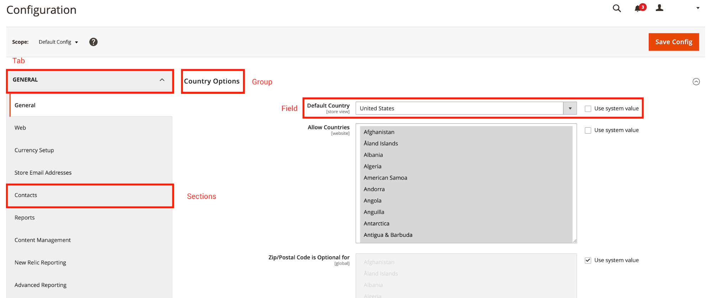

6 - Developing with Adminhtml
=============================

6.1 Describe common structure/architecture
------------------------------------------

**Describe the difference between Adminhtml and Frontend. What additional tools and requirements exist in the admin?**

*   ACL permissions - _isAllowed, change static const ADMIN_RESOURCE
*   Base controllers are different `Magento\Backend\App\Action` vs `Magento\Backend\App\AbstractAction` which accepts 4 parameters + pathPrefix (more on this below).
*   Custom URL model which uses a secret key: key
*   The layout acl block attribute
*   File tree path structures are different:
    *   `app/design/adminhtml` vs `app/design/frontend`
    *   `<module_dir>/view/adminhtml` vs `<module_dir>/view/frontend`
*   `UIComponents` are used in Adminhtml whereas they are not in Frontend.
*   The `adminhtml` area code of `Magento\Framework\App\Area` includes and allows code needed for store management using `Magento\Framework\App\State` whereas frontend  contains template and layout files that define the appearance of your storefront only.

Adminhtml & Frontend do share design paths in `<module_dir>/view/base` & `app/design/base` if common functionality exists between them.

**What does router `id="admin"`, router `id="standard"` mean in routes.xml?**

> The Standard Router (A.K.A the base router) sets module `frontName`, Controller Action names, Controller Module & Route Name if found. It processes all standard Magento URLs.
>
> The `frontName` attribute value becomes the part of our URL structure. Simply put, the URL formula for hitting the C.R.U.D action is formatted like:

```
<store-url>/<store-code>/<front-name>/<controller-name>/<action-name>
```

> The `id` attribute is the naming convention for Layout Handle XML and is formatted:

```
{route-id}_{controller-name}_{action-name}.xml
```

When configuring a custom routes.xml, it's easier to keep the id and frontName the same value.

More information on Routers in [Section 2.3](#h.1jz2h7ynseok).

**Some URLs in the backend start with "admin/admin/.." - 2 times admin, some only 1 - "admin/...". How?**

Config In Settings

> The admin appears twice in the url when you have the flag:
>
>       Use Store Codes in the URL set = Yes.
>
> Since the admin section is actually a store view from Magento's point of view, its code (admin) is shown in the url.
>
>
> The second time it appears it's because admin is the route key for the adminhtml controllers. For example, if you set a custom admin url key in the configuration:
>
> **      System > Configuration > Admin > Admin Base URL > Custom Admin Path**
>
> The url will look like https:///example.com/admin/backend/controller/action/
>
> The First link hides behind `Magento_Backend`'s original `frontName` route `"adminhtml"="admin"`. The Second link has it's own `frontName="theme"` and is more beautiful.

Admin Workflow

1.  bootstrap.run(application)
2.  application.launch
3.  front controller.dispatch
4.  admin routerList: admin | default
5.  `Magento\Backend\App\Router` (admin router) - Same as frontend `Magento\Framework\App\Router\Base` (standard router) except for:
    *  It parses 4 sections:
        1.  'areaFrontName' = area such as "admin" which uses "adminhtml" area code.
        2.  'moduleFrontName' = The modules frontName e.g. "theme".
        3.  'actionPath' The modules action Controller path e.g. "design_config".
        4.  'actionName' The modules action method path e.g. "index" + additional query parameters such as /key/4bd2...13/
    *  pathPrefix = 'adminhtml' -- all controller classes are searched in Module\Controller\Adminhtml\...
6.  Module_Backend registers router i.e. getUrl("adminhtml/controller/action")

6.2 Define form and grid widgets
--------------------------------

**Define form structure, form templates, grids, grid containers, and elements. What steps are needed to display a grid or form?**

Step 1 - Define An ACL Resource

See [Section 6.4](#h.8mv9vd67dqk5) on how to do this.

Step 2 - Define A Menu Item

See [Section 6.4](#h.8mv9vd67dqk5) on how to do this.

Step 3 - Define A Route

Define a new routes.xml in your custom module. The contents of this XML file tells Magento to route requests that use the frontName "exampleadminnewpage" to this module. The file is found in:

`<module_dir>/etc/adminhtml/routes.xml`

Example `MyVendor/MyModule/Controller/MyExampleAdminPage/Index.php`:
```xml
<?xml version="1.0"?>
<config xmlns:xsi="http://www.w3.org/2001/XMLSchema-instance" xsi:noNamespaceSchemaLocation="urn:magento:framework:App/etc/routes.xsd">
        <router id="admin">
                   <route id="exampleadminnewpage" frontName="exampleadminnewpage">
                       <module name="MyVendor_MyModule"/>
                   </route>
        </router>
</config>
```
Step 4 - Create A Controller & Layout Handle

> A layout handle is a uniquely identified set of layout instructions that serves as a name of a layout file.
> The id attribute of the <route> node defined above will be the naming convention for this Layout Handle XML and is formatted and found in:

```
<module_dir>/view/adminhtml/{route-id}_{controller-name}_{action-name}.xml
```
> In this example it would be `exampleadminnewpage_myexampleadminnewpage_index.xml`

More on [Layout Handles here.](https://devdocs.magento.com/guides/v2.4/frontend-dev-guide/layouts/layout-overview.html%23layout-over-terms&sa=D&ust=1609223265050000&usg=AOvVaw3_snUU799Zu0QeeZjg_QQp)

Example Layout Handle with `uiComponent` node:

```xml
<?xml version="1.0"?>
<page xmlns:xsi="http://www.w3.org/2001/XMLSchema-instance" xsi:noNamespaceSchemaLocation="urn:magento:framework:View/Layout/etc/page_configuration.xsd">
        <body>
                   <referenceContainer name="content">
                               <uiComponent name="example_admin_new_page" />
                   </referenceContainer>
        </body>
</page>
```

Create A UI Component

> Magento UI components are used to represent distinct UI elements, such as tables, buttons, dialogs, and others. They are designed for simple and flexible user interface (UI) rendering.
> UI component is a combination of:

*   XML declaration that specifies the component's configuration settings and inner structure.
*   JavaScript class inherited from one of the Magento JavaScript framework UI components base classes (such as `UIElement`, `UIClass` or `UICollection`).
*   Related template(s)

> UI Component is configured through a dedicated XML file:

```
<module_dir>/view/<adminhtml/base>/ui_component/{ui_component_name.xml}
```

In this example:

```
MyVendor/MyModule/view/adminhtml/ui_component/example_admin_new_page.xml
```
> For Adminhtml, UI Components take the form of either a [UI Form Component](https://devdocs.magento.com/guides/v2.4/ui_comp_guide/components/ui-form.html&sa=D&ust=1609223265053000&usg=AOvVaw3wKYwjnzCE7AQFh-Muy2TU) or [UI Listing (Grid) Component](https://devdocs.magento.com/guides/v2.4/ui_comp_guide/components/ui-listing-grid.html&sa=D&ust=1609223265054000&usg=AOvVaw2jmBXaNRZ1CBqWh9CRKQxi).

*   How to create a UI Listing (Grid)Component: [Please refer to the section below](#h.sa9xmdshqqtr)
*   How to make a UI Form Component: [Please refer to the section below](#h.zewrzi9tl4q3)

Step 6 - Define a DataSource Provider Component

> Magento provides the [DataSource](https://devdocs.magento.com/guides/v2.4/ui_comp_guide/concepts/ui_comp_data_source.html&sa=D&ust=1609223265055000&usg=AOvVaw2xYsbx67HiCgYdW7Zg2WDf) object, which is designed to interact with data in your UI component. Many of the core UI components use this DataSource component. Many UI components require that this object is included. However, there are specific requirements in order for it to work correctly.
>
> For more information, please refer to the [DataSource Provider Component section](#h.kg229a1fn1nm) below.

Step 7 - Define & Create Actions

```xml
<type name="Magento\Framework\View\Element\UiComponent\DataProvider\CollectionFactory">
        <arguments>
                   <argument name="collections" xsi:type="array">
                                <item name="example_admin_new_page_grid_data_source" xsi:type="string">MyVendor\MyModule\Model\ResourceModel\CustomAdminPage\Grid\Collection</item>
                   </argument>
        <arguments>
</type>
```

Example `MyVendor/MyModule/view/adminhtml/ui_component/example_admin_new_page.xml`:

**Describe the grid and form workflow.**

Server Side

1.  Layout handle loads UI component
2.  XML files of UI component are searched in each enabled module (`<module_dir>/view/<area>/ui_component/<ui_component_name>.xml`)
3.  All found files of UI components are merged in a single configuration object
4.  Configuration and definition.xml are merged. Objects from definition.xml have lower priority than single configuration object, received in the previous step
5.  The received configuration is transformed into JSON and embedded into the page with Magento\Ui\TemplateEngine\Xhtml\Result class

As a result, we get the following outputted JSON code:

```html
<script type="text/x-magento-init">
{
    "*": {
        "Magento_Ui/js/core/app": {
            "types":{ ... },

            "components":{ ... }
        }
    }
}
</script>
```
To help remember this, think about how Magento [Adminhtml standard router](#h.eyiqynfna8fc) requests work then add the extra UI Component / Configuration / definition.xml

Client Side

1.  RequireJS loads `Magento_Ui/js/core/app` and passes configuration as a parameter.
2.  `Magento_Ui/js/core/app` calls `Magento_Ui/js/core/renderer/layout` and passes it the configuration.
3.  layout.js creates instances of UI components and applies the configuration to it
4.  HTML template rendering with knockout.js and binding of the component to the template is performed

[Data Source](#h.kg229a1fn1nm)

The data for grid and form is loaded with the help of [DataProvider](#h.kg229a1fn1nm). The difference lies in the moment of information upload.

[Form Component](#h.zewrzi9tl4q3)
> For the form component, the data of an entity are passed inside the current page's html code in the `<script type = "text / x-magento-init"> ... </script>` tag.
>
> [Grid Component](#h.sa9xmdshqqtr)For the grid component, the data is loaded through an additional ajax request for the controller action `mui/index/render`, processed by the `Magento\Ui\Controller\Adminhtml\Index\Render` for `adminhtml` area and `Magento\Ui\Controller\Index\Render` for frontend area .

**How is data provided to the grid or form?**

### DataSource Provider Component

> Magento provides the [DataSource](https://devdocs.magento.com/guides/v2.4/ui_comp_guide/concepts/ui_comp_data_source.html&sa=D&ust=1609223265063000&usg=AOvVaw3alkjPHTsH5uBc0r_NfY_q) object, which is designed to interact with data in your UI component. Many of the core UI components use this DataSource component. Many UI components require that this object is included. However, there are specific requirements in order for it to work correctly.
>
> Using `Magento_Ui/view/base/ui_component/etc/definition.map.xml` we can deduce full <dataSource> definition and what parameter will end up where:

```xml
<dataSource class="Magento\Ui\Component\DataSource">
   <aclResource/>
   <settings>
       <submitUrl />
       <validateUrl />
       <updateUrl/>
       <filterUrlParams/>
       <storageConfig/>
       <statefull/>
       <imports/>
       <exports/>
       <links/>
       <listens/>
       <ns/>
       <componentType/>
       <dataScope/>
       <deps/>
       <layout>
           <type/>
           <navContainerName/>
       </layout>
   </settings>
   <dataProvider name="some_name" class="SomeDataProviderClass">
       <settings>
           <primaryFieldName>entity_id</primaryFieldName>
           <requestFieldName>id</requestFieldName>
       </settings>
   </dataProvider>
</dataSource>
```

`**<dataSource>**`:

```xml
<argument name="data" xsi:type="array">
    <item name="js_config" xsi:type="array">
        <item name="provider" xsi:type="string">[ComponentName].[ComponentName]_data_source</item>
        <item name="deps" xsi:type="string">[ComponentName].index_listing_data_source</item>
    </item>
</argument>
<dataSource name="index_listing_data_source" component="Magento_Ui/js/grid/provider">
        <settings>
           <updateUrl path="mui/index/render"/>
        </settings>
        <aclResource>Vendor_MyModule::view</aclResource>
        <dataProvider class="MyVendor\MyModule\Ui\Component\CustomAdminPage\Listing\DataProvider" name="index_listing_data_source">
           <settings>
               <requestFieldName>id</requestFieldName>
               <primaryFieldName>main_table.id</primaryFieldName>
           </settings>
        </dataProvider>
</dataSource>
```

In our example [ComponentName] = `example_admin_new_page` which matches the `ui_component` XML file name.

> The main node of interest is `<dataProvider class="">`. This references a PHP class that MUST implement `Magento\Framework\View\Element\UiComponent\DataProvider\DataProviderInterface` to meet that requirement, it can extend the following classes:

*   `Magento\Ui\DataProvider\AbstractDataProvider`
*   `Magento\Framework\View\Element\UiComponent\DataProvider\DataProvider`

> The node `<item name="js_config">` is a good way to keep configuration data out of the JavaScript. It accepts:

*   `<item name="provider" xsi:type="string">` = will output in the JSON that will contain the UI component's configuration.
*   `<item name="deps" xsi:type="string">` = the name="" of your `<dataSource>` in which will be the provider.
*   `<item name="component" xsi:type="string">` = the `jsComponent` of your UI Component, for a form use `Magento_Ui/js/form/provider`. For a grid use `Magento_Ui/js/grid/provider`. These can be extended if it does not do exactly what you need.

> Other nodes of interest / importance include:

[Javascript Component Linking](https://devdocs.magento.com/guides/v2.4/ui_comp_guide/concepts/ui_comp_linking_concept.html&sa=D&ust=1609223265069000&usg=AOvVaw0SFEbEvoRrG9pkBcjHPUyq)

> Every Javascript component should extend the core [uiElement](#h.h647tzfdps5a) class in some way. When this class initializes it runs an `initLinks()` method. That method, in turn, passes a few class properties into a method that handles linking components together. This file (`lib/core/element/link.js`) binds the values of those parameters to actual components.
>
> The properties Magento will parse are:

*   `imports`
*   `exports`
*   `links`


[**`<exports/>`**](https://devdocs.magento.com/guides/v2.4/ui_comp_guide/concepts/ui_comp_linking_concept.html%23exports-property&sa=D&ust=1609223265070000&usg=AOvVaw3MmS_8QmSLuPiyk8ipbrWi) [](https://devdocs.magento.com/guides/v2.4/ui_comp_guide/concepts/ui_comp_linking_concept.html%23exports-property&sa=D&ust=1609223265071000&usg=AOvVaw0rVCuPuhkMyBKUTZ0bVJCN)

> The `<exports>` property is used to copy a local value to some external entity. Exports's value is an object, composed of the following:

```xml
<argument name="data" xsi:type="array">
    <item name="config" xsi:type="array">
        <item name="exports" xsi:type="array">
            <item name="visible" xsi:type="string">sample_config.sample_provider:visibility</item>
        </item>
    </item>
</argument>
```

> Here visible is the key, `${ $.provider }:visibility` is the value. The value of the local visible property is assigned to the visibility property of the provider component. The latter is changed automatically if the value of visible changes if the local visible property is an ko io-es5 observable (which it isn't given in the code example above).
>
> Within the jsComponent's defaults property:

```json
{
    "defaults": {
        "exports": {
            "visible": "${ $.provider }:visibility"
        }
    }
}
```

[**`<imports />`**](https://devdocs.magento.com/guides/v2.4/ui_comp_guide/concepts/ui_comp_linking_concept.html%23imports-property&sa=D&ust=1609223265074000&usg=AOvVaw1PwT5VH-B53vSSOuakgaaW) [](https://devdocs.magento.com/guides/v2.4/ui_comp_guide/concepts/ui_comp_linking_concept.html%23imports-property&sa=D&ust=1609223265075000&usg=AOvVaw1FmY-MwOGmfanHwMqKffRp)

> The `<imports>` property is used for tracking changes of an external entity property. imports's value is an object, composed of the following:

```xml
<argument name="data" xsi:type="array">
    <item name="config" xsi:type="array">
        <item name="imports" xsi:type="array">
            <item name="visible" xsi:type="string">sample_config.sample_provider:visibility</item>
        </item>
    </item>
</argument>
```

> Within the `jsComponent`'s defaults property:
```json
{
    "defaults": {
        "imports": {
            "visible": "${ $.provider }:visibility"
        }
    }
}
```

[**`<links />`**](https://devdocs.magento.com/guides/v2.4/ui_comp_guide/concepts/ui_comp_linking_concept.html%23links-property&sa=D&ust=1609223265162000&usg=AOvVaw1Zqt-qaZoI8fYWmbnqSdGL)

> The links property is used for cross tracking properties changes (import and export combined): both linked properties are tracked and changing of one results in changing the other. links's value is an object, composed of the following:

```xml
<argument name="data" xsi:type="array">
    <item name="config" xsi:type="array">
        <item name="links" xsi:type="array">
            <item name="visible" xsi:type="string">sample_config.sample_provider:visibility</item>
        </item>
    </item>
</argument>
```

> The links property of a `jsComponent` is the same as duplicating a value in both imports and exports. Each of those properties expect an object that contains key/value pairs to bind the expression to. In the example above, it would appear in the defaults property like this:

```json
{
    "defaults": {
        "links": {
            "visibility": "${ $.provider }:data.visibility"
        }
    }
}
```

[**`<listens />`**](https://devdocs.magento.com/guides/v2.4/ui_comp_guide/concepts/ui_comp_linking_concept.html%23listens-property&sa=D&ust=1609223265165000&usg=AOvVaw38P_R1lCCCZz9056X56hAv)

> The `<listens />` property is used to track the changes of a component's property. listens's value is an object, composed of the following:

```xml
<argument name="data" xsi:type="array">
    <item name="config" xsi:type="array">
        <item name="listens" xsi:type="array">
            <item name="sample_config.sample_provider:visibility" xsi:type="string">visibilityChanged</item>
        </item>
    </item>
</argument>
```

> In this example, the local `visibilityChanged` property is a method that will be called when the visibility property of the provider component changes. It receives the new value as an argument but, if the local property is not a function, it will be set to the new value (although the external property has to be a KO observable in order for listens to have any effect).

[**Template Literals**](https://devdocs.magento.com/guides/v2.4/ui_comp_guide/concepts/ui_comp_data_source.html%23javascript-template-literals&sa=D&ust=1609223265168000&usg=AOvVaw1wOfWejMB5DNqB78Zn-qOf)

> Throughout Magento's core Javascript components there are strings like this: `'${ $.provider }:data.totalRecords'`. These are [ES2015 template literals](https://developer.mozilla.org/en-US/docs/Web/JavaScript/Reference/Template_literals&sa=D&ust=1609223265168000&usg=AOvVaw2lF6Qy8tT5c88sbKBv5Glr). The `${ }` surrounds an expression that will be parsed as Javascript. `$.provider` is the expression, in this example.
>
> When the `uiElement` class initializes, it will process the link that was declared in imports. Remember that one of the first things Magento does is process string literals, though, so it is actually working with something that looks more like the following:

```json
{
    "defaults": {
        "exports": {
            "items": "checkout.sidebar.summary.cart_items:items"
        }
    }
}
```

**How can this process be customized or extended?**

> You can change the form data the following ways:

1.  Create a custom [`DataProvider`](#h.kg229a1fn1nm) and specify it in the xml file of the UI component.
2.  Create a plugin for `DataProvider::getData()` method
3.  Create Modifier class and set it in `di.xml`, if this DataProvider support Modifiers (for example, like `Magento\Catalog\Ui\DataProvider\Product\Form\ProductDataProvider`)

**Describe how to create a simple form and grid for a custom entity. Given a specific entity with different types of fields (text, dropdown, image, file, date, and so on) how would you create a grid and a form?**

### UI Listing (Grid) Component

> Listing is a user interface component that implements grids, lists and tiles with filtering, pagination, sorting and other features. Much like the `sales_order_grid`
>
> Listing (Grid) is a [Basic Component](https://devdocs.magento.com/guides/v2.4/ui_comp_guide/bk-ui_comps.html%23general-structure&sa=D&ust=1609223265175000&usg=AOvVaw0hhtFjgtvRoapdhB9wIGHs).

UI Grid Listing config tree:

| Root Node | Description | Child Nodes |
| --- | --- | --- |
| `<argument name="data">` | Related to the `<dataSource>` | `<item name="">`, `js_config`, `provider`, `deps` , `spinner` |
| [`<button>`](https://devdocs.magento.com/guides/v2.4/ui_comp_guide/components/ui-button.html&sa=D&ust=1609223265178000&usg=AOvVaw2HIVdlAmH2V4QINvtnrAcY) | The Button component allows user to perform a list of predefined actions by clicking on the corresponding button | `<argument name="data">`, `<item name="">`, `config`, `buttonClasses`, `actions`, `<settings>`, `<displayAsLink>`, `<title>` |
| [`<columns>`](https://devdocs.magento.com/guides/v2.4/ui_comp_guide/components/ui-columns.html&sa=D&ust=1609223265180000&usg=AOvVaw1ffebj8wB3dZpPcvdfNopD) | The Columns component is a collection of columns. It renders the `<table>` element. | [`<actionsColumn name="">`](https://devdocs.magento.com/guides/v2.4/ui_comp_guide/components/ui-actionscolumn.html&sa=D&ust=1609223265181000&usg=AOvVaw02665LNSh1uzuqDqt5dxPs),  [`<selectionsColumn name="">`](https://devdocs.magento.com/guides/v2.4/ui_comp_guide/components/ui-listing-grid.html&sa=D&ust=1609223265181000&usg=AOvVaw28o5s1u_yivq4_egWZeeGy), [`<column name="">`](https://devdocs.magento.com/guides/v2.4/ui_comp_guide/components/ui-column.html&sa=D&ust=1609223265182000&usg=AOvVaw0kWnrSFlSvQshvbS_rzf9d) - [`DateColumn`](https://devdocs.magento.com/guides/v2.4/ui_comp_guide/components/ui-datecolumn.html&sa=D&ust=1609223265182000&usg=AOvVaw0EY30QVWjvZqTj1Px1ZibK), [`ExpandableColumn`](https://devdocs.magento.com/guides/v2.4/ui_comp_guide/components/ui-expandable-column.html&sa=D&ust=1609223265183000&usg=AOvVaw1M-iLMi8kC9iztUv5oN8hT), [`ImagePreviewColumn`](https://devdocs.magento.com/guides/v2.4/ui_comp_guide/components/ui-image-preview.html&sa=D&ust=1609223265183000&usg=AOvVaw29LjZERV29Yg_udnCHE7_u), [`LinkColumn`](https://devdocs.magento.com/guides/v2.4/ui_comp_guide/components/ui-linkcolumn.html&sa=D&ust=1609223265184000&usg=AOvVaw3UPi8KNeW4_wxiuk5hVDh1), [`MultiselectColumn`](https://devdocs.magento.com/guides/v2.4/ui_comp_guide/components/ui-multiselectcolumn.html&sa=D&ust=1609223265185000&usg=AOvVaw3bQVM8bDeYocJ3Q_uIefar), [`OnOffColumn`](https://devdocs.magento.com/guides/v2.4/ui_comp_guide/components/ui-onoffcolumn.html&sa=D&ust=1609223265185000&usg=AOvVaw1QUF4tKZ8Cv9mSWnDsj8Df), [`RangeColumn`](https://devdocs.magento.com/guides/v2.4/ui_comp_guide/components/ui-range.html&sa=D&ust=1609223265186000&usg=AOvVaw31RAOlbqMyzYKywB4-ygmb), [`ThumbnailColumn`](https://devdocs.magento.com/guides/v2.4/ui_comp_guide/components/ui-thumbnailcolumn.html&sa=D&ust=1609223265186000&usg=AOvVaw1g8qyMT0m_1_KTDXMItWio). `<settings>` - [`DragAndDrop`](https://devdocs.magento.com/guides/v2.4/ui_comp_guide/components/ui-draganddrop.html&sa=D&ust=1609223265187000&usg=AOvVaw2Ks4C5ZvHoEco-fULGKnPC)
| `<container>` | | [`<exportButton name="">`](https://devdocs.magento.com/guides/v2.4/ui_comp_guide/components/ui-exportbutton.html&sa=D&ust=1609223265188000&usg=AOvVaw3ve72X2B7eiSfWB8tYYoFM) |
| [`<dataSource component="" name="">`](https://devdocs.magento.com/guides/v2.4/ui_comp_guide/components/ui-listing-grid.html%23configure-datasource&sa=D&ust=1609223265189000&usg=AOvVaw2Lj40IujkzENQ0QjdmMKFV) | Another UI component that provides data in specific format which is shared among all UI components. `component="Magento_Ui/js/form/provider"` The listing component requires the data source to be properly configured and associated with it.| `<aclResource>`, `<dataProvider class="" name="">`.  `<settings>` - `requestFieldName`, `primaryFieldName`. `<settings>` - `<updateUrl path="mui/index/render" />`, `<submitUrl path="">`, `<validateUrl path="">` |
| [`<listingToolbar>`](https://devdocs.magento.com/guides/v2.4/ui_comp_guide/components/ui-toolbar.html&sa=D&ust=1609223265191000&usg=AOvVaw0B-bvEJftL2GFYKKQ0s1T4) | | [`<bookmark name="">`](https://devdocs.magento.com/guides/v2.4/ui_comp_guide/components/ui-bookmarks.html&sa=D&ust=1609223265192000&usg=AOvVaw3DIIJXn3ERhUpA9amWAlmb). [`<columnsControls>`](https://devdocs.magento.com/guides/v2.4/ui_comp_guide/components/ui-columnscontrols.html&sa=D&ust=1609223265192000&usg=AOvVaw2BzZc1tbT5_mejs1oYlHYD). [`<filters name="">`](https://devdocs.magento.com/guides/v2.4/ui_comp_guide/components/ui-filters.html&sa=D&ust=1609223265193000&usg=AOvVaw0dRuPU3JiVO0J8-4hodugI)- [`FilterChips`](https://devdocs.magento.com/guides/v2.4/ui_comp_guide/components/ui-filterschips.html&sa=D&ust=1609223265193000&usg=AOvVaw0nioNbiZjb1gKUb-BneYBN). [`<massaction name="">`](https://devdocs.magento.com/guides/v2.4/ui_comp_guide/components/ui-massactions.html&sa=D&ust=1609223265193000&usg=AOvVaw0FsMbUhFHLiG7ko4xs_VPm)- [`TreeMassActions`](https://devdocs.magento.com/guides/v2.4/ui_comp_guide/components/ui-treemassactions.html&sa=D&ust=1609223265194000&usg=AOvVaw2FgFI8D9SFuir_LPG7X16k). [`<paging name="">`](https://devdocs.magento.com/guides/v2.4/ui_comp_guide/components/ui-paging.html&sa=D&ust=1609223265195000&usg=AOvVaw21L-5MCQdoYLp0PrFCRz8c)-  [`SizesComponent`](https://devdocs.magento.com/guides/v2.4/ui_comp_guide/components/ui-sizes.html&sa=D&ust=1609223265195000&usg=AOvVaw3Xzoz7vLKnsjl0Y6WixQG9). [<filterSearch name="fulltext"/>](https://devdocs.magento.com/guides/v2.4/ui_comp_guide/components/ui-search.html&sa=D&ust=1609223265195000&usg=AOvVaw0QMMZRV-Sm-oQd3r-ASeR7) |
| [`<filterSelect name="uiSelect">`](https://devdocs.magento.com/guides/v2.4/ui_comp_guide/components/ui-filters.html&sa=D&ust=1609223265196000&usg=AOvVaw2vq9IXzgW5UYB9wGwdmkM-) | The UI-select component is a single select/multiple select component that enables the selection of a collection of items. It extends all abstract configuration and can be configured in two modes: 1. Single - checkbox isn't displayed. 2. Multiple - checkboxes are displayed | |
| `<settings>` | Additional configurations such as multiple buttons | |

Nodes such as <settings> are part of a UI Components [Basic Configuration Elements](https://devdocs.magento.com/guides/v2.4/ui_comp_guide/concepts/ui_comp_xmlconfig_structure.html%23basic-configuration-elements&sa=D&ust=1609223265198000&usg=AOvVaw3T0HieVxAXSX9areVgrr9T). You can find all available settings for each node in the XSD of that XML file.

> UI Grid Listing Example `MyVendor/MyModule/view/adminhtml/ui_component/example_admin_new_page.xml`):

```xml
<?xml version="1.0" encoding="UTF-8"?>

<listing xmlns:xsi="http://www.w3.org/2001/XMLSchema-instance" xsi:noNamespaceSchemaLocation="urn:magento:module:Magento_Ui:etc/ui_configuration.xsd">
    <argument name="data" xsi:type="array">
        <item name="js_config" xsi:type="array">
            <item name="provider" xsi:type="string">custom_admin_grid.custom_admin_grid</item>
            <item name="deps" xsi:type="string">custom_admin_grid.custom_admin_grid_data_source</item>
        </item>
        <item name="spinner" xsi:type="string">convert_monitor_indexers_catalogindexers_columns</item>
    </argument>
    <settings>
        <buttons>
            <button name="add" class="MyVendor\MyModule\Block\Adminhtml\CustomAdminPage\Button\Add" />
        </buttons>
    </settings>
    <dataSource name="custom_admin_grid_data_source" component="Magento_Ui/js/grid/provider">
        <settings>
            <updateUrl path="mui/index/render"/>
        </settings>
        <aclResource>Convert_MonitorIndexers::config</aclResource>
        <dataProvider class="MyVendor\MyModule\Ui\Component\CustomAdminPage\DataProvider" name="custom_admin_grid_data_source">
            <settings>
                <requestFieldName>id</requestFieldName>
                <primaryFieldName>main_table.id</primaryFieldName>
            </settings>
        </dataProvider>
    </dataSource>
    <listingToolbar name="listing_top">
        <argument name="data" xsi:type="array">
            <item name="config" xsi:type="array">
                <item name="sticky" xsi:type="boolean">true</item>
            </item>
        </argument>
        <bookmark name="bookmarks"/>
        <columnsControls name="columns_controls"/>
        <filters name="listing_filters"/>
        <!-- todo Add some mass actions ?
           <massaction name="listing_massaction">
           </massaction>-->
        <paging name="listing_paging"/>
    </listingToolbar>
    <columns name="convert_monitor_indexers_catalogindexers_columns">
        <selectionsColumn name="id">
            <argument name="data" xsi:type="array">
                <item name="config" xsi:type="array">
                    <item name="indexField" xsi:type="string">id</item>
                    <item name="sortOrder" xsi:type="number">10</item>
                </item>
            </argument>
        </selectionsColumn>
        <column name="id">
            <argument name="data" xsi:type="array">
                <item name="config" xsi:type="array">
                    <item name="filter" xsi:type="string">textRange</item>
                    <item name="sorting" xsi:type="string">asc</item>
                    <item name="label" xsi:type="string" translate="true">Entity ID</item>
                    <item name="sortOrder" xsi:type="number">20</item>
                </item>
            </argument>
        </column>
        <actionsColumn name="actions" class="MyVendor\MyModule\Ui\Component\CustomAdminPage\Listing\Columns\Actions">
            <argument name="data" xsi:type="array">
                <item name="config" xsi:type="array">
                    <item name="indexField" xsi:type="string">id</item>
                    <item name="urlEntityParamName" xsi:type="string">id</item>
                    <item name="sortOrder" xsi:type="number">20</item>
                </item>
            </argument>
        </actionsColumn>
    </columns>
</listing>
```
### UI Form Component

> The Form is a user interface component comprising a collection of fields that can be grouped in tabs and fieldsets. It enables CRUD operations.
>
> Form is a [Basic Component](https://devdocs.magento.com/guides/v2.4/ui_comp_guide/bk-ui_comps.html%23general-structure&sa=D&ust=1609223265204000&usg=AOvVaw2yXqzXs1pa68_nGBJ8Zsox).

UI Form config tree:

| Root Node | Description | Child Nodes |
| --- | --- | --- |
| [`<dataSource>`](https://devdocs.magento.com/guides/v2.4/ui_comp_guide/components/ui-listing-grid.html%23configure-datasource&sa=D&ust=1609223265206000&usg=AOvVaw3rtUKHEqG1esZzIRIsfbkX) | Another UI component that provides data in specific format which is shared among all UI components. `component="Magento_Ui/js/form/provider"`. The listing component requires the data source to be properly configured and associated with it | `<aclResource>`. `<dataProvider class="" name="">` - `<settings>`, `requestFieldName`, `primaryFieldName`. `<settings>` | `<updateUrl path="mui/index/render" />`, `<submitUrl path="">`, `<validateUrl path="">` |
| [`<dynamicRows>`](https://devdocs.magento.com/guides/v2.4/ui_comp_guide/components/ui-dynamicrows.html&sa=D&ust=1609223265208000&usg=AOvVaw1IcwGj8Pfx2oPdYMt0odXf) | The DynamicRows component is a dynamic collection of records. The user can edit the records, change their position, and navigate through the collection. | [`<actionDelete>`](https://devdocs.magento.com/guides/v2.4/ui_comp_guide/components/ui-actiondelete.html&sa=D&ust=1609223265209000&usg=AOvVaw36zvk8JurMWGum0-2pDYFY) |
| [`<fieldset>`](https://devdocs.magento.com/guides/v2.4/ui_comp_guide/components/ui-fieldset.html&sa=D&ust=1609223265210000&usg=AOvVaw27X1by2FHaKIge9oZDffxj) | The Fieldset component implements a container for visually-grouped form elements, such as buttons and form fields. | [`<checkboxset>`](https://devdocs.magento.com/guides/v2.4/ui_comp_guide/components/ui-checkboxset.html&sa=D&ust=1609223265211000&usg=AOvVaw0dygZiHW8UpcpeCr-Qu6cu) - `<argument name="data">`, `<item name="config">`. `additionalInfo`. [`<email>`](https://devdocs.magento.com/guides/v2.4/ui_comp_guide/components/ui-email.html&sa=D&ust=1609223265213000&usg=AOvVaw1Z2T9DUJT0L4OKJQD0GbA1). `<field name="">` - `<argument name="data">` - `<item name="config">` - , `label`, `visible`, `dataType`, `formElement`. [`FileUploader`](https://devdocs.magento.com/guides/v2.4/ui_comp_guide/components/ui-fileuploader.html&sa=D&ust=1609223265214000&usg=AOvVaw1GFjD8UtgyFPmhAnGKlBKl) component - `<formElements>`. [`<checkbox>`](https://devdocs.magento.com/guides/v2.4/ui_comp_guide/components/ui-checkbox.html&sa=D&ust=1609223265214000&usg=AOvVaw1hQ5sYML23v8HCYz26whSE). [`Input`](https://devdocs.magento.com/guides/v2.4/ui_comp_guide/components/ui-input.html&sa=D&ust=1609223265215000&usg=AOvVaw2Lyb4lHEwf8WpaT4irYGp6) component. [`Multiline`](https://devdocs.magento.com/guides/v2.4/ui_comp_guide/components/ui-multiline.html&sa=D&ust=1609223265215000&usg=AOvVaw1uONLAYgNCZGyYxgEHUm_6) component. [`Multiselect`](https://devdocs.magento.com/guides/v2.4/ui_comp_guide/components/ui-multiselect.html&sa=D&ust=1609223265215000&usg=AOvVaw3DT6Zl4Qn4skyoTJJCcXXW) component. [`Text`](https://devdocs.magento.com/guides/v2.4/ui_comp_guide/components/ui-text.html&sa=D&ust=1609223265216000&usg=AOvVaw0erIwFc0uYF3YmpHwvtF-z) component. [`Textarea`](https://devdocs.magento.com/guides/v2.4/ui_comp_guide/components/ui-textarea.html&sa=D&ust=1609223265216000&usg=AOvVaw1KOcz2HlCqxPBPHg-MCRcC) component [`WYSIWYG`](https://devdocs.magento.com/guides/v2.4/ui_comp_guide/components/ui-wysiwyg.html&sa=D&ust=1609223265217000&usg=AOvVaw2z2nRGSZUvCNrjr85HoV75) compon nt. [`<fieldset>`](https://devdocs.magento.com/guides/v2.4/ui_comp_guide/components/ui-fieldset.html&sa=D&ust=1609223265218000&usg=AOvVaw3z2xCQD8TB3JVI-Fz9dg9_) (can p rent itself). [`<file>`](https://devdocs.magento.com/guides/v2.4/ui_comp_guide/components/ui-file.html&sa=D&ust=1609223265218000&usg=AOvVaw3om7m7_z28KfT_UF7BDi2s). [`<hidd n>`](https://devdocs.magento.com/guides/v2.4/ui_comp_guide/components/ui-hidden.html&sa=D&ust=1609223265219000&usg=AOvVaw2Ne25XVISOw3SkiF8XDMFA). [`<radioset `](https://devdocs.magento.com/guides/v2.4/ui_comp_guide/components/ui-radioset.html&sa=D&ust=1609223265219000&usg=AOvVaw31LGPvUqumVJycQ8bYnRQK). [`<select>`](https://devdocs.magento.com/guides/v2.4/ui_comp_guide/components/ui-select.html&sa=D&ust=1609223265220000&usg=AOvVaw11Y_HSdFLrBt-NOVt6xn4V). `<settings>` - `<options>`, `<option>`, `<item name="value">`, `<item name="label">`, `<caption>`, `<label>`. |
| [`<htmlContent>`](https://devdocs.magento.com/guides/v2.4/ui_comp_guide/components/ui-htmlcontent.html&sa=D&ust=1609223265221000&usg=AOvVaw1zHXq5F252nqEB7lsyXH_e) | The HtmlContent UI component provides the ability to process and render a layout structure or a Magento block directly inside a UI component configuration. Processing and rendering is executed on the server side.| [`<block>`](https://devdocs.magento.com/guides/v2.4/frontend-dev-guide/layouts/xml-instructions.html%23fedg_layout_xml-instruc_ex_block&sa=D&ust=1609223265222000&usg=AOvVaw0lHNlnmmym9laLeJMrNmyP) |

Nodes such as <settings> are part of a UI Components [Basic Configuration Elements](https://devdocs.magento.com/guides/v2.4/ui_comp_guide/concepts/ui_comp_xmlconfig_structure.html%23basic-configuration-elements&sa=D&ust=1609223265223000&usg=AOvVaw3UFGegwqs4mIGNHKfkevGT). You can find all available settings for each node in the XSD of that XML file.

UI Form Example:
```xml
<form xmlns:xsi="http://www.w3.org/2001/XMLSchema-instance" xsi:noNamespaceSchemaLocation="urn:magento:module:Magento_Ui:etc/ui_configuration.xsd">
    <argument name="data" xsi:type="array">
        <item name="js_config" xsi:type="array">
            <item name="provider" xsi:type="string">customer_form.customer_form_data_source</item>
        </item>
        <item name="label" xsi:type="string" translate="true">Customer Information</item>
        <item name="reverseMetadataMerge" xsi:type="boolean">true</item>
    </argument>
    <dataSource name="customer_form_data_source">
        <argument name="data" xsi:type="array">
            <item name="js_config" xsi:type="array">
                <item name="component" xsi:type="string">Magento_Ui/js/form/provider</item>
            </item>
        </argument>
        <settings>
            <validateUrl path="customer/index/validate" />
            <submitUrl path="customer/index/save" />
        </settings>
        <dataProvider class="MyVendor\MyModule\Model\Customer\DataProvider" name="customer_form_data_source">
            <settings>
                <requestFieldName>id</requestFieldName>
                <primaryFieldName>entity_id</primaryFieldName>
            </settings>
        </dataProvider>
    </dataSource>
    <fieldset name="customer">
        <settings>
            <label translate="true">Account Information</label>
        </settings>
        <field name="entity_id" formElement="input">
            <argument name="data" xsi:type="array">
                <item name="config" xsi:type="array">
                    <item name="source" xsi:type="string">customer</item>
                </item>
            </argument>
            <settings>
                <dataType>text</dataType>
                <visible>false</visible>
            </settings>
        </field>
    </fieldset>
    <settings>
        <buttons>
            <button name="save_and_continue" class="MyVendor\MyModule\Block\Adminhtml\Edit\SaveAndContinueButton" />
            <button name="save" class="MyVendor\MyModule\Block\Adminhtml\Edit\SaveButton" />
            <button name="reset" class="MyVendor\MyModule\Block\Adminhtml\Edit\ResetButton" />
            <button name="order" class="MyVendor\MyModule\Block\Adminhtml\Edit\OrderButton" />
            <button name="resetPassword" class="MyVendor\MyModule\Block\Adminhtml\Edit\ResetPasswordButton" />
            <button name="unlock" class="MyVendor\MyModule\Block\Adminhtml\Edit\UnlockButton" />
            <button name="invalidateToken" class="MyVendor\MyModule\Block\Adminhtml\Edit\InvalidateTokenButton" />
            <button name="delete" class="MyVendor\MyModule\Block\Adminhtml\Edit\DeleteButton" />
            <button name="back" class="MyVendor\MyModule\Block\Adminhtml\Edit\BackButton" />
        </buttons>
        <layout>
            <navContainerName>left</navContainerName>
            <type>tabs</type>
        </layout>
        <deps>
            <dep>customer_form.customer_form_data_source</dep>
        </deps>
    </settings>
</form>
```

6.3 Define system configuration XML and configuration scope
-----------------------------------------------------------

**Define basic terms and elements of system configuration XML, including scopes.**

> The `system.xml` file allows you to manage the Magento system configuration. Use this topic as a general reference for the `system.xml` file. The system.xml file is located under `etc/adminhtml/system.xml` in a given Magento 2 extension.
>
> Tabs // Sections // Groups // Fields
>
> In the `system.xml` file, it is possible to define four different types of entities: tabs, sections, groups, and fields. Each related but rest in different sections of Admin > Stores > Configuration. Like so: 

#### system.xml

`etc/adminhtml/system.xml`:
```xml
<?xml version="1.0"?>

<config xmlns:xsi="http://www.w3.org/2001/XMLSchema-instance" xsi:noNamespaceSchemaLocation="urn:magento:module:Magento_Config:etc/system_file.xsd">
    <system>
        <tab id="my_vendor" translate="label" sortOrder="0">
            <label>Example Vendor</label>
        </tab>
        <section id="convert" translate="label" type="text" sortOrder="0" showInDefault="1" showInWebsite="0" showInStore="0">
            <label>General</label>
            <tab>my_vendor</tab>
            <resource>MyVendor_MyModule::config</resource>
            <group id="general" showInDefault="1" showInStore="1" showInWebsite="1" sortOrder="10" translate="label">
                <label>Settings</label>
                <field id="debug" showInDefault="1" showInStore="1" showInWebsite="1" sortOrder="10" translate="label" type="select">
                    <label>Debug</label>
                    <comment>Enable debug mode for module</comment>
                    <source_model>Magento\Config\Model\Config\Source\Enabledisable</source_model>
                </field>
            </group>
        </section>
    </system>
</config>
```
### Tabs

Node Attribute Reference:

| `<tab>` Node Attribute | Description | Type | Required |
| --- | --- |--- | --- |
| `id=""` | Defines the identifier that is used referencing the section. | `typeId` | Yes |
| `translate="label"` | Defines the field that should be translatable. Usually "label". Be sure to  provide a label to make the label translatable. | `string` | No |
| `type=""` | Defines the input type of the rendered HTML element - defaults to text. | string | No |
| `sortOrder=""` | Defines the sort order of the section. High numbers push the section to the bottom of the page; low numbers push the section to the top. | float | No |
| `class=""` | Adds a defined CSS class to the rendered tab HTML element. | string | No |

See Section [5.3 EAV Attribute Features](#h.v4fzn8rafjf4) for available types.

Node Reference

| `<tab>` Node Children | Description | Type |
| --- | --- | --- |
| `label` | Defines the label that is displayed in the frontend. Ensure the translate="" attribute is set | string |

### Sections

Node Attribute Reference:

| `<section>` Node Attribute | Description | Type | Required |
| --- | --- | --- | --- |
| `id=""` | Defines the identifier that is used referencing the section. | `typeId` | Yes |
| `translate="label"` | Defines the field that should be translatable. Usually "label". Be sure to  provide a label to make the label translatable. | string | No |
| `type=""` | Defines the input type of the rendered HTML element - defaults to text. | string | No |
| `sortOrder=""` | Defines the sort order of the section. High numbers push the section to the bottom of the page; low numbers push the section to the top. | float | No |
| `showInDefault=""` | Show in the Default Configuration Scope | int | No |
| `showInWebsite=""` | Show in the Website Configuration Scope | int | No |
| `showInStore=""` | Show in the Store Configuration Scope | int | No |
| `translate="label"` | Defines the label that is displayed in the frontend. Ensure the translate="" attribute is set | string | No |
| `canRestore=""` | Defines if the section can be restored to default. | int | No |
| `advanced=""` | Deprecated since 100.0.2. | bool | No |
| `extends=""` | By providing an identifier of another section, the content of this node will extend the section that you referenced. | string | No |


Node Reference:

| `<section>` Node Children | Description | Type |
| --- | --- | --- |
| `label` | Defines the label that is displayed in the frontend. Ensure the translate="" attribute is set | string |
| `class` | Adds a defined CSS class to the rendered section HTML element. | string |
| `tab` | References the associated tab. Expects the ID of the tab. | `typeTabId` |
| `header_css` | Neither used nor evaluated at the time of this writing. | string |
| `resource` | References an ACL resource to provide permission settings for this section. | `typeAclResourceId` |
| `resource` | Define one or more subgroups. | `typeGroup` |
| `frontend_model` | Specifies a different frontend model to change the rendering and modify the output. | `typeModel` |
| `include` | Used to include additional system_include.xsd compatible files. Usually used to structure large system.xml files. | `includeType` |

See Section [5.3 EAV Attribute Features](#h.v4fzn8rafjf4) for available type models.

### Groups

Node Attribute Reference:

| `<group>` Node Attribute | Description | Type | Required |
| --- | --- | --- | --- |
| `id=""` | Defines the identifier that is used referencing the section. | `typeId` | Yes |
| `translate="label"` | Defines the field that should be translatable. Usually "label". Be sure to  provide a label to make the label node translatable. | string | No |
| `type=""` | Defines the input type of the rendered HTML element - defaults to text. | string | No |
| `sortOrder=""` | Defines the sort order of the section. High numbers push the section to the bottom of the page; low numbers push the section to the top. | float | No |
| `showInDefault=""` | Show in the Default Configuration Scope | int | No |
| `showInWebsite=""` | Show in the Website Configuration Scope | int | No |
| `showInStore=""` | Show in the Store Configuration Scope | int | No |
| `canRestore=""` | Defines if the section can be restored to default. | int | No |
| `advanced=""` | Deprecated since 100.0.2. | bool | No |
| `extends=""` | By providing an identifier of another group, the content of this node will extend the section that you referenced. | string | No |

Node Reference:

| `<group>` Node Children | Description | Type |
| --- | --- | --- |
| `label` | Defines the label that is displayed in the frontend. Ensure the translate="" attribute is set | string |
| `fieldset_css` | Adds one or more CSS classes to a group fieldset. | string |
| `frontend_model` | Specifies a different frontend model class namespace to change the rendering and modify the output. | `typeModel` |
| `clone_model` | Specifies a given model to clone fields. | `typeModel` |
| `clone_fields` | Enabled or disabled cloning of fields. | int |
| `help_url` | Not extensible. See below. | `typeUrl` |
| `more_url` | Not extensible. See below. | `typeUrl` |
| `demo_link` | Not extensible. See below. | `typeUrl` |
| `comment` | Adds a comment below the group label. By using `<![CDATA[//]]>` HTML can be applied. | string |
| `hide_in_single_store_mode` | Whether the group should be visible in single store mode. 1 hides the group; 0 shows the group. | int |
| `field` | Define one or more fields that should be available under this group. | `field` |
| `group` | Define one or more subgroups. | `unbounded` |
| `depends` | Can be used to declare dependencies on other fields. Is used to show specific fields/groups only when a given field has a value of 1. This node expects a section/group/field. format | `depends` |
| `attribute` | Custom attributes can be used by frontend models. Usually used to make a given frontend model more dynamic. | `attribute` |
| `include` | Used to include additional system_include.xsd compatible files. Usually used to structure large system.xml files. | `includeType` |

See Section [5.3 EAV Attribute Features](#h.v4fzn8rafjf4) for available type models.

The nodes more_url, demo_url and help_url are defined by a PayPal frontend model that is only used once. These nodes are not reusable.

### Fields

Node Attribute Reference:

| `<field>` Node Attribute | Description | Type | Required |
| --- | --- | --- | --- |
| `id=""` | Defines the identifier that is used referencing the section. | `typeId` | Yes |
| `translate="label"` | Defines the field that should be translatable. Usually "label". Be sure to  provide a label to make the label translatable. | string | No |
| `type=""` | Defines the input type of the rendered HTML element - defaults to text. Depending on the type used, the `<source_model>` node is required. | Available Types Include: `button`, `checkbox`, `checkboxes`, `column`, `date`, `editablemultiselect`, `editor`, `fieldset`, `file`, `gallery`, `hidden`, `image`, `imagefile`, `label`, `link`, `multiline`, `multiselect`, `note`, `obscure`, `password`, `radio`, `radios`, `reset`, `select`, `submit`, `text`, `textarea`, `time`.| string | Yes |
| `sortOrder=""` | Defines the sort order of the section. High numbers push the section to the bottom of the page; low numbers push the section to the top. | float | No |
| `showInDefault=""` | Show in the Default Configuration Scope | int | No |
| `showInWebsite=""` | Show in the Website Configuration Scope | int | No |
| `showInStore=""` | Show in the Store Configuration Scope | int || No |
| `canRestore=""` | Defines if the section can be restored to default. | int | No |
| `advanced=""` | Deprecated since 100.0.2. | bool | No |
| `extends=""` | By providing an identifier of another group, the content of this node will extend the section that you referenced. | string | No |

Node Reference:
| `<field>` | Node Children | Description | Type |
| --- | --- | --- | --- |
| `label` | `Defines the label that is displayed in the frontend.` | `string` |
| `comment` | Adds a comment below the group label. By using <![CDATA[//]]> HTML can be applied. | `string` |
| `tooltip` | Another possible frontend element that also can be used to describe the meaning of this field. Will be displayed as a small icon beside the field. | `string` |
| `hint` | Displays additional information. Only available with specific frontend_model. | `string` |
| `frontend_class` | Displays additional information. Only available with specific frontend_model. | `string` |
| `frontend_model` | Specifies a different frontend model to change the rendering and modify the output. | `typeModel` |
| `backend_model` | Specifies a different backend model to modify the configured values. | `typeModel` |
| `source_model` | Specifies a different source model that provides a specific set of values. | `typeModel` |
| `config_path` | Can be used to overwrite the generic config path of a field. | `typeConfigPath` |
| `validate` | Define different validation rules (comma separated). Full reference list of available validation rules is listed below. | `string` |
| `can_be_empty` | Used when type is multiselect to specify that a field can be empty. | `int` |
| `if_module_enabled` | Used to display a field only when a given module is enabled. | `typeModule` |
| `base_url` | Used in combination with upload_dir for file uploads. | `typeUrl` |
| `upload_dir` | Specify a target directory for uploads. This node has additional attributes and nodes. Look them up before using this. | `typeUploadDir` |
| `button_url` | Displays a button if button_url and button_label are specified. Usually used in combination with a custom frontend model. | `typeUrl` |
| `button_label` | Displays a button if button_label and button_url are specified. Usually used in combination with a custom frontend model. | `string` |
| `more_url` | Not extensible. See below. | `typeUrl` |
| `demo_url` | Not extensible. See below. | `typeUrl` |
| `hide_in_single_store_mode` | Whether the group should be visible in single store mode. 1 hides the group; 0 shows the group. | `int` |
| `source_service` | Service used to populate select options. | `complexType` |
| `options` | Not used. Potentially deprecated. | `complexType` |
| `depends` | Can be used to declare dependencies to other fields. Is used to only show specific fields/groups when a given field has a value of 1. This node expects a section/group/field-string. | `complexType` |
| `attribute` | Custom attributes can be used by frontend models. Usually used to make a given frontend model more dynamic. | `complexType` |
| `requires` | Not extensible. See below. | `complexType` |

See Section [5.3 EAV Attribute Features](#h.v4fzn8rafjf4) for available type models.

The nodes more_url, demo_url and help_url are defined by a PayPal frontend model that is only used once. These nodes are not reusable.

**How would you add a new system configuration option?**

```
<module_dir>etc/adminhtml/system.xml
```

Tabs example

```xml
<?xml version="1.0" ?>
<config xmlns:xsi="http://www.w3.org/2001/XMLSchema-instance" xsi:noNamespaceSchemaLocation="urn:magento:module:Magento_Config:etc/system_file.xsd">
    <system>
        <tab id="A_UNIQUE_ID" translate="label" class="a-custom-css-class-to-style-this-tab" sortOrder="10">
            <label>A meaningful label</label>
        </tab>
    </system>
</config>
```

Sections example
```xml
<?xml version="1.0" ?>
<config xmlns:xsi="http://www.w3.org/2001/XMLSchema-instance" xsi:noNamespaceSchemaLocation="urn:magento:module:Magento_Config:etc/system_file.xsd">
    <system>
        <tab id="A_UNIQUE_ID" translate="label" class="a-custom-css-class-to-style-this-tab" sortOrder="10">
            <label>A meaningful label</label>
        </tab>
        <section id="A_UNIQUE_SECTION_ID" showInDefault="1" showInWebsite="0" showInStore="1" sortOrder="10" translate="label">
            <label>A meaningful section label</label>
            <tab>A_UNIQUE_ID</tab>
            <resource>VENDOR_MODULE::path_to_the_acl_resource</resource>
        </section>
    </system>
</config>
```

Groups example

```xml
<?xml version="1.0" ?>

<config xmlns:xsi="http://www.w3.org/2001/XMLSchema-instance" xsi:noNamespaceSchemaLocation="urn:magento:module:Magento_Config:etc/system_file.xsd">
    <system>
        <tab id="A_UNIQUE_ID" translate="label" class="a-custom-css-class-to-style-this-tab" sortOrder="10">
            <label>A meaningful label</label>
        </tab>
        <section id="A_UNIQUE_SECTION_ID" showInDefault="1" showInWebsite="0" showInStore="1" sortOrder="10" translate="label">
            <label>A meaningful section label</label>
            <tab>A_UNIQUE_ID</tab>
            <resource>VENDOR_MODULE::path_to_the_acl_resource</resource>
            <group id="A_UNIQUE_GROUP_ID" translate="label comment" sortOrder="10" showInDefault="1" showInWebsite="0" showInStore="1">
                <label>A meaningful group label</label>
                <comment>An additional comment helping users to understand the effect when configuring the fields defined in this group.</comment>
                <!-- Add your fields here. -->
            </group>
        </section>
    </system>
</config>
```

Fields example

```xml
<?xml version="1.0" ?>

<config xmlns:xsi="http://www.w3.org/2001/XMLSchema-instance" xsi:noNamespaceSchemaLocation="urn:magento:module:Magento_Config:etc/system_file.xsd">
    <system>
        <tab id="A_UNIQUE_ID" translate="label" class="a-custom-css-class-to-style-this-tab" sortOrder="10">
            <label>A meaningful label</label>
        </tab>
        <section id="A_UNIQUE_SECTION_ID" showInDefault="1" showInWebsite="0" showInStore="1" sortOrder="10" translate="label">
            <label>A meaningful section label</label>
            <tab>A_UNIQUE_ID</tab>
            <resource>VENDOR_MODULE::path_to_the_acl_resource</resource>
            <group id="A_UNIQUE_GROUP_ID" translate="label" sortOrder="10" showInDefault="1" showInWebsite="0" showInStore="1">
                <label>A meaningful group label</label>
                <comment>An additional comment helping users to understand the effect when configuring the fields defined in this group.</comment>
                <field id="A_UNIQUE_FIELD_ID" translate="label" sortOrder="10" showInDefault="0" showInWebsite="0" showInStore="1" type="select">
                    <label>Feature Flag Example</label>
                    <comment>This field is an example for a basic yes or no select.</comment>
                    <tooltip>Usually these kinds of fields are used to enable or disable a given feature. Other fields might be dependent to this and will only appear if this field is set to yes.</tooltip>
                    <source_model>Magento\Config\Model\Config\Source\Yesno</source_model>
                </field>
                <field id="ANOTHER_UNIQUE_FIELD_ID" translate="label" sortOrder="10" showInDefault="0" showInWebsite="0" showInStore="1" type="text">
                    <label>A meaningful field label</label>
                    <comment>A descriptive text explaining this configuration field.</comment>
                    <tooltip>Another possible frontend element that also can be used to describe the meaning of this field. Will be displayed as a small icon beside the field.</tooltip>
                    <validate>required-entry no-whitespace</validate>                    <!-- Field is required and must not contain any whitespace. -->
                    <if_module_enabled>VENDOR_MODULE</if_module_enabled>
                    <depends>
                        <!-- This field will only be visible if the field with the id A_UNIQUE_FIELD_ID is set to value 1 -->
                        <field id="A_UNIQUE_FIELD_ID">1</field>
                    </depends>
                </field>
            </group>
        </section>
    </system>
</config>
```

**What is the difference in this process for different option types (secret, file)?**

> See the [Fields part of this section](#h.op69p944prs) to see the available types. Different Field Types require certain child nodes in order to operate.

Field Text

> Text Fields have no requirements:
```xml
<field id="custom_text" translate="label" type="text" sortOrder="20" showInDefault="1" showInWebsite="1" showInStore="1">
    <label>Custom Text</label>
</field>
```

Field Dropdown With The Custom Source Model

> Certain Select Fields require the `<source_model>` node, such like:

```xml
<field id="custom_dropdown" translate="label" type="select" sortOrder="10" showInDefault="1" showInWebsite="1" showInStore="1">
    <label>Dropdown with custom source model example</label>
    <source_model>MyVendor\MyModule\Model\Config\Source\Custom</source_model>
</field>
```

> The custom `<source_model>` class will look something like:

```php
class Custom implements Magento\Framework\Option\ArrayInterface
{
    /** @return array */
    public function toOptionArray()
    {
        return [
            ['value' => 0, 'label' => __('Zero')],
            ['value' => 1, 'label' => __('One')],
            ['value' => 2, 'label' => __('Two')],
        ];
    }
}
```

Field Yes/No Dropdown

> Yes/No Dropdown Fields require the `<source_model>` node, such like:
```xml
<field id="yesno_dropdown" translate="label" type="select" sortOrder="10" showInDefault="1" showInWebsite="1" showInStore="1">
    <label>Custom Yes/No Dropdown</label>
    <source_model>Magento\Config\Model\Config\Source\Yesno</source_model>
</field>
```

Field File Upload

File Upload Fields require the `<backend_model> <upload_dir> <base_url>` nodes, such like:
```xml
<field id="logo" translate="label" type="image" sortOrder="30" showInDefault="1" showInWebsite="1" showInStore="1">
    <label>Custom Image</label>
    <backend_model>Magento\Config\Model\Config\Backend\Image</backend_model>
    <upload_dir config="system/filesystem/media" scope_info="1">logo</upload_dir>
    <base_url type="media" scope_info="1">logo</base_url>
    <comment><![CDATA[Allowed file types: jpeg, gif, png.]]></comment>
</field>
```

Field Dependent

> Dependent Fields are available to all types, just need to define `<depends>` node such like:

```xml
<field id="depends_example" translate="label" type="text" sortOrder="40" showInDefault="1" showInWebsite="1" showInStore="1">
    <label>Dependant text field example with validation</label>
    <depends>
        <field id="*/*/yesno_dropdown">1</field>
    </depends>
    <validate>validate-no-empty</validate>
</field>
```

Field Textarea

> Textarea Fields have no requirements:
```xml
<field id="custom_textarea" translate="label" type="textarea" sortOrder="50" showInDefault="1" showInWebsite="1" showInStore="1">
    <label>Custom Textarea</label>
</field>
```

Field Secret

> Secret Fields require the `<backend_model>` & `type="obscure"` node such like:
```xml
<field id="custom_secret" type="obscure" translate="label" sortOrder="70" showInDefault="1" showInWebsite="1" showInStore="1">
    <label>Custom Secret Field</label>
    <backend_model>Magento\Config\Model\Config\Backend\Encrypted</backend_model>
</field>
```
`type="obscure"` hides the field's value from the frontend, but the information from it will still be saved as plain text. Setting `Magento\Config\Model\Config\Backend\Encrypted` as a backend model allows to encrypt the data in the database.

Most of the source models are located in `Magento\Config\Model\Config\Source` and backend models are located in `Magento\Config\Model\Config\Backend`.

**Setting Default Value**

> To set default value for any of the custom settings, create a file:
```
<module_dir>/etc/config.xml
```

> The format goes: section/group/field

Example:
```xml
<?xml version="1.0"?>
<config xmlns:xsi="http://www.w3.org/2001/XMLSchema-instance" xsi:noNamespaceSchemaLocation="urn:magento:module:Magento_Store:etc/config.xsd">
    <default>
        <custom_section>
            <general>
                <yesno_dropdown>1</enable>
                <custom_text>Test Value</display_text>
            </general>
        </custom_section>
    </default>
</config>
```

**Describe system configuration data retrieval. How do you access system configuration options programmatically?**

> Programmatically requesting system configuration options are available from class: `Magento\Framework\App\Config\ScopeConfigInterface`
>
> Usually within a custom module this resides within a Helper class' $this->scopeConfig property which extends class: `Magento\Framework\App\Helper\AbstractHelper`

Example:

```php
<?php

namespace MyVendor\MyModule\Helper;

use Magento\Framework\App\Helper\AbstractHelper;
use Magento\Store\Model\ScopeInterface;

class Config extends AbstractHelper
{
    const XML_PATH_VENDOR = 'myvendor/';

    /** @return string */
    public function getTestValue(): string
    {
        return (string) $this->scopeConfig->getValue(
            static::XML_PATH_VENDOR . 'settings/test_value',
            ScopeInterface::SCOPE_STORE
        );
    }
}

```

6.4 Utilize ACL to set menu items and permissions
-------------------------------------------------

**Describe how to set up a menu item and permissions.**

> Access Control List (ACL) rules allow an admin to limit the permissions of users in Magento. For example, you can use ACL rules to authorize the users to access menus, controllers, API endpoints and conditionally render layout blocks.
>
> ACL is defined in:
>
> `<module_dir>/etc/adminhtml/acl.xml`

Example:

```xml
<?xml version="1.0"?>
<config xmlns:xsi="http://www.w3.org/2001/XMLSchema-instance" xsi:noNamespaceSchemaLocation="urn:magento:framework:Acl/etc/acl.xsd">
    <acl>
        <resources>
            <resource id="Magento_Backend::admin">
                <resource id="Vendor_MyModule::menu" title="Custom Menu" sortOrder="10">
                    <resource id="Vendor_MyModule::create" title="Create" sortOrder="50" />
                    <resource id="Vendor_MyModule::delete" title="Delete" sortOrder="100" />
                    <resource id="Vendor_MyModule::view" title="View" sortOrder="150">
                        <resource id="Vendor_MyModule::view_additional" title="View Additional Information" sortOrder="10" />
                    </resource>
                </resource>
            </resource>
        </resources>
    </acl>
</config>
```

| `<resource>` Attribute | Description |
| --- | --- |
| `id` | Unique string. Should be in the format `Vendor_ModuleName::resourceName` |
| `title` | Title which is displayed in the menu bar |
| `sortOrder` | Position in which menu is displayed |

**How would you add a new menu item in a given tab?**

> Using declarative schema in menu.xml you can add items to Magento's main left navigation of the admin.
>
> Menu Items are defined in:
>
> `<module_dir>etc/adminhtml/menu.xml`

Example:

```xml
<?xml version="1.0"?>
<config xmlns:xsi="http://www.w3.org/2001/XMLSchema-instance" xsi:noNamespaceSchemaLocation="urn:magento:module:Magento_Backend:etc/menu.xsd">
    <menu>
        <add id="Vendor_MyModule::menu" title="Custom Menu" module="Vendor_MyModule" sortOrder="10" resource="Vendor_MyModule::menu"/>
        <add id="Vendor_MyModule::create" title="Create" module="Vendor_MyModule" sortOrder="10" parent="Vendor_MyModule::menu" action="custommenu/create/index" resource="Vendor_MyModule::create"/>
        <add id="Vendor_MyModule::delete" title="Delete" module="Vendor_MyModule" sortOrder="20" parent="Vendor_MyModule::menu" action="custommenu/delete/index" resource="Vendor_MyModule::delete"/>
        <add id="Vendor_MyModule::view" title="View" module="Vendor_MyModule" sortOrder="30" parent="Vendor_MyModule::menu" action="custommenu/view/index" resource="Vendor_MyModule::view"/>
    </menu>
</config>
```

| `<add>` Attribute | Description |
| --- | --- |
| `id` | Unique string. Should be in the format: `Vendor_ModuleName::resourceName` |
| `title` | Title which is displayed in menu bar |
| `module` | Module which containing the current menu |
| `sortOrder` | Position in which menu to be displayed |
| `parent` | The another menu which is parent of current menu |
| `action` | Url of the page which needs to be displayed after clicking the menu. It should be in following format: `front_name/controller_path/action` |
| `resource` | ACL rule to restrict the access |

**How would you add a new tab in the Admin menu?**

 Primary Sidebar Navigation Menu

> Define an <add> node WITHOUT a `parent=""` attribute in:
>
> `<module_dir>/etc/adminhtml/menu.xml`

[More info on how to define this above](#h.gk6g5dbgvggm).

In contrast, define a `parent=""` attribute if you'd like your menu item to appear under a sub-menu / tab.

System Stores Configuration Tab

> If you'd rather your new settings be in a Tab format under:
>
> **Admin > Stores > Configuration**
>
> Then you will need to configure a new [system.xml](#h.op69p944prs)
> Under and existing tab, you need to specify the existing tab's ID such as:
>
> `<tab>general</tab>`
>
> Otherwise you will need to create your own `<tab>`. [See Section 6.3 for more detail](#h.op69p944prs) on how to achieve this.

**How do menu items relate to ACL permissions?**

> Using the `resource=""` attribute within the `<add>` nodes determine the resource each action accesses.
>
> Defined in:
>
> `<module_dir>/etc/adminhtml/menu.xml`
>
> File will render your menu items hidden from unauthorized users. More info on how to define this above.

**Describe how to check for permissions in the permissions management tree structures. How would you add a new user with a given set of permissions?**

> ACL permissions are viewed within the admin path:
>
> **Admin > System > Permissions > User Roles**
>
> **Admin > System > Permissions > All Users**
>
> Here contains all the available roles, their permissions and allows us to create new users or modify the current users, as well as assign user roles.
>
> When defining a new user with a custom ACL:
>
> After clicking the Add New Role button, enter values for Role Name and Your Password. Then, click a Role Resources tab and select Resource Access as Custom. You should see any custom ones here.

**How can you do that programmatically?**

Within an action Controller

> To restrict permissions to actions with ACL, override `_isAllowed` method or `ADMIN_RESOURCE` constant in the class of this action. The following is available to those actions extending `Magento\Backend\App\AbstractAction`:

```php
protected function _isAllowed()
{
    return $this->_authorization->isAllowed('MyVendor_MyModule::config');
}
```

> OR, define a constant in your action Controller:

```php
const ADMIN_RESOURCE = 'MyVendor_MyModule::config';
```

Creating a new User Role

> Inject `Magento\Authorization\Model\RoleFactory` & `Magento\Authorization\Model\RulesFactory`

```php
$role = $this->roleFactory->create();
$role->setParentId(0)
    ->setTreeLevel(1)
    ->setSortOrder(1)
    ->setRoleType(Group::ROLE_TYPE)
    ->setUserId(0)
    ->setUserType(UserContextInterface::USER_TYPE_ADMIN)
    ->setRoleName('Example Administrator');

/** @var \Magento\Authorization\Model\Rules $rule */
$rule = $this->rulesFactory->create();
$rule->setRoleId($role->getId())
    ->setResourceId($this->rootResource->getId())
    ->setPrivilegies(null)
    ->setPermission('allow');
```

Creating a new User

Inject class `Magento\User\Model\UserFactory`:

```php
$adminUser = $this->userFactory->create();
$adminUser->setRoleId(ROLE_ID)
    ->setEmail('admin' . $i . '@example.com')
    ->setFirstName('Firstname')
    ->setLastName('Lastname')
    ->setUserName('admin' . $i)
    ->setPassword('123123q')
    ->setIsActive(1);
```

Via CLI

```bash
php bin/magento admin:user:create
```