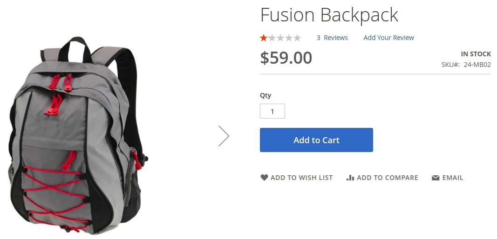
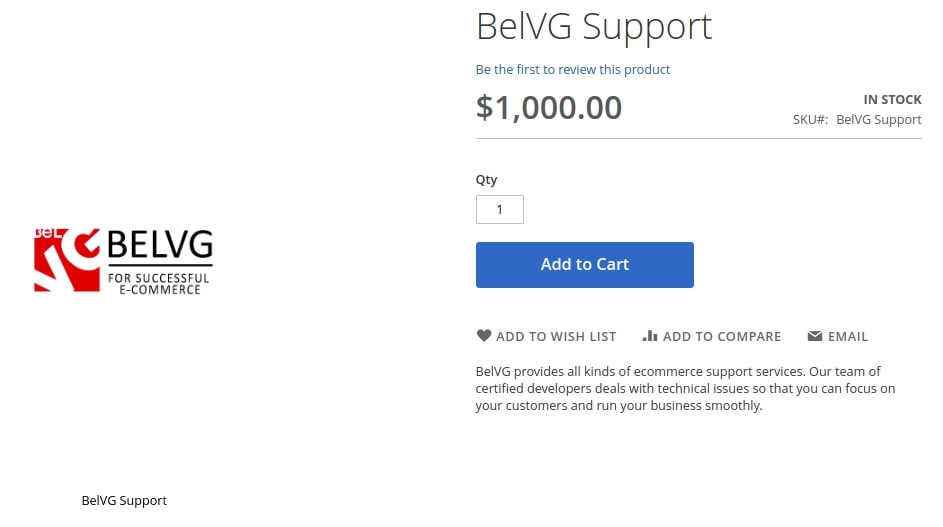
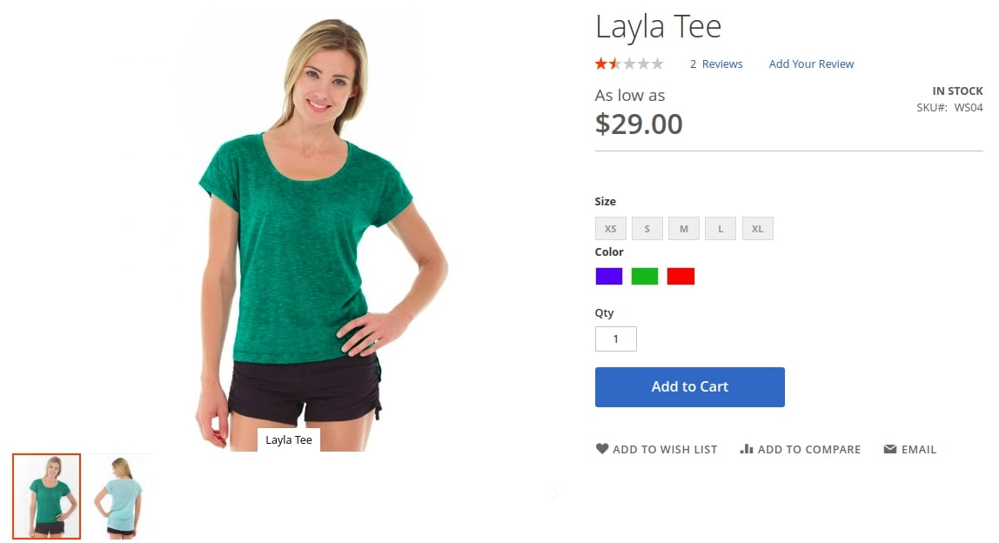
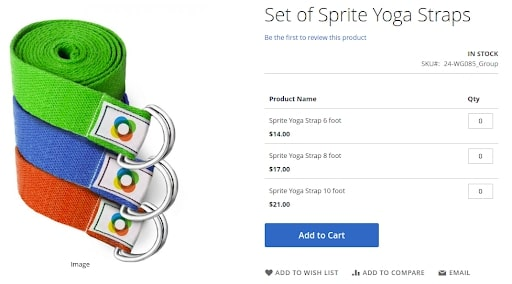
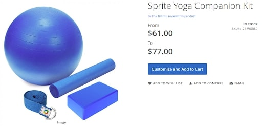
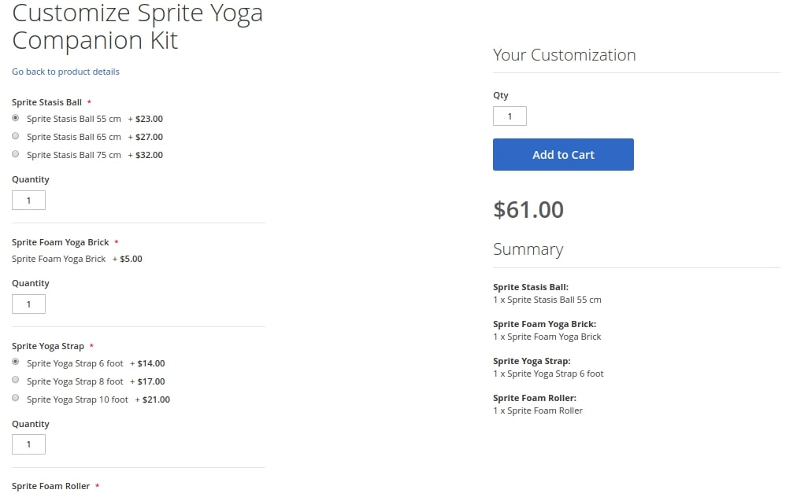
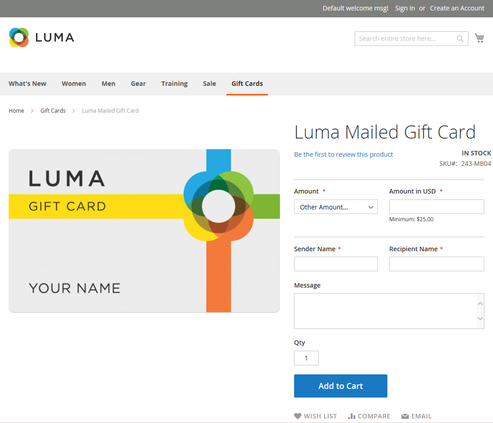
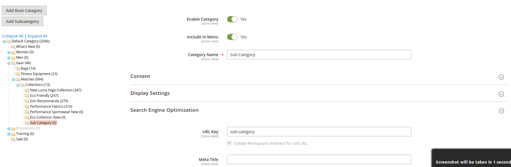

7 - Customising the Catalogue
==============================

7.1 Demonstrate ability to use products and product types
---------------------------------------------------------

**Identify/describe standard product types (simple, configurable, bundled, etc.).**

### Simple Product

> This is the most basic and the most popular product type. A single simple product corresponds to a single physically existing product to a unique Store Keeping Unit (SKU). A simple product can be sold individually or as part of a [Grouped](#h.fdbtjoju72x), [Configurable](#h.98cgcmsgdbu5), or [Bundle](#h.kvd5wn1qb9e) product.
>
> A Simple product MUST have an Attribute Set (or [product template](https://docs.magento.com/user-guide/stores/attribute-sets.html&sa=D&ust=1609223265371000&usg=AOvVaw3KA-UfRdUrjtpunGMSwZiO)) plus ALL required / basic fields filled.
>
> A simple product can have custom options with a variety of input controls, which makes it possible to sell many product variations from a single SKU. A simple product with custom options is sometimes referred to as a Composite Product.
>
> Example:



> Required settings include:

1.  SKU
2.  Price
3.  Enable Product set to either Yes or No

> Basic setting include:

1.  A Tax Class:

    *  Taxable Goods
    *  None

2.  Quantity:

    *  Basic
    *  Multi Source using Inventory Management

3.  Stock Status

    *  In Stock
    *  Out Of Stock

4.  Weight
5.  Visibility
6.  Assign Categories
7.  Country of Manufacture
8.  An Assigned Website

> WITHOUT these settings filled, the product MAY NOT appear in the front-end as expected.
>
> Other settings:

1.  [Content](https://docs.magento.com/user-guide/catalog/product-content.html&sa=D&ust=1609223265376000&usg=AOvVaw38mJ-fGRy3PdTPGOW6kaR3)
2.  [Images and Videos](https://docs.magento.com/user-guide/catalog/product-images-and-video.html&sa=D&ust=1609223265377000&usg=AOvVaw0vfkUjOLxY6p73AT_u5DED)
3.  [Related Products, Up-Sells, and Cross-Sells](https://docs.magento.com/user-guide/catalog/related-products-up-sells-cross-sells.html&sa=D&ust=1609223265378000&usg=AOvVaw01cnypdM3Dn3E0cqKwBskr)
4.  [Search Engine Optimization](https://docs.magento.com/user-guide/catalog/product-search-engine-optimization.html&sa=D&ust=1609223265378000&usg=AOvVaw0xMt9GiabiofhnRypczou_)
5.  [Customizable Options](https://docs.magento.com/user-guide/catalog/settings-advanced-custom-options.html&sa=D&ust=1609223265378000&usg=AOvVaw0rdD1DEuqVavWLstDl3kk-)
6.  [Products in Websites](https://docs.magento.com/user-guide/catalog/settings-basic-websites.html&sa=D&ust=1609223265379000&usg=AOvVaw122LUOO79famVgMIC-iOPx)
7.  [Design](https://docs.magento.com/user-guide/catalog/settings-advanced-design.html&sa=D&ust=1609223265379000&usg=AOvVaw2IhPmNax9NygwvcA1vHWWz)
8.  [Gift Options](https://docs.magento.com/user-guide/catalog/product-gift-options.html&sa=D&ust=1609223265380000&usg=AOvVaw1n_x4het5CNGsKmDYQzjBZ)

> [More on how to set up a simple product here](https://docs.magento.com/user-guide/catalog/product-create-simple.html&sa=D&ust=1609223265380000&usg=AOvVaw2HDMJqY8RZk6vF3nn77Dn_).

### Virtual Product

> Virtual products are a product type for the products that do not exist physically. This can represent non-tangible items such as memberships, services, warranties, or subscriptions and digital goods / downloads of books, music, videos, or other products. Virtual products can be sold individually or included as part of the [Grouped Product](#h.fdbtjoju72x) or [Bundle Product](#h.kvd5wn1qb9e) product types.
>
> Example:



> Aside from the absence of the Weight field, the process of creating a Virtual Product and a [Simple Product](#h.cbgifdse6zd5) are the same.
>
> In the front-end workflow, Virtual products skip the shipping step at checkout (seeing as they cannot be fulfilled in that sense) unless there is a tangible product in the cart.
>
> [More on how to create a Virtual Product here.](https://docs.magento.com/user-guide/catalog/product-create-virtual.html&sa=D&ust=1609223265383000&usg=AOvVaw0DPQ7FPT0H8xtBHvmZ4UXp)

### Configurable Product

> A Configurable Product looks like a [Simple Product](#h.cbgifdse6zd5) with drop-down lists of options for each variation. Each option is actually a separate [Simple Product](#h.cbgifdse6zd5) with a unique SKU, which makes it possible to track inventory for each variation. These are often called Product Variations or Associated Simple Products. In the context of code, they can be referred to as Sub-Products or Children.
>
> You could achieve a similar effect by using a [Simple Product](#h.cbgifdse6zd5) with custom options (Composite Product) but this route loses the ability to track inventory for each variation.
>
> Product Variations can appear in the front-end in the form of [Drop-Down](https://developer.mozilla.org/en-US/docs/Web/HTML/Element/select&sa=D&ust=1609223265385000&usg=AOvVaw32rdc-nYgAxQ9GpWsxAGG4), [Multiple Select](https://developer.mozilla.org/en-US/docs/Web/HTML/Element/select&sa=D&ust=1609223265385000&usg=AOvVaw32rdc-nYgAxQ9GpWsxAGG4), [Visual Swatch](https://docs.magento.com/user-guide/catalog/swatches.html&sa=D&ust=1609223265386000&usg=AOvVaw0CXOJxRqWUDa9qnM4enB43) and [Text Swatch](https://docs.magento.com/user-guide/catalog/swatches.html&sa=D&ust=1609223265386000&usg=AOvVaw0CXOJxRqWUDa9qnM4enB43) input types.
>
> An example of a Configurable would be a T-shirt in different colors and sizes. Each product option of such configurable products corresponds to a single Simple Product with a unique SKU, allowing the retailer to keep track of each product option stock balance:



> The configurable product acts as a sort of umbrella / parent and holds no price or stock information by itself. The associated simple product will be the item that appears in the cart.
>
> Creating a Configurable Product follows the same process as with a Simple Product except for an extra step: [Assigning Product Configurations](https://docs.magento.com/user-guide/catalog/product-create-configurable.html%23part-2-adding-configurations&sa=D&ust=1609223265387000&usg=AOvVaw0g4Y29zQG7-4nnj5cKCz13). Each configuration provides the ability to assign independent images, price, and quantity.
>
> For price there are 2 methods:

1.  Apply the same price to all SKUs
2.  Apply a different price for each SKU

> For quantity there are also 2 methods:

1.  Apply the same quantity to all SKUs
2.  Apply Different Quantity by Attribute

> As is for images, there are 2 methods:

1.  Apply a single set of images to all SKUs
2.  Apply unique images for each SKU

[More on how to create a Configurable Product here.](https://docs.magento.com/user-guide/catalog/product-create-configurable.html&sa=D&ust=1609223265390000&usg=AOvVaw3tbxvl3QYxCrtluTMJst4T)

The attributes that are used for product variations must have a Global Scope and the customer must be required to choose a value. The product variation attributes must be included in the attribute set that is used as a template for the configurable product.

The Attribute Set that is used as a template for a configurable product must include the attribute(s) that contain the values that are needed for each product variation.

The thumbnail image in the shopping cart can be set to display the image from the configurable product record or from the product variation.

Configurable Products DO NOT have prices.

Configurable Products DO NOT have stock information.

Configurable Products DO NOT NEED weights.

### Grouped Product

> A grouped product consists of simple standalone products that are presented as a group. You can offer variations of a single product or group them by season or theme.
>
> Presenting a grouped product can create an incentive for customers to purchase additional items. A grouped product provides an easy way to offer variations of a product and list them all on the same page. This product type allows the grouping of single [Simple](#h.cbgifdse6zd5) or [Virtual](#h.t3fkw0wf3trp) Products into collections. Moreover, the customer gets to decide which products from the collection she/he wants to purchase and in what amount.
>
> 
>
> Although they are presented as a group, each product in the group is purchased as a separate item. In the shopping cart, each item and the quantity purchased appears a separate line item.
>
> Aside from the extra step of [Adding Products to a Group within the Grouped Products section](https://docs.magento.com/user-guide/catalog/product-create-grouped.html%23step-5-add-products-to-the-group&sa=D&ust=1609223265392000&usg=AOvVaw1N6ZzJozW59FKwdXbcyIDI), the process of creating a Grouped Product and a Simple Product are the same.
>
> [More on how to create a Grouped Product here.](https://docs.magento.com/user-guide/catalog/product-create-grouped.html&sa=D&ust=1609223265393000&usg=AOvVaw3_D0y2sK9-SS2GvAgfyx6f)


A grouped product is essentially a collection of simple associated products.

Each item purchased appears individually in the shopping cart, rather than as part of the group.

The thumbnail image in the shopping cart can be set to display the image from the grouped parent product or associated product.

Grouped Products DO NOT have prices.

Grouped Products DO NOT have stock information.

Grouped Products DO NOT NEED weights.

### Bundle Product

> A bundle is a build your own, customizable product. Each item in a bundle can be based on one of the following product types:
>
> *   [Simple Product](#h.cbgifdse6zd5)
> *   [Virtual Product](#h.t3fkw0wf3trp)
>
> The options in the front-end appear when the customer clicks either Customize or Add to Cart. This is because the products that are included in the bundle vary. A SKU, Price, or Weight can be set to either a dynamic or fixed value. An exception would be unless [Instant Purchase](https://docs.magento.com/user-guide/sales/checkout-instant-purchase.html&sa=D&ust=1609223265396000&usg=AOvVaw2phbhJSDX7LwzFeTI6MAp0) is available.
>
> Add 1 composite product, consisting of many selected variations, options independent. SKU dynamic/fixed, weight dynamic/fixed, price dynamic/fixed. Each qty x total qty.
>
>
> Ror example, a yoga kit:



> Each option is a [Simple Product](#h.cbgifdse6zd5) or a [Virtual Product](#h.t3fkw0wf3trp). Before adding a bundle product to the cart, a customer must customize it with the provided options. The final price will depend on the chosen configuration.
>
> 
>
> SKU and Weight attributes can be fixed or dynamic. The price for Bundle Product can be set as Price Range (from minimum to maximum) or As Low As (the lowest price possible). The admin can set how the products will be delivered – together or separately.
>
> Inventory is tracked separately for each child.
>
> Aside from the extra step of [Adding Bundle Items within the Bundle Items section](https://docs.magento.com/user-guide/catalog/product-create-bundle.html%23step-5-add-the-bundle-items&sa=D&ust=1609223265398000&usg=AOvVaw00U83xfQoeYOrkYTQMqnz1), the process of creating a Bundle Product and a [Simple Product](#h.cbgifdse6zd5) are the same.
>
> The SKU of bundle items can be set as either Dynamic or Fixed. If you set SKU as Dynamic, each bundle item SKU is assigned by adding a suffix to the default SKU. If you set SKU as fixed, you can assign a unique SKU for each bundle item.
>
> With bundle product weight, a Fixed weight setting allows you to set a determined value for bundle products directly, but with Dynamic weight, you can not set a weight value to bundle products. Instead, the weight of the bundle is calculated from the selected bundle items.
>
> If you set a Fixed price for a bundle product, you can enter a base price with applied taxes for it. For Dynamic price setting, the bundle price and tax class attribute are disabled, and the price of the bundle is composed of the item prices in options. Moreover, you can set the price viewing on the category page and the product details page in case you set a Magento bundle product price is Dynamic. If you select Price Range, the lowest and the highest prices calculated from option item prices will be displayed. If you set it to As Low As, the lowest possible price of the bundle will be shown only. Of course, the final price depends on the price of products that are selected by purchasers.


How I remember this is that it's a configurable [Grouped Product](#h.pedurdgu5za5). Customers can build their own bundle product.

Bundle items can be simple or virtual products without custom options.

The Price View can be set to either Price Range or As Low As.

SKU and Weight can be either Fixed or Dynamic by adding a suffix to the default value. By default, this is set to Yes.

The quantity can be a preset or user-defined value. However, do not assign the User Defined property to checkbox or multiple-select input types.

Bundle items can be shipped together or separately.

A Minimum Advertised Price (MAP) is not available for Bundle products that use dynamic pricing.

The Instant Purchase button appears below the Add to Cart button for each item in the bundle. When enabled, the Instant Purchase button appears below the Add to Cart button on the product page for customers who [meet the requirements](https://docs.magento.com/user-guide/sales/checkout-instant-purchase.html%23customer-requirements&sa=D&ust=1609223265401000&usg=AOvVaw1SxKAe89rZ1LC1_8M1Hr8w).

Bundle Products DO NOT have prices.

Bundle Products DO NOT have stock information.

Bundle Products DO NOT have weights.

Bundle Products DO NOT have tax information

### Downloadable Product

> A Downloadable Product can be anything that you can deliver as a file, such as an eBook, music, video, software application, or update. You can offer an album for sale and sell each song individually. You can also use a downloadable product to deliver an electronic version of your product catalog.
>
> Downloadable Products can consist of one or several files. Because the actual download is not available until after the purchase, you can provide samples, such as an excerpt from a book, a clip from an audio file, or a trailer from a video that the customer can try before purchasing the product. The files that you make available for download can be either uploaded to your server or from a different server.
>
> Example:


> Downloadable products can be configured to require that the customer log in to an account to receive the link OR they can be sent by email and shared with others.
>
> The status of the order before the download becomes available, default values, and other delivery options are set in the configuration. Fore more information, see Download Options.
>
> Aside from the extra step of [Configuring the Format](https://docs.magento.com/user-guide/catalog/product-create-downloadable.html%23step-4-complete-the-basic-settings&sa=D&ust=1609223265404000&usg=AOvVaw0YMZFDqLkiVrIFKiJn5zmR) & [Downloadable Information](https://docs.magento.com/user-guide/catalog/product-create-downloadable.html%23step-5-complete-the-downloadable-information&sa=D&ust=1609223265405000&usg=AOvVaw2xRf-bKDgLDjPu8me25pj1), the process of creating a Downloadable Product and a [Simple Product](#h.cbgifdse6zd5) are the same. The [Downloadable Configuration Settings](https://docs.magento.com/user-guide/catalog/product-download-options.html&sa=D&ust=1609223265405000&usg=AOvVaw2pNtAXRJs8EqHdvJb9UOQh) determine the default values and delivery options for downloadable products and specify if guests can purchase downloads.

[More on how to create Downloadable Products here.](https://docs.magento.com/user-guide/catalog/product-create-downloadable.html&sa=D&ust=1609223265406000&usg=AOvVaw1JxvkhMtbwT9kGC-8W0Dcw)

### Gift Card Product (Commerce / Enterprise edition)

> There are three kinds of gift card products:
>
> **Virtual**
>
> A virtual gift card is sent to the recipient's email address, which is required during the purchase of the gift card. A shipping address is not necessary (similar front-end interface as [Virtual Products](#h.t3fkw0wf3trp)).
>
> **Physical**
>
> A physical gift card is shipped to the recipient's address, which is required during the purchase of the gift card (similar front-end interface as [Simple Products](#h.cbgifdse6zd5)).
>
> **Combined**
>
> A combined gift card is shipped and emailed to the recipient. The recipient's email and shipping address is required during the purchase of the gift card (similar front-end interface as Physical).
>
> Example:



> Gift cards are redeemed in the shopping cart similar to the way a coupon is applied to an order. During checkout, the shopper enters the gift card code to apply an amount from the gift card to the purchase. Gift card holders who have customer accounts can check the status and remaining balance from their account dashboard. Single, as well as multiple, gift cards can be used to pay for all or part of an order. It can be redeemed on any store / website and will never expire.
>
> Gift Card Workflow:

1.  Customer determines the gift card value
2.  Customer completes the gift card information
3.  Customer completes checkout
4.  Customer receives confirmation of the order
5.  Recipient receives the gift card
6.  Recipient applies gift card to purchase

Gift Cards are only available in Commerce / Enterprise edition.

If a gift card order is canceled or refunded, you must manually cancel the associated gift card account. You can either delete the account entirely or deactivate it via Admin.

**How would you obtain a product of a specific type?**

Using `Magento\Catalog\Model\ResourceModel\Product\Collection` like so:

```php
$productCollection->addFieldToFilter('type_id', 'simple');
```

Using the `Magento\Catalog\Api\ProductRepositoryInterface` doesn't work here because currently `Magento\Framework\Api\SearchCriteriaInterface` doesn't have the ability to select specific fields.

**What tools (in general) does a product type model provide?**

> All general product type methods are available (public) in `Magento\Catalog\Model\Product`:

*   `getId`/`setId` - Getter & setter of entity_id (try avoiding setting IDs however).
*   `getStoreId`/setStoreId - Setting the store view ID this product belongs to.
*   `getWebsiteIds` - Setting the website ID this product belongs to.
*   `getStoreIds` - Get store IDs as arrays in case there are many.
*   `getUrlModel`/`getLinkInstance` - Return `Magento\Catalog\Model\Product\Url` instance for this product.
*   `validate` - Validate Product Data.
*   `getName`/`setName` - Getter & setter of product name.
*   `getVisibility`/`setVisibility` - Getter & setter of products visibility in catalog + search (@param int).
*   `getSku`/`setSku` - Getter & setter of products stock-keeping unit.
*   `getAttributeSetId`/`setAttributeSetId` - Getter & setter of the Attribute Set or product template.
*   `getCreatedAt`/`setCreatedAt` - Getter & setter of the products first created date - this is automatic when saving products.
*   `getUpdatedAt`/`setUpdatedAt` - Getter & setter of when this product was last updated - this is automatic when saving products.
*   `getTypeId`/`setTypeId` - Getter & setter of the products type (@param int)
*   `getStatus`/`setStatus` - Getter & setter of stock status of this product (in stock / out of stock).
*   `getWeight`/`setWeight` - Getter & setter of products weight.
*   `getTypeInstance`/setTypeInstance - Getter & setter of type instance `Magento\Catalog\Model\Product\Type\AbstractType`. Type instance implements product type dependent logic and is a singleton shared by all products of the same type.
*   `getIdBySku` - return entity_id of this product by SKU.
*   `getCategoryId` - Get the current category of this product.
*   `getCategory` - Get the current category of this product as `Magento\Catalog\Model\Category`
*   `getCategoryIds` - Get all categories belonging to this product as array
*   `getCategoryCollection` - Get the current category of this product as `Magento\Framework\Data\Collection` (Setter is protected).
*   `getStockData`/setStockData - Getter & setter of StockItemInterface data as array
*   `getAttributes` - Retrieve product attributes as an array of `Magento\Eav\Model\Entity\Attribute\AbstractAttribute`.
*   `beforeSave` - Check product options and type options and save them, too.
*   `canAffectOptions` - Check/set if options can be affected when saving products. If the value is specified, it will be set.
*   `afterSave` - Saving product type related data and init index.
*   `getQty`/`setQty` - Getter & setter of product quantity.
*   `priceReindexCallback` - Callback for reindex specific to this entity.
*   `eavReindexCallback` - Reindex callback for EAV indexers.
*   `isDataChanged` - Check if data was changed.
*   `reindex` - Init indexing process after product save.
*   `beforeDelete` - Clear cache related to product and protect delete from not admin.
*   `afterDeleteCommit` - Init indexing process after product delete commit.
*   `cleanCache` - Clean (not clear) cache related with product id.
*   `getPrice`/`setPrice` - Getter & setter of products price.
*   `setPriceCalculation` - Set Price calculation flag
*   `getPriceModel` - Get price model `Magento\Catalog\Model\Product\Type\Price` based on product type.
*   `getPriceInfo` - Return base price information as `Magento\Framework\Pricing\PriceInfo\Base`
*   `getTierPrices`/setTierPrices - Getter & setter list of product tier prices as `Magento\Catalog\Api\Data\ProductTierPriceInterface`
*   `getTierPrice` - Get product tier price for the customer, based on qty of this product as float
*   `getFormatedPrice`/getFormattedPrice - Get formatted by currency product price
*   `getFinalPrice` - Get products price including tax and discount.
*   `setFinalPrice` - Accepts a $price parameter but, this func is equal to magic 'setFinalPrice()', but added as a separate func, because in cart with bundle products it's called very often in Item->getProduct(). So removing the chain of magic with more cpu consuming algorithms gives a nice optimization boost.
*   `getCalculatedFinalPrice` - Returns calculated final price.
*   `getMinimalPrice` - Returns most minimal price of product.
*   `getSpecialPrice` - Get sales price of product.
*   `getSpecialFromDate` - Returns starting date of the special price.
*   `getSpecialToDate` - Returns ending date of the special price.
*   `getRelatedProducts` - Get related product `Magento\Catalog\Model\Product` as array.
*   `getRelatedProductIds` - Get related product IDs.
*   `getRelatedProductCollection` - Retrieve collection related products as `Magento\Catalog\Model\ResourceModel\Product\Link\Product\Collection`.
*   `getRelatedLinkCollection` - Retrieve link collections related to the object `Magento\Catalog\Model\ResourceModel\Product\Link\Collection`.
*   `getUpSellProducts` - Get up-sell product `Magento\Catalog\Model\Product` as array.
*   `getUpSellProductIds` - Get up-sell product IDs.
*   `getUpSellProductCollection` - Retrieve collection up-sell product as `Magento\Catalog\Model\ResourceModel\Product\Link\Product\Collection`.
*   `getUpSellLinkCollection` - Retrieve link collections of up-sell as `Magento\Catalog\Model\ResourceModel\Product\Link\Collection`.
*   `getCrossSellProducts` - Get cross-sell product `Magento\Catalog\Model\Product` as array.
*   `getCrossSellProductIds` - Get cross-sell product IDs.
*   `getCrossSellProductCollection` - Retrieve collection cross-sell product as `Magento\Catalog\Model\ResourceModel\Product\Link\Product\Collection`.
*   `getCrossSellLinkCollection` - Retrieve link collections of cross-sell as `Magento\Catalog\Model\ResourceModel\Product\Link\Collection`.
*   `getProductLinks`/`setProductLinks` - Getter & setter of product links info as `Magento\Catalog\Api\Data\ProductLinkInterface`.
*   `getMediaAttributes` - Retrieve attributes for media gallery.
*   `getMediaAttributeValues` - Retrieve assoc array that contains media attribute values of the product.
*   `getMediaGalleryImages` - Retrieve media gallery images as `Magento\Framework\Data\Collection`.
*   `hasGalleryAttribute` - Checks whether a product has a Media Gallery attribute.
*   `addImageToMediaGallery` - Add image to media gallery (@param string $file)
*   `getMediaConfig` - Retrieve product media config
*   `getVisibleInCatalogStatuses` - Returns visible status IDs in catalog
*   `getVisibleStatuses` - Retrieve visible statuses
*   `isVisibleInCatalog` - Check Product visible in catalog
*   `getVisibleInSiteVisibilities` - Retrieve visible in site visibilities
*   `isVisibleInSiteVisibility` - Check Product visible in site
*   `isDuplicable`/setIsDuplicable - Getter & setter of checks for whether a product has been duplicated
*   `isSalable`/isSaleable - Check is product available for sale. Product needs to be enabled, Configurables & bundles need to have at least one salable simple product. Downloadables need to have at least one link.
*   `isAvailable` - Check whether the product type or stock allows you to purchase the product. It only checks isSalable on that specific product type.
*   `getIsSalable` - Is product salable detecting by product type.
*   `isVirtual`/getIsVirtual - Check if this product is virtual.
*   `isInStock` - Check the stock status is in stock.
*   `getAttributeText` - Get an attribute value by its code (`@param string $attributeCode`).
*   `getCustomDesignDate` - Returns array with dates for custom design.
*   `getProductUrl` - Retrieve Product URL.
*   `getUrlInStore` - Retrieve URL in current store.
*   `formatUrlKey` - Formats URL key.
*   `addAttributeUpdate` - Save current attribute with code $code and assign new value (@param string $code).
*   `toArray` - Get product data as an array.
*   `fromArray` - Same as setData(), but also initiates the stock item (if it is there).
*   `getRequestPath` - Returns request path.
*   `getGiftMessageAvailable` - Custom function for other modules, gift messages for product.
*   `isComposite` - Is this a [Composite Product](#h.cbgifdse6zd5) (product with custom options).
*   `canConfigure` - Check if product options can be configured.
*   `getOptionInstance` - Get product options as `Magento\Catalog\Model\Product\Option`.
*   `addOption` - Add option to array of product options (@param `Magento\Catalog\Model\Product\Option`).
*   `getOptionById` - Get option from options array of product by given option id.
*   `getProductOptionsCollection` - Retrieve product options collection as `Magento\Catalog\Model\ResourceModel\Product\Option\Collection`.
*   `getOptions`/setOptions - Getter & setter of product options (@param `Magento\Catalog\Api\Data\ProductCustomOptionInterface`).
*   `addCustomOption`/getCustomOption - Getter & setter of a custom option information to product (@param string $code, @param string value).
*   `getCustomOptions`/setCustomOptions - Getter & setter of multiple custom options information to product as array.
*   `hasCustomOptions` - Does this product have custom options
*   `canBeShowInCategory` - Check availability display of product within category.
*   `getAvailableInCategories` - Retrieve category IDs where product is available.
*   `getDefaultAttributeSetId` - Retrieve the default attribute set ID
*   `reset` - Reset all model data.
*   `getCacheIdTags` - Get cache tags associated with object ID.
*   `isProductsHasSku` - Check for empty SKU on each product.
*   `processBuyRequest` - Parse buyRequest into options values used by the product.
*   `getPreconfiguredValues` - Get pre configured values from product.
*   `prepareCustomOptions` - Prepare product custom options. To be sure that all product custom options do not have IDs and have product instances.
*   `getProductEntitiesInfo` - Retrieve product entities info as array.
*   `isDisabled` - Checks whether a product has disabled status.
*   `getImage` - Gets product images from it's child if possible.
*   `getIdentities` - Get identities.
*   `reloadPriceInfo` - Refresh the PriceInfo Object.
*   `toFlatArray` - Convert Category model into flat array
*   `getExtensionAttributes`/setExtensionAttributes - Getter & setter of [Extension Attributes](#h.aqe3c923mrz4) as `Magento\Framework\Api\ExtensionAttributesInterface`
*   `getMediaGalleryEntries`/setMediaGalleryEntries - Getter & setter of Media Gallery Entities as `Magento\Catalog\Api\Data\ProductAttributeMediaGalleryEntryInterface`
*   `setAssociatedProductIds` - Get Configurable Product Super Links / Associated Simple Products (If product is child of configurable).
*   `getQuantityAndStockStatus`/`setQuantityAndStockStatus` - Getter & setter of quantity and stock status data.

> The following methods are deprecated:

*   `getStockData`/`setStockData` @deprecated 102.0.0.
*   `getQuantityAndStockStatus`/`setQuantityAndStockStatus` @deprecated 102.0.0 - Product model shouldn't be responsible for stock status.
*   `setPriceCalculation` @deprecated 102.0.4
*   `getFormatedPrice` @deprecated 102.0.6
*   `getCacheIdTags` @deprecated 102.0.5

Not expected to memorise a whole class. The most important thing to remember here is that this model allows you to:

*   Set [Basic / Required Information](#h.cbgifdse6zd5) such as you can within admin.
*   Getting/Setting [Related/Cross-Sell/Up-Sell Products](https://docs.magento.com/user-guide/catalog/related-products-up-sells-cross-sells.html&sa=D&ust=1609223265437000&usg=AOvVaw080lS390-fwBk0-e8Gk6rV).
*   Checking if this specific product this an [Associated Simple Product](#h.98cgcmsgdbu5).
*   Getting/Setting/Refreshing Prices, [Group Prices](https://docs.magento.com/user-guide/catalog/product-price-group.html&sa=D&ust=1609223265438000&usg=AOvVaw3RyTK40CFEXIsytwIE6oah), [Tier Prices](https://docs.magento.com/user-guide/catalog/product-price-tier.html&sa=D&ust=1609223265438000&usg=AOvVaw2-vKAcFNdlJX9NU34yG4zY), [Advanced Prices](https://docs.magento.com/user-guide/catalog/pricing-advanced.html&sa=D&ust=1609223265439000&usg=AOvVaw30rg72uQrYlqfLtotvY1b4), [Special Prices](https://docs.magento.com/user-guide/catalog/product-price-special.html&sa=D&ust=1609223265439000&usg=AOvVaw3kGlW9LeG73cLJzojGJ6r_), [Catalog Price Rules](https://docs.magento.com/user-guide/marketing/price-rules-catalog.html&sa=D&ust=1609223265439000&usg=AOvVaw0MwLoDaKG1EbxBZ5mtZpPL) as final, before or after discount/tax, as a Price Object.
*   Getting/Setting Media Gallery Objects.
*   Checking if this specific product is salable/available for purchase both configuratively and categorically within scope.
*   Checking if this specific product is a duplicate.
*   Getting/Setting [Composite Product](#h.cbgifdse6zd5) Configurations.
*   Invalidating Cache / Index for this specific product.
*   Getting product information in desired formats such as an array.

**What additional functionality is available for each of the different product types?**

 Simple (`Magento\Catalog\Model\Product\Type\Simple`):

> Extends `Magento\Catalog\Model\Product\Type\AbstractType` to provide the methods:

*   `prepareForCart` - Initialize product(s) for add to cart process
*   `checkProductBuyState` - Check if product can be bought
*   `getOrderOptions` - Prepare additional options/information for the order item which will be created from this product.
*   `save` - Save type related data ONLY.
*   `getOptionSku` - Default action to get sku of product with option.
*   `hasWeight` - defaults to true as this is a tangible product type.
*   `hasOptions` - Return true if the product has custom options.
*   `updateQtyOption` - Method is needed for specific actions to change given configuration options values according to current product type logic. Example: the cataloginventory validation of decimal qty can change qty to int, so need to change configuration item qty option value too.
*   `hasRequiredOptions` - Check if composite product has required custom options
*   `getStoreFilter`/setStoreFilter - Getter & Setter of store filter for associated products.
*   `prepareQuoteItemQty` - Prepare Quote Item Quantity
*   `assignProductToOption` - Implementation of product specify logic of which product needs to be assigned to which option. For example: if a product which was added to option already removed from catalog.
*   `setConfig` - Sets specific composite product type variables if this is a composite product.
*   `getSearchableData` - Retrieve additional searchable data from type instance. Using based on product id and store_id data.
*   `getProductsToPurchaseByReqGroups` - Retrieve products divided into groups required to purchase At least one product in each group has to be purchased

 Configurable (`Magento\ConfigurableProduct\Model\Product\Type\Configurable`):

Extends `Magento\Catalog\Model\Product\Type\AbstractType` to provide the following additional methods:

*   `getConfigurableAttributes` - Gets the attributes, used for sub-products. Retrieve configurable attributes data.
*   `getUsedProducts` - Retrieve used associative product as array of `Magento\Catalog\Model\Product`.
*   `getSalableUsedProducts` - Retrieve only salable used associative product as array of `Magento\Catalog\Model\Product`.
*   `getUsedProductIds` - Retrieve identifiers of used associative product attributes.
*   `getUsedProductCollection` - Retrieve ids of associative product attributes as: `Magento\ConfigurableProduct\Model\ResourceModel\Product\Type\Configurable\Product\Collection`
*   `getChildrenIds` - Retrieve required associative product ids as grouped array
*   `getParentIdsByChild` - Retrieve parent ids array by required child
*   `canUseAttribute` - Check attribute availability for super product creation
*   `getUsedProductAttributeIds`/`setUsedProductAttributeIds` - Getter & setter of attribute identifiers used for assigning associative subproducts
*   `getProductByAttributes` - Gets associative products by their attribute values.
*   `getUsedProductAttributes`/`setUsedProductAttributes` - Getter & setter of the list of used attributes to product.
*   `getSelectedAttributesInfo` - Retrieve the selected Attribute info
*   `getConfigurableOptions` - Gets options list;
*   `setImageFromChildProduct` - Sets the image of a child product for a parent product, if it was not set previously.
*   `getRelationInfo` - Return relation info about used products
*   `isPossibleBuyFromList` - Checks if all attributes are visible in product listing.
*   `resetConfigurableAttributes` - Reset the cached configurable attributes of a product
*   `getConfigurableAttributesAsArray` - Retrieve Configurable Attributes as array
*   `getConfigurableAttributeCollection` - Retrieve configurable attribute collection object `Magento\ConfigurableProduct\Model\ResourceModel\Product\Type\Configurable\Attribute\Collection`
*   `isSalable`/`getIsSalable` - Additional checks to ensure all Associated Simple Products are also salable.
*   `checkProductBuyState` - Check if a product can be bought including Associated Simple Products Attributes.
*   `getSpecifyOptionMessage` - Retrieve message for specified option(s).
*   `getOrderOptions` - Prepare additional options/information for the order item which will be created from this product.
*   `isVirtual` - Should be false, being configurable and all.
*   `hasOptions` - Check to see if this configurable is also a Composite Product.
*   `getWeight` - Configurable products themselves do not need a weight. Get the simple product weight, else return value on configurable.
*   `getProductsToPurchaseByReqGroups` - Retrieve products divided into groups required to purchase. At least one product in each group has to be purchased
*   `processBuyRequest` - Prepare selected options for configurable product
*   `getConfigurableOptions` - Prepare and retrieve options values with product data
*   `deleteTypeSpecificData` - Delete data specific for Configurable product type
*   `getAttributeById` - Retrieve product attribute by identifier. Difference from abstract: any attribute is available, not just the ones from $product's attribute set
*   `setImageFromChildProduct` - Set image for product without an image (if possible).

Deprecated:

*   `getUsedProductIds` - @deprecated 100.1.1
*   `getSalableUsedProducts` - @deprecated 100.2.0 Not used anymore. Keep it for backward compatibility.
*   `setUsedProductAttributeIds` - @deprecated 100.1.0 use `Magento\ConfigurableProduct\Model\Product\Type\Configurable::setUsedProductAttributes` instead

Not expected to memorise a whole class. The most important thing to remember here is that Configurable Products extend General Tools (above) to provide:

*   Access to [Associated Simple Products](#h.98cgcmsgdbu5) as an array from parent.
*   Refine isSalable to ensure all Associated Simple Products are also Available.
*   Configurable Products DO NOT have prices.
*   Configurable Products DO NOT have stock information.
*   Configurable Products DO NOT NEED weights.

 Bundle (`Magento\Bundle\Model\Product\Type`):

> Extends `Magento\Catalog\Model\Product\Type\AbstractType` to provide the following additional methods:

*   `getRelationInfo` - Return relation info about used products as object `Magento\Framework\DataObject`
*   `getChildrenIds` - Retrieve Required children ids. Returns a grouped array, example: [group => [ids]]
*   `getParentIdsByChild` - Retrieve parent ids array by required child.
*   `getSku` - Return product sku based on sku_type attribute.
*   `getWeight` - Return product weight based on weight_type attribute.
*   `isVirtual` - Check is virtual product within bundle. Defaults to false, being a Bundle.
*   `getOptions` - Retrieve bundle options items as object `Magento\Framework\DataObject`.
*   `getOptionsIds` - Retrieve bundle options IDs as array.
*   `getOptionsCollection` - Retrieve bundle option collection as object `Magento\Bundle\Model\ResourceModel\Option\Collection`.
*   `getSelectionsCollection` - Retrieve bundle selections collection based on used options as object `Magento\Bundle\Model\ResourceModel\Selection\Collection`.
*   `updateQtyOption` - Method is needed for specific actions to change given quote options values according current product type logic Example: the catalog inventory validation of decimal qty can change qty to int, so need to change quote item qty option value too.
*   `prepareQuoteItemQty` - Prepare Quote Item Quantity.
*   `isSalable` - Checking if we can sale this bundle, all items in bundle need to be salable also.
*   `getSpecifyOptionMessage` - Retrieve message for specify option(s).
*   `getSelectionsByIds` - Retrieve bundle selections collection based on ids.
*   `getOptionsByIds` - Retrieve bundle options collection based on ids as object `Magento\Bundle\Model\ResourceModel\Option\Collection`.
*   `getOrderOptions` - Prepare additional options/information for order item which will be created from this product.
*   `shakeSelections` - Sort selections method for usort function. Sort selections by option position, selection position and selection id.
*   `hasOptions` - Return true if product has options.
*   `getForceChildItemQtyChanges` - Allow for updates of children qty's.
*   `getSearchableData` - Retrieve additional searchable data from type instance, Using based on product id and store_id data.
*   `checkProductBuyState` - Check if product can be bought.
*   `getProductsToPurchaseByReqGroups` - Retrieve products divided into groups required to purchase. At least one product in each group has to be purchased.
*   `processBuyRequest` - Prepare selected options for bundle product.
*   `canConfigure` - Check if product can be configured.
*   `deleteTypeSpecificData` - Delete data specific for Bundle product type.
*   `getIdentities` - Return array of specific to type product entities.

Not expected to memorise a whole class. The most important thing to remember here is that Bundle Products extend General Tools (above) to provide:

*   Give additional functionality around Getting/Setting Bundle options.
*   Refine isSalable to ensure all products Bundle Options are also saleable.
*   Bundle Products DO NOT have prices.
*   Bundle Products DO NOT have stock information.
*   Bundle Products DO NOT have weights.
*   Bundle Products DO NOT have tax information

Grouped (`Magento\GroupedProduct\Model\Product\Type\Grouped`):

Extends `Magento\Catalog\Model\Product\Type\AbstractType` to provide the following additional methods:

*   `getRelationInfo` - Return relation info about used products.
*   `getChildrenIds` - Retrieve Required children ids. Returns a grouped array, example: [group => [ids]].
*   `getParentIdsByChild` - Retrieve parent ids array by required child.
*   `getAssociatedProducts` - Retrieve array of associated products as object `Magento\Catalog\Model\Product`.
*   `flushAssociatedProductsCache` - Flush Associated Products Cache.
*   `addStatusFilter` - Add status filter to collection (@param  int $status).
*   `setSaleableStatus` - Set only saleable filter of product (@param  `Magento\Catalog\Model\Product` $product).
*   `getStatusFilters` - Return all assigned status filters (@param `Magento\Catalog\Model\Product` $product).
*   `getAssociatedProductIds` - getAssociatedProductIds (@param `Magento\Catalog\Model\Product` $product).
*   `getAssociatedProductCollection` - Retrieve collection of associated products as object `Magento\Catalog\Model\ResourceModel\Product\Link\Product\Collection` (@param `Magento\Catalog\Model\Product` $product).
*   `getProductsToPurchaseByReqGroups` - Retrieve products divided into groups required to purchase. At least one product in each group has to be purchased (@param `Magento\Catalog\Model\Product` $product)
*   `processBuyRequest` - Prepare selected qty for grouped product's options (@param `Magento\Catalog\Model\Product` $product, @param `Magento\Framework\DataObject` $buyRequest). Returns an array.
*   `hasWeight` - Grouped products do not have any weight.
*   `deleteTypeSpecificData` - Does nothing
*   `getChildrenMsrp` - Returns Manufacturer's Suggested Retail Price for children products. Returns int (should be float).

Not expected to memorise a whole class. The most important thing to remember here is that Grouped Products extend General Tools (above) to provide:

*   Give additional functionality around Getting/Setting Associated Products..
*   Refine isSalable to ensure all Associated Products are also saleable.
*   Grouped Products DO NOT have prices.
*   Grouped Products DO NOT have stock information.
*   Grouped Products DO NOT NEED weights.

 Virtual (`Magento\Catalog\Model\Product\Type\Virtual`):

> Extends Magento\Catalog\Model\Product\Type\AbstractType to provide the following additional methods:

*   `isVirtual` - Returns true.
*   `hasWeight` - Returns false.
*   `deleteTypeSpecificData` - Does nothing.

Virtual Products skip the shipping step at checkout, being virtual.

 Downloadable (`Magento\Downloadable\Model\Product\Type`):

Actually extends `Magento\Catalog\Model\Product\Type\Virtual` (above) and adds the following methods:

*   `getLinks` - Get downloadable product links as array Magento\Downloadable\Model\Link[].
*   `hasLinks` - Check if product has links.
*   `hasOptions` - Check if product has options.
*   `hasRequiredOptions` - Check if product has required options.
*   `getLinkSelectionRequired` - Check if product cannot be purchased with no links selected.
*   `getSamples` - Get downloadable product samples as object Magento\Downloadable\Model\ResourceModel\Sample\Collection.
*   `hasSamples` - Check if product has samples.
*   `checkProductBuyState` - Check if product can be bought.
*   `getOrderOptions` - Prepare additional options/information for the order item which will be created from this product as an array.
*   `getSearchableData` - Retrieve additional searchable data from type instance. Using based on product id and store_id data. (@param `Magento\Catalog\Model\Product` $product).
*   `isSalable` - Same as Simple.
*   `processBuyRequest` - Prepare selected options for downloadable products. (@param `Magento\Catalog\Model\Product` $product, @param `Magento\Framework\DataObject` $buyRequest). Returns an array.
*   `canConfigure` - Check if downloadable product has links and they can be purchased separately.
*   `hasWeight` - Returns false.
*   `deleteTypeSpecificData` - Delete data specific for Downloadable product type such as samples and links.

 Giftcard (`Magento\GiftCard\Model\Catalog\Product\Type\Giftcard`):

> Extends `Magento\Catalog\Model\Product\Type\AbstractType` to provide the following additional methods:

*   `isTypeCombined` - Check if gift card type is combined (Both Physical & Virtual).
*   `isTypePhysical` - Check if gift card type is physical (a tangible product).
*   `isTypeVirtual` - Check if gift card type is virtual i.e online voucher only.
*   `isVirtual` - false for Combined & Virtual, true for Virtual Gift Cards (obviously).
*   `isSalable` - As well as default isSalable, this checks if there is an existing balance on this gift card.
*   `checkProductBuyState` - Check if product can be bought
*   `processBuyRequest` - Prepare selected options for Gift Card (@param `Magento\Catalog\Model\Product` $product, @param `Magento\Framework\DataObject` $buyRequest). Returns an array.
*   `deleteTypeSpecificData` - Does nothing.

It is worth mentioning that `getRelationInfo`, `getAssociatedProducts`, `getChildrenIds`, `getParentIdsByChild`, etc. methods return empty arrays, even though they are shared by all product types, not only compound ones, like Simple and Virtual. The logic of these methods is realized in the compound types' classes, taking into account this type's specifics.

7.2 Describe price functionality
--------------------------------

**Identify the basic concepts of price generation in Magento.**

> Magento is able to operate with a variety of prices, taxes, and product types. Magento represents these prices as Price Types (e.g. final price, minimum price, maximum price, regular price) and are separate from the actual price in the code. For example, Special Price is represented by the final price type in the code. Each type of price has its own class, which is responsible for calculating the total value of this price.
>
> Price Info holds Price Collections and is available for all the product types. Price Collections hold pools known as Price Pools which are responsible for instantiating Price Interfaces & Adjustment Collections for each Price Type (final_price, special_price etc)- these pools are defined in the di.xml and are unique to each dedicated product type module and is therefore different for each product type.
>
> Adjustment Collections hold Adjustment Pools which are codes that hold relevant Tax information such as wee_tax i.e. fixed product tax (FPT) or tax percentage.

Do remember this!

Price Info Calculation Flow

> Each product type Price Info implements `Magento\Framework\Pricing\SaleableInterface` How Price Info is calculated:

*   A Price Info Factory specific to product type is created (`Magento\Framework\Pricing\PriceInfo\Factory::create`) and is passed the Price Pool - Each product type has a personal Price Collection and Price Pool instances.
*   Firstly, the Default Price Info is calculated first (`Magento\Catalog\Model\Product\Type::getPriceInfo`) ALL product types use the SAME instance class `Magento\Framework\Pricing\PriceInfo\Base` to calculate base_price initially.
*   Secondly, the Adjustment Collections (tax) are calculated (`Magento\Framework\Pricing\Adjustment\Collection`). Again this is the same across all products (it is worth noting that bundle products hold a custom copy of this class but have NO changes. So it's just a separate copy).
*   Thirdly, the Price Collection loads separate Price Pools of each product type via a code e.g. configurable:
    *   Price Pool is first calculated (`Magento\Framework\Pricing\Price\Pool`) which iterates through di.xml of each dedicated product type.
        *   The `<argument>` node named "target" within the `<virtualType>` Price Pool means to inherit prices from other Price Pools e.g: `<argument name="target" xsi:type="object">Magento\Catalog\Pricing\Price\Pool</argument>`
        * Here are a list of all the available Price Pools:
            *   `Magento\Catalog\Model\Product\Type\Pool`
            *   `Magento\Bundle\Pricing\Price\Pool`
            *   `Magento\ConfigurableProduct\Pricing\Price\Pool`
            *   `Magento\Downloadable\Pricing\Price\Pool`
            *   `Magento\GroupedProduct\Pricing\Price\Pool`
            *   `Magento\GiftCard\Pricing\Price\Pool`

Price Types

> Here are all the available Price Types:

*   `base_price` = (`Magento\Catalog\Pricing\Price\BasePrice`) - The minimum product price at the default exchange rate (currency).
*   `regular_price` = (`Magento\Catalog\Pricing\Price\RegularPrice`) - Product price at the chosen exchange rate (currency).
*   `final_price` = (`Magento\Catalog\Pricing\Price\FinalPrice`) - Total product price including all discounts, tax and configurations applied.
*   `special_price` = (`Magento\Catalog\Pricing\Price\SpecialPrice`) - Product price with a discount specific to that product applied (i.e. not a catalog price rule).
*   `tier_price` = (`Magento\Catalog\Pricing\Price\TierPrice`) - Product price depending on the number of products in the cart and customer group.
*   `custom_option_price` = (`Magento\Catalog\Pricing\Price\CustomOptionPrice`) - Price of custom options individually, if the product has options (is composite), option price can be displayed in percentage (except for configurable products).
*   `configured_price` = (`Magento\Catalog\Pricing\Price\ConfiguredPrice`) - Product price together with custom options.
*   `wishlist_configured_price` = (`Magento\Catalog\Pricing\Price\ConfiguredPrice`) - Product price together with custom options in a wishlist (same logic as configured_price).
*   `catalog_rule_price` = (`Magento\CatalogRule\Pricing\Price\CatalogRulePrice`) - Product price after catalog rules are applied.
*   `catalog_rule_price` (content staging) = (`Magento\CatalogRuleStaging\Pricing\Price\CatalogRulePrice`) - create, preview, and schedule a catalog price rule.
*   `link_price` = (`Magento\Downloadable\Pricing\Price\LinkPrice`) - The price when the product is downloaded from the link provided.
*   `bundle_option` = (`Magento\Bundle\Pricing\Price\BundleOptionPrice`) - Price of bundle product option individually.
*   `bundle_option_regular_price` = (`Magento\Bundle\Pricing\Price\BundleOptionRegularPrice`) - Bundle option price together with product final price
*   `msrp_price` = (`Magento\Msrp\Pricing\Price\MsrpPrice`) - An Adjustment Collection, Manufacturer's Suggested Retail Price (MSRP).

> Each product type might overwrite each Price Type within their Price Pool. A description on how each Price Type has been changed can be found below in the next section.

Price bundle_selection = Price of selected bundle product options. While important, is NOT a price type. Rather, a separate entity.

Do remember this!

Price Pools

> Basic classes, accountable for different price types realisation, are located in `Magento\Catalog\Pricing\Price` namespace and extends `Magento\Framework\Pricing\Price\AbstractPrice`. Different product types, as a rule, override the calculation logic for various price types. In this case, the corresponding classes are located in the names area of the corresponding product types. Also, several product types add custom price types. Let's take a look at Price Pools specific to certain product types:

*   [Simple Products](#h.cbgifdse6zd5) (default) => `Magento\Catalog\Pricing\Price\Collection` => `Magento\Catalog\Pricing\Price\Pool`:

*   `regular_price` (description above)
*   `final_price` (description above)
*   `tier_price` (description above)
*   `special_price` (description above)
*   `base_price` (description above)
*   `custom_option_price` (description above)
*   `configured_price` (description above)
*   `wishlist_configured_price` (description above)
*   `catalog_rule_price` (description above)
*   `catalog_rule_price` (content staging) (description above)

*   [Downloadable Products](#h.614rvm49j6y9) (downloadable) => Magento\Downloadable\Pricing\Price\Collection => Magento\Downloadable\Pricing\Price\Pool:

*   `link_price` (description above)
*   `wishlist_configured_price` (`Magento\Wishlist\Pricing\ConfiguredPrice\Downloadable`) (description above).
*   `inherit` rest from default (above).

*   [Configurable Products](#h.98cgcmsgdbu5) (configurable) => `Magento\ConfigurableProduct\Pricing\Price\Collection` => `Magento\ConfigurableProduct\Pricing\Price\Pool`:

*   `regular_price` (`Magento\ConfigurableProduct\Pricing\Price\ConfigurableRegularPrice`) - Get the minimum regular_price from [Associated Simple Products](#h.98cgcmsgdbu5).
*   `final_price` (`Magento\ConfigurableProduct\Pricing\Price\FinalPrice`) - Get the minimum final_price from [Associated Simple Products](#h.98cgcmsgdbu5).
*   `wishlist_configured_price` Get the maximum `wishlist_configured_price` from [Associated Simple Products](#h.98cgcmsgdbu5).
*   inherit rest from default (above).

*   [Bundle Products](#h.41g7zcfrlmri) (bundle) => `Magento\Bundle\Pricing\Price\Collection` => `Magento\Bundle\Pricing\Price\Pool`:

*   `regular_price` (`Magento\Bundle\Pricing\Price\BundleRegularPrice`) - Get the minimum regular_price from [all Selected Options](#h.41g7zcfrlmri).
*   `final_price` (`Magento\Bundle\Pricing\Price\FinalPrice`) - Get the minimum final_price from [all Selected Options](#h.41g7zcfrlmri).
*   `tier_price` (`Magento\Bundle\Pricing\Price\TierPrice`) - Calculate tier_price of each [all Selected Options](#h.41g7zcfrlmri).
*   `special_price` (`Magento\Bundle\Pricing\Price\SpecialPrice`) - Percentage discount off regular_price for each [all Selected Options](#h.41g7zcfrlmri).
*   `custom_option_price` (`Magento\Catalog\Pricing\Price\CustomOptionPrice`) - (description above).
*   `base_price` (`Magento\Catalog\Pricing\Price\BasePrice`) - (description above).
*   `configured_price` (`Magento\Bundle\Pricing\Price\ConfiguredPrice`) - Get configured_price which is the included amount for [all Selected Options](#h.41g7zcfrlmri).
*   `bundle_option`
*   `bundle_option_regular_price`
*   `catalog_rule_price` (`Magento\CatalogRule\Pricing\Price\CatalogRulePrice`) - (description above).
*   `wishlist_configured_price` (`Magento\Bundle\Pricing\Price\ConfiguredPrice`) - same as configured_price.

*   [Grouped Products](#h.pedurdgu5za5) (grouped) => `Magento\GroupedProduct\Pricing\Price\Collection` => `Magento\GroupedProduct\Pricing\Price\Pool`:

*   `final_price` (`Magento\GroupedProduct\Pricing\Price\FinalPrice`) - Get the minimum final_price from [Associated Simple Products](#h.pedurdgu5za5).
*   `configured_price` (`Magento\GroupedProduct\Pricing\Price\ConfiguredPrice`) - Rewrite configured_price to calculate the prices of custom options ONLY for all [Associated Simple Products](#h.pedurdgu5za5) of the group as well as custom options.
*   `configured_regular_price` (`Magento\GroupedProduct\Pricing\Price\ConfiguredRegularPrice`) - Rewrite the configured_regular_price to calculate the prices of custom options + product final price for [Associated Simple Products](#h.pedurdgu5za5) of the group as well as custom options.

*   [Giftcard Products](#h.87l1vab27p5t) (giftcard) => `Magento\GiftCard\Pricing\Price\Collection` => `Magento\GiftCard\Pricing\Price\Pool`:

*   `regular_price` (`Magento\Catalog\Pricing\Price\RegularPrice`) - (description above).
*   `final_price` (`Magento\GiftCard\Pricing\Price\FinalPrice`) - The Giftcard amount is converted into a regular_price specific to that store's/websites currency.
*   `tier_price` (`Magento\Catalog\Pricing\Price\TierPrice`) - (description above).
*   `special_price` (`Magento\Catalog\Pricing\Price\SpecialPrice`) - (description above).
*   `msrp_price`
*   `custom_option_price` (`Magento\Catalog\Pricing\Price\CustomOptionPrice`) - (description above).
*   `base_price` (`Magento\Catalog\Pricing\Price\BasePrice`) - (description above).
*   `configured_price` (`Magento\GiftCard\Pricing\Price\ConfiguredPrice`) - Price value of product with configured options.
*   `bundle_option` (`Magento\Bundle\Pricing\Price\BundleOptionPrice`) - (description above).
*   `wishlist_configured_price` (`Magento\GiftCard\Pricing\Price\ConfiguredPrice`) - Same as configured_price for wishlist.

> Each price type has the `getValue()` and `getAmount()` methods. `getValue()` method returns the price value (`regular_price`), while `getAmount()` method returns the final price (`final_price`) with all the taxes/discounts/configurations applied.

*   Other Price Types
    *   `index_price` - Product's latest base_price to be updated by indexers.
    *   `abstract_price` - The default value set in admin (same as base_price if multi-store doesn't exist).

Price Pool Example (vendor/magento/module-catalog/etc/di.xml)

```xml
<virtualType name="Magento\Catalog\Pricing\Price\Pool" type="Magento\Framework\Pricing\Price\Pool">
    <arguments>
        <argument name="prices" xsi:type="array">
            <item name="regular_price" xsi:type="string">Magento\Catalog\Pricing\Price\RegularPrice</item>
            <item name="final_price" xsi:type="string">Magento\Catalog\Pricing\Price\FinalPrice</item>
            <item name="tier_price" xsi:type="string">Magento\Catalog\Pricing\Price\TierPrice</item>
            <item name="special_price" xsi:type="string">Magento\Catalog\Pricing\Price\SpecialPrice</item>
            <item name="base_price" xsi:type="string">Magento\Catalog\Pricing\Price\BasePrice</item>
            <item name="custom_option_price" xsi:type="string">Magento\Catalog\Pricing\Price\CustomOptionPrice</item>
            <item name="configured_price" xsi:type="string">Magento\Catalog\Pricing\Price\ConfiguredPrice</item>
            <item name="configured_regular_price" xsi:type="string">Magento\Catalog\Pricing\Price\ConfiguredRegularPrice</item>
        </argument>
    </arguments>
</virtualType>
```

**How would you identify what is composing the regular price of the product?**

The regular_price (`Magento\Catalog\Pricing\Price\RegularPrice`) is the raw amount applied to all product types for that currency of that store. If the current store IS NOT multi-store, then use base_price (`Magento\Catalog\Pricing\Price\BasePrice`).

It is calculated using the following methods:

*   `Magento\Catalog\Pricing\Price\RegularPrice::getValue` - Get the minimum float value of that product for that specific store currency.
*   `Magento\Framework\Pricing\PriceInfoInterface::getPrice` - Convert to display currency. This is raw float value without Price Adjustments (tax).
*   `Magento\Framework\Pricing\Adjustment\Calculator::getAmount`:
    *   `Magento\Framework\Pricing\PriceInfoInterface::getAdjustments` -
    *   Retrieve Price Adjustments (tax) to be included/excluded in either `base_price` or in display price.
    *   if included in base price:
        *   `Magento\Framework\Pricing\Adjustment\AdjustmentInterface::extractAdjustment` - get base price without Price Adjustment.
        *   `Magento\Framework\Pricing\Adjustment\AdjustmentInterface::applyAdjustment` - add Price Adjustment back
        *   If included in display price:
            *   `Magento\Framework\Pricing\Adjustment\AdjustmentInterface::applyAdjustment` - add Price Adjustment over base price.

> Alternatively you can also list all the price types available/applied for a specific product by executing the following:

```php
/** @var \Magento\Framework\Pricing\Price\PriceInterface */
$prices = $product
    ->getPriceInfo()
    ->getPrices();
```

**How would you identify what is composing the final price of the product?**

> Each Price Pool is defined in the di.xml by the individual module of a product type. The final price is calculated by the final_price item within this pool. Price Pools hold the Price Interfaces for every Price Type. Below is a list of the `final_price` per product type:

 Simple (default) (`Magento\Catalog\Model\Product\Type\Price::calculatePrice`)

> For [Simple](#h.cbgifdse6zd5) and [Virtual](#h.t3fkw0wf3trp) product types, `final_price` delegates calculation to `base_price` minimum value return from all classes implementing `Pricing\Price\BasePriceProviderInterface` - they are:

*   `regular_price` (or base_price if multi-store doesn't exist).
*   `configured_price` (custom_option_price with selected options configured).
*   `catalog_rule_price` (final_price vs final_price & catalog_rule_price - whichever is smallest).
*   `special_price` (final_price vs final_price & special_price - whichever is smallest).
*   `tier_price`

All prices in magento worked on the "least price" approach.

Special Price will only be applied if it is lower than Tier Price & Regular Price.

 Configurable (configurable) (`Magento\ConfigurableProduct\Pricing\Price\FinalPrice`)

> For configurable products, the price of each option is selected as a minimal value from the following calculation of all [Associated Simple Products](#h.98cgcmsgdbu5) combined:

*  `base_price`
*  `tier_price`
*  `index_price`
*  `catalog_rule_price`

> Remember that configurable products themselves hold no price value, it's the associated simple products that do.
>
> When choosing the minimum price, the status of the [Associated Simple Product](#h.98cgcmsgdbu5) option, its availability for a particular website and it's stock availability are checked.
>
> After determining the final_price of all options, the final price of the configurable product is determined, which will be equal to the lowest cost of its options.

 Bundle (bundle) (`Magento\Bundle\Model\Product\Price::getFinalPrice`)

> The final_price method is determined by:

*   `Magento\Bundle\Pricing\Price\FinalPrice`
*   `Magento\Bundle\Pricing\Adjustment\Calculator`
*   `Magento\Bundle\Pricing\Price\BundleOptionRegularPrice`
*   `Magento\Bundle\Pricing\Price\BundleOptionPrice`
*   `Magento\Bundle\Pricing\Price\BundleSelectionPrice`

> Price is calculated the same way for Bundle as for Simple Products (default final price (min of classes implementing interface `BasePriceProviderInterface`) + `bundle_option`:

*   Minimum regular_price (or base_price if multi-store doesn't exist) of the individual product in the bundle.
*   `configured_price` (custom_option_price with selected options configured) of the individual product in the bundle.
*   `catalog_rule_price` (`final_price` vs `final_price` & `catalog_rule_price` - whichever is smallest) of the individual product in the bundle.
*   `special_price` (`final_price` vs `final_price` & `special_price` - whichever is smallest) of the individual product in the bundle.
*   `tier_price` of the individual product in the bundle.
*   `bundle_option` - the cost of all required options multiplied by their number.

> Remember that [Bundle Products](#h.41g7zcfrlmri) themselves hold no price value, it's their product bundle options that do.
>
> `bundle_option` can be a fixed value or dynamic value (percentage) in which case a dynamic calculation would look like:

```
Price = `final_price` * (`bundle_option` / 100);
Price *= Selection Quantity ?: 1
```

 Virtual (virtual) (`Magento\Catalog\Model\Product\Type\Price::calculatePrice`)

> Virtual Products follow the same steps as the Simple Product price calculation (above).

 Downloadable (`Magento\Downloadable\Model\Product\Price`)

> Downloadable Products follow the same steps as the Simple Product price calculation (above) with the option to add Link Price (`Magento\Downloadable\Pricing\Price\LinkPrice`). If Downloadable Links are set to be purchased separately, prices are added after the calculation of base product price:

*   (same as above) `regular_price` (or `base_price` if multi-store doesn't exist).
*   (same as above) `configured_price` (`custom_option_price` with selected options configured).
*   (same as above) `catalog_rule_price` (`final_price` vs `final_price` & `catalog_rule_price` - whichever is smallest).
*   (same as above) `special_price` (`final_price` vs `final_price` & `special_price` - whichever is smallest).
*   (same as above) `tier_price`
*   `link_price` (optional, if links are set as purchased separately).

 Grouped (grouped) (`Magento\GroupedProduct\Model\Product\Type\Grouped\Price::getFinalPrice`)

> Grouped Products follow the same steps as the Simple Product price calculation (above).
>
> For each [Associated Simple Product](#h.pedurdgu5za5)
>
> Calculation = the maximum value for each child:

```
final_price += Associated Product final_price * (custom_option_price ?: 1);
```

 Giftcard (giftcard) (`Magento\GiftCard\Pricing\Price\FinalPrice::getAmounts`)

> Take the first available giftcard amount.
>
> Giftcard amounts are a Product set as an [Extension Attribute](#h.aqe3c923mrz4) (`Magento\GiftCard\Api\Data\GiftcardAmountInterface[]`) which just provides a single value that gets deducted against the products price when redeemed.
>
> Giftcards can only be redeemed on products with prices therefore Grouped, Configurable & Bundle are not included here rather, their Associated Simple Products.
>
> The Giftcard amount is converted into a regular_price specific to that store's/websites currency.
>
> When being redeemed, amount is then converted into a configured_price in class: `Magento\GiftCard\Pricing\Price\ConfiguredPrice::calculatePrice()` whereby the Simple Product price calculation (same as above) is made + giftcard amount to be redeemed:

*   The product's `regular_price` (or `base_price` if multi-store doesn't exist) is calculated.
*   (same as above) `configured_price` (`custom_option_price` with selected options configured).
*   (same as above) `catalog_rule_price` (`final_price` vs `final_price` & `catalog_rule_price` - whichever is smallest).
*   (same as above) `special_price` (`final_price` vs `final_price` & `special_price` - whichever is smallest).
*   (same as above) `tier_price`
*   `custom_option_price` the redeemable giftcard amount is then calculated on top.

Giftcards are an Enterprise / Commerce Only Feature

**How can you customize the price calculation process?**

 Create A Price Adjustment

> Create a class that Implements `Magento\Framework\Pricing\Adjustment\AdjustmentInterface`
>
> Then configure [Dependency Injection](#h.9ofwnl5q9fnf) (DI) configuration:

`di.xml`
```xml
<type name="Magento\Framework\Pricing\Adjustment\Collection">
   <arguments>
       <argument name="adjustments" xsi:type="array">
           <item name="somecode" xsi:type="const">MyVendor\MyModule\Pricing\Adjustment::ADJUSTMENT_CODE</item>
       </argument>
   </arguments>
</type>

<type name="Magento\Framework\Pricing\Adjustment\Pool">
   <arguments>
       <argument name="adjustments" xsi:type="array">
           <item name="somecode" xsi:type="array">
               <item name="className" xsi:type="string">MyVendor\MyModule\Pricing\Adjustment</item>
               <item name="sortOrder" xsi:type="string">40</item>
           </item>
       </argument>
   </arguments>
</type>
```
 Register Price Type

> Follow the same steps as above to register a new Price Type in the default price pool namespace.
>
> Implement interface Magento\Framework\Pricing\Price\BasePriceProviderInterface.
>
> This new price type can influence the final price if it returns the lowest price.

 Plugin Interceptor

> [Create a plugin](#h.nc1ow1wmf2km) over necessary native price classes of that Price Type, the calculation process of which you need to modify; for example, around getValue() method.

 Overwrite Virtual Price Preference

> Replace price class via [Dependency Injection](#h.9ofwnl5q9fnf) (DI) for specific virtual pool.
>
> Example:

```xml
<virtualType name="Magento\Bundle\Pricing\Price\Pool">
    <arguments>
        <argument name="prices" xsi:type="array">
            <item name="regular_price" xsi:type="string">MyVendor\MyModule\Pricing\Price\BundleRegularPrice</item>
        </argument>
    <arguments>
</virtualType>
```

 Create A Preference

> Replace price class via [Dependency Injection](#h.9ofwnl5q9fnf) (DI) `<preference>` for specific class.

**Describe how price is rendered in Magento.**

Price Workflow Breakdown

> Price is rendered using both Global & Local Renderers These renderers call the `_prepareLayout` method which calls on the Price Layout Handle (`catalog_product_prices.xml`) - Each product type has its own version of the Price Layout Handle (`catalog_product_prices.xml`).
>
> Within this Price Layout Handle (catalog_product_prices.xml) file is a Renderer Pool `<block>` instance - this is a simple wrapper that holds a separate layout instance and renders of each Price Type. Each renderer will create a Price Box block which then calls on the Price Info flow (above).

All Price Boxes are cached.

Global / Local Renderers

> A Global Render is provided by default (`product.price.render.default`) in which is present for all pages.
>
> Global Render calls method `_prepareLayout` which calls the Renderer Pool, every product type adds its own arguments by product type.
>
> Of course, Global can be overwritten to a Local Render specific to displaying price in a designated location. There can be multiple on the same page. When defining, the argument `price_type_code` at least MUST be set.
>
> Global Example (`Magento_Catalog::view/base/layout/default.xml`):

```xml
<block class="Magento\Framework\Pricing\Render" name="product.price.render.default">
    <arguments>
        <argument name="price_render_handle" xsi:type="string">catalog_product_prices</argument>
        <argument name="use_link_for_as_low_as" xsi:type="boolean">true</argument>
    </arguments>
</block>
```
Local Example (`Module_Catalog::view/frontend/layout/catalog_product_view.xml`):

```xml
<block class="Magento\Catalog\Pricing\Render" name="product.price.final">
    <arguments>
        <argument name="price_render" xsi:type="string">product.price.render.default</argument>
        <argument name="price_type_code" xsi:type="string">final_price</argument>
        <argument name="zone" xsi:type="string">item_view</argument>
    </arguments>
</block>
```

Renderer Pool

> A shared `<block>` `Magento\Framework\Pricing\Render\RendererPool` defined in `catalog_product_prices.xml`. Data-arguments define the Price Box class, template, amount renderer and adjustment render for each combination of product type and Price Type, or defaults when not customized.
>
> Base Renderer Pool Example (`Magento_Catalog::view/base/layout/catalog_product_prices.xml`):

```xml
<block class="Magento\Framework\Pricing\Render\RendererPool" name="render.product.prices">
    <arguments>
        <argument name="default" xsi:type="array">
            <item name="default_render_class" xsi:type="string">Magento\Catalog\Pricing\Render\PriceBox</item>
            <item name="default_render_template" xsi:type="string">Magento_Catalog::product/price/default.phtml</item>
            <item name="default_amount_render_class" xsi:type="string">Magento\Framework\Pricing\Render\Amount</item>
            <item name="default_amount_render_template" xsi:type="string">Magento_Catalog::product/price/amount/default.phtml</item>
            <item name="prices" xsi:type="array">
                <item name="special_price" xsi:type="array">
                    <item name="render_template" xsi:type="string">Magento_Catalog::product/price/special_price.phtml

                    </item>
                </item>
                <item name="tier_price" xsi:type="array">
                    <item name="render_template" xsi:type="string">Magento_Catalog::product/price/tier_prices.phtml</item>
                </item>
                <item name="final_price" xsi:type="array">
                    <item name="render_class" xsi:type="string">Magento\Catalog\Pricing\Render\FinalPriceBox</item>
                    <item name="render_template" xsi:type="string">Magento_Catalog::product/price/final_price.phtml</item>
                </item>
                <item name="custom_option_price" xsi:type="array">
                    <item name="amount_render_template" xsi:type="string">Magento_Catalog::product/price/amount/default.phtml</item>
                </item>
                <item name="configured_price" xsi:type="array">
                    <item name="render_class" xsi:type="string">Magento\Catalog\Pricing\Render\ConfiguredPriceBox</item>
                    <item name="render_template" xsi:type="string">Magento_Catalog::product/price/configured_price.phtml</item>
                </item>
            </item>
        </argument>
    </arguments>
</block>
```

Price Box

> All Price Box classes implement `Magento\Framework\Pricing\Render\PriceBoxInterface` - they render templates and can render multiple prices like old price and special price.
>
> Each price within a Price Box has its own Amount Render which is rendered by class: `Magento\Framework\Pricing\Render\Amount` (as specified above) and is responsible for the display value and adjustments html of a specific price inside the Price Box.
>
> Finally, an Adjustment Render is calculated using classes extending `Magento\Framework\Pricing\Render\AbstractAdjustment` - prices / custom markup adjustments are made by whatever has access to amount render and amount, Tax for example.


**How would you render price in a given place on the page, and how would you modify how the price is rendered?**

Local Renderer

> Include new copy block type `Magento\Catalog\Pricing\Render`, pass required value for price_type_code argument (see above for more info on Global/Local renderer).

Renderer Pool

Local Overwriting the Renderer Pool (`render.product.prices`) block locally within the Price Layout Handle (`catalog_product_prices.xml`) for that specific product type / module.

Example (`Magento_ConfigurableProduct::view/base/layout/catalog_product_prices.xml`):

```xml
<referenceBlock name="render.product.prices">
    <arguments>
        <argument name="configurable" xsi:type="array">
            <item name="prices" xsi:type="array">
                <item name="tier_price" xsi:type="array">
                    <item name="render_class" xsi:type="string">Magento\ConfigurableProduct\Pricing\Render\TierPriceBox</item>
                    <item name="render_template" xsi:type="string">Magento_ConfigurableProduct::product/price/tier_price.phtml</item>
                </item>
                <item name="final_price" xsi:type="array">
                    <item name="render_class" xsi:type="string">Magento\ConfigurableProduct\Pricing\Render\FinalPriceBox</item>
                    <item name="render_template" xsi:type="string">Magento_ConfigurableProduct::product/price/final_price.phtml</item>
                </item>
            </item>
        </argument>
    </arguments>
</referenceBlock>
```

Adjustment Render

> Within the Price Layout Handle (`catalog_product_prices.xml`) Overwriting the Renderer Pool (`render.product.prices`) block. Use data-arguments to customize data for price box, amount renders and adjustment renders with the adjustments: `css_classes`, `price_id`, `price_id_prefix`, `price_id_suffix`.
>
> Example (`Magento_Tax::view/base/layout/catalog_product_prices.xml`):

```xml
<referenceBlock name="render.product.prices">
    <arguments>
        <argument name="default" xsi:type="array">
            <item name="adjustments" xsi:type="array">
                <item name="default" xsi:type="array">
                    <item name="tax" xsi:type="array">
                        <item name="adjustment_render_class" xsi:type="string">Magento\Tax\Pricing\Render\Adjustment</item>
                        <item name="adjustment_render_template" xsi:type="string">Magento_Tax::pricing/adjustment.phtml</item>
                    </item>
                </item>
            </item>
        </argument>
    </arguments>
</referenceBlock>
```

7.3 Demonstrate ability to use and customize categories
-------------------------------------------------------

**Describe category properties and features.**

| Feature | Backend Type / Frontend Input | Description |
| --- | --- | --- |
| `is_active` | int / YesNo | Is the category enabled/disabled. When disabled category will not appear in the menu and will not be reachable via it's URL. |
| `position` | int / YesNo | The position of the category in relation to other siblings. |
| `name` | varchar / Text | The category name. |
| `description` | varchar / WYSIWYG | The description of this category. |
| `image_url` | varchar / File | The URL path to the image of this category. |
| `level` | int / (Drag n' Drop) | How deep this category in relation to the root category within the node tree. |
| `include_in_menu` | int / YesNo | A switch to choose if this category is included within the site's main navigation menu. |
| `display_mode` | varchar / Select Dropdown | What should this category display: PRODUCTS = Products only. PAGE = Static blocks only. PRODUCTS_AND_PAGE = Static block and products. |
| `is_anchor` | int / YesNo | Categories can be Anchored / Unanchored. When Anchored, all products from subcategories "bubble up" and show up in the category listing even when not assigned explicitly. |
| `available_sort_by` | varchar / Multi-select | Within the category's toolbar, users can select how products are sorted. This setting allows admins to select which sort options are available to the user: position, name, price, sort_ranking. |
| `default_sort_by` | varchar / Select Dropdown | Like the above setting, this just sets which sort option is selected by default. |
| `url_key` | varchar / Text | The relative URL path of the category. |
| `meta_title` | string / Text | HTML element that specifies the title of the category |
| `meta_keywords` | string / TextArea | Used to give more information to search engines on what the category is about. |
| `meta_description` | string / TextArea | HTML element that specifies the description of the category (takes description if blank). |
| `custom_use_parent_settings` | Int / YesNo | Take the design elements from the parent. |
| `custom_design` | varchar / Select Dropdown | Take on the styling / layout of a specific theme for this category |
| `page_layout` | varchar / Select Dropdown | Change the root page display layout for this category specifically. Some defaults for example: 1 Column, 2 Columns - Left sidebar, 2 Columns - Right sidebar, 3 Columns etc. |
| `custom_layout_update` | string / TextArea | Any additional layout handles specific for this category. |
| `custom_apply_to_products` | Apply the custom designs specified in the "Design" section (of the Admin) to the products. |

**How do you create and manage categories?**

> `Magento\Catalog\Api\CategoryRepositoryInterface`
>
> C.R.U.D actions on the category object (`Magento\Catalog\Api\Data\CategoryInterface`).
>
>
> `Magento\Catalog\Api\CategoryManagementInterface`
>
> Managing the category within the node tree (moving to new parents, getting a total number of sub-categories etc).
>
>
> `Magento\Catalog\Api\CategoryLinkRepositoryInterface`
>
> C.R.U.D actions on products assigned to a category (`Magento\Catalog\Api\Data\CategoryProductLinkInterface`).
>
> `Magento\Catalog\Api\CategoryLinkManagementInterface`
>
> Managing (getting/setting) products assigned to a category (`Magento\Catalog\Api\Data\CategoryProductLinkInterface`).
>
> `Magento\Catalog\Api\CategoryListInterface`
>
> Searching (`Magento\Framework\Api\SearchCriteriaInterface`) for products assigned to a category.
>
> `Magento\Catalog\Api\CategoryAttributeOptionManagementInterface`
>
> Getting the list of available options for the dropdown, multi select, checkbox types of a category.
>
> `Magento\Catalog\Api\CategoryAttributeRepositoryInterface`
>
> Searching (`Magento\Framework\Api\SearchCriteriaInterface`) for category attributes.

**Describe the category hierarchy tree structure implementation (the internal structure inside the database).**

> Every category has hierarchy fields: `parent_id`, `level` & `path`.
>
>
> To avoid recursive parent-child traversing, A flat category path is saved for every category. It includes all parents IDs. This allows optimisation when searching for children with a single query.
>
> E.g. to search children of category id 2 and knowing its path '1/2', we can get children.
>
> Example query:

```sql
SELECT * FROM catalog_category_entity WHERE path LIKE "1/2/%";

+-----------+-----------+--------------+-------+| entity_id | parent_id | path | level |
+-----------+-----------+--------------+-------+
|         3 |         2 | 1/2/3        |     2 |
|         4 |         3 | 1/2/3/4      |     3 |
|         5 |         3 | 1/2/3/5      |     3 |
|         6 |         3 | 1/2/3/6      |     3 |
|         7 |         2 | 1/2/7        |     2 |
|         8 |         7 | 1/2/7/8      |     3 |
```

**What is the meaning of parent_id 0?**

> This is a constant of class: `Magento\Catalog\Model\Category` and this ID is reserved for `ROOT_CATEGORY_ID`

*   `const ROOT_CATEGORY_ID = 0;` Reserved functionality, has only one child.
*   `const TREE_ROOT_ID = 1;` All store group root categories are assigned to this node.

> These categories are not visible in the admin panel in category management.
>
> When creating a Root Category from the admin, `parent_id` is always `TREE_ROOT_ID`.
>
> `Magento\Store\Model\Store::getRootCategoryId()`:

*   Use `TREE_ROOT_ID` when the store group is not selected.
*   Each store group has its own Root Category ID.
*   Each store group Root Category allows only selecting from categories with parent_id = `TREE_ROOT_ID`

**How are paths constructed?**

> A forward slash delimiter separates the parents ID from the own ID (see above question on category hierarchy tree structure for an example).

**Which attribute values are required to display a new category in the store?**

> The following category attributes are required in order to display a Category in the frontend:

*   `is_active` = 1
*   `include_in_menu` = 1 - but even if set to 0, it can still be opened via direct link.
*   `url_key` - Can be created automatically based on name.



**What kind of strategies can you suggest for organizing products into categories?**

> The strategy of organizing products into categories usually depends on the specifics of your online shop, and it's where not only developers, but marketing specialists step into the game.
>
> You can organize items into categories according to the target group of buyers (men, women, children, etc.) or their purpose (tourism, fitness, running, etc.) or whichever logic you believe is the most suitable. But please bear in mind that the products should share common attributes, based on which you will create a filter, like shirt size or color.

This is a very weird question and more of a Solution Specialist question, not a developer one.

7.4 Determine and manage Catalog / Cart Price Rules
---------------------------------------------------

**How would you create a Catalog Price Rule?**

### Catalog Price Rules

> Catalog price rules can be used to offer products to buyers at a discounted price, based on a set of defined conditions. Catalog price rules do not use coupon codes, because they are triggered before a product is placed into the shopping cart.

Catalog Price Rule

| Attribute | Backend Type / Frontend Type | Description |
| --- | --- | --- |
| `name` | varchar/Text | (Required) The name of the rule is for internal reference. |
| `description` | varchar/TextArea | A description of the rule should include the purpose of the rule, and explain how it is used. |
| `is_active` | int/YesNo | (Required) Determines if the rule is currently active in the store. Options: Yes / No |
| `website_ids` | varchar/Multiselect | (Required) Identifies the websites where the rule can be used. |
| `customer_group_ids` | varchar/Multiselect | (Required) Identifies the customer groups to which the rule applies. |
| `sort_order` | int/Number | The Priority setting is important when the same catalog product meets the conditions set for more than one price rule. The rule with the highest Priority setting (1 being the highest) will become active for the product. |
| `discount_amount` (Action section) | int/Number | (Required) The amount of discount that is offered. |
| `stop_rules_processing` (Action section) | int/YesNo | Determines if additional rules can be applied to this purchase. To prevent multiple discounts from being applied to the same purchase, select Yes. Options: Yes / No |
| `from_time` (community/open source only) | datetime/DatePicker | The first date the coupon can be used. |
| `to_time` (community/open source only) | datetime/DatePicker | The last date the coupon can be used. |

Catalog Price Rule Conditions

| Condition | Description |
| --- | --- |
| Conditions Combination | Choose to create an additional set of All/Any and True/False conditions inside the existing condition. |
| Product Attributes | Attribute Set, Category SKU. For an attribute to appear in the list, it must be configured to be Used In Promo Rule Conditions. To learn more, see [](https://docs.magento.com/user-guide/stores/attributes-product.html&sa=D&ust=1609223265581000&usg=AOvVaw2uICv2INQwdEIzLWgCqXW1) [Product Attributes](https://docs.magento.com/user-guide/stores/attributes-product.html&sa=D&ust=1609223265581000&usg=AOvVaw2uICv2INQwdEIzLWgCqXW1). |

Catalog Price Rule Actions

| Action (simple_action) | Description |
| --- | --- |
| Apply as percentage of original | Discounts item by subtracting a percentage of the regular price. For example: Enter 10 in Discount Amount for a final price that is marked down 10% from the regular price. |
| Apply as fixed amount | Discounts item by subtracting a fixed amount from the regular price. For example: Enter 10 in Discount Amount for a final price that is $10 less than the regular price. |
| Adjust final price to this percentage | Adjusts the final price by a percentage of the regular price. For example: Enter 50 in Discount Amount for a final price that is marked down 50% from the regular price. |
| Adjust final price to discount value | Sets the final price to a fixed, discounted amount. For example: Enter 20 in Discount Amount for a final price of $20.00. |

Regular price refers to the base product price without any advanced pricing (special/tier/group) or promotional discounts. Final price refers to the discounted price that appears in the shopping cart.

For more information on Catalog Price Rules, see here:

[https://docs.magento.com/user-guide/marketing/price-rules-catalog-create.html](https://docs.magento.com/user-guide/marketing/price-rules-catalog-create.html&sa=D&ust=1609223265584000&usg=AOvVaw0zR3Yoa46w__Dc4XvB5Gcz)

Related Dynamic Blocks

Identifies any dynamic block(s) that are associated with the rule.

Manage Coupon Codes

Coupons codes are used with [](https://docs.magento.com/user-guide/marketing/price-rules-cart.html&sa=D&ust=1609223265585000&usg=AOvVaw3UwrOOyGrxfY24gc4tsq8m) [Cart Price Rules](https://docs.magento.com/user-guide/marketing/price-rules-cart.html&sa=D&ust=1609223265586000&usg=AOvVaw3_xvXtinqn2nDJMe6qEd8h) to apply a discount when a set of conditions is met. For example, a coupon code can be created for a specific customer group, or for anyone who makes a purchase over a certain amount. To apply the coupon to a purchase, the customer can enter the coupon code in the cart, or possibly at the cash register of your brick and mortar store. Here are a few ways that you can use coupons in your store:

*   Email coupons to customers
*   Produce printed coupons
*   Create in-store coupons for mobile users

More info now how to create Cart Price Rules here:

[https://docs.magento.com/user-guide/marketing/price-rules-cart-create.html](https://docs.magento.com/user-guide/marketing/price-rules-cart-create.html&sa=D&ust=1609223265587000&usg=AOvVaw20yqJJfKPJBKp_3ErxPY8q)

**How are Catalog Price Rules saved?**

Catalog Rules - Repository

> Managing (C.R.U.D actions) rules is done using the [Service Contract](#h.i0qq8aqgijv7) design pattern with the following class:

```php
Magento\CatalogRule\Api\CatalogRuleRepositoryInterface::save(
    \Magento\CatalogRule\Api\Data\RuleInterface $rule
);
```

Rule Conditions has it's own [Custom Attribute](#h.2lcvcwr56aq) class:

Magento\CatalogRule\Api\Data\ConditionInterface

Catalog Rules - Database

Primary Tables:

*   `catalogrule` - The main entity table holding information specific to rules. Main features of this table:

    *   Dates from/to
    *   Conditions (serialized)
    *   Actions serialized
    *   Stop further processing
    *   Simple action
    *   Discount amount

*   `catalogrule_product` - These are the products which apply to each rule, they are updated by the indexers. Main features of this table:

    *   Time from/to
    *   Product ID
    *   Action amount / operator / stop

*   `catalogrule_website` - Just a relational table between the Catalog Rule and which Website in which it is applied. The only features of this table are:

    *   Rule ID
    *   Website ID

*   `catalogrule_product_price` - A relational table between Product, Price, Customer Group & Rule updated by the indexers. Product prices demand their own table due to the natural complexity of it. Main features of this table:

    *   Customer Group ID`
    *   Product ID
    *   Rule date
    *   Rule price
    *   Latest start date
    *   Earliest end date`

*   `catalogrule_customer_group` - Another relational table between the Catalog Rule and which Customer Group in which it is applied. The only features of this table are:

    *   Rule ID
    *   Customer Group ID

*   `catalogrule_group_website` - Just another relational table between Catalog Rule to Customer Group & Website that currently exists in the index table. Only features of this table:

    *   Rule ID
    *   Customer group ID
    *   Website ID

*   `sequence_catalogrule` - A number dedicated to incrementing the Catalog Rule IDs by. Only item in this table:

    *   Sequence Value - The value to increment the ID by

*   `magento_banner_catalogrule` (Magento Commerce/Enterprise only) - Used for [Dynamic Blocks in Price Rules](https://docs.magento.com/user-guide/cms/dynamic-blocks-price-rules.html&sa=D&ust=1609223265594000&usg=AOvVaw1S8GOz-r4cpDWs8ZYzz8Sf). Only features of this table:

    *   Banner ID
    *   Rule ID

*   `magento_reward_salesrule` (Magento Commerce/Enterprise only) - Used for [Reward Points can be awarded to customers on the basis of a Cart Price Rule](https://docs.magento.com/user-guide/marketing/reward-points-price-rules.html&sa=D&ust=1609223265595000&usg=AOvVaw0moqpJ1r6z3RPTrd2nxqak). The award of points can be the only action of the price rule, or can be used in combination with a discount.


Indexer Tables

*   `catalogrule_rule_cl` - Catalog Product Rule change-log table is responsible for  catalog rule "conditions". If a "condition" is updated (like a 10% discount or something), this table gets populated with the changes, the indexer gets invalidated pending a re-run ready to update catalogrule. Only features of this table:

    *   Version ID of Materialized View (mview)
    *   Rule Entity ID

*   `catalogrule_product_cl` - Catalog Rule Product change-log table is responsible for updating the products on which catalog rule will be applied. This table is populated with the changes ready to update catalogrule_product when the indexer runs. Only features of this table:

    *   Version ID of Materialized View (mview)
    *   Rule Entity ID


Replica Tables

> Replica tables are mainly used for indexer optimization. Replica tables are used to prevent deadlocks or wait locks caused by read/write collisions on the same table. Magento uses a separate table for reading/writing operations and indexing. As a result of this "switching" process, the customer can freely navigate the front-end, search pages, use layered navigation filtered with price, whilst you run a full re-index. The replica tables associated with Catalog Rule Product are:

*   `catalogrule_product_replica`
*   `catalogrule_product_price_replica`
*   `catalogrule_group_website_replica`

**When would you use Catalog Price Rules?**

> There are infinite answers to this question, here are some examples:

*   Setting up a discount on a category for an occasion or end of line.
*   VIP customer group members get X amount off.
*   For a B2B website, discount 10% from all prices.
*   Wholesale

> The point is that discounts on the Catalog for numerous conditions exist in Magento to suit a wide variety of business goals.

This is a very weird question and more of a Solution Specialist question, not a developer one.

**When would you use Cart Price Rules?**

> There are infinite answers to this question, here are some examples:

*   Creating a coupon or voucher code to use as a marketing strategy.
*   Buy X get Y free.
*   Free shipping over a certain amount.
*   Discount on over $100 orders.

> The point is that discounts on the Cart/Sales for numerous conditions exist in Magento to suit a wide variety of business goals.

This is a very weird question and more of a Solution Specialist question, not a developer one.

**How does Catalog Price Rules impact performance?**

> The impact on page loading is relatively small, since all price calculations occur during reindex. The speed of reindex is affected by: the number of catalog rules, customer groups, products and websites affected. In the worst case, if all catalog price rules affect all customer groups, products and websites, then the number of rows in the catalogrule_product table will be CATALOG_RULES_QTY * CUSTOMER_GROUPS_QTY * PRODUCTS_QTY * WEBSITES_QTY. The catalogrule_product_price table contains 3 times more rows than the catalogrule_product table.
>
> Example:
>
> We have one catalog rule that applies to 4 customer groups, one website and 247 products. In this case, the number of lines in the tables will be the following:

*   `catalogrule_product`: 1 * 4 * 1 * 247 = 988 rows.
*   `catalogrule_product_price`: 988 * 3 = 2964 rows.

> Why is the influence on the page upload is relatively insignificant?
>
> Observer for `catalog_product_get_final_price` in `Magento_Catalog::etc\frontend\events.xml` - it simply requests from the table catalogrule_product_price and assigns the value to the product if a rule exists.

**How would you debug problems with Catalog Price Rules?**

1.  First, make sure that price rule is active. Navigate to
    Admin > Marketing > Promotions > Catalog Price Rule and make sure that the status is set at active.
2.  Check indexes for catalogrule_product - find row by product id, ensure found - rule matched.
3.  Ensure needed rule matched and unwanted rules didn't match, check sort_order, check from_time and to_time, ensure correct
4.  Check the database table: catalogrule_product_price contains product within +-1 day
5.  Apply the rules by pressing the corresponding button Apply Rules in Admin > Marketing > Promotions > Catalog Price Rule

**How would you debug problems with Cart Price Rules?**

1.  First, make sure that price rule is active. Navigate to Admin > Marketing > Promotions > Cart Price Rule and make sure that the status is set at active.
2.  Ensure needed rules are matched and unwanted rules don't match, check sort_order, check from_time and to_time, ensure correct.
3.  If conditions based on product attributes check the database table: salesrule_rule_cl contains product entity_id