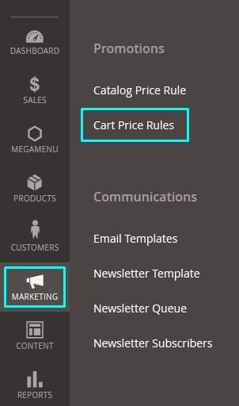
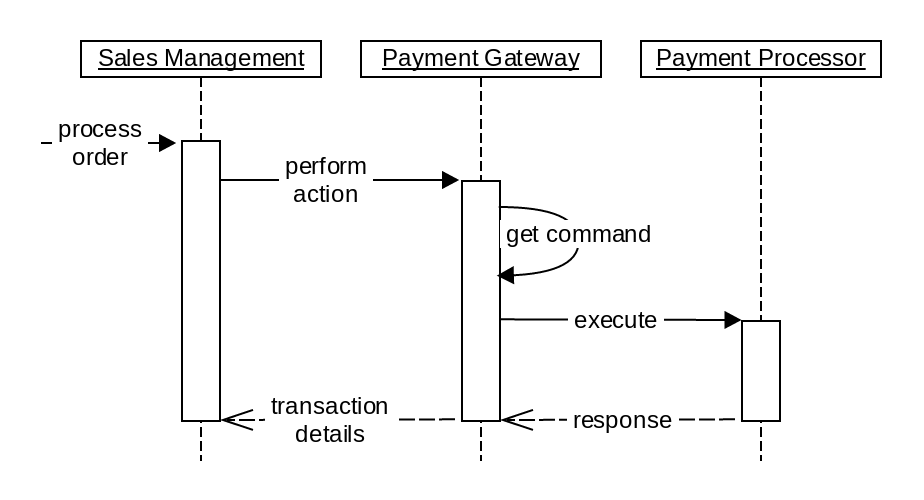

8 - Customizing the Checkout Process
====================================

8.1 Demonstrate ability to use Quote, Quote Item, Address, and shopping Cart Price rules in checkout
----------------------------------------------------------------------------------------------------

**Describe how to modify these models and effectively use them in customizations.**

> Quote/Cart, Quote/Cart Items, Quote/Cart Addresses and Cart Price Rules are ALL their own entity which follow the [Service Contracts](#h.i0qq8aqgijv7) design pattern. Therefore the following ways of customisation are available:

*   They all support [Extension Attributes](#h.2lcvcwr56aq)
*   Quote/Cart Address supports [EAV Custom Attributes](#h.2lcvcwr56aq)
*   Observable [Events dispatched](https://www.mageplaza.com/magento-2-module-development/magento-2-events.html&sa=D&ust=1609223265607000&usg=AOvVaw3hoe7G8p_gZJXAzywkihca) at certain points throughout each entity's checkout lifecycle.
*   Implement / extend interfaces / class implementations via [DI Preference](#h.9ofwnl5q9fnf).
*   [Plugin Interceptors](#h.nc1ow1wmf2km) around / before & after concrete class implementations of the interfaces (below).
*   [JSComponent](#h.kg229a1fn1nm) & [Mixins](https://devdocs.magento.com/guides/v2.3/javascript-dev-guide/javascript/js_mixins.html%23example&sa=D&ust=1609223265609000&usg=AOvVaw2ZXvsf2EHlwrejlu7ciEyY)
*   The following XML [Layout Handles](https://devdocs.magento.com/guides/v2.4/frontend-dev-guide/layouts/layout-overview.html%23layout-over-terms&sa=D&ust=1609223265609000&usg=AOvVaw0R1h3jI4LhzgqvneoVz4UF):

    *   `checkout_cart_index.xml`
    *   `checkout_index_index.xml`
    *   `checkout_onepage_review.xml`
    *   `checkout_onepage_success.xml`
    *   `checkout_onepage_failure.xml`
    *   `checkout_cart_item_renderers.xml`
    *   `checkout_item_price_renderers.xml`
    *   `checkout_cart_configure.xml`
    *   `checkout_cart_configure_type_simple.xml`
    *   `checkout_cart_sidebar_item_price_renderers.xml`
    *   `checkout_onepage_review_item_renderers.xml`
    *   `checkout_cart_sidebar_item_renderers.xml`
    *   `checkout_cart_sidebar_total_renderers.xml`
    *   `default.xml` (last resort)

> The below sub-sections illustrate in detail the extendable functionality within each entity:

### Quote

> Like all Modules, Magento_Quote uses the [Service Contracts](#h.i0qq8aqgijv7) design pattern to manage (C.R.U.D actions) Quotes/Carts with the following Repositories:
>
> The main interface for managing (C.R.U.D actions) Quotes/Carts:

```php
Magento\Quote\Api\CartRepositoryInterface::get(
    $cartId
);
```

> The main interface for managing (C.R.U.D actions) Quotes/Carts of Guests:

```php
Magento\Quote\Api\GuestCartRepositoryInterface::get(
    $cartId
);
```

> The main interface for placing quotes/carts i.e. createEmptyCart, assignCustomer, placeOrder actions:

```php
Magento\Quote\Api\CartManagementInterface::placeOrder(
    $cartId,
    \Magento\Quote\Api\Data\PaymentInterface $paymentMethod = null
);
```

> The main interface for placing quotes/carts i.e. createEmptyCart, assignCustomer, placeOrder for Guests:

```php
Magento\Quote\Api\GuestCartManagementInterface::placeOrder(
    $cartId,
    \Magento\Quote\Api\Data\PaymentInterface $paymentMethod = null
);
```

> Set shipping/billing methods and additional data for cart and collect totals:

```php
Magento\Quote\Api\CartTotalManagementInterface::collectTotals(
    $cartId,
    \Magento\Quote\Api\Data\PaymentInterface $paymentMethod,
    $shippingCarrierCode = null,
    $shippingMethodCode = null,
    \Magento\Quote\Api\Data\TotalsAdditionalDataInterface $additionalData = null
);
```

> Set shipping/billing methods and additional data for cart and collect totals of Guests:

```php
Magento\Quote\Api\GuestCartTotalManagementInterface::collectTotals(
    $cartId,
    \Magento\Quote\Api\Data\PaymentInterface $paymentMethod,
    $shippingCarrierCode = null,
    $shippingMethodCode = null,
    \Magento\Quote\Api\Data\TotalsAdditionalDataInterface $additionalData = null
);
```

> Returns Quote totals data for a specified Cart/Quote:

```php
Magento\Quote\Api\CartTotalRepositoryInterface::get(
    $cartId
);
```

> Returns Quote totals data for a specified Cart/Quote of a Guest:

```php
Magento\Quote\Api\GuestCartTotalRepositoryInterface::get(
    $cartId
);
```

> The main Quote/Cart data interface which houses all the quote properties such as `shipping_address`, `checkout_method`, items, `billing_address`, `entity_id` etc:

```php
Magento\Quote\Api\Data\CartInterface
```

> The data interface for calculating cart totals e.g. grand_total, subtotal, discount_amount, tax_amount etc:

```php
Magento\Quote\Api\Data\TotalsInterface
```

> Service checks if the user has ability to change the Quote:

```php
Magento\Quote\Api\ChangeQuoteControlInterface
```

> A data interface extension of `Magento\Framework\Api\SearchResultsInterface` used for searching Carts/Quotes in getList methods:

```php
Magento\Quote\Api\Data\CartSearchResultsInterface
```

> Data interface regarding currency information for this Cart/Quote:

```php
Magento\Quote\Api\Data\CurrencyInterface
```

| Table: **`quote`** | Notable Columns | Description |
| --- | --- | --- |
| Core Quote/Cart properties | `entity_id` int(10), `store_id`, smallint(5), `created_at`, timestamp, `updated_at`, timestamp, `is_active`, smallint(5), `is_virtual`, smallint(5), `is_multi_shipping`, smallint(5), `items_count`, int(10), `items_qty`, decimal(12,4), `store_to_base_rate`, decimal(12,4), `store_to_quote_rate`, decimal(12,4), `base_currency_code`, varchar(255), `store_currency_code`, varchar(255), `quote_currency_code`, varchar(255), `checkout_method`, varchar(255), `remote_ip`, varchar(45), `is_persistent`, smallint(5), `reserved_order_id`, varchar(64), `password_hash`, varchar(255), `global_currency_code`, varchar(255), `base_to_global_rate`, decimal(20,4), `base_to_quote_rate`, decimal(20,4), `trigger_recollect`, smallint(6) | `entity_id`: used all over the code and is the global identifier. **``is_active``**: Used for status / abandonment queries. Quotes are active when: Customer first creates a cart, it remains active even when logged out. Quotes are inactive when: Created by admin or API, a customer converts to an order Quotes are abandoned when: Quote/Cart is active but hasn't checked out for X length of time (configured in admin). **``is_virtual``**: Relating to [Virtual Products](#h.t3fkw0wf3trp) / [Downloadable Products](#h.614rvm49j6y9). **``is_multi_shipping``**: Used to indicate a [Multi-shipping](https://docs.magento.com/user-guide/configuration/sales/multishipping-settings.html&sa=D&ust=1609223265634000&usg=AOvVaw079SqVOaiMkuJU0G8bFd5G) Quote / Cart. |
| Quote/Cart Totals Properties | `grand_total`, decimal(20,4), `base_grand_total`, decimal(20,4), subtotal, decimal(20,4), `base_subtotal`, decimal(20,4), `subtotal_with_discount`, decimal(20,4), `base_subtotal_with_discount`, decimal(20,4) | The Quotes / Cart's calculated totals. **`grand_total`**: The final price of the Quote/Cart. **`subtotal`**: Total of all Cart Items prices * by the Cart Item Qtys, before tax or discount. The difference between Base Totals & Totals are in the customer's Currency vs your shop's Base Currency. Used for the currency switcher. |
| Quote/Cart Customer Properties | `customer_id`, int(10), `customer_tax_class_id`, int(10), `customer_group_id`, int(10), `customer_email`, varchar(255), `customer_prefix`, varchar(40), `customer_firstname`, varchar(255), `customer_middlename`, varchar(40), `customer_lastname`, varchar(255), `customer_suffix`, varchar(40), `customer_dob`, datetime, `customer_note`, varchar(255), `customer_note_notify`, smallint(5), `customer_is_guest`, smallint(5), `customer_taxvat`, varchar(255), `customer_gender`, varchar(255) | De-normalised / duplicate information data regarding the customer for a specific Quote/Cart. The reason why this information is duplicated is for preservation, in case the customer changes their information / remove's their account. It shouldn't affect Quotes / Sales going forward. Another reason is for read performance purposes, duplicating this data saves on extra relational queries. |
| Sales / Cart Price Rules | `applied_rule_ids`, varchar(255), `coupon_code`, varchar(255) | Used for Sales / Cart Price Rules (promotions) applied Rule IDs / Coupons. |
| [Magento Store Credit](https://docs.magento.com/user-guide/sales/store-credit.html&sa=D&ust=1609223265643000&usg=AOvVaw3HH3BN-FAWWASMN30lpOa5) (Magento commerce/enterprise only) | `customer_balance_amount_used`, decimal(20,4), `base_customer_bal_amount_used`, decimal(20,4), `use_customer_balance`, int(11) | These are all the relevant columns for [Magento Store Credit](https://docs.magento.com/user-guide/sales/store-credit.html&sa=D&ust=1609223265644000&usg=`AOvVaw230xRzowyrgC_QbpBaMwq7`) (Magento commerce/enterprise only). Store credit is an amount that is restored to a customer account. Customers can use their store credit to pay for purchases, and administrators can use store credit for cash refunds. Gift card balances can be credited to the customer's account, instead of using the gift card code for future purchases. |
| [Magento Giftcard Accounts](https://docs.magento.com/user-guide/catalog/product-gift-card-accounts.html&sa=D&ust=1609223265645000&usg=AOvVaw0iq5JUqocV68hGgqxC2VON) (Magento commerce/enterprise only) | `gift_cards`, text, `gift_cards_amount`, decimal(20,4), `base_gift_cards_amount`, decimal(20,4), `gift_cards_amount_used`, decimal(20,4), `base_gift_cards_amount_used`, decimal(20,4) | A gift card account is automatically created for each Gift Card that is purchased. The value of the gift card can then be applied toward the purchase of a product in your store. You can also create gift card accounts from the Admin as a promotion or service for customers. The gift card account number corresponds to the gift card code. The value in the Quote/Cart table will be the amount being redeemed. |
| [Magento Gift Options](https://docs.magento.com/user-guide/sales/gift-options.html&sa=D&ust=1609223265647000&usg=AOvVaw0VXkG9uh9mMhwyoLW2OUJc) | | `gift_message_id`, int(11) | **`gift_message_id`**: The foreign key linking `quote_item` to a [Gift Option](https://docs.magento.com/user-guide/sales/gift-options.html&sa=D&ust=1609223265648000&usg=AOvVaw23dQaBbWEvHYYH7KdQ4Gwv) |
| [Magento Gift Wrapping](https://docs.magento.com/user-guide/sales/gift-wrap.html&sa=D&ust=1609223265649000&usg=AOvVaw17WaWQQQsKiRoUJqSvzC9G) (Magento commerce/enterprise only) | `gw_id`, int(11), `gw_allow_gift_receipt`, int(11), `gw_add_card`, int(11), `gw_base_price`, decimal(12,4), `gw_price`, decimal(12,4), `gw_items_base_price`, decimal(12,4), `gw_items_price`, decimal(12,4), `gw_card_base_price`, decimal(12,4), `gw_card_price`, decimal(12,4), `gw_base_tax_amount`, decimal(12,4), `gw_tax_amount`, decimal(12,4), `gw_items_base_tax_amount`, decimal(12,4), `gw_items_tax_amount`, decimal(12,4), `gw_card_base_tax_amount`, decimal(12,4), `gw_card_tax_amount`, decimal(12,4), `gw_base_price_incl_tax`, decimal(12,4), `gw_price_incl_tax`, decimal(12,4), `gw_items_base_price_incl_tax`, decimal(12,4), `gw_items_price_incl_tax`, decimal(12,4), `gw_card_base_price_incl_tax`, decimal(12,4), `gw_card_price_incl_tax`, decimal(12,4) | These are all the relevant columns for [Magento Gift Wrapping](https://docs.magento.com/user-guide/sales/gift-wrap.html&sa=D&ust=1609223265652000&usg=AOvVaw2JMyw5UtqnpvAZb7FoKfvS) (Magento commerce/enterprise only). Gift wrapping is available for any product that can be shipped, and can be offered for individual items or for the entire order. You can charge a separate price for each gift wrap design, and upload a thumbnail image of the design that appears as an option for the product in the cart. |
| [Reward Points](https://docs.magento.com/user-guide/configuration/customers/reward-points.html&sa=D&ust=1609223265653000&usg=AOvVaw2859kqVzKhtA8GL4atV-jq) (Magento commerce/enterprise only) | `use_reward_points`, int(11), `reward_points_balance`, int(11), `base_reward_currency_amount`, decimal(20,4), `reward_currency_amount`, decimal(20,4) | These are all the relevant columns for [Reward Points](https://docs.magento.com/user-guide/configuration/customers/reward-points.html&sa=D&ust=1609223265655000&usg=AOvVaw3pILSmz7cdW7Ku2lPcI1k4) (Magento commerce/enterprise only) Or Loyalty Points. |
| Unused columns | `ext_shipping_info`, text, `is_changed`, int(10), `orig_order_id`, int(10), `converted_at`, timestamp, `changed_flag`, int(10) | Though these are seemingly unused in the code, they might be here for backward compatibility with Magento 1 |


The main thing to remember here is that Quotes adhere to the [Service Contracts](#h.i0qq8aqgijv7) design pattern, therefore all the necessary models for customisation are available within the Api/ directory of the Magento_Quote module. The main functions of these models to remember here are Managing Carts/Quotes, placing orders, assigning Shipping/Billing addresses, assigning Payments, assigning Shipping Methods, assigning Quote Items.

### Quote Item

> Like all Modules, Magento_Quote uses the [Service Contracts](#h.i0qq8aqgijv7) design pattern to manage (C.R.U.D actions) Quote/Cart Items with the following Repositories:
>
> The main interface for managing Cart Items:


```php
Magento\Quote\Api\CartItemRepositoryInterface::save(
    \Magento\Quote\Api\Data\CartItemInterface $cartItem
);
```

> Manage that are assigned to a specified Guests cart:

```php
Magento\Quote\Api\GuestCartItemRepositoryInterface::save(
    \Magento\Quote\Api\Data\CartItemInterface $cartItem
);
```

> The main data interface for Cart/Quote items which houses properties such as `sku`, `qty`, `price`, `quote_id` etc:

```php
Magento\Quote\Api\Data\CartItemInterface
```

> The main data interface for calculating cart item totals e.g. `row_total`, `base_price`, `qty`, `tax_amount` etc:

```php
Magento\Quote\Api\Data\TotalsItemInterface
```

> Assigning Product Options ([Composite Product](#h.cbgifdse6zd5) Options) as an [Extension Attribute](#h.2lcvcwr56aq):

```php
Magento\Quote\Api\Data\ProductOptionInterface
```

> Data interface for additional totals (on other entities such as Address) which affect `grand_total` as an [Extension Attribute](#h.2lcvcwr56aq):

```php
Magento\Quote\Api\Data\TotalsAdditionalDataInterface
```

> Data interface for additional totals (on other entities such as Address) which affect `grand_total`:

```php
Magento\Quote\Api\Data\TotalSegmentInterface
```

|Table: **`quote_item`** | Notable Columns | Description |
| --- | --- | --- |
| Core Quote/Cart Item Properties | `item_id` - int(10) unsigned, `quote_id` - int(10) unsigned, `created_at` - timestamp, `updated_at` - timestamp, `product_id` - int(10) unsigned, `store_id` - smallint(5) unsigned, `parent_item_id` - int(10) unsigned, `is_virtual` - smallint(5) unsigned, `is_qty_decimal` - smallint(5) unsigned, qty - decimal(12,4), `free_shipping` - smallint(5) unsigned, `additional_data` - text, `item_id`: The main Quote/Cart Item Entity identifier | `quote_id`: The foreign key that links `quote_item` to quote table. `product_id`: The foreign key that links `quote_item` to (numerous) Product Entity tables. `parent_item_id`: If this item is an [Associated Simple Product](#h.98cgcmsgdbu5) then this is the identifier of the [Configurable Product](#h.98cgcmsgdbu5). `qty`: How many of this item is in the cart. `is_virtual`: Is this item a [Virtual Product](#h.t3fkw0wf3trp). `free_shipping`: Whether this Quote/Cart item is subject to free shipping. `additional_data`: JSON object for anything additional used for 3rd party modules.
| Core Quote/Cart Item Product Data | sku - varchar(255), name - varchar(255), description - text, weight - decimal(12,4), `row_weight` - decimal(12,4), `product_type` - varchar(255), price - decimal(12,4), `redirect_url` - varchar(255), De-normalised / duplicate information data regarding the customer for a specific Quote/Cart. | The reason why this information is duplicated is for preservation, in case the Product changes or is removed - there is always a record of what was purchased. Another reason is for read performance purposes, duplicating this data saves on extra relational queries. `row_weight`: weight * qty. `price`: initial item price, declared during product association at the time that the item was added to the Quote/Cart.
| Quote / Cart Item Totals | `base_price` - decimal(12,4), `custom_price` - decimal(12,4), `original_custom_price` - decimal(12,4), `base_cost` - decimal(12,4), `discount_percent` - decimal(12,4), `discount_amount` - decimal(20,4), `base_discount_amount` - decimal(20,4), `base_tax_amount` - decimal(20,4), `row_total` - decimal(20,4), `base_row_total` - decimal(20,4), `row_total_with_discount` - decimal(20,4), `price_incl_tax` - decimal(20,4), `base_price_incl_tax` - decimal(20,4), `row_total_incl_tax` - decimal(20,4), `base_row_total_incl_tax` - decimal(20,4), The difference between Base Prices & Prices are in the customer's Currency vs your shop's Base Currency. Used for the currency switcher. For example: | `row_total`: The Grand total for this item of this row (qty + discount + tax + price) in the customer's chosen currency. `base_row_total`: The Grand total for this item of this row (qty + discount + tax + price) in your store's chosen base currency. `custom_price`: A new price that can be declared and recalculated during the calculation process. `original_custom_price`: Original defined value of custom price without any conversion
| Quote / Cart Item Tax Amounts | `tax_percent` - decimal(12,4), `tax_amount` - decimal(20,4), `base_tax_before_discount` - decimal(20,4), `tax_before_discount` - decimal(20,4), `weee_tax_applied` - text, `weee_tax_applied_amount` - decimal(12,4), `weee_tax_applied_row_amount` - decimal(12,4), `weee_tax_disposition` - decimal(12,4), `weee_tax_row_disposition` - decimal(12,4), `base_weee_tax_applied_amount` - decimal(12,4), `base_weee_tax_applied_row_amnt` - decimal(12,4), `base_weee_tax_disposition` - decimal(12,4), `base_weee_tax_row_disposition` - decimal(12,4), `discount_tax_compensation_amount` - decimal(20,4), `base_discount_tax_compensation_amount` - decimal(20,4), The [`Magento_Weee`](https://devdocs.magento.com/guides/v2.3/mrg/ce/Weee.html&sa=D&ust=1609223265677000&usg=`AOvVaw0B_HdWyEbZDhpU4flweObr`) module enables the application of fees/fixed product taxes (FPT) on certain types of products, usually related to electronic devices and recycling. Fixed product taxes can be used to set up a WEEE tax that is a fixed amount, rather than a percentage of the product price. FPT can be configured to be displayed at various places in Magento. Rules, amounts, and display options can be configured in the backend. This module extends the existing functionality of `Magento_Tax`. | `tax_amount`: Total tax of this Quote/Cart item including qty for this row. `discount_tax_compensation_amount`: Row `tax_amount` - row `tax_amount` after discount.
| [Magento Gift Options](https://docs.magento.com/user-guide/sales/gift-options.html&sa=D&ust=1609223265678000&usg=`AOvVaw17bpkriufBse_w0GC122k1`) | `gift_message_id` - int(11) | `gift_message_id`: The foreign key linking `quote_item` to a [Gift Option](https://docs.magento.com/user-guide/sales/gift-options.html&sa=D&ust=1609223265679000&usg=AOvVaw0ddGxSfRtNEfZ4by7-wB11) |
| [Magento Gift Wrapping](https://docs.magento.com/user-guide/sales/gift-wrap.html&sa=D&ust=1609223265680000&usg=AOvVaw0Rgwl3nyJ8maPW3LfdeUFo) (Magento commerce/enterprise only) | `gw_id` - int(11), `gw_base_price` - decimal(12,4), `gw_price` - decimal(12,4), `gw_base_tax_amount` - decimal(12,4), `gw_tax_amount` - decimal(12,4) | These are all the relevant columns for [Magento Gift Wrapping](https://docs.magento.com/user-guide/sales/gift-wrap.html&sa=D&ust=1609223265682000&usg=`AOvVaw0LqqLOQTxyh8PiSlV_OMfN`) (Magento commerce/enterprise only). Gift wrapping is available for any product that can be shipped, and can be offered for individual items or for the entire order. You can charge a separate price for each gift wrap design, and upload a thumbnail image of the design that appears as an option for the product in the cart. |
| [Magento Events](https://docs.magento.com/user-guide/marketing/event-create.html&sa=D&ust=1609223265682000&usg=AOvVaw1ZnfLcebV0Cebi7RdxWd-Z) (Magento commerce/enterprise only) | `event_id` - int(11) | [`Magento_CatalogEvent`](https://docs.magento.com/user-guide/marketing/event-create.html&sa=D&ust=1609223265684000&usg=AOvVaw0loMrqR-bwM68fqI3okHay) module is designed for creating campaigns that encourage customers to buy products with lower prices. There are three types of the catalog events: upcoming, open, closed. |
| [Magento Gift Registries](https://docs.magento.com/user-guide/marketing/gift-registries.html&sa=D&ust=1609223265684000&usg=`AOvVaw3t16tNCRCcriXVFUHMH_UZ`) (Magento commerce/enterprise only) | `giftregistry_item_id` - int(11) | [`Magento_GiftRegistry`](https://docs.magento.com/user-guide/marketing/gift-registries.html&sa=D&ust=1609223265686000&usg=AOvVaw2SjrY-`R_Xbr1UfG5YjdpuM`) gives your customers the ability to create gift registries for special occasions, and to invite their friends and family to purchase their gifts from the gift registry. Magento keeps track of all items purchased and the quantities remaining. |
| Sales / Cart Price Rules | `applied_rule_ids` - text, `no_discount` - smallint(5) unsigned | Used for Sales / Cart Price Rules (promotions) applied Rule IDs / Coupons. `no_discount`: Yes/No to applying Sales Rules on this item. |


The main thing to remember here is that Quote Items adhere to the [Service Contracts](#h.i0qq8aqgijv7) design pattern, therefore all the necessary models for customisation are available within the Api/ directory of the Magento_Quote module. The main functions of these models to remember here are Managing Carts/Quote Items, assigning an item to a Quote, assigning properties of an item such as row_total, qty etc, applying additional totals to a Cart/Quote Item. Separate management interfaces exist for both logged in Customers & Guests.

### Payments

> Like all Modules, Magento_Quote uses the [Service Contracts](#h.i0qq8aqgijv7) design pattern to manage (C.R.U.D actions) Payments with the following Repositories:
>
> The main interface for managing specified payment methods to a specified shopping cart:

```php
Magento\Quote\Api\PaymentMethodManagementInterface::set(
    $cartId,
    \Magento\Quote\Api\Data\PaymentInterface
    $method
);
```

> The main interface for managing specified payment methods to a specified shopping cart of a Guest:

```php
Magento\Quote\Api\GuestPaymentMethodManagementInterface::set(
    $cartId,
    \Magento\Quote\Api\Data\PaymentInterface
    $method
);
```

> The main data interface for Payments housing properties such as method, `po_number`, `additional_data`:

```php
Magento\Quote\Api\Data\PaymentInterface
```

> The main data interface for Payments Method housing properties such as title & code:

```php
Magento\Quote\Api\Data\PaymentMethodInterface
```

| Database Table: **`quote_payment`** | Notable Columns | Description |
| --- | --- | --- |
| Core Quote Payment Properties | `payment_id` - int(10) unsigned, `quote_id` - int(10) unsigned, `created_at` - timestamp, `updated_at` - timestamp, method - varchar(255), `po_number` - varchar(255), `additional_data` - text, `additional_information` - text. | `payment_id`: The main Quote/Cart Item Entity identifier. `quote_id`: The foreign key that links `quote_item` to quote table. method: This is the Payment Method code used to checkout .e.g "braintree". `po_number`: Purchase Order number, for Purchase Order Payment Methods. `additional_data`: Magento uses this to input quote related data once the customer submits the payment form. `additional_information`: This can be used to place 3rd party module information. Braintree for example adds "`payment_method_nonce`". |
| Quote Payment Credit Card Information | `cc_type` - varchar(255), `cc_number_enc` - varchar(255), `cc_last_4` - varchar(255), `cc_cid_enc` - varchar(255), `cc_owner` - varchar(255), `cc_exp_month` - varchar(255), `cc_exp_year` - smallint(5) unsigned, `cc_ss_owner` - varchar(255), `cc_ss_start_month` - smallint(5) unsigned, `cc_ss_start_year` - smallint(5) unsigned, `cc_ss_issue` - varchar(255) | The non-sensitive card information. In order to store the sensitive information you would have to be PCI Compliant, Magneto Cloud by default has PCI Compliant infrastructure, but Magento Community is not necessarily. |
| Quote Payment PayPal Properties | `paypal_payer_id` - varchar(255), `paypal_payer_status` - varchar(255), `paypal_correlation_id` - varchar(255) | PayPal relational information. |

The main thing to remember here is that Payments adhere to the [Service Contracts](#h.i0qq8aqgijv7) design pattern, therefore all the necessary models for customisation are available within the Api/ directory of the Magento_Quote module. The main functions of these models to remember here are Managing Payments (C.R.U.D actions), assigning a Payment to a Quote, assigning properties of a Payment such as code, title, method etc. Separate management interfaces exist for both logged in Customers & Guests.

### Shipping Methods

> Like all Modules, Magento_Quote uses the [Service Contracts](#h.i0qq8aqgijv7) design pattern to manage (C.R.U.D actions) Shipping Methods with the following Repositories:
>
> Estimate shipping by address and return list of available shipping methods:

```php
Magento\Quote\Api\ShipmentEstimationInterface::estimateByExtendedAddress(
    $cartId,
    \Magento\Quote\Api\Data\AddressInterface $address
);
```

> Estimate shipping by address and return list of available shipping methods for Guest:

```php
Magento\Quote\Api\GuestShipmentEstimationInterface::estimateByExtendedAddress(
    $cartId,
    \Magento\Quote\Api\Data\AddressInterface $address
);
```

> Estimate shipping by Shipping Address:

```php
Magento\Quote\Api\ShippingMethodManagementInterface::estimateByAddress(
    $cartId,
    \Magento\Quote\Api\Data\EstimateAddressInterface $address
);
```

> Estimate shipping by Shipping Address for Guests:

```php
Magento\Quote\Api\GuestShippingMethodManagementInterface::estimateByAddress(
    $cartId,
    \Magento\Quote\Api\Data\EstimateAddressInterface $address
);
```

> The main data interface for managing shipments in Quotes:

```php
Magento\Quote\Api\Data\ShippingInterface
```

> A data interface for creating an address for estimation with properties such as `country_id`, `region_id`, `postcode` etc:

```php
Magento\Quote\Api\Data\EstimateAddressInterface
```

> A data interface for assigning shipping methods to Quotes/Cart:

```php
Magento\Quote\Api\Data\ShippingAssignmentInterface::public function setItems(
    \Magento\Quote\Api\Data\CartItemInterface[] $value
);
```

> The data interface for creating new Shipping Methods with properties such as `carrier_code`, `method_code`, `carrier_title`, `method_title` etc:

```php
Magento\Quote\Api\Data\ShippingMethodInterface
```

| Database Table: **`quote_shipping_rate`** | Notable Columns | Description |
| --- | --- | --- |
| Quote/Cart Shipping Rates Core Properties | `rate_id` - int(10) unsigned, `address_id` - int(10) unsigned, `created_at` - timestamp, `updated_at` - timestamp, code - varchar(255), method - varchar(255), `method_title` - text, `method_description` - text, `error_message` - text | `rate_id`: The main Quote/Cart Item Entity identifier. `address_id`: The foreign key that links `quote_shipping_rate` to `quote_address` table. method: This is the Shipping Rate Method Code, often duplicated in other tables such as `shipping_method` column of `quote_address` (below) as an alternate human-friendly identifier. code: This is the more specific Shipping Rate method (above) for dynamic rates (such as [Table Rates](https://docs.magento.com/user-guide/shipping/shipping-table-rate.html&sa=D&ust=1609223265713000&usg=AOvVaw3EIc7rGRjXihlyWhv02loG)) whereby the method = tablerate code would be bestway (default) delimited via an underscore (`tablerate_bestway`) which would translate to: Use the Table Rates Best Method Available. Whatever is "Best" depends on the calculation [Conditions](https://docs.magento.com/user-guide/shipping/shipping-table-rate.html%23step-1-complete-the-default-settings&sa=D&ust=1609223265713000&usg=`AOvVaw0EybmPIuVVUVn1vzORbV_t`) & the [Uploaded Rates CSV](https://docs.magento.com/user-guide/shipping/shipping-table-rate.html%23step-3-import-the-table-rate-data&sa=D&ust=1609223265713000&usg=AOvVaw2rwYJG7VYdcMTsPIGM0kjq) price for that postcode. `method_title`: The headline of this Cart/Quote Shipping Rate displayed to the customer. Correlating to the main method name e.g. "Standard" (defined in admin). `error_message`: Exceptions encountered whilst calculating shipping rates. |
| Quote/Cart Shipping Rates Totals Properties | `price` - decimal(20,4) | `price`: The Grand Total of the cost for this shipping method posting to this Quote/Cart Address |
| Quote/Cart Shipping Rates [Carrier](https://docs.magento.com/user-guide/shipping/carriers.html&sa=D&ust=1609223265715000&usg=AOvVaw3jHUsd99DklWfi6Dc1VDlu) Properties | carrier - varchar(255), `carrier_title` - varchar(255), `carrier_type` - text, `carrier_id` - text, `carriergroup_id` - text, carriergroup - text, `carriergroup_shipping_details` - text | Relational columns regarding [Magento Shipping Carriers](https://docs.magento.com/user-guide/shipping/carriers.html&sa=D&ust=1609223265717000&usg=AOvVaw2wcibpDuMsxpFaZ6NX4ym1). If you have a commercial account with a supported carrier, you can offer your customers the convenience of choosing that carrier during checkout. The rates are automatically downloaded, so you do not need to look up the information. |


The main thing to remember here is that Shipping Methods adhere to the [Service Contracts](#h.i0qq8aqgijv7) design pattern, therefore all the necessary models for customisation are available within the Api/ directory of the Magento_Quote module. The main functions of these models to remember here are Managing Shipping Methods (C.R.U.D actions), assigning a Shipping Methods to a Quote, assigning properties of a Shipping Method such as country_id, region_id, postcode etc. Separate management interfaces exist for both logged in Customers & Guests.

### Addresses

> Like all Modules, Magento_SalesRule uses the [Service Contracts](#h.i0qq8aqgijv7) design pattern to manage (C.R.U.D actions) Cart Price Rules with the following Repositories:
>
> Assigns a specified billing address to a specified cart:

```php
Magento\Quote\Api\BillingAddressManagementInterface::assign(
    Magento\Quote\Api\Data\AddressInterface $address,
    $useForShipping = false
);
```

> Assign a specified billing address to a specified cart for Guests:

```php
Magento\Quote\Api\GuestBillingAddressManagementInterface::assign(
    $cartId, \Magento\Quote\Api\Data\AddressInterface $address, $useForShipping = false
);
```

> The main Api data interface for Shipping & Billing Addresses which houses properties such as `email`, `region_code`, `customer_id`, `street`, `telephone`, `postcode`, `city`, `firstname`, `lastname` etc:

```php
Magento\Quote\Api\Data\AddressInterface
```

> Retrieve existing Address Additional Data as [Extension Attributes](#h.2lcvcwr56aq) object or create a new one. Address Additional Data are custom additional fields in the format of a [Custom Attribute](#h.2lcvcwr56aq)

```php
Magento\Quote\Api\Data\AddressAdditionalDataInterface
```

| Database Table: **`quote_address`** | Notable Columns | Description |
| --- | --- | --- |
| Core Quote/Cart Address Properties | `address_id` - int(10) unsigned, `quote_id` - int(10) unsigned, `created_at` - timestamp, `updated_at` - timestamp, `customer_id` - int(10) unsigned, `save_in_address_book` - smallint(6), `customer_address_id` - int(10) unsigned, `address_type` - varchar(10), `same_as_billing` - smallint(5) unsigned, `customer_notes` - text, `collect_shipping_rates` - smallint(5) unsigned, `shipping_method` - varchar(120), `shipping_description` - varchar(255), `validated_country_code` - text, `validated_vat_number` - text, `free_shipping` - smallint(5) unsigned, `address_id`: The main Quote/Cart Address Entity Identifier | `quote_id`: The foreign key that links `quote_address` to quote table. `customer_id`: The foreign key that links `quote_address` to `customer_entity` table. `save_in_address_book`: Selected by the Customer, if ticked then this address will be tied to their account for future use. `address_type`: The column to differentiate between a Billing Address and a Shipping Address `same_as_billing`: Yes/No value to denote whether this Shipping address matches Billing (saves on duplicating data). `shipping_method`: This is the same value as the Shipping Method method column that was used to calculate the shipping amounts (e.g. `flatrate_flatrate`). |
| Customer Quote/Cart Address Properties | email - varchar(255), prefix - varchar(40), firstname - varchar(255), middlename - varchar(40), lastname - varchar(255), suffix - varchar(40), company - varchar(255), street - varchar(255), city - varchar(255), region - varchar(255), `region_id` - int(10) unsigned, postcode - varchar(20), `country_id` - varchar(30), telephone - varchar(255), fax - varchar(255), De-normalised / duplicate information data regarding the customer for a specific Quote/Cart Address. | The reason why this information is duplicated is for preservation, in case the customer changes their information / remove's their account. It shouldn't affect Quotes / Sales going forward. Another reason is for read performance purposes, duplicating this data saves on extra relational queries. |
| Quote/Cart Address Total Properties | weight - decimal(12,4), subtotal - decimal(20,4), `base_subtotal` - decimal(20,4), `subtotal_with_discount` - decimal(20,4), `base_subtotal_with_discount` - decimal(20,4), `tax_amount` - decimal(20,4), `base_tax_amount` - decimal(20,4), `shipping_amount` - decimal(20,4), `base_shipping_amount` - decimal(20,4), `shipping_tax_amount` - decimal(20,4), `base_shipping_tax_amount` - decimal(20,4), `discount_amount` - decimal(20,4), `base_discount_amount` - decimal(20,4), `grand_total` - decimal(20,4), `base_grand_total` - decimal(20,4), `applied_taxes` - text, `discount_description` - varchar(255), `shipping_discount_amount` - decimal(20,4), `base_shipping_discount_amount` - decimal(20,4), `subtotal_incl_tax` - decimal(20,4), `base_subtotal_total_incl_tax` - decimal(20,4), `discount_tax_compensation_amount` - decimal(20,4), `base_discount_tax_compensation_amount` - decimal(20,4), `shipping_discount_tax_compensation_amount` - decimal(20,4), `base_shipping_discount_tax_compensation_amnt` - decimal(20,4), `shipping_incl_tax` - decimal(20,4), `base_shipping_incl_tax` - decimal(20,4) | These totals are used to calculate [Magento Shipping Method Rates](https://docs.magento.com/user-guide/configuration/sales/delivery-methods.html&sa=D&ust=1609223265734000&usg=AOvVaw1NUzphzbyg0JQTbKPwlhcs). The difference between Base Amounts & Amounts are in the customer's Currency vs your shop's Base Currency. Used for the currency switcher. `grand_total`: This would be the final price of shipping for this Quote/Cart Address. `subtotal`: Total shipping amount for Quote/Cart Address, before tax or discount. `applied_taxes`: JSON encoded string containing the Tax rates for that specific store. For example: `{"GST":{"amount":1,"base_amount":1,"percent":10,"id":"GST","rates":[{"percent":10,"code":"GST","title":"GST"}],"item_id":"197836","item_type":"product","associated_item_id":null,"process":0}}`. `weight`: Important unit for calculating Table Rates. |
| Quote/Cart Value Added Tax (VAT) | `vat_id` - text, `vat_is_valid` - smallint(6), `vat_request_id` - text, `vat_request_date` - text, `vat_request_success` - smallint(6) | Relational columns regarding [Magento Value Added Tax](https://docs.magento.com/user-guide/tax/vat.html&sa=D&ust=1609223265738000&usg=AOvVaw0tuZRour2aWSNh6GSYrQyQ). Some countries charge a value-added tax, or VAT, on goods and services. There can be different VAT rates depending on which stage you as a merchant are at in the manufacture or distribution of the products, materials, or services that you sell to your customers. In some cases, you might need to use more than one VAT rate in your store for tax calculation purposes. |
| [Magento Giftcard Accounts](https://docs.magento.com/user-guide/catalog/product-gift-card-accounts.html&sa=D&ust=1609223265739000&usg=AOvVaw0A2kNf2NOi59-aZCYMXNQ1) (Magento commerce/enterprise only) | `gift_cards_amount` - decimal(20,4), `base_gift_cards_amount` - decimal(20,4), `gift_cards` - text, `used_gift_cards` - text, A gift card account is automatically created for each Gift Card that is purchased. The value of the gift card can then be applied toward the purchase of a product in your store. You can also create gift card accounts from the Admin as a promotion or service for customers. The gift card account number corresponds to the gift card code. The value in the Quote/Cart Address table will be the amount being redeemed. |
| [Magento Gift Options](https://docs.magento.com/user-guide/sales/gift-options.html&sa=D&ust=1609223265740000&usg=AOvVaw2mROQ8OQIvT4KsGKFUN-Q8) | `gift_message_id` - int(11) | `gift_message_id`: The foreign key linking `quote_item` to a [Gift Option](https://docs.magento.com/user-guide/sales/gift-options.html&sa=D&ust=1609223265741000&usg=`AOvVaw1ZRX0m_UhtWPhE8OimlPqP`) |
| [Magento Gift Wrapping](https://docs.magento.com/user-guide/sales/gift-wrap.html&sa=D&ust=1609223265742000&usg=`AOvVaw3haaTEXdIMiLKNqI_NL_67`) (Magento commerce/enterprise only) | `gw_id` - int(11), `gw_allow_gift_receipt` - int(11), `gw_add_card` - int(11), `gw_base_price` - decimal(12,4), `gw_price` - decimal(12,4), `gw_items_base_price` - decimal(12,4), `gw_items_price` - decimal(12,4), `gw_card_base_price` - decimal(12,4), `gw_card_price` - decimal(12,4), `gw_base_tax_amount` - decimal(12,4), `gw_tax_amount` - decimal(12,4), `gw_items_base_tax_amount` - decimal(12,4), `gw_items_tax_amount` - decimal(12,4), `gw_card_base_tax_amount` - decimal(12,4), `gw_card_tax_amount` - decimal(12,4), `gw_base_price_incl_tax` - decimal(12,4), `gw_price_incl_tax` - decimal(12,4), `gw_items_base_price_incl_tax` - decimal(12,4), `gw_items_price_incl_tax` - decimal(12,4), `gw_card_base_price_incl_tax` - decimal(12,4), `gw_card_price_incl_tax` - decimal(12,4) | These are all the relevant columns for [Magento Gift Wrapping](https://docs.magento.com/user-guide/sales/gift-wrap.html&sa=D&ust=1609223265747000&usg=`AOvVaw05zayxAmTy04HEoqQ4hCa_`) (Magento commerce/enterprise only). Gift wrapping is available for any product that can be shipped, and can be offered for individual items or for the entire order. You can charge a separate price for each gift wrap design, and upload a thumbnail image of the design that appears as an option for the product in the cart. |
| | `giftregistry_item_id` - int(11) | |
| [Magento Rewards & Loyalty](https://docs.magento.com/user-guide/marketing/rewards-loyalty.html&sa=D&ust=1609223265749000&usg=AOvVaw2VRBWm3Vs-r9onTmO2W0PU) (Magento commerce/enterprise only) | `base_customer_balance_amount` - decimal(20,4), `customer_balance_amount` - decimal(20,4), `reward_points_balance` - int(11), `base_reward_currency_amount` - decimal(20,4), `reward_currency_amount` - decimal(20,4) | Specifies the number of [](https://docs.magento.com/user-guide/marketing/rewards-loyalty.html&sa=D&ust=1609223265751000&usg=AOvVaw1VO2MeM-`Dvg3WzSE1fA1_4`) [reward points](https://docs.magento.com/user-guide/marketing/rewards-loyalty.html&sa=D&ust=1609223265751000&usg=AOvVaw1VO2MeM-`Dvg3WzSE1fA1_4`) that are earned by the customer. |


The main thing to remember here is that Addresses adhere to the [Service Contracts](#h.i0qq8aqgijv7) design pattern, therefore all the necessary models for customisation are available within the Api/ directory of the Magento_Quote module. The main functions of these models to remember here are Addresses (C.R.U.D actions), assigning a Shipping Method to a Quote, assigning properties of a Shipping Method such as email, region_code, street, postcode, city etc. Separate management interfaces exist for both logged in Customers & Guests. Separate management interfaces exist for both logged in Shipping & Billing Addresses as well.

### Cart Price Rules

> Please refer to the Sales / [Cart Price Rules](#h.9it0avmbiyyv) section.

**Describe how to customize the process of adding a product to the cart.**

> [Plugin Interceptors](#h.nc1ow1wmf2km) over the following classes:

```php
Magento\Catalog\Model\Product\Type\AbstractType::prepareForCartAdvanced(
    Magento\Framework\DataObject $buyRequest,
    \Magento\Catalog\Model\Product $product,
    $processMode = null
)
```

```php
\Magento\Quote\Model\Quote\Item\Processor::prepare(
    \Magento\Quote\Model\Quote\Item $item,
    Magento\Framework\DataObject $request,
    \Magento\Catalog\Model\Product $candidate
)
```

> Observable [Events dispatched](https://www.mageplaza.com/magento-2-module-development/magento-2-events.html&sa=D&ust=1609223265755000&usg=AOvVaw0F1AxJ-CkGCsqQo2WEJBp7) on add-to-cart events:

1.  `checkout_cart_product_add_after`
2.  `checkout_cart_add_product_complete`
3.  `checkout_cart_update_item_complete`
4.  `checkout_cart_product_add_after`
5.  `checkout_cart_update_items_before`
6.  `checkout_cart_update_items_after`
7.  `checkout_cart_save_before`
8.  `checkout_cart_save_after`
9.  `checkout_cart_product_update_after`
10.  `catalog_product_type_prepare_full_options` ([Composite Product](#h.cbgifdse6zd5) Custom Options in `_prepareOptions` method).

> A [JSComponent](#h.kg229a1fn1nm) [Mixin](https://magento.stackexchange.com/a/210392/24588&sa=D&ust=1609223265757000&usg=AOvVaw1RLUWzBlhxoOhGsOkaWIkr) on add-to-cart:

`requirejs - config.js`
```js
var config = {
    config: {
        mixins: {
            'Magento_Catalog/js/catalog-add-to-cart': {
                'Custom_Module/js/catalog-add-to-cart-mixin': true
            },
        }
    }
};
```

`catalog-add-to-cart-mixin.js`
```js
define([
    'jquery',
    'mage/translate',
    'jquery/ui',
], function ($, $t, alert) {

    'use strict';

    return function (widget) {

        console.log('catalog-add-to-cart-mixin');
        $.widget('mage.catalogAddToCart', widget, {

        });

        return $.mage.catalogAddToCart;
    }
});
```

Remember the exam is multiple choice here, you won't be expected to memorise these events. Just know that Observables, Plugins & JsComponents are available to use at the point of adding to cart.

**Which different scenarios should you take into account?**

> When customising the add-to-cart process the following areas should be taken into account:

1.  Add to cart from catalog
2.  Add to cart from wishlist
3.  Move all wishlist to cart
4.  Merge quote when existing customer has quote, then shops as a guest and logs in
5.  Admin create order
6.  Admin reorder
7.  Configure added product - change custom options

8.2 Demonstrate ability to use totals models
--------------------------------------------

> `<module_dir>/etc/sales.xml` contains all kinds of total objects like `discount`, `subtotal`, `grand_total`, tax etc which display on cart pages or order details pages within all areas (`frontend`, `backend`).
>
> You can add custom total objects as well using this file. Check below link for more details. Custom totals can be used to add an additional tax or discount in Magento Checkout or modify the existing ones.
> First, we need to create the `<module_dir>/etc/sales.xml` file in our module. This file is applied for registration of all the available Magento totals.
>
> The below examples are how default Magento uses this to add the basic totals:

[Magento_Quote](https://devdocs.magento.com/guides/v2.3/mrg/ce/Quote.html&sa=D&ust=1609223265766000&usg=AOvVaw36Ia-BIL2xfbyCg2rX160B)::etc/sales.xml

> Default `subtotals`, `shipping` & `grand_totals` on Quote:

```xml
<?xml version="1.0"?>

<config xmlns:xsi="http://www.w3.org/2001/XMLSchema-instance" xsi:noNamespaceSchemaLocation="urn:magento:module:Magento_Sales:etc/sales.xsd">
    <section name="quote">
        <group name="totals">
            <item name="subtotal" instance="Magento\Quote\Model\Quote\Address\Total\Subtotal" sort_order="100"/>
            <item name="shipping" instance="Magento\Quote\Model\Quote\Address\Total\Shipping" sort_order="350"/>
            <item name="grand_total" instance="Magento\Quote\Model\Quote\Address\Total\Grand" sort_order="550"/>
        </group>
    </section>
</config>
```

**Quote/Cart**

> Totals collector class:

```php
Magento\Quote\Model\Quote\TotalsCollector::collect(
    \Magento\Quote\Model\Quote $quote
)
```

 `Magento\Quote\Model\Quote\TotalsCollector::collectQuoteTotals` not used

1.  Create totalsCollector.collect factory to crunch numbers, return data to set on Quote.
2.  Create Quote Totals object `Magento\Quote\Model\Cart\Totals`. All you set here will be copied to quote.
3.  Dispatch event: `sales_quote_collect_totals_before`
4.  Collect Quote/Cart Item `qtys`, `itemsCount`, `itemsQty`, `virtualItemsQty`, zero total object amounts, subtotal, grand total etc
5.  Collect each Quote/Cart Address Totals: Collect address totals into new address total object address total = `quote.collectAddressTotals` (see below
6.  Add to Quote/Cart totals object the following: shipping amount, shipping description, subtotal, subtotal with discount, grant total (+ base versions when applicable)
7.  Validate max grand total amount 99999999
8.  Validate coupon code - check that at least one address has it, otherwise reset to '' - code is
9.  Dispatch event: `sales_quote_collect_totals_after`
10.  `Magento\Quote\Model\Quote::addData(Magento\Quote\Model\Cart\Totals::getData())`


**Quote/Cart Address**

> Totals collector class:

```php
Magento\Quote\Model\Quote\TotalsCollector::collectAddressTotals(
    \Magento\Quote\Model\Quote $quote,
    \Magento\Quote\Model\Quote\Address $address
)
```

1.  `Magento\Quote\Model\Quote\TotalsCollector::collectAddressTotals` for each address (billing, shipping) - set address fields, return some fields for the Quote/Cart
2.  New shipping assignment object:

    *  shipping = [method, address
    *  items = address items. empty for normal checkout?

3.  Create a new Address Totals object `Magento\Quote\Model\Quote\Address\Total` - All you set here will be copied to the Quote/Cart Address.
4.  Dispatch event: `sales_quote_address_collect_totals_before`
5.  Get Totals Collectors (all data set on the Quote/Cart Address Total object will be copied to the Quote/Cart Address object. Main amounts will also copy to Quote Totals object):

    *  `_initModels` -> `_initModelInstance` -> `model.processConfigArray` -- tax collector can change its sort programmatically
    *  `sales/totals_sort/*` - admin configurable totals retrievers ordering - display
    *  Every `collector[].collect`

6.  Address Totals object has direct access to
7.  Address Totals object has access to Quote/Cart Address via shipping `assignment.getShipping`.
8.  Dispatch event: `sales_quote_address_collect_totals_after`
9.  `Magento\Quote\Model\Quote\Address::addData(Magento\Quote\Model\Quote\Address\Total.getData())`

[Magento_Sales](https://devdocs.magento.com/guides/v2.3/mrg/ce/Sales.html&sa=D&ust=1609223265775000&usg=AOvVaw2XF-Kl-6Epn71FzU0J_vzq)::etc/sales.xml

Default `subtotals`, `shipping`, `discounts`, `tax`, `costs` and `grand_totals` on Order Invoices and Order Credit Memo. Available for [Simple](#h.cbgifdse6zd5) and [Virtual](#h.t3fkw0wf3trp) Products:


```xml
<?xml version="1.0"?>

<config xmlns:xsi="http://www.w3.org/2001/XMLSchema-instance" xsi:noNamespaceSchemaLocation="urn:magento:module:Magento_Sales:etc/sales.xsd">
    <section name="order_invoice">
        <group name="totals">
            <item name="subtotal" instance="Magento\Sales\Model\Order\Invoice\Total\Subtotal" sort_order="50"/>
            <item name="discount" instance="Magento\Sales\Model\Order\Invoice\Total\Discount" sort_order="100"/>
            <item name="shipping" instance="Magento\Sales\Model\Order\Invoice\Total\Shipping" sort_order="150"/>
            <item name="tax" instance="Magento\Sales\Model\Order\Invoice\Total\Tax" sort_order="200"/>
            <item name="cost_total" instance="Magento\Sales\Model\Order\Invoice\Total\Cost" sort_order="250"/>
            <item name="grand_total" instance="Magento\Sales\Model\Order\Invoice\Total\Grand" sort_order="350"/>
        </group>
    </section>
    <section name="order_creditmemo">
        <group name="totals">
            <item name="subtotal" instance="Magento\Sales\Model\Order\Creditmemo\Total\Subtotal" sort_order="50"/>
            <item name="discount" instance="Magento\Sales\Model\Order\Creditmemo\Total\Discount" sort_order="150"/>
            <item name="shipping" instance="Magento\Sales\Model\Order\Creditmemo\Total\Shipping" sort_order="200"/>
            <item name="tax" instance="Magento\Sales\Model\Order\Creditmemo\Total\Tax" sort_order="250"/>
            <item name="cost_total" instance="Magento\Sales\Model\Order\Creditmemo\Total\Cost" sort_order="300"/>
            <item name="grand_total" instance="Magento\Sales\Model\Order\Creditmemo\Total\Grand" sort_order="400"/>
        </group>
    </section>
    <order>
        <available_product_type name="simple"/>
        <available_product_type name="virtual"/>
    </order>
</config>
```

**Invoice**

> Totals collector class: `Magento\Sales\Model\Order\Invoice::collectTotals()`

```php
Magento\Sales\Model\Order\Invoice\Total\AbstractTotal::collect(
    \Magento\Sales\Model\Order\Invoice $invoice
)
```

**Credit Memo**

> Totals collector class: `Magento\Sales\Model\Order\Creditmemo::collectTotals()`

```php
Magento\Sales\Model\Order\Creditmemo\Total\AbstractTotal::collect
    \Magento\Sales\Model\Order\Creditmemo $creditmemo
)
```

**Display totals**

> Totals rendered in cart in UI-component fashion with JS Configuration.
>
> Totals JS models extend the following class:
>
> `Magento_Checkout/js/view/summary/abstract-total`
>
> & implement:

*   `getPureValue` - raw float
*   `getValue` - formatted via Magento_Catalog/js/price-utils in format window.checkoutConfig.priceFormat.

> Models get their values from model `quote.getTotals()`, e.g.
>
> `quote.getTotals()().subtotal`.
>
> Initial totals values are available in
>
> `window.checkoutConfig.totalsData`
>
> & extended attributes are merged into main totals.
>
> `window.checkoutConfig` values are provided by the following PHP classes:
>
> `Magento\Checkout\Model\CompositeConfigProvider` - [Composite Product](#h.cbgifdse6zd5) config provider `Magento\Checkout\Model\DefaultConfigProvider` - Default config provider
>
> To extend config providers you must register your classes via arguments.
>
> Finally, the Default config `provider.getTotalsData` method and REST API re-uses the same [Repository](#h.5y2r6c8djm3h) which starts the process mentioned above (see the Quote/Cart Totals collector example).

[Magento_Tax](https://devdocs.magento.com/guides/v2.3/mrg/ce/Tax.html&sa=D&ust=1609223265784000&usg=AOvVaw2XyaB1BynDZoUFL2BIvU8a)::etc/sales.xml

> Default Quote totals calculation for `tax`, `tax_subtotals`, `tax_shipping`, `subtotal`, `shipping`, `discount` and `grand_totals`:

```xml
<?xml version="1.0"?>
<config xmlns:xsi="http://www.w3.org/2001/XMLSchema-instance" xsi:noNamespaceSchemaLocation="urn:magento:module:Magento_Sales:etc/sales.xsd">
    <section name="quote">
        <group name="totals">
            <item name="tax_subtotal" instance="Magento\Tax\Model\Sales\Total\Quote\Subtotal" sort_order="200"/>
            <item name="tax_shipping" instance="Magento\Tax\Model\Sales\Total\Quote\Shipping" sort_order="375"/>
            <item name="tax" instance="Magento\Tax\Model\Sales\Total\Quote\Tax" sort_order="450">
                <renderer name="adminhtml" instance="Magento\Sales\Block\Adminhtml\Order\Create\Totals\Tax"/>
                <renderer name="frontend" instance="Magento\Tax\Block\Checkout\Tax"/>
            </item>
            <item name="subtotal">
                <renderer name="adminhtml" instance="Magento\Sales\Block\Adminhtml\Order\Create\Totals\Subtotal"/>
                <renderer name="frontend" instance="Magento\Tax\Block\Checkout\Subtotal"/>
            </item>
            <item name="shipping">
                <renderer name="adminhtml" instance="Magento\Sales\Block\Adminhtml\Order\Create\Totals\Shipping"/>
                <renderer name="frontend" instance="Magento\Tax\Block\Checkout\Shipping"/>
            </item>
            <item name="discount">
                <renderer name="adminhtml" instance="Magento\Sales\Block\Adminhtml\Order\Create\Totals\Discount"/>
                <renderer name="frontend" instance="Magento\Tax\Block\Checkout\Discount"/>
            </item>
            <item name="grand_total">
                <renderer name="adminhtml" instance="Magento\Sales\Block\Adminhtml\Order\Create\Totals\Grandtotal"/>
                <renderer name="frontend" instance="Magento\Tax\Block\Checkout\Grandtotal"/>
            </item>
        </group>
    </section>
</config>
```
[Magento_Weee](https://devdocs.magento.com/guides/v2.3/mrg/ce/Weee.html&sa=D&ust=1609223265788000&usg=AOvVaw3Wer_jZlM-Cr5wST5WdpfM)::etc/sales.xml

> Default [Magento_Weee](https://devdocs.magento.com/guides/v2.3/mrg/ce/Weee.html&sa=D&ust=1609223265789000&usg=AOvVaw1xFFD0cm0LBgfrHreOpybl) fees/fixed product taxes (FPT) on certain types of products on Quote, Order Invoice & Order Credit Memo example:

```xml
<?xml version="1.0"?>
<config xmlns:xsi="http://www.w3.org/2001/XMLSchema-instance" xsi:noNamespaceSchemaLocation="urn:magento:module:Magento_Sales:etc/sales.xsd">
    <section name="quote">
        <group name="totals">
            <item name="weee" instance="Magento\Weee\Model\Total\Quote\Weee" sort_order="225"/>
            <item name="weee_tax" instance="Magento\Weee\Model\Total\Quote\WeeeTax" sort_order="460"/>
        </group>
    </section>
    <section name="order_invoice">
        <group name="totals">
            <item name="weee" instance="Magento\Weee\Model\Total\Invoice\Weee" sort_order="600"/>
        </group>
    </section>
    <section name="order_creditmemo">
        <group name="totals">
            <item name="weee" instance="Magento\Weee\Model\Total\Creditmemo\Weee" sort_order="100"/>
        </group>
    </section>
</config>
```

[Magento_SalesRule](https://devdocs.magento.com/guides/v2.3/mrg/ce/SalesRule.html&sa=D&ust=1609223265792000&usg=AOvVaw0yBiIKRU3qXytSrNS0J9Vz)::etc/sales.xml

> Sales Rule totals, discounts and shipping discounts for Quote available for [Configurable Products](#h.98cgcmsgdbu5):

```xml
<?xml version="1.0"?>
<config xmlns:xsi="http://www.w3.org/2001/XMLSchema-instance" xsi:noNamespaceSchemaLocation="urn:magento:module:Magento_Sales:etc/sales.xsd">
    <section name="quote">
        <group name="totals">
            <item name="discount" instance="Magento\SalesRule\Model\Quote\Discount" sort_order="300"/>
            <item name="shipping_discount" instance="Magento\SalesRule\Model\Quote\Address\Total\ShippingDiscount" sort_order="400"/>
        </group>
    </section>
</config>
```

[Magento_ConfigurableProduct](https://devdocs.magento.com/guides/v2.3/mrg/ce/ConfigurableProduct.html&sa=D&ust=1609223265793000&usg=AOvVaw1bYzvZxfK_ejsFruecW3uG)::etc/sales.xml

> Allowing default sales totals objects (defined previously) for [Configurable Products](#h.98cgcmsgdbu5):

```xml
<?xml version="1.0"?>
<config xmlns:xsi="http://www.w3.org/2001/XMLSchema-instance" xsi:noNamespaceSchemaLocation="urn:magento:module:Magento_Sales:etc/sales.xsd">
    <order>
        <available_product_type name="configurable"/>
    </order>
</config>
```


[Magento_Bundle](https://devdocs.magento.com/guides/v2.3/mrg/ce/Bundle.html&sa=D&ust=1609223265795000&usg=AOvVaw13Xm7RUCSzcY66bFv8TK7e)::etc/sales.xml

> Allowing default sales totals objects (defined previously) for [Bundle Products](#h.41g7zcfrlmri):

```xml
<?xml version="1.0"?>
<config xmlns:xsi="http://www.w3.org/2001/XMLSchema-instance" xsi:noNamespaceSchemaLocation="urn:magento:module:Magento_Sales:etc/sales.xsd">
    <order>
        <available_product_type name="bundle"/>
    </order>
</config>
```

[Magento_Downloadable](https://devdocs.magento.com/guides/v2.3/mrg/ce/Downloadable.html&sa=D&ust=1609223265797000&usg=AOvVaw0COgtorvSjRXGnHZpjbCDR)::etc/sales.xml

> Allowing default sales totals objects (defined previously) for [Downloadable Products](#h.614rvm49j6y9):

```xml
<?xml version="1.0"?>
<config xmlns:xsi="http://www.w3.org/2001/XMLSchema-instance" xsi:noNamespaceSchemaLocation="urn:magento:module:Magento_Sales:etc/sales.xsd">
    <order>
        <available_product_type name="downloadable"/>
    </order>
</config>
```

[Magento_GroupedProduct](https://devdocs.magento.com/guides/v2.3/mrg/ce/GroupedProduct.html&sa=D&ust=1609223265799000&usg=AOvVaw1TSEdgAOVaqshRXb0USfBr)::etc/sales.xml

> Allowing default sales totals objects (defined previously) for [Grouped Products](#h.pedurdgu5za5):

```xml
<?xml version="1.0"?>
<config xmlns:xsi="http://www.w3.org/2001/XMLSchema-instance" xsi:noNamespaceSchemaLocation="urn:magento:module:Magento_Sales:etc/sales.xsd">
    <order>
        <available_product_type name="grouped"/>
    </order>
</config>
```

[Magento_GiftCard](https://devdocs.magento.com/guides/v2.3/mrg/ee/GiftCard.html&sa=D&ust=1609223265800000&usg=AOvVaw3G5q4KapL5kpTv67kDSZqm)::etc/sales.xml (Magento Commerce/Enterprise only)

> Allowing default sales totals objects (defined previously) for [Giftcard Products](#h.87l1vab27p5t):

```xml
<?xml version="1.0"?>
<config xmlns:xsi="http://www.w3.org/2001/XMLSchema-instance" xsi:noNamespaceSchemaLocation="urn:magento:module:Magento_Sales:etc/sales.xsd">
    <order>
        <available_product_type name="giftcard"/>
    </order>
</config>
```

[Magento_GiftCardAccount](https://devdocs.magento.com/guides/v2.3/mrg/ee/GiftCardAccount.html&sa=D&ust=1609223265801000&usg=AOvVaw2xWqBEjFbnvvA7QcBxCVGW)::etc/sales.xml (Magento Commerce/Enterprise only)

> Defining total giftcard amount objects for [Magento Giftcards](https://docs.magento.com/user-guide/catalog/product-gift-card-create.html&sa=D&ust=1609223265802000&usg=AOvVaw2giqaglD6JFR0Ont1hjzcE) on Quote, Order Invoice, Order and Credit Memos:

```xml
<?xml version="1.0"?>
<config xmlns:xsi="http://www.w3.org/2001/XMLSchema-instance" xsi:noNamespaceSchemaLocation="urn:magento:module:Magento_Sales:etc/sales.xsd">
    <section name="quote">
        <group name="totals">
            <item name="giftcardaccount" instance="Magento\GiftCardAccount\Model\Total\Quote\Giftcardaccount" sort_order="700">
                <renderer name="frontend" instance="Magento\GiftCardAccount\Block\Checkout\Cart\Total"/>
            </item>
        </group>
    </section>
    <section name="order_invoice">
        <group name="totals">
            <item name="giftcardaccount" instance="Magento\GiftCardAccount\Model\Total\Invoice\Giftcardaccount" sort_order="500"/>
        </group>
    </section>
    <section name="order_creditmemo">
        <group name="totals">
            <item name="giftcardaccount" instance="Magento\GiftCardAccount\Model\Total\Creditmemo\Giftcardaccount" sort_order="500"/>
        </group>
    </section>
</config>
```

[Magento_CustomerBalance](https://devdocs.magento.com/guides/v2.3/mrg/ee/CustomerBalance.html&sa=D&ust=1609223265805000&usg=AOvVaw0K2ggPeOXzHMBsPbLX7Jqm)::etc/sales.xml (Magento Commerce/Enterprise only)

> Defining total customer balance objects for [Magento Store Credit](https://docs.magento.com/user-guide/sales/store-credit.html&sa=D&ust=1609223265806000&usg=AOvVaw0PKZDkdfIPICiYaSzRwjr3) on Quote, Order Invoice, Order and Credit Memos:

```xml
<?xml version="1.0"?>
<config xmlns:xsi="http://www.w3.org/2001/XMLSchema-instance" xsi:noNamespaceSchemaLocation="urn:magento:module:Magento_Sales:etc/sales.xsd">
    <section name="quote">
        <group name="totals">
            <item name="customerbalance" instance="Magento\CustomerBalance\Model\Total\Quote\Customerbalance" sort_order="750">
                <renderer name="frontend" instance="Magento\CustomerBalance\Block\Checkout\Total"/>
            </item>
        </group>
    </section>
    <section name="order_invoice">
        <group name="totals">
            <item name="customerbalance" instance="Magento\CustomerBalance\Model\Total\Invoice\Customerbalance" sort_order="550"/>
        </group>
    </section>
    <section name="order_creditmemo">
        <group name="totals">
            <item name="customerbalance" instance="Magento\CustomerBalance\Model\Total\Creditmemo\Customerbalance" sort_order="450"/>
        </group>
    </section>
</config>
```

[Magento_Reward](https://devdocs.magento.com/guides/v2.3/mrg/ee/Reward.html&sa=D&ust=1609223265809000&usg=AOvVaw2wXRRK9TuEvOWIps1tRCY5)::etc/sales.xml (Magento Commerce/Enterprise only)

> Defining total reward points objects for [Magento Store Credit](https://docs.magento.com/user-guide/sales/store-credit.html&sa=D&ust=1609223265810000&usg=AOvVaw1wNUcEVszesfyJinFLNgBH) on Quote, Order Invoice, Order and Credit Memos:

```xml
<?xml version="1.0"?>
<config xmlns:xsi="http://www.w3.org/2001/XMLSchema-instance" xsi:noNamespaceSchemaLocation="urn:magento:module:Magento_Sales:etc/sales.xsd">
    <section name="quote">
        <group name="totals">
            <item name="reward" instance="Magento\Reward\Model\Total\Quote\Reward" sort_order="1000">
                <renderer name="frontend" instance="Magento\Reward\Block\Checkout\Total"/>
            </item>
        </group>
    </section>
    <section name="order_invoice">
        <group name="totals">
            <item name="reward" instance="Magento\Reward\Model\Total\Invoice\Reward" sort_order="450"/>
        </group>
    </section>
    <section name="order_creditmemo">
        <group name="totals">
            <item name="reward" instance="Magento\Reward\Model\Total\Creditmemo\Reward" sort_order="550"/>
        </group>
    </section>
</config>

```

[Magento_GiftWrapping](https://devdocs.magento.com/guides/v2.3/mrg/ee/GiftWrapping.html&sa=D&ust=1609223265814000&usg=AOvVaw1TvfwtuZA2RzCtukevqN8_)::etc/sales.xml (Magento Commerce/Enterprise only)

> Defining [Magento Gift Wrapping](https://docs.magento.com/user-guide/sales/gift-wrap.html&sa=D&ust=1609223265814000&usg=AOvVaw1JfNhTm_O2jBLneEy_qadY) totals & tax objects on Quote, Order Invoice, Order and Credit Memos:

```xml
<?xml version="1.0"?>
<config xmlns:xsi="http://www.w3.org/2001/XMLSchema-instance" xsi:noNamespaceSchemaLocation="urn:magento:module:Magento_Sales:etc/sales.xsd">
    <section name="quote">
        <group name="totals">
            <item name="giftwrapping" instance="Magento\GiftWrapping\Model\Total\Quote\Giftwrapping" sort_order="190">
                <renderer name="frontend" instance="Magento\GiftWrapping\Block\Checkout\Totals"/>
            </item>
            <item name="pretax_giftwrapping" instance="Magento\GiftWrapping\Model\Total\Quote\Tax\Giftwrapping" sort_order="425"/>
            <item name="tax_giftwrapping" instance="Magento\GiftWrapping\Model\Total\Quote\Tax\GiftwrappingAfterTax" sort_order="475"/>
        </group>
    </section>
    <section name="order_invoice">
        <group name="totals">
            <item name="giftwrapping" instance="Magento\GiftWrapping\Model\Total\Invoice\Giftwrapping" sort_order="400"/>
            <item name="tax_giftwrapping" instance="Magento\GiftWrapping\Model\Total\Invoice\Tax\Giftwrapping" sort_order="300"/>
        </group>
    </section>
    <section name="order_creditmemo">
        <group name="totals">
            <item name="giftwrapping" instance="Magento\GiftWrapping\Model\Total\Creditmemo\Giftwrapping" sort_order="450"/>
            <item name="tax_giftwrapping" instance="Magento\GiftWrapping\Model\Total\Creditmemo\Tax\Giftwrapping" sort_order="350"/>
        </group>
    </section>
</config>
```

Remember the exam is multiple choice here, you won't be expected to memorise all this. It's for demonstration purposes only.

**Describe how to modify the price calculation process in the shopping cart. How can you add a custom totals model or modify existing totals models?**

> There are a few ways you can modify totals in the shopping cart:

1.  `Method: Magento\Quote\Model\Quote\Item::setCustomPrice` which can be set in an [Observer](#h.y2lezqicnwxl), event: [checkout_cart_product_add_after](https://store.magenest.com/blog/set-custom-price-products-cart-magento-2/&sa=D&ust=1609223265817000&usg=AOvVaw1_z229NQgWnW-9VcsniWnf) for example.
2.  Create a Sales / [Cart Price Rule](#h.x0kvcqk03fp8).
3.  Create a Custom Totals object.

> Depending on the task at hand, either of these approaches may better suit the requirements. For modifying the calculation process specifically however, creating a Custom Totals object is the best option. Custom Totals can be used to add an additional tax or discount in Magento Checkout or modify the existing ones.
>
> Here's an example:

`<module_dir>/etc/sales.xml`
```xml
<?xml version="1.0"?>
<config xmlns:xsi="http://www.w3.org/2001/XMLSchema-instance" xsi:noNamespaceSchemaLocation="urn:magento:module:Magento_Sales:etc/sales.xsd">
   <section name="quote">
       <group name="totals">
           <item name="custom_total" instance="MyVendor\MyModule\Model\Totals\Custom" sort_order="500"/>
       </group>
   </section>
</config>
```

> Here, we set `MyVendor\MyModule\Model\Totals\Custom` class as the model of our custom total. This class should inherit `Magento\Quote\Model\Quote\Address\Total\AbstractTotal` and realise methods: collect and fetch.
> The collect method is applied to calculate our total, while the fetch method returns the value together with total's code and its name.
>
> Also, `Magento\Quote\Model\Quote\Address\Total $total` parameter allows you to affect the result of the other total classes. But, depending on the task, it may be reasonable to use plugins to modify their values.

`<module_dir>/Model/Total/Custom.php`

```php
<?php

namespace MyVendor\MyModule\Model\Total;

class Custom extends \Magento\Quote\Model\Quote\Address\Total\AbstractTotal
{

    public function __construct()
    {
        $this->setCode('custom_total');
    }

    /**
     * @param \Magento\Quote\Model\Quote $quote
     * @param \Magento\Quote\Api\Data\ShippingAssignmentInterface $shippingAssignment
     * @param \Magento\Quote\Model\Quote\Address\Total $total
     * @return $this
     */
    public function collect(
        \Magento\Quote\Model\Quote $quote,
        \Magento\Quote\Api\Data\ShippingAssignmentInterface $shippingAssignment,
        \Magento\Quote\Model\Quote\Address\Total $total
    ) {
        parent::collect($quote, $shippingAssignment, $total);

        $items = $shippingAssignment->getItems();
        if (!count($items)) {
            return $this;
        }

        //we will add an additional amount of 150 to the order as an example
        $amount = 150;

        $total->setTotalAmount('custom_total', $amount);
        $total->setBaseTotalAmount('custom_total', $amount);
        $total->setCustomAmount($amount);
        $total->setBaseCustomAmount($amount);
        $total->setGrandTotal($total->getGrandTotal() + $amount);
        $total->setBaseGrandTotal($total->getBaseGrandTotal() + $amount);
        return $this;
    }

    /**
     * @param \Magento\Quote\Model\Quote\Address\Total $total
     */ protected function clearValues(\Magento\Quote\Model\Quote\Address\Total  $total)
    {
        $total->setTotalAmount('subtotal', 0);
        $total->setBaseTotalAmount('subtotal', 0);
        $total->setTotalAmount('tax', 0);
        $total->setBaseTotalAmount('tax', 0);
        $total->setTotalAmount('discount_tax_compensation', 0);
        $total->setBaseTotalAmount('discount_tax_compensation', 0);
        $total->setTotalAmount('shipping_discount_tax_compensation', 0);
        $total->setBaseTotalAmount('shipping_discount_tax_compensation', 0);
        $total->setSubtotalInclTax(0);
        $total->setBaseSubtotalInclTax(0);
    }

    /**
     * @param \Magento\Quote\Model\Quote $quote
     * @param \Magento\Quote\Model\Quote\Address\Total $total
     * @return array
     */ public function fetch(
        \Magento\Quote\Model\Quote  $quote,
        \Magento\Quote\Model\Quote\Address\Total $total
    ) {
        return [
            'code' => $this->getCode(),
            'title' => 'Custom Total',
            'value' => 150
        ];
    }

    /**
     * @return Magento\Framework\Phrase
     */ public function getLabel()
    {
        return __('Custom Total');
    }
}
```

**How would you display this custom totals object?**

Checkout & Cart

> Displaying this Custom Totals object in the Cart and Checkout pages is done using knockout.js.
> Therefore, to make our total appear at the cart and checkout pages, we need to add a new JS component into checkout_cart_index.xml and checkout_index_index.xml layouts:

`<module_dir>/view/frontend/layout/checkout_cart_index.xml`

```xml
<?xml version="1.0"?>
<page xmlns:xsi="http://www.w3.org/2001/XMLSchema-instance" xsi:noNamespaceSchemaLocation="urn:magento:framework:View/Layout/etc/page_configuration.xsd">
    <body>
        <referenceBlock name="checkout.cart.totals">
            <arguments>
                <argument name="jsLayout" xsi:type="array">
                    <item name="components" xsi:type="array">
                        <item name="block-totals" xsi:type="array">
                            <item name="children" xsi:type="array">
                                <item name="custom_total" xsi:type="array">
                                    <item name="component" xsi:type="string">Vendor_Module/js/view/checkout/cart/totals/custom_total</item>
                                    <item name="sortOrder" xsi:type="string">20</item>
                                    <item name="config" xsi:type="array">
                                        <item name="template" xsi:type="string">Vendor_Module/checkout/cart/totals/custom_total</item>
                                        <item name="title" xsi:type="string">Custom Total</item>
                                    </item>
                                </item>
                            </item>
                        </item>
                    </item>
                </argument>
            </arguments>
        </referenceBlock>
    </body>
</page>
```

`<module_dir>/view/frontend/layout/checkout_index_index.xml`

```xml
<?xml version="1.0"?>
<page xmlns:xsi="http://www.w3.org/2001/XMLSchema-instance" layout="1column" xsi:noNamespaceSchemaLocation="urn:magento:framework:View/Layout/etc/page_configuration.xsd">
   <body>
       <referenceBlock name="checkout.root">
           <arguments>
               <argument name="jsLayout" xsi:type="array">
                   <item name="components" xsi:type="array">
                       <item name="checkout" xsi:type="array">
                           <item name="children" xsi:type="array">
                               <item name="sidebar" xsi:type="array">
                                   <item name="children" xsi:type="array">
                                       <item name="summary" xsi:type="array">
                                           <item name="children" xsi:type="array">
                                               <item name="totals" xsi:type="array">
                                                   <item name="children" xsi:type="array">
                                                       <item name="custom_total" xsi:type="array">
                                                           <item name="component"  xsi:type="string">Vendor_Module/js/view/checkout/cart/totals/custom_total</item>
                                                           <item name="sortOrder" xsi:type="string">20</item>
                                                           <item name="config" xsi:type="array">
                                                               <item name="template" xsi:type="string">Vendor_Module/checkout/cart/totals/custom_total</item>
                                                               <item name="title" xsi:type="string">Custom Total</item>
                                                           </item>
                                                       </item>
                                                   </item>
                                               </item>
                                               <item name="cart_items" xsi:type="array">
                                                   <item name="children" xsi:type="array">
                                                       <item name="details" xsi:type="array">
                                                           <item name="children" xsi:type="array">
                                                               <item name="subtotal" xsi:type="array">
                                                                   <item name="component" xsi:type="string">Magento_Tax/js/view/checkout/summary/item/details/subtotal</item>
                                                               </item>
                                                           </item>
                                                       </item>
                                                   </item>
                                               </item>
                                           </item>
                                       </item>
                                   </item>
                               </item>
                           </item>
                       </item>
                   </item>
               </argument>
           </arguments>
       </referenceBlock>
   </body>
</page>
```

> We can also create the components themselves, together with HTML templates:

`<module_dir>/view/frontend/web/js/view/checkout/cart/totals/custom_total.js`

```js

define(
    [
        'Vendor_Module/js/view/checkout/summary/custom_total'
    ],
    function (
        Component
    ) {

        'use strict';
        return Component.extend({

                /**
                 * @override
                 */
                isDisplayed: function () {

                    return this.getPureValue() !== 0;
                }
        });
    }
);
```

`<module_dir>/view/frontend/web/template/checkout/cart/totals/custom_total.html`

```html
<!-- ko if: isDisplayed() -->
<tr class="totals custom_total excl">
   <th class="mark" colspan="1" scope="row" data-bind="text: title"></th>
   <td class="amount">
       <span class="price" data-bind="text: getValue()"></span>
   </td>
</tr>
<!-- /ko -->
```

`<module_dir>/view/frontend/web/js/view/checkout/summary/custom_total.js`

```js
define(
    [
        'Magento_Checkout/js/view/summary/abstract-total',
        'Magento_Checkout/js/model/quote',
        'Magento_Catalog/js/price-utils',
        'Magento_Checkout/js/model/totals'
    ],
    function (
        Component,
        quote,
        priceUtils,
        totals
    ) {
        "use strict";

        return Component.extend({

            defaults: {
                isFullTaxSummaryDisplayed: window.checkoutConfig.isFullTaxSummaryDisplayed || false,
                template: 'Vendor_Module/checkout/summary/custom_total'
            },

            totals: quote.getTotals(),

            isTaxDisplayedInGrandTotal: window.checkoutConfig.includeTaxInGrandTotal || false,

            isDisplayed: function () {

                return this.isFullMode() && this.getPureValue() !== 0;
            },

            getValue: function () {

                var price = 0; if (this.totals()) {
                    price = totals.getSegment('custom_total').value;
                }

                return this.getFormattedPrice(price);
            },
            getPureValue: function () {

                var price = 0; if (this.totals()) {
                    price = totals.getSegment('custom_total').value;
                }

                return price;
            }
        });
    }
);
```

> `getValue` and `getPureValue` methods return the values of our custom total, but getValue method formats the value, adding two decimal digits and the actual currency symbol.

`<module_dir>/view/frontend/web/template/checkout/summary/custom_total.html`

```html
<!-- ko if: isDisplayed() -->
<tr class="totals custom_total excl">
    <th class="mark" scope="row">
        <span class="label" data-bind="text: title"></span>
        <span class="value" data-bind="text: getValue()"></span>
    </th>
    <td class="amount">
        <span class="price" data-bind="text: getValue(), attr: {'data-th': title}"></span>
    </td>
</tr>
<!-- /ko -->
```

Sales Order Emails

> To add a new total display into order email, add a new block in `sales_email_order_items` layout.

`<module_dir>/view/frontend/layout/sales_email_order_items.xml`

```xml
<?xml version="1.0" encoding="UTF-8"?>
<page xmlns:xsi="http://www.w3.org/2001/XMLSchema-instance" xsi:noNamespaceSchemaLocation="urn:magento:framework:View/Layout/etc/page_configuration.xsd">
    <body>
        <referenceBlock name="order_totals">
            <block class="Vendor\Module\Block\Order\CustomTotal" name="order.totals.custom" />
        </referenceBlock>
    </body>
</page>
```

`<module_dir>/Block/Order/CustomTotal.php`

```php
<?php

namespace Vendor\Module\Block\Order;

class CustomTotal extends Magento\Framework\View\Element\AbstractBlock
{
    public function initTotals()
    {
        $orderTotalsBlock = $this->getParentBlock();
        $order = $orderTotalsBlock->getOrder();
        if ($order->getCustomAmount() > 0) {
            $orderTotalsBlock->addTotal(new Magento\Framework\DataObject([
                'code'           => 'custom_total',
                'label'      => __('Custom Total'),
                'value'      => $order->getCustomAmount(),
                'base_value' => $order->getCustomBaseAmount(),
            ]), 'subtotal');
        }
    }
}
```

Remember the exam is multiple choice here, you won't be expected to memorise all this. It's for demonstration purposes only.

8.3 Demonstrate ability to customize the shopping cart
------------------------------------------------------

**Describe the available shopping cart operations. Which operations are available to the customer on the cart page?**

1.  Modify product quantity
2.  Update the cart (required after the quantities are modified)
3.  Modify configurable/bundle product options
4.  Remove the product from the cart
5.  Place the product into wishlist (if enabled)
6.  Add / delete the coupon
7.  Redeem a Giftcard (Magento Enterprise/Commerce only)
8.  Specify Gift Options (Magento Enterprise/Commerce only)
9.  Specify Gift Wrapping Options (Magento Enterprise/Commerce only)
10.  Go to checkout
11.  Go to multi-shipping settings (if enabled)

### Cart Price Rules

**Describe how to implement shopping cart rules. How would you create a Cart Price Rule?**

#### Implementing Via Admin

> Sales / Cart Price Rules (or Sales Price Rules) apply discounts to items in the shopping cart, based on a set of conditions. The discount can be applied automatically as soon as the conditions are met, or when the customer enters a valid coupon code. When applied, the discount appears in the cart under the subtotal. A Cart Price Rule can be used as needed for a season or promotion by changing its status and date range.
>
> Commonly, cart rules are created from the admin panel, but they can also be created programmatically.
>
> Log in to the admin panel and navigate to:
>
> **Admin > Marketing > Cart Price Rules > Click: "Add New Rule"**
>
> 
>
> Fill in the following Features / Actions & Conditions:

Cart Price Rule Features

| Attribute | Backend Type / Frontend Type | Description |
| --- | --- | --- |
| `name` | varchar/Text | (Required) The name of the rule is for internal reference. |
| `description` | varchar/TextArea | A description of the rule should include the purpose of the rule, and explain how it is used. |
| `is_active` | int/YesNo | (Required) Determines if the rule is currently active in the store. Options: Yes / No |
| `website_ids` | varchar/Multiselect | (Required) Identifies the websites where the rule can be used. |
| `customer_group_ids` | varchar/Multiselect | (Required) Identifies the customer groups to which the rule applies. |
| `coupon_type` | int/Select | (Required) Indicates if a coupon is associated with the rule. Options: No Coupon - No coupon is associated with the rule. Specific Coupon - A specific coupon is associated with the rule. Coupon Code - When prompted, enter the Coupon Code that the customer must enter to take advantage of the promotion. Use Auto Generation - Select the checkbox to automatically generate multiple coupon codes that can be used with the promotion. Auto - Displays the Coupons Information section to define the format of the coupon codes to be generated. |
| `uses_per_customer` | int/Number | Determines how many times the coupon code can be used by the same registered customer who belongs to any selected customer group. Does not apply to guest shoppers who are members of the NOT LOGGED IN customer group, or to customers who shop without logging in to their accounts. For no limit, leave blank. |
| `sort_order` | int/Number | A number that indicates the priority of this rule in relation to others. The highest priority is number 1. |
| `is_rss` | int/YesNo | Determines if the promotion is included in your store's public RSS feed. Options:  Yes / No |
| `from_time` (community/open source only) | datetime/DatePicker | The first date the coupon can be used. |
| `to_time` (community/open source only) | datetime/DatePicker | The last date the coupon can be used. |

 Cart Price Rule Conditions

> Specifies the conditions that must be met before the cart price rule goes into action. If left blank, the rule applies to all products in the cart. Conditions can be based on any combination of cart and product attributes. However, customizable options cannot be referenced in cart price rule conditions.

| Condition | Description |
| --- | --- |
| Product attribute combination | **Product Attribute** - The available product attributes depend on the [](https://docs.magento.com/user-guide/stores/attribute-product-create.html&sa=D&ust=1609223265859000&usg=AOvVaw3UcrB_gTppov7f1ba2z1WB) [setup of the attribute](https://docs.magento.com/user-guide/stores/attribute-product-create.html&sa=D&ust=1609223265859000&usg=AOvVaw3UcrB_gTppov7f1ba2z1WB). For an attribute to show in the list, **Use for Promo Rule Conditions** for the attribute MUST be set to Yes in your [](https://docs.magento.com/user-guide/stores/attribute-product-create.html&sa=D&ust=1609223265859000&usg=AOvVaw3UcrB_gTppov7f1ba2z1WB) [Storefront Properties](https://docs.magento.com/user-guide/stores/attribute-product-create.html&sa=D&ust=1609223265860000&usg=AOvVaw01VaTMMfSjJH5qakfzbEt1). |
| Conditions Combination | Choose to create an additional set of All/Any and True/False conditions inside the existing condition. |
| Cart Attributes | Subtotal, Subtotal (Excl Tax), Total Items Qty, Total Weight, Payment Method, Shipping Method, Shipping Postcode, Shipping Region, Shipping State/Province, Shipping Country. |
| Customer Segment (enterprise/commerce only) | [Customer Segments](https://docs.magento.com/user-guide/marketing/customer-segments.html&sa=D&ust=1609223265861000&usg=AOvVaw0hqeK3gkaLmmY9k_4q9K3h) allow you to dynamically display promotions to specific customers, based on properties such as customer address, order history, shopping cart contents, and so on. |

 Cart Price Rule Actions

| Action | Backend Type / Frontend Type | Description |
| --- | --- | --- |
| `simple_action` | varchar/Select | Determines the type of calculation that is applied to the purchase. Options: **Percent of product price discount** - Discounts item by subtracting a percentage from the original price. For example: Enter 10 in Discount Amount for an updated price that is 10% less than the original price.**Fixed amount discount** - Discounts item by subtracting a fixed amount from the original price of each qualifying item in the cart. For example: Enter 10 in Discount Amount for an updated price that is $10 less than the original price.**Fixed amount discount for the whole cart** - Discounts the entire cart by subtracting a fixed amount from the cart subtotal. For example: Enter 10 in Discount Amount to subtract $10 from the cart subtotal. By default, the discount applies only to the cart subtotal. To apply the discount to the subtotal and shipping separately, see Apply to Shipping Amount.**Buy X Get Y Free (discount amount is Y)** - Defines a quantity that the customer must purchase to receive a quantity for free. (The Discount Amount is Y.) |
| `discount_amount` | int/Number | (Required) The amount of discount that is offered. |
| `discount_qty` | int/Number | Sets the maximum number of products that the discount can be applied to in the same purchase. |
| `discount_step` | int/Number | Sets the number of products represented by X in a Buy X Get Y Free promotion. |
| `apply_to_shipping` | int/YesNo | Determines if the discount is applied separately to the subtotal and shipping amounts. Otherwise, it is applied only to the subtotal. Options: Yes / No |
| `stop_rules_processing` | int/YesNo | Determines if additional rules can be applied to this purchase. To prevent multiple discounts from being applied to the same purchase, select Yes. Options: Yes / No |
| `simple_free_shipping` | varchar/Select | Determines if free shipping is included in the promotion, and if so, for which items. Options: **No** - Free shipping is not available when a coupon that is based on the rule is used. **For matching items only** - Free shipping is available only for specific items in the cart that match the rule. **For shipment with matching items** - Free shipping is available for the entire cart when a coupon that is based on the rule is used. |
| `reward_points_delta` (enterprise/commerce only) | int/Number | Specifies the number of [](https://docs.magento.com/user-guide/marketing/rewards-loyalty.html&sa=D&ust=1609223265872000&usg=AOvVaw1ImEyqbt-ng6QVcPnKdp6d) [reward points](https://docs.magento.com/user-guide/marketing/rewards-loyalty.html&sa=D&ust=1609223265873000&usg=AOvVaw0PzYeEYlcKwljZYjKB7du7) that are earned by the customer whenever the price rule is applied. This is an [Extension Attribute](#h.2lcvcwr56aq). |

 Cart Price Rule Labels

> Default Rule Label for All Store Views - A default label that identifies the discount and can be used for all store views.
>
> Store View Specific Labels - If applicable, specifies a different label to identify the discount for each store view.

Databases
| Table | Notable Columns | Description
| --- | --- | --- |
| `salesrule` | Rule ID, Is Active, Name/Description, From/To dates, Uses per customer/Times Used, Conditions (serialized), Actions (serialized), Stop Further Processing, Priorities, Discount Actions/Amounts/Quantity, Coupon Type | The main entity table where most of the detailed information regarding its rules are held such as its actions, conditions, discount amounts. |
| `salesrule_coupon` | Coupon ID, Rule ID, Coupon Code, Usage Limit, Times Used, Expiry Date | Where generated coupon codes are kept ready for use. |
| `salesrule_customer` | Customer ID, Rule ID, Times Used | Contains all used rules per customer. In the field times_used you'll get your number for each customer. |
| `salesrule_coupon_usage` | Customer ID, Coupon ID, Times Used. | Contains all used coupon codes per customer. In the field times_used you'll get your number for each customer. |
| `salesrule_product_attribute` | Website ID, Attribute ID, Customer Group ID, Row ID | Used in the conditions section of a Cart Price Rule, when a "Product Attributes Combination" matches the set conditions. |
| `sequence_salesrule` | Sequence Value - The value to increment the ID by | A number dedicated to incrementing the Cart Price Rule IDs by. |
| `magento_banner_salesrule` (Magento Commerce/Enterprise only) | Banner ID, Rule ID | Used for [Dynamic Blocks in Price Rules](https://docs.magento.com/user-guide/cms/dynamic-blocks-price-rules.html&sa=D&ust=1609223265884000&usg=AOvVaw1Af53rwYszXVy8lRrz8In2). |
| `salesrule_rule_cl` | Version ID of Materialized View (mview), Rule Entity ID | The Cart Price Rule change-log table is responsible for updating the products on which catalog rule will be applied. This table is populated with the changes ready to update catalogrule_product when the indexer runs. |

Aggregated tables are for reporting purposes such as `salesrule_coupon_aggregated`

Sequence tables are also used for Order Increment IDs, Shipments, Invoices, Credit Memo, Categories, Products, Blocks & CMS Pages. They are there to improve concurrency (I think), it goes faster than using MySQL auto allocation. E.g. you can grab 100 ids in a single update for batch loads, or preallocate an ID before inserting the real record etc.

Unlike [Catalog Rule Product](#h.x0kvcqk03fp8), there are no replica tables associated with Cart Price Rules. This is likely because you don't really navigate Sales Rules like you would a category of products with applied Catalog Price Rules.

The main thing to remember here is that Cart Price Rules adhere to the [Service Contracts](#h.i0qq8aqgijv7) design pattern, therefore all the necessary models for customisation are available within the `Api/` directory of the `Magento_Quote` & `Magento_SalesRule` modules. The main functions of these models to remember here are Cart Price Rules (C.R.U.D actions), assigning a Cart Price Rule to a Quote, assigning properties of a Cart Price Rule such as conditions, actions etc, managing coupons. Separate management interfaces exist for both logged in Customers & Guests.

#### Implementing Programmatically

**Magento_Rule**

> Module [Magento_Rule](https://devdocs.magento.com/guides/v2.3/mrg/ce/Rule.html&sa=D&ust=1609223265887000&usg=AOvVaw0iL7wHGG0hoJFJSSytiGV1) provides abstract implementation of Rules and Rule Conditions that are extended by other modules, in particular by: [Magento_SalesRule](https://devdocs.magento.com/guides/v2.3/mrg/ce/SalesRule.html&sa=D&ust=1609223265887000&usg=AOvVaw2-OeJ-fopKpekPsghJoa-y), [Magento_CatalogRule](https://devdocs.magento.com/guides/v2.3/mrg/ce/CatalogRule.html&sa=D&ust=1609223265887000&usg=AOvVaw1tL31RBJg-iNf-jd_EjJVq). Conditions and Actions are serialized and implemented on a foundation of abstract rules of class [Magento\Rule\Model\AbstractModel](https://github.com/magento/magento2/tree/2.2-develop/app/code/Magento/Rule/Model/AbstractModel.php&sa=D&ust=1609223265888000&usg=AOvVaw3FiSmcRLkCELmFnLnVlyGM):

*   Rule Conditions: [](https://github.com/magento/magento2/tree/2.2-develop/app/code/Magento/Rule/Model/Condition/AbstractCondition.php&sa=D&ust=1609223265888000&usg=AOvVaw3tNV3wSwSGNayVoNtYkOAp) [Magento\Rule\Model\Condition\AbstractCondition](https://github.com/magento/magento2/tree/2.2-develop/app/code/Magento/Rule/Model/Condition/AbstractCondition.php&sa=D&ust=1609223265888000&usg=AOvVaw3tNV3wSwSGNayVoNtYkOAp), [](https://github.com/magento/magento2/tree/2.2-develop/app/code/Magento/Rule/Model/Condition/Combine.php&sa=D&ust=1609223265889000&usg=AOvVaw0vKJGxmi0DGiDTf7Iu4bp4) [combine](https://github.com/magento/magento2/tree/2.2-develop/app/code/Magento/Rule/Model/Condition/Combine.php&sa=D&ust=1609223265889000&usg=AOvVaw0vKJGxmi0DGiDTf7Iu4bp4)
*   Rule Actions: [](https://github.com/magento/magento2/tree/2.2-develop/app/code/Magento/Rule/Model/Action/AbstractAction.php&sa=D&ust=1609223265889000&usg=AOvVaw2UkCUhI49VHtfCNzxixyxy) [Magento\Rule\Model\Action\AbstractAction](https://github.com/magento/magento2/tree/2.2-develop/app/code/Magento/Rule/Model/Action/AbstractAction.php&sa=D&ust=1609223265890000&usg=AOvVaw2EzIo7x10Nq2TlvbeYCry9), collection

**Service Contracts**

> Like the other Modules, Magento_SalesRule uses the [Service Contracts](#h.i0qq8aqgijv7) design pattern to manage (C.R.U.D actions) Cart Price Rules with the following Repositories:

```php
Magento\SalesRule\Api\RuleRepositoryInterface::save(
    \Magento\SalesRule\Api\Data\RuleInterface $rule
);
```

> Cart Price Coupons are a separate entity managed (C.R.U.D actions) by the following class:

```php
Magento\SalesRule\Api\CouponRepositoryInterface::save(
    \Magento\SalesRule\Api\Data\CouponInterface $coupon
);
```

> You can also use the following class to generate / remove coupon codes for Cart Price Rules:
```php
Magento\SalesRule\Api\CouponManagementInterface::generate(
    \Magento\SalesRule\Api\Data\CouponGenerationSpecInterface $couponSpec
);
```

> Return information on a coupon in a specified cart for a Guest:

```php
Magento\Quote\Api\GuestCouponManagementInterface::get(
    $cartId
);
```

> Return information on a coupon in a specified cart:

```php
Magento\Quote\Api\CouponManagementInterface::get(
    $cartId
);
```

> Rule Conditions of a Cart Price Rule are its own [Extension Attribute](#h.2lcvcwr56aq):

```php
Magento\SalesRule\Api\Data\ConditionInterface
```

> Rule Labels of a Cart Price Rule are its own [Extension Attribute](#h.2lcvcwr56aq):

```php
Magento\SalesRule\Api\Data\RuleLabelInterface
```

#### Implementing Conditions & Actions Programmatically

> To create a shipping cart rule programmatically, you have to inject \Magento\SalesRule\Model\RuleFactory class:

```php
<?php
.....

protected $ruleFactorypublic;

function __construct(
    \Magento\SalesRule\Model\RuleFactory $ruleFactory,

    \Magento\SalesRule\Api\RuleRepositoryInterface $ruleRepository
) {
    $this->rulesFactory = $ruleFactory;

    $this->ruleRepository = $ruleRepository;
}

```

> And then use it like this:

```php
<?php

$ruleData = [
    "name" => "Custom Cart Rule",
    "description" => "Buy some products and get one more free",
    "from_date" => null,
    "to_date" => null,
    "uses_per_customer" => "0",
    "is_active" => "1",
    "stop_rules_processing" => "0",
    "is_advanced" => "1",
    "product_ids" => null,
    "sort_order" => "0",
    "simple_action" => "buy_x_get_y",
    "discount_amount" => "1.0000",
    "discount_qty" = >null,
    "discount_step" => "3",
    "apply_to_shipping" => "0",
    "times_used" => "0",
    "is_rss" => "1",
    "coupon_type" => "NO_COUPON",
    "use_auto_generation" => "0",
    "uses_per_coupon" => "0",
    "simple_free_shipping" => "0",
    "customer_group_ids" => [0, 1, 2, 3],
    "website_ids" => [1],
    "coupon_code" => null,
    "store_labels" => [],
    "conditions_serialized" => '',
    "actions_serialized" => ''
];

$ruleModel = $this->ruleFactory->create();
$ruleModel->setData($ruleData);
$this->ruleRepository->save($ruleModel);
```


> Creating conditions and actions for the rule - For the sake of demonstration, let us create the condition that sets a discount for a certain product, if the customer has added more than five items of this product.

```php
......

protected $ruleFactoryprotected;

protected $productFoundConditionFactory;

protected $productConditionFactory;

public function __construct(
    \Magento\SalesRule\Model\RuleFactory $ruleFactory,
    \Magento\SalesRule\Model\Rule\Condition\Product\FoundFactory $productFoundConditionFactory,
    \Magento\SalesRule\Model\Rule\Condition\ProductFactory $productConditionFactory,
) {
    $this->rulesFactory = $ruleFactory;
    $this->productFoundConditionFactory = $productFoundConditionFactory;
    $this->productConditionFactory = $productConditionFactory;


}
```

```php
    $discount = '25';
    $sku = 'PRODUCT_SKU';

    $shoppingCartPriceRule = $this->rulesFactory->create();
    $shoppingCartPriceRule->setName('25% off with multiple products - ' . $sku)
        ->setDescription('Get 25% off with two or more products')
        ->setFromDate('2000-01-01')
        ->setToDate(NULL)
        ->setUsesPerCustomer('0')
        ->setCustomerGroupIds(array('0', '1', '2', '3',))
        ->setIsActive('1')
        ->setStopRulesProcessing('0')
        ->setIsAdvanced('1')
        ->setProductIds(NULL)
        ->setSortOrder('1')
        ->setSimpleAction('by_percent')
        ->setDiscountAmount($discount)
        ->setDiscountQty(NULL)
        ->setDiscountStep('0')
        ->setSimpleFreeShipping('0')
        ->setApplyToShipping('0')
        ->setTimesUsed('0')
        ->setIsRss('0')
        ->setWebsiteIds(array('1',))
        ->setCouponType('1')
        ->setCouponCode(NULL)
        ->setUsesPerCoupon(NULL);

    $productFoundCondition = $this->productFoundConditionFactory->create()
        ->setType('Magento\SalesRule\Model\Rule\Condition\Product\Found')
        ->setValue(1) // 1 == FOUND
        ->setAggregator('all'); // match ALL conditions

    $productCondition = $this->productConditionFactory->create()
        ->setType('Magento\SalesRule\Model\Rule\Condition\Product')
        ->setAttribute('sku')
        ->setOperator('==')
        ->setValue($sku);
    $productFoundCondition->addCondition($productCondition);

    $shoppingCartPriceRule->getConditions()->addCondition($productFoundCondition);

    $skuCondition = $this->productConditionFactory->create()
        ->setType('Magento\SalesRule\Model\Rule\Condition\Product')
        ->setAttribute('sku')
        ->setOperator('==')
        ->setValue($sku);
    $shoppingCartPriceRule->getActions()->addCondition($skuCondition);

    $qtyCondition = $this->productConditionFactory->create()
        ->setType('Magento\SalesRule\Model\Rule\Condition\Product')
        ->setAttribute('quote_item_qty')
        ->setOperator('>=')
        ->setValue('2');
    $shoppingCartPriceRule->getActions()->addCondition($qtyCondition);

    $this->ruleRepository->save($shoppingCartPriceRule);
```

Again, this is just for demonstrative purposes. I think the main thing to remember here is that you use the Factory class: Magento\SalesRule\Model\RuleFactory to create & Magento\SalesRule\Api\RuleRepositoryInterface to save the entity.

**What is the difference between sales rules and catalog rules?**

> Compared to [Catalog Price Rules](#h.x0kvcqk03fp8), Sales / [Cart Price Rules](#h.5wkclkkw15ho) are applied to the current user's shopping cart, not to each separate product; they may also require that a certain coupon code is entered to get them. Due to this, the discounts are not visible at the catalog pages, but still allow you to apply different factors for getting them, like the number of products in the customer's shopping cart, their total price, the categories they belong to, and much more. See [Cart Price Rules](#h.5wkclkkw15ho) for a detailed description.
>
> Technically here are some differences between [Magento_SalesRule](https://devdocs.magento.com/guides/v2.3/mrg/ce/SalesRule.html&sa=D&ust=1609223265906000&usg=AOvVaw2dSzOItaarn0qrpHSkQMEQ) & [Magento_CatalogRule](https://devdocs.magento.com/guides/v2.3/mrg/ce/CatalogRule.html&sa=D&ust=1609223265906000&usg=AOvVaw1LMCB8f7N6cQqwc903d8d_):

*   Catalog rules update product final price, they are visible in all catalog - category listing, product page.
*   Cart / Sales Rules are visible only in checkout and can require a coupon.
*   Cart / Sales Rules can affect shipping price.
*   Cart / Sales Rules can trigger on products combination.

**How do Cart Price Rules impact performance?**

> All calculation happens on the fly in the totals collectors.
>
> For each customer, there can be only one active coupon. Rules cannot add other products to the cart and apply to the item they were assigned to work with.
>
> Cart rules can slow down the process of adding a product to the cart, as well as checkout and shopping cart pages speed. Performance impact from cart rules can increase in case there is a large number of cart rules with a wide area of application (without connection to website or customer group) and without coupons.
>
> Cart Price Rules currently do not have any specific indexes unless you specifically choose Product Attributes as a Condition, then the table: `salesrule_rule_cl` is applied.

Currently there are a few core bugs: that impact performance: [Over a certain amount of coupon codes](https://github.com/magento/magento2/pull/20484&sa=D&ust=1609223265910000&usg=AOvVaw3E8S6N3YxvorBdrXZANSDf) or [according to this open issue](https://github.com/magento/magento2/issues/20998&sa=D&ust=1609223265910000&usg=AOvVaw3xuy9uGNJ9Qo2PCdqO5mix).

**How are Cart / Sales Price Rules saved?**

Cart Price Rules - Repository

> Managing (C.R.U.D actions) Cart Price Rules are done using the [Service Contract](#h.i0qq8aqgijv7) design pattern with the following class:

```php
Magento\SalesRule\Api\RuleRepositoryInterface::save(
    \Magento\SalesRule\Api\Data\RuleInterface $rule
);
```


> Cart Price Coupons are a separate entity managed (C.R.U.D actions) by the following class:

```php
Magento\SalesRule\Api\CouponRepositoryInterface::save(
    \Magento\SalesRule\Api\Data\CouponInterface $coupon
);
```

> You can also use the following class to generate / remove coupon codes for Cart Price Rules:

```php
Magento\SalesRule\Api\CouponManagementInterface::generate(
    \Magento\SalesRule\Api\Data\CouponGenerationSpecInterface $couponSpec
);
```

> Rule Conditions of a Cart Price Rule are its own [Extension Attribute](#h.2lcvcwr56aq):

```php
Magento\SalesRule\Api\Data\ConditionInterface
```

> Rule Labels of a Cart Price Rule are its own [Extension Attribute](#h.2lcvcwr56aq):

```php
Magento\SalesRule\Api\Data\RuleLabelInterface
```

**What are the limitations of the native sales rules engine?**

1.  Only one coupon can be applied.
2.  Getting Conditions, usually the starting conditions are Composite options are processed first.
3.  Rules cannot add other products to the cart and apply to the item they were assigned to work with.

**Describe add-to-cart logic in different scenarios. What is the difference in adding a product to the cart from the product page, from the wishlist, by clicking Reorder, and during quotes merge?**

> Product Page - Add To Cart:

1.  Class: `Magento\Checkout\Controller\Cart\Add`
2.  Available Methods:

    *  `\Magento\Quote\Model\Quote::addProduct` `$product->getTypeInstance()->prepareForCartAdvanced($request, $product, $processMode);`
    *  `\Magento\Quote\Model\Quote\Item\Processor::prepare` - `custom_price`

3.  Available events:

    *  `checkout_cart_add_product_complete`
    *  `checkout_cart_product_add_after`
    *  `checkout_cart_save_after`
    *  `sales_quote_product_add_after`
    *  `sales_quote_add_item`
    *  `checkout_cart_update_items_before`
    *  `checkout_cart_update_items_after`
    *  `checkout_cart_add_product_complete`

4.  Based on the passed product and proper amount of cart model, the corresponding quote item is generated.


> Wishlist - Add To Cart:

1.  Available Actions:

    *  `\Magento\Wishlist\Controller\Index\Cart`
    *  `\Magento\Quote\Model\Quote\Item\Processor::prepare` - `custom_price`

2.  Available events:

    *  `wishlist_product_add_after`
    *  `wishlist_add_product`
    *  `checkout_cart_product_add_after`
    *  `sales_quote_product_add_after`
    *  `sales_quote_add_item`


> Reorder - Add To Cart:

1.  Class: `Magento\Sales\Model\Order\Reorder`
2.  Available Actions:

    *  `\Magento\Sales\Controller\AbstractController\Reorder`
    *  `\Magento\Quote\Model\Quote\Item\Processor::prepare` - `custom_price`

3.  Available events:

    *  `checkout_cart_product_add_after`
    *  `sales_quote_product_add_after`
    *  `sales_quote_add_item`


Quote Merge:

1.  Class: `Magento\Customer\Controller\Account\loginPost`
2.  Available Methods:

    *  `\Magento\Quote\Model\Quote::merge`

3.  Available events:

    *  `customer_login`
    *  `load_customer_quote_before`
    *  `sales_quote_merge_before`
    *  `sales_quote_add_item`
    *  `sales_quote_merge_after`

**Describe the difference in behavior of different product types in the shopping cart. How are configurable and bundle products rendered?**

> Magento 2 uses renderers to display products in the shopping cart. Each product type (e.g. [Simple](#h.cbgifdse6zd5), [Configurable](#h.98cgcmsgdbu5), [Bundle](#h.41g7zcfrlmri) etc) has a separate renderer Layout Handle + Block class; they are registered in the renderer list with layout instructions as child blocks of the `Magento\Framework\View\Element\RendererList` Block Class under the name `checkout.cart.item.renderers`.

The below is a demonstration of how each Product Type / Checkout Module manipulates the shopping cart renderers. You do no have to memorise this, only remember that each product type (e.g. Simple, Configurable, Bundle etc) has a renderer Layout Handle + Block class.

[Simple](#h.cbgifdse6zd5) (default)

> [Magento_Checkout](https://devdocs.magento.com/guides/v2.3/mrg/ce/Checkout.html&sa=D&ust=1609223265930000&usg=AOvVaw25sWtEiUCyiT7QCPrSMf3M)::/view/frontend/layout/checkout_cart_item_renderers.xml


```xml
<?xml version="1.0"?>
<page xmlns:xsi="http://www.w3.org/2001/XMLSchema-instance" xsi:noNamespaceSchemaLocation="urn:magento:framework:View/Layout/etc/page_configuration.xsd">
    <update handle="checkout_item_price_renderers"/>
    <body>
        <referenceBlock name="checkout.cart.item.renderers">
            <block class="Magento\Checkout\Block\Cart\Item\Renderer" name="checkout.cart.item.renderers.default" as="default" template="Magento_Checkout::cart/item/default.phtml">
                <block class="Magento\Checkout\Block\Cart\Item\Renderer\Actions" name="checkout.cart.item.renderers.default.actions" as="actions">
                    <block class="Magento\Checkout\Block\Cart\Item\Renderer\Actions\Edit" name="checkout.cart.item.renderers.default.actions.edit" template="Magento_Checkout::cart/item/renderer/actions/edit.phtml"/>
                    <block class="Magento\Checkout\Block\Cart\Item\Renderer\Actions\Remove" name="checkout.cart.item.renderers.default.actions.remove" template="Magento_Checkout::cart/item/renderer/actions/remove.phtml"/>
                </block>
            </block>
            <block class="Magento\Checkout\Block\Cart\Item\Renderer" name="checkout.cart.item.renderers.simple" as="simple" template="Magento_Checkout::cart/item/default.phtml">
                <block class="Magento\Checkout\Block\Cart\Item\Renderer\Actions" name="checkout.cart.item.renderers.simple.actions" as="actions">
                    <block class="Magento\Checkout\Block\Cart\Item\Renderer\Actions\Edit" name="checkout.cart.item.renderers.simple.actions.edit" template="Magento_Checkout::cart/item/renderer/actions/edit.phtml"/>
                    <block class="Magento\Checkout\Block\Cart\Item\Renderer\Actions\Remove" name="checkout.cart.item.renderers.simple.actions.remove" template="Magento_Checkout::cart/item/renderer/actions/remove.phtml"/>
                </block>
            </block>
        </referenceBlock>
    </body>
</page>
```

`Magento\Checkout\Block\Cart\Item\Renderer`

[Configurable](#h.98cgcmsgdbu5)

> [Magento_ConfigurableProduct](https://devdocs.magento.com/guides/v2.3/mrg/ce/ConfigurableProduct.html&sa=D&ust=1609223265932000&usg=AOvVaw0MjLhCpRxV0E9sxt4IM8RK)::/view/frontend/layout/checkout_cart_item_renderers.xml

```xml
<?xml version="1.0"?>
<page xmlns:xsi="http://www.w3.org/2001/XMLSchema-instance" xsi:noNamespaceSchemaLocation="urn:magento:framework:View/Layout/etc/page_configuration.xsd">
    <body>
        <referenceBlock name="checkout.cart.item.renderers">
            <block class="Magento\ConfigurableProduct\Block\Cart\Item\Renderer\Configurable" name="checkout.cart.item.renderers.configurable" as="configurable" template="Magento_Checkout::cart/item/default.phtml">
                <block class="Magento\Checkout\Block\Cart\Item\Renderer\Actions" name="checkout.cart.item.renderers.configurable.actions" as="actions">
                    <block class="Magento\Checkout\Block\Cart\Item\Renderer\Actions\Edit" name="checkout.cart.item.renderers.configurable.actions.edit" template="Magento_Checkout::cart/item/renderer/actions/edit.phtml"/>
                    <block class="Magento\Checkout\Block\Cart\Item\Renderer\Actions\Remove" name="checkout.cart.item.renderers.configurable.actions.remove" template="Magento_Checkout::cart/item/renderer/actions/remove.phtml"/>
                </block>
            </block>
        </referenceBlock>
    </body>
</page>
```

`Magento\ConfigurableProduct\Block\Cart\Item\Renderer\Configurable`

[Virtual](#h.t3fkw0wf3trp)

> Magento_Catalog::/view/frontend/layout/checkout_cart_item_renderers.xml

```xml
<?xml version="1.0"?>
<page xmlns:xsi="http://www.w3.org/2001/XMLSchema-instance" xsi:noNamespaceSchemaLocation="urn:magento:framework:View/Layout/etc/page_configuration.xsd">
    <body>
        <referenceBlock name="checkout.cart.item.renderers">
            <block class="Magento\Checkout\Block\Cart\Item\Renderer" name="checkout.cart.item.renderers.virtual" as="virtual" template="Magento_Checkout::cart/item/default.phtml">
                <block class="Magento\Checkout\Block\Cart\Item\Renderer\Actions" name="checkout.cart.item.renderers.virtual.actions" as="actions">
                    <block class="Magento\Checkout\Block\Cart\Item\Renderer\Actions\Edit" name="checkout.cart.item.renderers.virtual.actions.edit" template="Magento_Checkout::cart/item/renderer/actions/edit.phtml"/>
                    <block class="Magento\Checkout\Block\Cart\Item\Renderer\Actions\Remove" name="checkout.cart.item.renderers.virtual.actions.remove" template="Magento_Checkout::cart/item/renderer/actions/remove.phtml"/>
                </block>
            </block>
        </referenceBlock>
    </body>
</page>
```

Magento\Checkout\Block\Cart\Item\Renderer

[Bundle](#h.41g7zcfrlmri)

> [Magento_Bundle](https://devdocs.magento.com/guides/v2.3/mrg/ce/Bundle.html&sa=D&ust=1609223265935000&usg=AOvVaw3pnbLTvlOuHR2SakF0u6_0)::/view/frontend/layout/checkout_cart_item_renderers.xml

```xml
<?xml version="1.0"?>
<page xmlns:xsi="http://www.w3.org/2001/XMLSchema-instance" xsi:noNamespaceSchemaLocation="urn:magento:framework:View/Layout/etc/page_configuration.xsd">
    <body>
        <referenceBlock name="checkout.cart.item.renderers">
            <block class="Magento\Bundle\Block\Checkout\Cart\Item\Renderer" name="checkout.cart.item.renderers.bundle" as="bundle" template="Magento_Checkout::cart/item/default.phtml">
                <block class="Magento\Checkout\Block\Cart\Item\Renderer\Actions" name="checkout.cart.item.renderers.bundle.actions" as="actions">
                    <block class="Magento\Checkout\Block\Cart\Item\Renderer\Actions\Edit" name="checkout.cart.item.renderers.bundle.actions.edit" template="Magento_Checkout::cart/item/renderer/actions/edit.phtml"/>
                    <block class="Magento\Checkout\Block\Cart\Item\Renderer\Actions\Remove" name="checkout.cart.item.renderers.bundle.actions.remove" template="Magento_Checkout::cart/item/renderer/actions/remove.phtml"/>
                </block>
            </block>
        </referenceBlock>
    </body>
</page>
```

Magento\Bundle\Block\Checkout\Cart\Item\Renderer

[Downloadable](#h.614rvm49j6y9)

[Magento_Downloadable](https://devdocs.magento.com/guides/v2.3/mrg/ce/Downloadable.html&sa=D&ust=1609223265937000&usg=AOvVaw131smzZ84x0p1Ieqg1JZou)::/view/frontend/layout/checkout_cart_item_renderers.xml

```xml
<?xml version="1.0"?>
<page xmlns:xsi="http://www.w3.org/2001/XMLSchema-instance" xsi:noNamespaceSchemaLocation="urn:magento:framework:View/Layout/etc/page_configuration.xsd">
    <body>
        <referenceBlock name="checkout.cart.item.renderers">
            <block class="Magento\Downloadable\Block\Checkout\Cart\Item\Renderer" name="checkout.cart.item.renderers.downloadable" as="downloadable" template="Magento_Checkout::cart/item/default.phtml">
                <block class="Magento\Checkout\Block\Cart\Item\Renderer\Actions" name="checkout.cart.item.renderers.downloadable.actions" as="actions">
                    <block class="Magento\Checkout\Block\Cart\Item\Renderer\Actions\Edit" name="checkout.cart.item.renderers.downloadable.actions.edit" template="Magento_Checkout::cart/item/renderer/actions/edit.phtml"/>
                    <block class="Magento\Checkout\Block\Cart\Item\Renderer\Actions\Remove" name="checkout.cart.item.renderers.downloadable.actions.remove" template="Magento_Checkout::cart/item/renderer/actions/remove.phtml"/>
                </block>
            </block>
        </referenceBlock>
    </body>
</page>
```

Magento\Downloadable\Block\Checkout\Cart\Item\Renderer

[Grouped Product](#h.cbgifdse6zd5)

[Magento_GroupedProduct](https://devdocs.magento.com/guides/v2.3/mrg/ce/GroupedProduct.html&sa=D&ust=1609223265939000&usg=AOvVaw2ak01jrqeQtGkMgcKZVKXR)::/view/frontend/layout/checkout_cart_item_renderers.xml

```xml
<?xml version="1.0"?>
<page xmlns:xsi="http://www.w3.org/2001/XMLSchema-instance" xsi:noNamespaceSchemaLocation="urn:magento:framework:View/Layout/etc/page_configuration.xsd">
    <body>
        <referenceBlock name="checkout.cart.item.renderers">
            <block class="Magento\GroupedProduct\Block\Cart\Item\Renderer\Grouped" name="checkout.cart.item.renderers.grouped" as="grouped" template="Magento_Checkout::cart/item/default.phtml">
                <block class="Magento\Checkout\Block\Cart\Item\Renderer\Actions" name="checkout.cart.item.renderers.grouped.actions" as="actions">
                    <block class="Magento\Checkout\Block\Cart\Item\Renderer\Actions\Edit" name="checkout.cart.item.renderers.grouped.actions.edit" template="Magento_Checkout::cart/item/renderer/actions/edit.phtml"/>
                    <block class="Magento\Checkout\Block\Cart\Item\Renderer\Actions\Remove" name="checkout.cart.item.renderers.grouped.actions.remove" template="Magento_Checkout::cart/item/renderer/actions/remove.phtml"/>
                </block>
            </block>
        </referenceBlock>
    </body>
</page>
```

Magento\GroupedProduct\Block\Cart\Item\Renderer\Grouped

[Wishlist](https://docs.magento.com/user-guide/customers/account-dashboard-my-wish-list.html&sa=D&ust=1609223265942000&usg=AOvVaw2kLxv2DoN5McuSyxFPHEDF)

[Magento_Wishlist](https://devdocs.magento.com/guides/v2.3/mrg/ce/Wishlist.html&sa=D&ust=1609223265942000&usg=AOvVaw3QekxPHSAFYl8cIus4Ds3G)::view/frontend/layout/checkout_cart_item_renderers.xml

```xml
<?xml version="1.0"?>
<page xmlns:xsi="http://www.w3.org/2001/XMLSchema-instance" xsi:noNamespaceSchemaLocation="urn:magento:framework:View/Layout/etc/page_configuration.xsd">
    <body>
        <referenceBlock name="checkout.cart.item.renderers.default.actions">
            <block class="Magento\Wishlist\Block\Cart\Item\Renderer\Actions\MoveToWishlist" name="checkout.cart.item.renderers.default.actions.move_to_wishlist" template="Magento_Wishlist::cart/item/renderer/actions/move_to_wishlist.phtml" before="checkout.cart.item.renderers.default.actions.edit"/>
        </referenceBlock>
        <referenceBlock name="checkout.cart.item.renderers.simple.actions">
            <block class="Magento\Wishlist\Block\Cart\Item\Renderer\Actions\MoveToWishlist" name="checkout.cart.item.renderers.simple.actions.move_to_wishlist" template="Magento_Wishlist::cart/item/renderer/actions/move_to_wishlist.phtml" before="checkout.cart.item.renderers.simple.actions.edit"/>
        </referenceBlock>
        <referenceBlock name="checkout.cart.item.renderers.bundle.actions">
            <block class="Magento\Wishlist\Block\Cart\Item\Renderer\Actions\MoveToWishlist" name="checkout.cart.item.renderers.bundle.actions.move_to_wishlist" template="Magento_Wishlist::cart/item/renderer/actions/move_to_wishlist.phtml" before="checkout.cart.item.renderers.bundle.actions.edit"/>
        </referenceBlock>
        <referenceBlock name="checkout.cart.item.renderers.downloadable.actions">
            <block class="Magento\Wishlist\Block\Cart\Item\Renderer\Actions\MoveToWishlist" name="checkout.cart.item.renderers.downloadable.actions.move_to_wishlist" template="Magento_Wishlist::cart/item/renderer/actions/move_to_wishlist.phtml" before="checkout.cart.item.renderers.downloadable.actions.edit"/>
        </referenceBlock>
        <referenceBlock name="checkout.cart.item.renderers.grouped.actions">
            <block class="Magento\Wishlist\Block\Cart\Item\Renderer\Actions\MoveToWishlist" name="checkout.cart.item.renderers.grouped.actions.move_to_wishlist" template="Magento_Wishlist::cart/item/renderer/actions/move_to_wishlist.phtml" before="checkout.cart.item.renderers.grouped.actions.edit"/>
        </referenceBlock>
        <referenceBlock name="checkout.cart.item.renderers.configurable.actions">
            <block class="Magento\Wishlist\Block\Cart\Item\Renderer\Actions\MoveToWishlist" name="checkout.cart.item.renderers.configurable.actions.move_to_wishlist" template="Magento_Wishlist::cart/item/renderer/actions/move_to_wishlist.phtml" before="checkout.cart.item.renderers.configurable.actions.edit"/>
        </referenceBlock>
        <referenceBlock name="checkout.cart.item.renderers.virtual.actions">
            <block class="Magento\Wishlist\Block\Cart\Item\Renderer\Actions\MoveToWishlist" name="checkout.cart.item.renderers.virtual.actions.move_to_wishlist" template="Magento_Wishlist::cart/item/renderer/actions/move_to_wishlist.phtml" before="checkout.cart.item.renderers.virtual.actions.edit"/>
        </referenceBlock>
    </body>
</page>
```

Changes the default Block class per product type.

Multiple Wishlists (Magento Commerce / Enterprise edition only)

> [Magento_MultipleWishlist](https://devdocs.magento.com/guides/v2.3/mrg/ee/MultipleWishlist.html&sa=D&ust=1609223265946000&usg=AOvVaw3wcaWUGElF689Vzj2b_G7l)::/view/frontend/layout/checkout_cart_item_renderers.xml

```xml
<page xmlns:xsi="http://www.w3.org/2001/XMLSchema-instance" xsi:noNamespaceSchemaLocation="urn:magento:framework:View/Layout/etc/page_configuration.xsd">
    <body>
        <referenceBlock name="checkout.cart.item.renderers.gift-card.actions">
            <block class="Magento\Wishlist\Block\Cart\Item\Renderer\Actions\MoveToWishlist" name="checkout.cart.item.renderers.giftcard.actions.move_to_wishlist" template="Magento_Wishlist::cart/item/renderer/actions/move_to_wishlist.phtml" before="checkout.cart.item.renderers.giftcard.actions.edit"/>
        </referenceBlock>
    </body>
</page>
```

Magento\Wishlist\Block\Cart\Item\Renderer\Actions\MoveToWishlist

Magento Advanced Checkout (Magento Commerce / Enterprise edition only)

> [Magento_AdvancedCheckout](https://devdocs.magento.com/guides/v2.3/mrg/ee/AdvancedCheckout.html&sa=D&ust=1609223265947000&usg=AOvVaw2Auj3jlpVQl1bI97PWWJ9B)/view/frontend/layout/checkout_cart_item_renderers.xml

```xml
<?xml version="1.0"?>
<page xmlns:xsi="http://www.w3.org/2001/XMLSchema-instance" xsi:noNamespaceSchemaLocation="urn:magento:framework:View/Layout/etc/page_configuration.xsd">
    <body>
        <referenceBlock name="checkout.cart.item.renderers">
            <block class="Magento\Checkout\Block\Cart\Item\Renderer" name="checkout.cart.item.renderers.undefined" as="undefined"/>
        </referenceBlock>
    </body>
</page>
```

This looks undefined currently. A work in progress.

[Giftcard](#h.87l1vab27p5t) (Magento Commerce / Enterprise edition only)

> [Magento_GiftCard](https://devdocs.magento.com/guides/v2.3/mrg/ee/GiftCard.html&sa=D&ust=1609223265948000&usg=AOvVaw3IddNz0q1mpk7Q0c54DFG5)::/view/frontend/layout/checkout_cart_item_renderers.xml

```xml
<?xml version="1.0"?>
<page xmlns:xsi="http://www.w3.org/2001/XMLSchema-instance" xsi:noNamespaceSchemaLocation="urn:magento:framework:View/Layout/etc/page_configuration.xsd">
    <body>
        <referenceBlock name="checkout.cart.item.renderers">
            <block class="Magento\GiftCard\Block\Checkout\Cart\Item\Renderer" name="checkout.cart.item.renderers.giftcard" as="giftcard" template="Magento_Checkout::cart/item/default.phtml">
                <block class="Magento\Checkout\Block\Cart\Item\Renderer\Actions" name="checkout.cart.item.renderers.gift-card.actions" as="actions">
                    <block class="Magento\Checkout\Block\Cart\Item\Renderer\Actions\Edit" name="checkout.cart.item.renderers.giftcard.actions.edit" template="Magento_Checkout::cart/item/renderer/actions/edit.phtml"/>
                    <block class="Magento\Checkout\Block\Cart\Item\Renderer\Actions\Remove" name="checkout.cart.item.renderers.giftcard.actions.remove" template="Magento_Checkout::cart/item/renderer/actions/remove.phtml"/>
                </block>
            </block>
        </referenceBlock>
    </body>
</page>
```

Magento\GiftCard\Block\Checkout\Cart\Item\Renderer

[Gift Options](https://docs.magento.com/user-guide/sales/gift-options.html&sa=D&ust=1609223265949000&usg=AOvVaw3q1MMW-7rBzpCGuoDZdD4l) (Magento Commerce / Enterprise edition only)

> [Magento_GiftMessage](https://devdocs.magento.com/guides/v2.3/mrg/ce/GiftMessage.html&sa=D&ust=1609223265950000&usg=AOvVaw03UKWI59ObQLtaubhrdno4)::view/frontend/layout/checkout_cart_item_renderers.xml

```xml
<?xml version="1.0"?>
<page xmlns:xsi="http://www.w3.org/2001/XMLSchema-instance" xsi:noNamespaceSchemaLocation="urn:magento:framework:View/Layout/etc/page_configuration.xsd">
    <body>
        <referenceBlock name="checkout.cart.item.renderers.default.actions">
            <block class="Magento\GiftMessage\Block\Cart\Item\Renderer\Actions\GiftOptions" name="checkout.cart.item.renderers.default.actions.gift_options" template="Magento_GiftMessage::cart/item/renderer/actions/gift_options.phtml" before="-" cacheable="false">
                <arguments>
                    <argument name="jsLayout" xsi:type="array">
                        <item name="types" xsi:type="array"/>
                        <item name="components" xsi:type="array">
                            <item name="giftOptionsCartItem" xsi:type="array">
                                <item name="component" xsi:type="string">Magento_GiftMessage/js/view/gift-message</item>
                                <item name="config" xsi:type="array">
                                    <item name="template" xsi:type="string">Magento_GiftMessage/gift-message-item-level</item>
                                    <item name="formTemplate" xsi:type="string">Magento_GiftMessage/gift-message-form</item>
                                </item>
                            </item>
                        </item>
                    </argument>
                </arguments>
            </block>
        </referenceBlock>
        <referenceBlock name="checkout.cart.item.renderers.simple.actions">
            <block class="Magento\GiftMessage\Block\Cart\Item\Renderer\Actions\GiftOptions" name="checkout.cart.item.renderers.simple.actions.gift_options" template="Magento_GiftMessage::cart/item/renderer/actions/gift_options.phtml" before="-" cacheable="false">
                <arguments>
                    <argument name="jsLayout" xsi:type="array">
                        <item name="types" xsi:type="array"/>
                        <item name="components" xsi:type="array">
                            <item name="giftOptionsCartItem" xsi:type="array">
                                <item name="component" xsi:type="string">Magento_GiftMessage/js/view/gift-message</item>
                                <item name="config" xsi:type="array">
                                    <item name="template" xsi:type="string">Magento_GiftMessage/gift-message-item-level</item>
                                    <item name="formTemplate" xsi:type="string">Magento_GiftMessage/gift-message-form</item>
                                </item>
                            </item>
                        </item>
                    </argument>
                </arguments>
            </block>
        </referenceBlock>
        <referenceBlock name="checkout.cart.item.renderers.bundle.actions">
            <block class="Magento\GiftMessage\Block\Cart\Item\Renderer\Actions\GiftOptions" name="checkout.cart.item.renderers.bundle.actions.gift_options" template="Magento_GiftMessage::cart/item/renderer/actions/gift_options.phtml" before="-" cacheable="false">
                <arguments>
                    <argument name="jsLayout" xsi:type="array">
                        <item name="types" xsi:type="array"/>
                        <item name="components" xsi:type="array">
                            <item name="giftOptionsCartItem" xsi:type="array">
                                <item name="component" xsi:type="string">Magento_GiftMessage/js/view/gift-message</item>
                                <item name="config" xsi:type="array">
                                    <item name="template" xsi:type="string">Magento_GiftMessage/gift-message-item-level</item>
                                    <item name="formTemplate" xsi:type="string">Magento_GiftMessage/gift-message-form</item>
                                </item>
                            </item>
                        </item>
                    </argument>
                </arguments>
            </block>
        </referenceBlock>
        <referenceBlock name="checkout.cart.item.renderers.grouped.actions">
            <block class="Magento\GiftMessage\Block\Cart\Item\Renderer\Actions\GiftOptions" name="checkout.cart.item.renderers.grouped.actions.gift_options" template="Magento_GiftMessage::cart/item/renderer/actions/gift_options.phtml" before="-" cacheable="false">
                <arguments>
                    <argument name="jsLayout" xsi:type="array">
                        <item name="types" xsi:type="array"/>
                        <item name="components" xsi:type="array">
                            <item name="giftOptionsCartItem" xsi:type="array">
                                <item name="component" xsi:type="string">Magento_GiftMessage/js/view/gift-message</item>
                                <item name="config" xsi:type="array">
                                    <item name="template" xsi:type="string">Magento_GiftMessage/gift-message-item-level</item>
                                    <item name="formTemplate" xsi:type="string">Magento_GiftMessage/gift-message-form</item>
                                </item>
                            </item>
                        </item>
                    </argument>
                </arguments>
            </block>
        </referenceBlock>
        <referenceBlock name="checkout.cart.item.renderers.configurable.actions">
            <block class="Magento\GiftMessage\Block\Cart\Item\Renderer\Actions\GiftOptions" name="checkout.cart.item.renderers.configurable.actions.gift_options" template="Magento_GiftMessage::cart/item/renderer/actions/gift_options.phtml" before="-" cacheable="false">
                <arguments>
                    <argument name="jsLayout" xsi:type="array">
                        <item name="types" xsi:type="array"/>
                        <item name="components" xsi:type="array">
                            <item name="giftOptionsCartItem" xsi:type="array">
                                <item name="component" xsi:type="string">Magento_GiftMessage/js/view/gift-message</item>
                                <item name="config" xsi:type="array">
                                    <item name="template" xsi:type="string">Magento_GiftMessage/gift-message-item-level</item>
                                    <item name="formTemplate" xsi:type="string">Magento_GiftMessage/gift-message-form</item>
                                </item>
                            </item>
                        </item>
                    </argument>
                </arguments>
            </block>
        </referenceBlock>
        <referenceBlock name="checkout.cart.item.renderers.gift-card.actions">
            <block class="Magento\GiftMessage\Block\Cart\Item\Renderer\Actions\GiftOptions" name="checkout.cart.item.renderers.gift-card.actions.gift_options" template="Magento_GiftMessage::cart/item/renderer/actions/gift_options.phtml" before="-" cacheable="false">
                <arguments>
                    <argument name="jsLayout" xsi:type="array">
                        <item name="types" xsi:type="array"/>
                        <item name="components" xsi:type="array">
                            <item name="giftOptionsCartItem" xsi:type="array">
                                <item name="component" xsi:type="string">Magento_GiftMessage/js/view/gift-message</item>
                                <item name="config" xsi:type="array">
                                    <item name="template" xsi:type="string">Magento_GiftMessage/gift-message-item-level</item>
                                    <item name="formTemplate" xsi:type="string">Magento_GiftMessage/gift-message-form</item>
                                </item>
                            </item>
                        </item>
                    </argument>
                </arguments>
            </block>
        </referenceBlock>
    </body>
</page>
```

Looks like Gift Options overwrites the main renders to add it's functionality.

[Gift Wrap](https://docs.magento.com/user-guide/sales/gift-wrap.html&sa=D&ust=1609223265958000&usg=AOvVaw0Oq9nGFFhmVe1vhxXVIUt_) (Magento Commerce / Enterprise edition only)

> [Magento_GiftWrapping](https://devdocs.magento.com/guides/v2.3/mrg/ee/GiftWrapping.html&sa=D&ust=1609223265958000&usg=AOvVaw0w1lgGVZ8qz4HaxkM-EZtu)::view/frontend/layout/checkout_cart_item_renderers.xml

```xml
<?xml version="1.0"?>
<page xmlns:xsi="http://www.w3.org/2001/XMLSchema-instance" xsi:noNamespaceSchemaLocation="urn:magento:framework:View/Layout/etc/page_configuration.xsd">
    <body>
        <referenceBlock name="checkout.cart.item.renderers.simple.actions.gift_options">
            <arguments>
                <argument name="jsLayout" xsi:type="array">
                    <item name="types" xsi:type="array"/>
                    <item name="components" xsi:type="array">
                        <item name="giftOptionsCartItem" xsi:type="array">
                            <item name="children" xsi:type="array">
                                <item name="giftWrapping" xsi:type="array">
                                    <item name="component" xsi:type="string">Magento_GiftWrapping/js/view/gift-wrapping</item>
                                    <item name="config" xsi:type="array">
                                        <item name="template" xsi:type="string">Magento_GiftWrapping/gift-wrapping</item>
                                        <item name="appliedTemplate" xsi:type="string">Magento_GiftWrapping/applied</item>
                                    </item>
                                </item>
                            </item>
                        </item>
                    </item>
                </argument>
            </arguments>
        </referenceBlock>
        <referenceBlock name="checkout.cart.item.renderers.default.actions.gift_options">
            <arguments>
                <argument name="jsLayout" xsi:type="array">
                    <item name="types" xsi:type="array"/>
                    <item name="components" xsi:type="array">
                        <item name="giftOptionsCartItem" xsi:type="array">
                            <item name="children" xsi:type="array">
                                <item name="giftWrapping" xsi:type="array">
                                    <item name="component" xsi:type="string">Magento_GiftWrapping/js/view/gift-wrapping</item>
                                    <item name="config" xsi:type="array">
                                        <item name="template" xsi:type="string">Magento_GiftWrapping/gift-wrapping</item>
                                        <item name="appliedTemplate" xsi:type="string">Magento_GiftWrapping/applied</item>
                                    </item>
                                </item>
                            </item>
                        </item>
                    </item>
                </argument>
            </arguments>
        </referenceBlock>
        <referenceBlock name="checkout.cart.item.renderers.bundle.actions.gift_options">
            <arguments>
                <argument name="jsLayout" xsi:type="array">
                    <item name="types" xsi:type="array"/>
                    <item name="components" xsi:type="array">
                        <item name="giftOptionsCartItem" xsi:type="array">
                            <item name="children" xsi:type="array">
                                <item name="giftWrapping" xsi:type="array">
                                    <item name="component" xsi:type="string">Magento_GiftWrapping/js/view/gift-wrapping</item>
                                    <item name="config" xsi:type="array">
                                        <item name="template" xsi:type="string">Magento_GiftWrapping/gift-wrapping</item>
                                        <item name="appliedTemplate" xsi:type="string">Magento_GiftWrapping/applied</item>
                                    </item>
                                </item>
                            </item>
                        </item>
                    </item>
                </argument>
            </arguments>
        </referenceBlock>
        <referenceBlock name="checkout.cart.item.renderers.configurable.actions.gift_options">
            <arguments>
                <argument name="jsLayout" xsi:type="array">
                    <item name="types" xsi:type="array"/>
                    <item name="components" xsi:type="array">
                        <item name="giftOptionsCartItem" xsi:type="array">
                            <item name="children" xsi:type="array">
                                <item name="giftWrapping" xsi:type="array">
                                    <item name="component" xsi:type="string">Magento_GiftWrapping/js/view/gift-wrapping</item>
                                    <item name="config" xsi:type="array">
                                        <item name="template" xsi:type="string">Magento_GiftWrapping/gift-wrapping</item>
                                        <item name="appliedTemplate" xsi:type="string">Magento_GiftWrapping/applied</item>
                                    </item>
                                </item>
                            </item>
                        </item>
                    </item>
                </argument>
            </arguments>
        </referenceBlock>
        <referenceBlock name="checkout.cart.item.renderers.giftcard.actions.gift_options">
            <arguments>
                <argument name="jsLayout" xsi:type="array">
                    <item name="types" xsi:type="array"/>
                    <item name="components" xsi:type="array">
                        <item name="giftOptionsCartItem" xsi:type="array">
                            <item name="children" xsi:type="array">
                                <item name="giftWrapping" xsi:type="array">
                                    <item name="component" xsi:type="string">Magento_GiftWrapping/js/view/gift-wrapping</item>
                                    <item name="config" xsi:type="array">
                                        <item name="template" xsi:type="string">Magento_GiftWrapping/gift-wrapping</item>
                                        <item name="appliedTemplate" xsi:type="string">Magento_GiftWrapping/applied</item>
                                    </item>
                                </item>
                            </item>
                        </item>
                    </item>
                </argument>
            </arguments>
        </referenceBlock>
        <referenceBlock name="checkout.cart.item.renderers.grouped.actions.gift_options">
            <arguments>
                <argument name="jsLayout" xsi:type="array">
                    <item name="types" xsi:type="array"/>
                    <item name="components" xsi:type="array">
                        <item name="giftOptionsCartItem" xsi:type="array">
                            <item name="children" xsi:type="array">
                                <item name="giftWrapping" xsi:type="array">
                                    <item name="component" xsi:type="string">Magento_GiftWrapping/js/view/gift-wrapping</item>
                                    <item name="config" xsi:type="array">
                                        <item name="template" xsi:type="string">Magento_GiftWrapping/gift-wrapping</item>
                                        <item name="appliedTemplate" xsi:type="string">Magento_GiftWrapping/applied</item>
                                    </item>
                                </item>
                            </item>
                        </item>
                    </item>
                </argument>
            </arguments>
        </referenceBlock>
    </body>
</page>
```

Looks like Gift Wrap overwrites the main renders to add it's functionality.

**How can you create a custom shopping cart renderer?**

> Firstly, following Block class is responsible for rendering the Cart/Quote Item HTML:

```php
\Magento\Checkout\Block\Cart\AbstractCart::getItemHtml()
```

> Therefore, the product will be available in the template of our block by calling: `$cartItem = $block->getItem();`
>
> Code below:

```php
public function getItemHtml(\Magento\Quote\Model\Quote\Item $item)
{
    $renderer = $this->getItemRenderer($item->getProductType())->setItem($item);
    return $renderer->toHtml();
}
```

> Next, we need to create a Block, `MyVendor\MyModule\Block\Cart\CustomRenderer` for example, that will be responsible for html content of a product. This block extends class

```php
Magento\Checkout\Block\Cart\Item\Renderer
```

> Finally, we need to create a `checkout_cart_item_renderers.xml` layout handle. Afterwards, all the "custom-type" type products will use our class for display.

`<module_dir>/view/frontend/layout/checkout_cart_item_renderers.xml`
```xml
<?xml version="1.0"?>
<page xmlns:xsi="http://www.w3.org/2001/XMLSchema-instance" xsi:noNamespaceSchemaLocation="urn:magento:framework:View/Layout/etc/page_configuration.xsd">
    <body>
        <referenceBlock name="checkout.cart.item.renderers">
            <block class="MyVendor\MyModule\Block\Cart\CustomRenderer" as="custom-type" template="Magento_Checkout::cart/item/default.phtml">
                <block class="Magento\Checkout\Block\Cart\Item\Renderer\Actions" name="checkout.cart.item.renderers.custom.actions" as="actions">
                    <block class="Magento\Checkout\Block\Cart\Item\Renderer\Actions\Edit" name="checkout.cart.item.renderers.custom.actions.edit" template="Magento_Checkout::cart/item/renderer/actions/edit.phtml"/>
                    <block class="Magento\Checkout\Block\Cart\Item\Renderer\Actions\Remove" name="checkout.cart.item.renderers.custom.actions.remove" template="Magento_Checkout::cart/item/renderer/actions/remove.phtml"/>
                </block>
            </block>
        </referenceBlock>
    </body>
</page>
```
**How can you customize cart edit functionality?**

1. Create a [Preference](#h.9ofwnl5q9fnf) or [Plugin Interceptor](#h.nc1ow1wmf2km) for the following action class: `Magento\Checkout\Controller\Cart\Configure` - Which, in its turn, allows the user to edit the product, already added to the shopping cart.
2. Depending on your needs, you can modify either the action or the corresponding layout / templates in `checkout_cart_index.xml`

**How would you create an extension that deletes one item if another was deleted?**

> Using the an [Observer](#h.y2lezqicnwxl) on event: `sales_quote_remove_item`

```php
<?php

/**
 * @see Event: sales_quote_remove_item
 */

namespace MyVendor\MyModule\Observer;

use Magento\Framework\Event\Observer;
use Magento\Framework\Event\ObserverInterface;

class SalesQuoteRemoveItemObserver implements ObserverInterface
{
    public function execute(Observer $observer)
    {
        $deletedItem = $observer->getQuoteItem();
        // We can also check the ID or SKU of the deleted cart item, and depending on the result, delete the other one.
    }
}

```

**How do you add a field to the shipping address?**

> You can add new fields to default checkout forms, such as shipping address or billing address forms. To illustrate this ability, this topic describes adding a field to the shipping address form.
>
> To add your custom field to the checkout address form and access its value on the client side:

1.  Add the field to the Layout Processor.
2.  Add a JS mixin to modify data submission.
3.  Load your mixin.
4.  Add the field to the address model.
5.  Access the value of the custom field on the server side.

The below is a [copy for the following guide](https://devdocs.magento.com/guides/v2.3/howdoi/checkout/checkout_new_field.html&sa=D&ust=1609223265982000&usg=AOvVaw0QeygeMkrRyOtY-NsRcJhs), this is for demonstration purposes only. Main things to remember are the above steps.

 Step 1: Add the field to the Layout Processor

> Both shipping address and billing address forms are generated dynamically.
>
> To modify their layouts, create a [Plugin Interceptor](#h.nc1ow1wmf2km) for the method:
>
> `Magento\Checkout\Block\Checkout\LayoutProcessor::process`
>
> Declare it in the di.xml file in your module.
>
> The following code snippet enumerates sample logic for adding a field named Custom Attribute to the shipping address form:

```php
<?php
$customAttributeCode = 'custom_field';
$customField = [
    'component' => 'Magento_Ui/js/form/element/abstract',
    'config' => [ // customScope is used to group elements within a single form (e.g. they can be validated separately) 'customScope' => 'shippingAddress.custom_attributes',
        'customEntry' => null,
        'template' => 'ui/form/field',
        'elementTmpl' => 'ui/form/element/input',
        'tooltip' => [
            'description' => 'this is what the field is for',
        ],
    ],
    'dataScope' => 'shippingAddress.custom_attributes' . '.' . $customAttributeCode,
    'label' => 'Custom Attribute',
    'provider' => 'checkoutProvider',
    'sortOrder' => 0,
    'validation' => [
        'required-entry' => true
    ],
    'options' => [],
    'filterBy' => null,
    'customEntry' => null,
    'visible' => true,
    'value' => '' // value field is used to set a default value of the attribute
];

$jsLayout['components']['checkout']['children']['steps']['children']['shipping-step']['children']['shippingAddress']['children']['shipping-address-fieldset']['children'][$customAttributeCode] = $customField;
```

> Via the previous example, the field is added to the customAttributes property of `Magento_Checkout/js/model/new-customer-address.js`, a JavaScript object that lists all predefined address attributes and matches the corresponding server-side interface `Magento\Quote\Api\Data\AddressInterface`.
>
> The customAttributes property was designed to contain custom EAV address attributes and is related to the `Magento\Quote\Model\Quote\Address\CustomAttributeListInterface::getAttributes` method. The sample code above will automatically handle local storage persistence on the frontend.
>
> Alternatively
>
> Instead of adding a plugin, you can use a [Dependency Injection](#h.9ofwnl5q9fnf) (DI). To use a DI, add the LayoutProcessor, which adds the custom field to the address form class, to the `<module_dir>/Block/Checkout/` directory. The class must implement the interface:
>
> `\Magento\Checkout\Block\Checkout\LayoutProcessorInterface`
>
> Use the code sample above as an example of the `\Magento\Checkout\Block\Checkout\LayoutProcessorInterface::process()` method implementation.
>
> To add your LayoutProcessor class the corresponding pool of processors, specify the following (where %unique_name% and %path\to\your\LayoutProcessor% must be replaced by your real values) in the `<module_dir>/etc/frontend/di.xml` file:

```xml
<type name="Magento\Checkout\Block\Onepage">
    <arguments>
        <argument name="layoutProcessors" xsi:type="array">
            <item name="%unique_name%" xsi:type="object">%path\to\your\LayoutProcessor%</item>
        </argument>
    </arguments>
</type>
```

 Step 2: Add a JS mixin to modify data submission

> Add a [JSComponent](#h.kg229a1fn1nm) [Mixin](https://magento.stackexchange.com/a/210392/24588&sa=D&ust=1609223265987000&usg=AOvVaw2VhmcibKg1vOLX1h42-YwK), to the server side, to change the behavior of the component responsible for the data submission.
>
> In your custom module, define a mixin as a separate AMD module that returns a callback function. Add the mixin file anywhere in the `<module_dir>/view/frontend/web` directory. There are no strict requirements for the mixin file naming.
>
> The following code sample is a sample mixin modifying the behavior of the component:
>
> `Magento_Checkout/js/action/set-shipping-information`
>
> the component responsible for data submission between shipping and billing checkout steps:


```js
/*jshint browser:true jquery:true*/
/*global alert*/
define(
    [
        'jquery',
        'mage/utils/wrapper',
        'Magento_Checkout/js/model/quote'
    ],
    function (
        $,
        wrapper,
        quote
    ) {
        'use strict';

        return function (setShippingInformationAction) {

            return wrapper.wrap(setShippingInformationAction, function (originalAction) {

                var shippingAddress = quote.shippingAddress();
                if (shippingAddress['extension_attributes'] === undefined) {
                    shippingAddress['extension_attributes'] = {};
                }

                shippingAddress['extension_attributes']['custom_field'] = shippingAddress.customAttributes['custom_field']; // pass execution to original action ('Magento_Checkout/js/action/set-shipping-information') return originalAction();
            });
        };
    }
);
```

> When adding a field to the billing address form, you must modify the behavior of 1 of the following components depending on when you need the custom field value to be passed to the server side:

*   `Magento_Checkout/js/action/place-order`
*   `Magento_Checkout/js/action/set-payment-information`

> To see an example of a mixin that modifies one of these components, see the [place-order-mixin.js](https://github.com/magento/magento2/blob/2.3/app/code/Magento/CheckoutAgreements/view/frontend/web/js/model/place-order-mixin.js&sa=D&ust=1609223265989000&usg=AOvVaw3q57vKPKCuiQYo7xEvHmKy) in the `Magento_CheckoutAgreements` module.

 Step 3: Load your mixin

> Tell Magento to load your [Mixin](https://magento.stackexchange.com/a/210392/24588&sa=D&ust=1609223265990000&usg=AOvVaw0foDy23DKLB4Rli2SdJeja) for the corresponding [JSComponent](#h.kg229a1fn1nm) by adding the `requirejs-config.js` to the `<module_dir>/view/frontend/` directory.
>
> The following code sample shows an example utilizing the sample mixin added earlier:

```js
var config = {
    config: {
        mixins: {
            'Magento_Checkout/js/action/set-shipping-information': {
                '<YourNamespace_YourModule>/js/action/set-shipping-information-mixin': true
            }
        }
    }
};
```

 Step 4: Add field to address model

> To add the field to the address model on the server side, add the [extension_attributes.xml](#h.aqe3c923mrz4) file in the `<module_dir>/etc/` directory.

```xml
<?xml version="1.0"?>
<config xmlns:xsi="http://www.w3.org/2001/XMLSchema-instance" xsi:noNamespaceSchemaLocation="urn:magento:framework:Api/etc/extension_attributes.xsd">
    <extension_attributes for="Magento\Quote\Api\Data\AddressInterface">
        <attribute code="custom_field" type="string" />
    </extension_attributes>
</config>
```

> Clear the `generated/code` directory when you run the `setup:di:compile` command. New getter and setter methods will be added in `generated/code/Magento/Quote/Api/Data/AddressExtension.php` file.

 Step 5: Access the value of the custom field on the server side

> If you completed all the steps described in the previous sections, Magento will generate the interface that includes your custom attribute and you can access your field value.
>
> You can set/get these attributes values by creating an instance of the `Magento/Quote/Api/Data/AddressInterface` interface:

```php
<?php

use Magento\Checkout\Api\Data\ShippingInformationInterface;
use Magento\Framework\View\Element\Template;
use Magento\Framework\View\Element\Template\Context;

class MyBlock extends Template
{
    /**
     * @var ShippingInformationInterface
     */
    private $_addressInformation;

    /**
     * @param Context $context
     * @param ShippingInformationInterface $addressInformation
     * @param array $data
     */
    public function __construct(
        Context $context,
        ShippingInformationInterface $addressInformation,
        array $data = []
    ) {
        $this->_addressInformation = $addressInformation;
        parent::__construct($context, $data);
    }

    /**
     * Get custom Shipping Charge
     *
     * @return String
     */
    public function getShippingCharge()
    {
        $extAttributes = $this->_addressInformation->getExtensionAttributes();
        return $extAttributes->getCustomField(); //get custom attribute data.
    }
}
```

> Finally, compile/deploy code and clean cache with:

```bash
bin/magento setup:di:compile
bin/magento setup:static-content:deploy
bin/magento cache:clean
```

8.4 Demonstrate ability to customize shipping and payment methods
-----------------------------------------------------------------

**Describe shipping methods architecture. How can you create a new shipping method?**

> Custom Shipping Carriers should implement the following interfaces:

*   `Magento\Shipping\Model\Carrier\CarrierInterface`
*   `Magento\Shipping\Model\Carrier\AbstractCarrierInterface`


> Useful implements

*   `Magento\Shipping\Model\Carrier\AbstractCarrier` - provides a useful class to extend from.

> Notable methods:

*   `getAllowedMethods()` - retrieves all available shipping methods tied to your custom carrier.
*   `collectRates()` - Calculates the shipping rates (`Magento\Shipping\Model\Rate\ResultFactory`) and method (`Magento\Quote\Model\Quote\Address\RateResult\MethodFactory`) then returns in the form of class: Magento\Shipping\Model\Rate\Result object if the carrier method is available on checkout. Otherwise, it returns false - the carrier method is not applicable to the shopping cart.
*   `isTrackingAvailable()` - Check if carrier has shipping tracking option available

The following is an example for demonstration purposes. Most of the needed information is above.

Each shipping carrier can contain one or several shipping rates.

Excellent guide here: [https://devdocs.magento.com/guides/v2.4/howdoi/checkout/checkout-add-custom-carrier.html#create-configuration](https://devdocs.magento.com/guides/v2.4/howdoi/checkout/checkout-add-custom-carrier.html%23create-configuration&sa=D&ust=1609223265997000&usg=AOvVaw1fKhrYBResFnSauj3bx2fD)

### Add A Custom Shipping Carrier

Add System Configuration

> The [system.xml](#h.op69p944prs) source code declares custom shipping module options.
>
> Required parameters for each shipping method:

*   `active` – shipping method enabled / disabled.
*   `model` – path to shipping method model.
*   `title` – shipping carrier name; the parameter displays at the front end.
*   `sallowspecific` – determines whether the shipping method is available for all countries, or for the certain ones.
*   `sort_order` – the order of shipping methods display in the list.

We also use several additional configuration parameters:

*   `price`;
*   `name`;
*   `showmethod` – whether the shipping method is displayed even if it can not be applied to the actual cart / customer.

```xml
<?xml version="1.0"?>
<config xmlns:xsi="http://www.w3.org/2001/XMLSchema-instance" xsi:noNamespaceSchemaLocation="urn:magento:module:Magento_Config:etc/system_file.xsd">
    <system>
        <section id="carriers" translate="label" type="text" sortOrder="320" showInDefault="1" showInWebsite="1" showInStore="1">
            <group id="customshipping" translate="label" type="text" sortOrder="900" showInDefault="1" showInWebsite="1" showInStore="1">
                <label>Custom Shipping Module</label>
                <field id="active" translate="label" type="select" sortOrder="10" showInDefault="1" showInWebsite="1" showInStore="0" canRestore="1">
                    <label>Enabled</label>
                    <source_model>Magento\Config\Model\Config\Source\Yesno</source_model>
                </field>
                <field id="title" translate="label" type="text" sortOrder="20" showInDefault="1" showInWebsite="1" showInStore="0">
                    <label>Title</label>
                </field>
                <field id="name" translate="label" type="text" sortOrder="30" showInDefault="1" showInWebsite="1" showInStore="0">
                    <label>Method Name</label>
                </field>
                <field id="shipping_cost" translate="label" type="text" sortOrder="40" showInDefault="1" showInWebsite="1" showInStore="0">
                    <label>Shipping Cost</label>
                    <validate>validate-number validate-zero-or-greater</validate>
                </field>
                <field id="sallowspecific" translate="label" type="select" sortOrder="60" showInDefault="1" showInWebsite="1" showInStore="0" canRestore="1">
                    <label>Ship to Applicable Countries</label>
                    <frontend_class>shipping-applicable-country</frontend_class>
                    <source_model>Magento\Shipping\Model\Config\Source\Allspecificcountries</source_model>
                </field>
                <field id="specificcountry" translate="label" type="multiselect" sortOrder="70" showInDefault="1" showInWebsite="1" showInStore="0">
                    <label>Ship to Specific Countries</label>
                    <source_model>Magento\Directory\Model\Config\Source\Country</source_model>
                    <can_be_empty>1</can_be_empty>
                </field>
                <field id="showmethod" translate="label" type="select" sortOrder="80" showInDefault="1" showInWebsite="1" showInStore="0">
                    <label>Show Method if Not Applicable</label>
                    <source_model>Magento\Config\Model\Config\Source\Yesno</source_model>
                    <frontend_class>shipping-skip-hide</frontend_class>
                </field>
                <field id="sort_order" translate="label" type="text" sortOrder="90" showInDefault="1" showInWebsite="1" showInStore="0">
                    <label>Sort Order</label>
                </field>
            </group>
        </section>
    </system>
</config>
```
The [config.xml](#h.glpavwxvxuhd) file specifies default values for custom shipping module options and the shipping module model, MyVendor\MyModule\Model\Carrier\Customshipping:

```xml
<?xml version="1.0"?>
<config xmlns:xsi="http://www.w3.org/2001/XMLSchema-instance" xsi:noNamespaceSchemaLocation="urn:magento:module:Magento_Store:etc/config.xsd">
    <default>
        <carriers>
            <customshipping>
                <active>0</active>
                <title>Custom Shipping Title</title>
                <name>Custom Shipping Method Name</name>
                <shipping_cost>10</shipping_cost>
                <sallowspecific>0</sallowspecific>
                <sort_order>15</sort_order>
                <model>MyVendor\MyModule\Model\Carrier\Customshipping</model>
            </customshipping>
        </carriers>
    </default>
</config>
```

> In this example, the `MyVendor\MyVendor\Model\Carrier\Customshipping` class is a skeleton of a carrier model. You can extend it to fit your needs.
>
> The carrier class implements the `Magento\Shipping\Model\Carrier\CarrierInterface` interface and retrieves all available shipping methods in the `getAllowedMethods` function.
>
> The collectRates function returns the `Magento\Shipping\Model\Rate\Result` object if the carrier method is available on checkout. Otherwise, it returns false - the carrier method is not applicable to the shopping cart.

```php
<?php

namespace MyVendor\MyModule\Model\Carrier;

use Magento\Quote\Model\Quote\Address\RateRequest;
use Magento\Shipping\Model\Carrier\AbstractCarrier;
use Magento\Shipping\Model\Carrier\CarrierInterface;

/**
 * Custom shipping model
 */
class Customshipping extends AbstractCarrier implements CarrierInterface
{
    /**
     * @var string
     */
    protected $_code = 'customshipping';

    /**
     * @var bool
     */
    protected $_isFixed = true;

    /**
     * @var \Magento\Shipping\Model\Rate\ResultFactory
     */
    private $rateResultFactory;

    /**
     * @var \Magento\Quote\Model\Quote\Address\RateResult\MethodFactory
     */
    private $rateMethodFactory;

    /**
     * @param Magento\Framework\App\Config\ScopeConfigInterface $scopeConfig
     * @param \Magento\Quote\Model\Quote\Address\RateResult\ErrorFactory $rateErrorFactory
     * @param \Psr\Log\LoggerInterface $logger
     * @param \Magento\Shipping\Model\Rate\ResultFactory $rateResultFactory
     * @param \Magento\Quote\Model\Quote\Address\RateResult\MethodFactory $rateMethodFactory
     * @param array $data
     */
    public function __construct(
        Magento\Framework\App\Config\ScopeConfigInterface $scopeConfig,
        \Magento\Quote\Model\Quote\Address\RateResult\ErrorFactory $rateErrorFactory,
        \Psr\Log\LoggerInterface $logger,
        \Magento\Shipping\Model\Rate\ResultFactory $rateResultFactory,
        \Magento\Quote\Model\Quote\Address\RateResult\MethodFactory $rateMethodFactory,
        array $data = []
    ) {
        parent::__construct($scopeConfig, $rateErrorFactory, $logger, $data);
        $this->rateResultFactory = $rateResultFactory;
        $this->rateMethodFactory = $rateMethodFactory;
    }

    /**
     * Custom Shipping Rates Collector
     *
     * @param RateRequest $request
     * @return \Magento\Shipping\Model\Rate\Result|bool
     */
    public function collectRates(RateRequest $request)
    {
        if (!$this->getConfigFlag('active')) {
            return false;
        }

        /** @var \Magento\Shipping\Model\Rate\Result $result */
        $result = $this->rateResultFactory->create();

        /** @var \Magento\Quote\Model\Quote\Address\RateResult\Method $method */
        $method = $this->rateMethodFactory->create();
        $method->setCarrier($this->_code);
        $method->setCarrierTitle($this->getConfigData('title'));
        $method->setMethod($this->_code);
        $method->setMethodTitle($this->getConfigData('name'));
        $shippingCost = (float)$this->getConfigData('shipping_cost');
        $method->setPrice($shippingCost);
        $method->setCost($shippingCost);
        $result->append($method);

        return $result;
    }

    /**
     * @return array
     */
    public function getAllowedMethods()
    {
        return [$this->_code => $this->getConfigData('name')];
    }
}
```

> This shipping method model should inherit `Magento\Shipping\Model\Carrier\AbstractCarrier` class and realize the interface: `Magento\Shipping\Model\Carrier\CarrierInterface`; it also should have at least two methods:

*   `getAllowedMethods()` - Should return the options array, available for our method (standard or fast delivery
*   `collectRates()` - When returned, false deletes the given shipping method from the list of available ones. An instance of `Magento\Shipping\Model\Rate\Result` with the list of available methods.

> `$_code` parameters in this model should contain a unique shipping method code; in our case, it's "`customshipping`".
>
> `$this->getConfigData` method allows us to get the configuration values for our method (based on the available in `system.xml` file).

**What is the relationship between carriers and rates?**

> The Shipping Carrier is responsible for calculating the shipping rate. In the example above the collectRates method returns the `Magento\Shipping\Model\Rate\Result` object if the carrier method is available on checkout. Otherwise, it returns false - the carrier method is not applicable to the shopping cart.

**Describe how to troubleshoot shipping methods and rate results. Where do shipping rates come from? How can you debug the wrong shipping rate being returned?**

> Debugging (specifically) any implementation of `Magento\Shipping\Model\Carrier\AbstractCarrierInterface::collectRates` method - This can be applied to check the availability of the given method for a certain customer. For instance, if we need to limit the method availability to certain postcodes only, this check should be performed there.
>
> Debugging (more generically) `Magento\Shipping\Model\Shipping::collectCarrierRates` - This method can also be used to set up shipping methods.

**How would you create a custom payment method?**

### Creating a Custom Payment Method

 Magento Payment Provider Gateway

> Via the Magento Payment Provider Gateway.
> The [Magento Payment Provider Gateway](https://devdocs.magento.com/guides/v2.4/payments-integrations/payment-gateway/payment-gateway-intro.html&sa=D&ust=1609223266031000&usg=AOvVaw2JMnBII16zg8WgMm-u2fsD) is a mechanism that allows you to integrate your stores with payment service providers. As a result, you can create and handle transactions based on order details.
>
>
> The following diagram shows a simplified interaction flow between Magento sales management and external payment service provider using Magento payment provider gateway:



> Magento Payment Provider Gateway supports the following payment operations:

*   `authorize`: process authorization transaction; funds are blocked on customer account, but not withdrawn.
*   `sale`: process authorization transaction and capture automatically, funds are withdrawn
*   `capture`: withdraw previously authorized amount
*   `refund`: return previously withdrawn customer funds
*   `void`: cancel transfer of funds from customer account

Magento/Adobe Commmerce Docs:
*   [Gateway Command](https://devdocs.magento.com/guides/v2.4/payments-integrations/payment-gateway/gateway-command.html&sa=D&ust=1609223266034000&usg=AOvVaw0xW8bx38jNelik8V6A6ldI)
*   [Gateway Command Pool](https://devdocs.magento.com/guides/v2.4/payments-integrations/payment-gateway/command-pool.html&sa=D&ust=1609223266035000&usg=AOvVaw2cebpKrBnX07gjsQIjoKbI)
*   [Request Builder](https://devdocs.magento.com/guides/v2.4/payments-integrations/payment-gateway/request-builder.html&sa=D&ust=1609223266036000&usg=AOvVaw2pBlDomdZEHLTPgopOGOoi)
*   [Gateway Client](https://devdocs.magento.com/guides/v2.4/payments-integrations/payment-gateway/gateway-client.html&sa=D&ust=1609223266036000&usg=AOvVaw265YoxwWOV_iUSNZAgMpq9)
*   [Response Validator](https://devdocs.magento.com/guides/v2.4/payments-integrations/payment-gateway/response-validator.html&sa=D&ust=1609223266037000&usg=AOvVaw32-HL99ZScRsTKna-yhGBL)
*   [Response Handler](https://devdocs.magento.com/guides/v2.4/payments-integrations/payment-gateway/response-handler.html&sa=D&ust=1609223266037000&usg=AOvVaw2wkAnID_bynK9Y-03Im3lI)

If nothing else, remember this information. The rest is further detail.

Declare Payment Method

> Declare a new Payment method via declarative schema, make it visible via:
>
> Admin panel > Stores > Settings > Configuration > Sales > Payment Methods

`payment.xml`
```xml
<?xml version="1.0" ?>
<payment xmlns:xsi="http://www.w3.org/2001/XMLSchema-instance" xsi:noNamespaceSchemaLocation="urn:magento:module:Magento_Payment:etc/payment.xsd">
    <groups>
        <group id="offline">
            <label>Example Payment Methods</label>
        </group>
    </groups>
    <methods>
        <method name="example">
            <allow_multiple_address>1</allow_multiple_address>
        </method>
    </methods>
</payment>
```

`config.xml`
```xml
<?xml version="1.0" ?>
<config xmlns:xsi="http://www.w3.org/2001/XMLSchema-instance" xsi:noNamespaceSchemaLocation="urn:magento:module:Magento_Store:etc/config.xsd">
    <default>
        <payment>
            <example>
                <active>1</active>
                <model>Mageplaza\Payment\Model\Payment\Simple</model>
                <order_status>pending</order_status>
                <title>Example - Test</title>
                <allowspecific>0</allowspecific>
                <group>Offline</group>
            </example>
        </payment>
    </default>
</config>
```

 Gateway Command Pool

> All Gateway Commands implemented for a particular payment provider, should be added to a command pool for this provider. A Gateway Command Pool is a set of gateway commands available for integration with a particular payment provider. The pool is added to the configuration of the payment provider using [Dependency Injection](#h.9ofwnl5q9fnf). Pools are Virtual Types that extend Magento\Payment\Gateway\Command\CommandPool which implements Magento\Payment\Gateway\Command\CommandPoolInterface
>
> Below is an example of a Gateway Command Pool

```xml
...

<!-- ExampleCommandPool - a command pool for the Example payments provider -->
<virtualType name="ExampleCommandPool" type="Magento\Payment\Gateway\Command\CommandPool">
    <arguments>
        <argument name="commands" xsi:type="array">
            <item name="authorize" xsi:type="string">ExampleAuthorizeCommand</item>
            <item name="sale" xsi:type="string">ExampleSaleCommand</item>
            <item name="capture" xsi:type="string">ExampleCaptureStrategyCommand</item>
        </argument>
    </arguments>
</virtualType>

...

<!-- Adding ExampleCommandPool to the Example payment method configuration:-->
<virtualType name="ExampleFacade" type="Magento\Payment\Model\Method\Adapter">
    <arguments>
        <argument name="commandPool" xsi:type="object">ExampleCommandPool</argument>
    </arguments>
</virtualType>

...
```

 Gateway Command

> A Gateway Command is a component of the Magento Payment Gateway
>
> It takes the payload required for a particular payment provider which sends, receives, and processes the provider's response. For each operation (authorization, capture and so on) of a certain payment provider - a separate gateway command is specified.
>
> In the example above you can see that the authorize, sale and capture commands are specified in the Gateway Command Pool
>
> Below is an example of the authorize command specified as a Virtual Type in [Dependency Injection](#h.9ofwnl5q9fnf):

```xml
<virtualType name="ExampleAuthorizeCommand" type="Magento\Payment\Gateway\Command\GatewayCommand">
    <arguments>
        <argument name="requestBuilder" xsi:type="object">ExampleAuthorizeRequest</argument>
        <argument name="transferFactory" xsi:type="object">MyVendor\MyModule\Gateway\Http\TransferFactory</argument>
        <argument name="client" xsi:type="object">MyVendor\MyModule\Gateway\Http\Client\TransactionSale</argument>
        <argument name="handler" xsi:type="object">ExampleAuthorizationHandler</argument>
        <argument name="validator" xsi:type="object">MyVendor\MyModule\Gateway\Validator\ResponseValidator</argument>
        <argument name="errorMessageMapper" xsi:type="object">MyVendor\MyModule\Gateway\ErrorMapper\VirtualErrorMessageMapper</argument>
    </arguments>
</virtualType>
```

> A Gateway Command must be configured with the following arguments:

*   `requestBuilder`: request builder, builds an array of provider-specific arguments using the order information. More info in the subsection below.
*   `transferFactory`: transfer factory, creates transfer object from request data, which will be used by Gateway Client to process requests. More info in the subsection below. For more details see [Gateway Client #Transfer Factory](https://devdocs.magento.com/guides/v2.4/payments-integrations/payment-gateway/gateway-client.html%23transfer_factory&sa=D&ust=1609223266049000&usg=AOvVaw1tzwYvLXxg6VNRKgfJQgq2)
*   `client`: gateway client, takes the provider-specific arguments and performs a low-level call to the provider. More info in the subsection below.
*   Optional arguments:

    *   `handler`: response handler, changes the order and payment status depending on the payment provider response. More info in the subsection below.
    *   `validator`: response validator, validates the provider response. More info in the subsection below.

 Request Builder

> Request Builder is a component of the Magento Payment Gateway
>
> It's responsible for building a request from several parts. It allows implementing complex, yet atomic and testable, building strategies.
>
> Each builder can have simple logic or can contain builder composites.
>
> The Request Builder may be configured as the requestBuilder argument of the Gateway Command using [Dependency Injection](#h.9ofwnl5q9fnf) (above).
>
> Builder compositeWhen creating Builder Composites: each instance extends the `Magento\Payment\Gateway\Request\BuilderComposite` class and is a container for a list of \Magento\Payment\Gateway\Request\BuilderInterface implementations. It gets a list of classes, or types, or virtual type names, and performs a lazy instantiation on an actual BuilderComposite::build([]) call. So that you can have as many objects as required, but only those, which are needed for a request are instantiated.
>
> `BuilderComposite` implements the composite design pattern.Adding A Builder CompositeBuilder composites are added using [Dependency Injection](#h.9ofwnl5q9fnf) in di.xml. A builder composite might comprise simple builders as well as other builder composites.
>
> Example of adding composite builders for the Braintree payment provider (`app/code/Magento/Braintree/etc/di.xml`):

```xml
...

<!--  is a builder composite comprising a number of builders -->
<virtualType name="BraintreeAuthorizeRequest" type="Magento\Payment\Gateway\Request\BuilderComposite">
    <arguments>
        <argument name="builders" xsi:type="array">
            <item name="customer" xsi:type="string">Magento\Braintree\Gateway\Request\CustomerDataBuilder</item>
            <item name="payment" xsi:type="string">Magento\Braintree\Gateway\Request\PaymentDataBuilder</item>
            <item name="channel" xsi:type="string">Magento\Braintree\Gateway\Request\ChannelDataBuilder</item>
            <item name="address" xsi:type="string">Magento\Braintree\Gateway\Request\AddressDataBuilder</item>
            <item name="vault" xsi:type="string">Magento\Braintree\Gateway\Request\VaultDataBuilder</item>
            <item name="3dsecure" xsi:type="string">Magento\Braintree\Gateway\Request\ThreeDSecureDataBuilder</item>
            <item name="device_data" xsi:type="string">Magento\Braintree\Gateway\Request\KountPaymentDataBuilder</item>
            <item name="dynamic_descriptor" xsi:type="string">Magento\Braintree\Gateway\Request\DescriptorDataBuilder</item>
            <item name="store" xsi:type="string">Magento\Braintree\Gateway\Request\StoreConfigBuilder</item>
            <item name="merchant_account" xsi:type="string">Magento\Braintree\Gateway\Request\MerchantAccountDataBuilder</item>
        </argument>
    </arguments>
</virtualType>

...

<!-- The same BraintreeAuthorizeRequest builder composite is a part of the BraintreeSaleRequest builder composite -->
<virtualType name="BraintreeSaleRequest" type="Magento\Payment\Gateway\Request\BuilderComposite">
    <arguments>
        <argument name="builders" xsi:type="array">
            <item name="authorize" xsi:type="string">BraintreeAuthorizeRequest</item>
            <item name="settlement" xsi:type="string">Magento\Braintree\Gateway\Request\SettlementDataBuilder</item>
        </argument>
    </arguments>
</virtualType>
```

 Gateway Client

> Gateway Client is a component of the Magento Payment Gateway
>
> It transfers the payload to the payment provider and gets the response and must implement `Magento\Payment\Gateway\Http\ClientInterface`.
>
> A gateway client receives a called Transfer Object.
>
> The client may be configured as the client argument of the Gateway Command with a response converter using [Dependency Injection](#h.9ofwnl5q9fnf).
>
> An example of a concrete implementation of `Magento\Payment\Gateway\Http\ClientInterface` might look like the following. Here transfer factory sets all required data to process requests using API credentials and all data is sent in JSON format:

```php
<?php

......

public function create(array $request)
{
    return $this->transferBuilder
        ->setMethod(Curl::POST)
        ->setHeaders(['Content-Type' => 'application/json'])
        ->setBody(json_encode($request, JSON_UNESCAPED_SLASHES))
        ->setAuthUsername($this->getApiKey())
        ->setAuthPassword($this->getApiPassword())
        ->setUri($this->getUrl())
        ->build();
}

```
 Response Validator

> The Response Validator is a component of the Magento Payment Provider Gateway
>
> It performs gateway response verification. This may include:

*   Low level data formatting
*   Security verification,
*   And even execution of some business logic required by the store configuration.

> Response Validator returns an object that implements interface: `Magento\Payment\Gateway\Validator\ResultInterface`, containing validation result as Boolean value and errors description as a list of Magento "Phrases" (localised string).
>
> Response Validator must implement Magento\Payment\Gateway\Validator\ValidatorInterface
>
> Useful Implementations:

*   `Magento\Payment\Gateway\Validator\AbstractValidator` - an abstract class with ability to create a Result object. Can be inherited from by particular response validator implementations.
*   `Magento\Payment\Gateway\Validator\ValidatorComposite` - a chain of Validator objects, which are executed one by one and the result gets aggregated into one Result object. This chain can be configured to stop when certain validators fail.
*   `Magento\Payment\Gateway\Validator\Result` - a base class for Result object. You still have an ability to create a Result of your own, but the default one covers the most amount of cases.

> In the following example a Response Validator is implemented and added to the pool of the Braintree payment provider request validators:

```php
<?php

class AcceptValidator extends AbstractValidator
{
    /**
     * Performs domain-related validation for business object
     *
     * @param array $validationSubject
     * @return ResultInterface
     */
    public function validate(array $validationSubject)
    {
        $response = SubjectReader::readResponse($validationSubject);
        $paymentDO = SubjectReader::readPayment($validationSubject);
        $isValid = true;
        $fails = [];
        $statements = [
            [
                $paymentDO->getOrder()->getCurrencyCode() === $response['authCurrency'],
                __('Currency doesn\'t match.')
            ],
            [
                sprintf(
                    '%.2F',
                    $paymentDO->getOrder()->getGrandTotalAmount()
                ) === $response['authCost'],
                __('Amount doesn\'t match.')
            ],
            [
                in_array($response['authMode'], ['A', 'E']),
                __('Not supported response.')
            ]
        ];

        foreach ($statements as $statementResult) {
            if (!$statementResult[0]) {
                $isValid = false;
                $fails[] = $statementResult[1];
            }
        }

        return $this->createResult($isValid, $fails);
    }
}
```

 Response Handler

> Response Handler is the component of Magento Payment Provider Gateway
>
> It processes payment provider response, typically the response requires one of the following actions:

*   Modify the order status
*   Save information that was provided in a transaction response
*   Send an email

> A custom Response Handler must implement interface: `Magento\Payment\Gateway\Response\HandlerInterface`
>
> Useful implementations

*   `Magento\Payment\Gateway\Response\HandlerChain` might be used as a basic container of response handlers, handling different parts.

> In the following example a Response Handler is implemented and added to the pool of the Braintree payment provider:

```php
<?php

class PayPalDetailsHandler implements HandlerInterface
{
    const PAYMENT_ID = 'paymentId';
    const PAYER_EMAIL = 'payerEmail';

    /**
     * @var SubjectReader
     */
    private $subjectReader;

    /**
     * Constructor
     *
     * @param SubjectReader $subjectReader
     */

    public function __construct(SubjectReader $subjectReader)
    {
        $this->subjectReader = $subjectReader;
    }

    /**
     * @inheritdoc
     */
    public function handle(array $handlingSubject, array $response)
    {
        $paymentDO = $this->subjectReader->readPayment($handlingSubject);

        /** @var \Braintree\Transaction $transaction */
        $transaction = $this->subjectReader->readTransaction($response);

        /** @var OrderPaymentInterface $payment */
        $payment = $paymentDO->getPayment();
        $payPal = $this->subjectReader->readPayPal($transaction);
        $payment->setAdditionalInformation(self::PAYMENT_ID, $payPal[self::PAYMENT_ID]);
        $payment->setAdditionalInformation(self::PAYER_EMAIL, $payPal[self::PAYER_EMAIL]);
    }
}

```

The Response Handler only modifies the order state, based on the payment gateway response. It does not perform any other required actions.

 Display Payment Method

> [https://devdocs.magento.com/guides/v2.4/howdoi/checkout/checkout_payment.html](https://devdocs.magento.com/guides/v2.4/howdoi/checkout/checkout_payment.html&sa=D&ust=1609223266068000&usg=AOvVaw3xziC83RvKQxkjDnn1uiG3)

**Describe how to troubleshoot payment methods. What types of payment methods exist?**

> In Magento 2, there are three payment method types:


1.  [Gateway](#h.ctho0c6bcdkk) - payment data is passed first into Magento, and then - to the merchant. To enhance safety, use payment data tokenization.
2.  Offline - the payment method that does not provide for the connection with any third-party payment provider. Examples: Check/Money Order, Bank Transfer, Purchase Order and Cash on Delivery.
3.  Hosted - redirects the customer to the payment page that is not a part of Magento 2.


> Each Gateway Payment Provider is divided into a different number of Request Builder commands:

*   `fetch_transaction_information`
*   `order`
*   `authorize`
*   `capture`
*   `refund`
*   `cancel`
*   `void`
*   `acceptPayment`
*   `denyPayment`


> Each command should be realized as a separate class; therefore, payment methods debugging should begin with the class of the corresponding command.

**What are the different payment flows?**

> Offline and online. While both utilize the same implementation, offline payment methods usually do very little with the authorize and capture steps. On the other hand, online payments utilize these steps to communicate with the external API to ensure funds are available, capture them, and refund the funds.