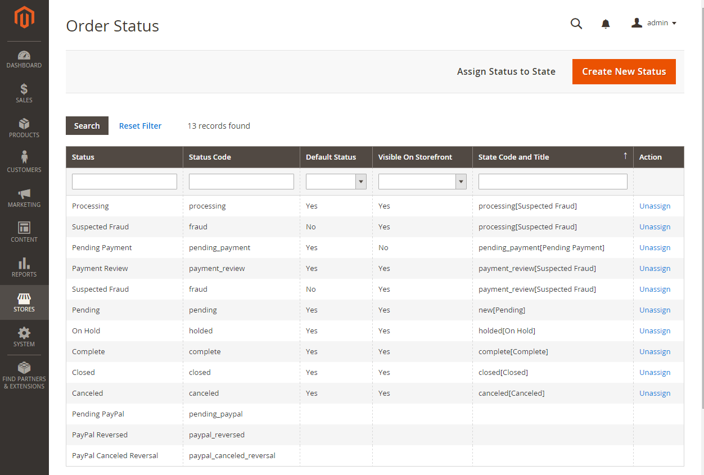
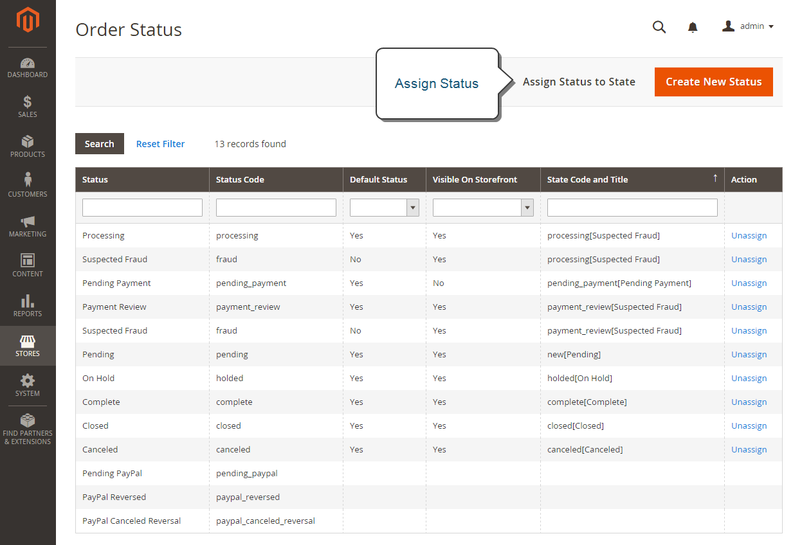

9 - Sales Operations
====================

9.1 Demonstrate ability to customize sales operations
-----------------------------------------------------

**Describe the Order entity**

### Sales Order

> Like all Modules, Magento_Sales uses the [Service Contracts](#h.i0qq8aqgijv7) design pattern to manage (C.R.U.D actions) Sales Orders with the following Repositories:
>
> Order repository interface.
>
> The main interface for managing (C.R.U.D actions) Sales Orders.
>
> An order is a document that a web store issues to a customer. Magento generates a sales order that lists the product items, billing and shipping addresses, and shipping and payment methods. A corresponding external document, known as a purchase order, is emailed to the customer.

```php
Magento\Sales\Api\OrderRepositoryInterface::save(
        Magento\Sales\Api\Data\OrderInterface $entity
);
```

> Credit memo repository interface.
>
> After a customer places and pays for an order and an invoice has been issued, the merchant can create a credit memo to refund all or part of the amount paid for any returned or undelivered items. The memo restores funds to the customer account so that the customer can make future purchases.

```php
Magento\Sales\Api\CreditmemoRepositoryInterface::save(
        Magento\Sales\Api\Data\CreditmemoInterface $entity
);
```

> Credit memo management interface.
>
> After a customer places and pays for an order and an invoice has been issued, the merchant can create a credit memo to refund all or part of the amount paid for any returned or undelivered items. The memo restores funds to the customer account so that the customer can make future purchases.

```php
Magento\Sales\Api\CreditmemoManagementInterface::refund(
        Magento\Sales\Api\Data\CreditmemoInterface $creditmemo
);
```

> Credit memo item repository interface.
>
> After a customer places and pays for an order and an invoice has been issued, the merchant can create a credit memo to refund all or part of the amount paid for any returned or undelivered items. The memo restores funds to the customer account so that the customer can make future purchases. A credit memo item is an invoiced item for which a merchant creates a credit memo.

```php
Magento\Sales\Api\CreditmemoItemRepositoryInterface::save(
        Magento\Sales\Api\Data\CreditmemoItemInterface $entity
);
```

> Credit memo comment repository interface.
>
> After a customer places and pays for an order and an invoice has been issued, the merchant can create a credit memo to refund all or part of the amount paid for any returned or undelivered items. The memo restores funds to the customer account so that the customer can make future purchases. A credit memo usually includes comments that detail why the credit memo amount was credited to the customer:

```php
Magento\Sales\Api\CreditmemoCommentRepositoryInterface::get(
        int $id
);
```

> Invoice repository interface.
>
> An invoice is a record of the receipt of payment for an order.

```php
Magento\Sales\Api\InvoiceRepositoryInterface::save(
        \Magento\Sales\Api\Data\InvoiceInterface $entity
);
```

> Invoice management interface.
>
> An invoice is a record of the receipt of payment for an order.

```php
Magento\Sales\Api\InvoiceManagementInterface::notify(
        int $id
);
```

> Invoice Order Interface
>
> The interface for invoicing orders setting them as paid.

```php
Magento\Sales\Api\InvoiceOrderInterface::execute(
        int $orderId,
        bool $capture = false,
        Magento\Sales\Api\Data\InvoiceItemCreationInterface[] $items = [],
        bool $notify = false,
        bool $appendComment = false,
        Magento\Sales\Api\Data\InvoiceCommentCreationInterface $comment = null,
        Magento\Sales\Api\Data\InvoiceCreationArgumentsInterface $arguments = null
);
```

> Invoice item repository interface.
>
> An invoice is a record of the receipt of payment for an order. An invoice item is a purchased item in an invoice.

```php
Magento\Sales\Api\InvoiceItemRepositoryInterface::save(
        \Magento\Sales\Api\Data\InvoiceItemInterface $entity
);
```

> Invoice comment repository interface.
>
> An invoice is a record of the receipt of payment for an order. An invoice can include comments that detail the invoice history.

```php
Magento\Sales\Api\InvoiceCommentRepositoryInterface::save(
        \Magento\Sales\Api\Data\InvoiceCommentInterface $entity
);
```

> Order address repository interface.
>
> An order is a document that a web store issues to a customer. Magento generates a sales order that lists the product items, billing and shipping addresses, and shipping and payment methods. A corresponding external document, known as a purchase order, is emailed to the customer.

```php
Magento\Sales\Api\OrderAddressRepositoryInterface::save(
        Magento\Sales\Api\Data\OrderAddressInterface $entity
);
```

> Order item repository interface.
>
> The main interface for CRUD actions on Order Items.
>
> An order is a document that a web store issues to a customer. Magento generates a sales order that lists the product items, billing and shipping addresses, and shipping and payment methods. A corresponding external document, known as a purchase order, is emailed to the customer.

```php
Magento\Sales\Api\OrderItemRepositoryInterface::save(
        Magento\Sales\Api\Data\OrderItemInterface $entity
);
```

> Order management interface.
>
> An order is a document that a web store issues to a customer. Magento generates a sales order that lists the product items, billing and shipping addresses, and shipping and payment methods. A corresponding external document, known as a purchase order, is emailed to the customer.

```php
Magento\Sales\Api\OrderManagementInterface::place(
        Magento\Sales\Api\Data\OrderInterface $order
);
```

> Order payment repository interface.
>
> The main interface for C.R.U.D actions on Order Payment entities.
>
> An order is a document that a web store issues to a customer. Magento generates a sales order that lists the product items, billing and shipping addresses, and shipping and payment methods. A corresponding external document, known as a purchase order, is emailed to the customer.

```php
Magento\Sales\Api\OrderPaymentRepositoryInterface::save(
        Magento\Sales\Api\Data\OrderPaymentInterface $entity
);
```

> Order status history repository interface.
>
> An order is a document that a web store issues to a customer. Magento generates a sales order that lists the product items, billing and shipping addresses, and shipping and payment methods. A corresponding external document, known as a purchase order, is emailed to the customer.

```php
Magento\Sales\Api\OrderStatusHistoryRepositoryInterface::save(
        Magento\Sales\Api\Data\OrderStatusHistoryInterface $entity
);
```

> Order Customer Management Interface
>
> Create a [Customer Entity](#h.u2g6b8nkpo4) account from an order ID.

```php
Magento\Sales\Api\OrderCustomerManagementInterface::create(
        int $orderId
);
```

> Refund Invoice Interface
>
> Create refund for invoice

```php
Magento\Sales\Api\RefundInvoiceInterface::execute(
        $invoiceId,
        array $items = [],
        $isOnline = false,
        $notify = false,
        $appendComment = false,
        \Magento\Sales\Api\Data\CreditmemoCommentCreationInterface $comment = null,
        \Magento\Sales\Api\Data\CreditmemoCreationArgumentsInterface $arguments = null
);
```

> Refund Order Interface
>
> Create offline refund for order

```php
Magento\Sales\Api\RefundOrderInterface::execute(
        $orderId,
        array $items = [],
        $notify = false,
        $appendComment = false,
        \Magento\Sales\Api\Data\CreditmemoCommentCreationInterface $comment = null,
        \Magento\Sales\Api\Data\CreditmemoCreationArgumentsInterface $arguments = null
);
```

> Payment Failures Interface
>
> Interface for managing payment gateway failures.

```php
Magento\Sales\Api\PaymentFailuresInterface::handle(
        int $cartId,
        string $errorMessage,
        string $checkoutType = 'onepage'
): PaymentFailuresInterface;
```

> Delegate related to orders customers operations to Customer module.
>
> Redirect to Customer module new-account page to finish creating customer based on order data.

```php
Magento\Sales\Api\OrderCustomerDelegateInterface::delegateNew(
        int $orderId
): Redirect;
```

> Shipment item repository interface.
>
> A shipment is a delivery package that contains products. A shipment document accompanies the shipment. This document lists the products and their quantities in the delivery package. A product is an item in a shipment.

```php
Magento\Sales\Api\ShipmentItemRepositoryInterface::save(
        \Magento\Sales\Api\Data\ShipmentItemInterface $entity
);
```

> Shipment management interface.
>
> A shipment is a delivery package that contains products. A shipment document accompanies the shipment. This document lists the products and their quantities in the delivery package.

```php
Magento\Sales\Api\ShipmentManagementInterface::notify(
        int $id
);
```

> Shipment repository interface.
>
> The main interface for C.R.U.D actions on Order Shipment Entities
>
> A shipment is a delivery package that contains products. A shipment document accompanies the shipment. This document lists the products and their quantities in the delivery package.

```php
Magento\Sales\Api\ShipmentRepositoryInterface::save(
        \Magento\Sales\Api\Data\ShipmentInterface $entity
);
```

> Shipment track repository interface.
>
> A shipment is a delivery package that contains products. A shipment document accompanies the shipment. This document lists the products and their quantities in the delivery package.

```php
Magento\Sales\Api\ShipmentTrackRepositoryInterface::save(
        \Magento\Sales\Api\Data\ShipmentTrackInterface $entity
);
```

> Ship Order Interface
>
> Creates new Shipment for given Order.

```php
Magento\Sales\Api\ShipOrderInterface::execute(
        $orderId,
        array $items = [],
        $notify = false,
        $appendComment = false,
        \Magento\Sales\Api\Data\ShipmentCommentCreationInterface $comment = null,
        array $tracks = [],
        array $packages = [],
        \Magento\Sales\Api\Data\ShipmentCreationArgumentsInterface $arguments = null
);
```

> Shipment comment repository interface.
>
> A shipment is a delivery package that contains products. A shipment document accompanies the shipment. This document lists the products and their quantities in the delivery package. A shipment document can contain comments.

```php
Magento\Sales\Api\ShipmentCommentRepositoryInterface::save(
        \Magento\Sales\Api\Data\ShipmentCommentInterface $entity
);
```

> Transaction repository interface.
>
> The main interface for CRUD actions on a Transaction entity.
>
> A transaction is an interaction between a merchant and a customer such as a purchase, a credit, a refund, and so on.

```php
Magento\Sales\Api\TransactionRepositoryInterface::save(
        \Magento\Sales\Api\Data\TransactionInterface $entity
);
```

Main thing to take away here is that The `Sales_Order` module is responsible for the Sales Order Entity. In this module contains Repositories that follow the [Service Contract](https://devdocs.magento.com/guides/v2.3/extension-dev-guide/service-contracts/service-contracts.html&sa=D&ust=1609223266106000&usg=AOvVaw3X_KS_UuGtifIdTL1l1NI6) design pattern to deliver injectable C.R.U.D actions on Sales Orders, Credit Memos, Comments, Sales Order Items, Invoices, Sales Addresses, Payments, Transactions & Shipment entities.

| Database Table: quote | Notable  Columns | Description |
| --- | --- | --- |
| Core Sales Order properties | `entity_id` - int(10), `increment_id` - varchar(32), state - varchar(32), status - varchar(32), `is_virtual` - smallint(5), `store_id` - smallint(5), `protect_code` - varchar(255), `base_discount_amount` - decimal(20,4), `base_discount_canceled` - decimal(20,4), `base_discount_invoiced` - decimal(20,4), `base_discount_refunded` - decimal(20,4), `base_grand_total` - decimal(20,4), `base_subtotal` - decimal(20,4), `base_subtotal_canceled` - decimal(20,4), `base_subtotal_invoiced` - decimal(20,4), `base_subtotal_refunded` - decimal(20,4), `base_tax_amount` - decimal(20,4), `base_tax_canceled` - decimal(20,4), `base_tax_invoiced` - decimal(20,4), `base_tax_refunded` - decimal(20,4), `base_to_global_rate` - decimal(20,4), `base_to_order_rate` - decimal(20,4), `base_total_canceled` - decimal(20,4), `base_total_invoiced` - decimal(20,4), `base_total_invoiced_cost` - decimal(20,4), `base_total_offline_refunded` - decimal(20,4), `base_total_online_refunded` - decimal(20,4), `base_total_paid` - decimal(20,4), `base_total_qty_ordered` - decimal(12,4), `base_total_refunded` - decimal(20,4), `discount_amount` - decimal(20,4), `discount_canceled` - decimal(20,4), `discount_invoiced` - decimal(20,4), `discount_refunded` - decimal(20,4), `grand_total` - decimal(20,4), `store_to_base_rate` - decimal(12,4), `store_to_order_rate` - decimal(12,4), subtotal - decimal(20,4), `subtotal_canceled` - decimal(20,4), `subtotal_invoiced` - decimal(20,4), `subtotal_refunded` - decimal(20,4), `total_canceled` - decimal(20,4), `total_invoiced` - decimal(20,4), `total_offline_refunded` - decimal(20,4), `total_online_refunded` - decimal(20,4), `total_paid` - decimal(20,4), `total_qty_ordered` - decimal(12,4), `total_refunded` - decimal(20,4), `edit_increment` - int(11), `email_sent` - smallint(5), `send_email` - smallint(5), `forced_shipment_with_invoice` - smallint(5), `payment_auth_expiration` - int(11), `quote_address_id` - int(11), `quote_id` - int(11), `adjustment_negative` - decimal(20,4), `adjustment_positive` - decimal(20,4), `base_adjustment_negative` - decimal(20,4), `base_adjustment_positive` - decimal(20,4), `base_subtotal_incl_tax` - decimal(20,4), `base_total_due` - decimal(20,4), `payment_authorization_amount` - decimal(20,4), `subtotal_incl_tax` - decimal(20,4), `total_due` - decimal(20,4), weight - decimal(12,4), `base_currency_code` - varchar(3), `discount_description` - varchar(255), `ext_order_id` - varchar(32), `global_currency_code` - varchar(3), `hold_before_state` - varchar(32), `hold_before_status` - varchar(32), `order_currency_code` - varchar(3), `original_increment_id` - varchar(32), `relation_child_id` - varchar(32), `relation_child_real_id` - varchar(32), `relation_parent_id` - varchar(32), `relation_parent_real_id` - varchar(32), `remote_ip` - varchar(45), `store_currency_code` - varchar(3), `store_name` - varchar(32), `x_forwarded_for` - varchar(32), `customer_note` - text, `created_at` - timestamp, `updated_at` - timestamp, `total_item_count` - smallint(5), `tax_amount` - decimal(20,4), `tax_canceled` - decimal(20,4), `tax_invoiced` - decimal(20,4), `tax_refunded` - decimal(20,4), `discount_tax_compensation_amount` - decimal(20,4), `base_discount_tax_compensation_amount` - decimal(20,4), `discount_tax_compensation_invoiced` - decimal(20,4), `base_discount_tax_compensation_invoiced` - decimal(20,4), `discount_tax_compensation_refunded` - decimal(20,4), `base_discount_tax_compensation_refunded`, `paypal_ipn_customer_notified` - int(11) | `entity_id`: used all over the code and is the global identifier. `increment_id`:  Unique identifier for an order, and commonly referred to as the `order_id` within Magento. The `increment_id` is most often used for joins to external sources, such as Google Ecommerce. `status`: Order's status. May return values such as ‘complete', ‘processing', ‘cancelled', ‘refunded', as well as any custom statuses implemented on the Magento instance. Subject to changes as the order gets processed. `store_id`: Foreign key associated with the store table. Join to store.`store_id` to determine which Magento store view is associated with the order. `is_virtual`: Relating to [Virtual Products](#h.t3fkw0wf3trp) / [Downloadable Products](#h.614rvm49j6y9). `grand_total`: The final price of the Quote/Cart. `subtotal`: Total of all Cart Items prices * by the Cart Item Qtys, before tax or discount. `base_currency_code`:  Currency for all values captured in `base_*` fields (that is `base_grand_total`, `base_subtotal`, and so on). This typically reflects the Magento store's default currency. `base_discount_amount`: Discount value applied to order. `base_grand_total`: Final price paid by the customer on the order, after all taxes, shipping, and discounts are applied. Although the precise calculation is customizable, in general the `base_grand_total` is calculated as `base_subtotal` + `base_tax_amount` + `base_shipping_amount` + `base_discount_amount` - `base_gift_cards_amount` - `base_customer_balance_amount`. `base_subtotal`: Gross merchandise value of all items included in the order. Taxes, shipping, discounts and so on are not included. `base_tax_amount`: Tax value applied to order. `created_at`: Creation timestamp of the order, usually stored locally in UTC. Depending on your configuration in MBI, this timestamp may be converted to a reporting time zone in MBI that differs from your database time zone. The difference between Base Totals & Totals are in the customer's Currency vs your shop's Base Currency. Used for the currency switcher. |
| Sales Order Shipping Properties | `shipping_method` - varchar(120), `shipping_description` - varchar(255), `shipping_amount` - decimal(20,4), `shipping_canceled` - decimal(20,4), `shipping_invoiced` - decimal(20,4), `shipping_refunded` - decimal(20,4), `shipping_tax_amount` - decimal(20,4), `shipping_tax_refunded` - decimal(20,4), `shipping_discount_amount` - decimal(20,4), `base_shipping_discount_amount` - decimal(20,4), `base_shipping_amount` - decimal(20,4), `base_shipping_canceled` - decimal(20,4), `base_shipping_invoiced` - decimal(20,4), `base_shipping_refunded` - decimal(20,4), `base_shipping_tax_amount` - decimal(20,4), `base_shipping_tax_refunded` - decimal(20,4), `can_ship_partially` - smallint(5), `can_ship_partially_item` - smallint(5), `shipping_discount_tax_compensation_amount` - decimal(20,4), `base_shipping_discount_tax_compensation_amnt` - decimal(20,4), `shipping_incl_tax` - decimal(20,4), `base_shipping_incl_tax` - decimal(20,4) | The Sales calculated shipping totals. `base_shipping_amount`: Shipping value applied to order. `shipping_address_id`: Foreign key associated with the `sales_order_address` table. Join to `sales_order_address`.`entity_id` to determine the shipping address details associated with the order. |
| Sales Order Customer Properties | `customer_id` - int(10), `ext_customer_id` - varchar(32), `customer_is_guest` - smallint(5), `customer_note_notify` - smallint(5), `billing_address_id` - int(11), `shipping_address_id` - int(11), `customer_group_id` - int(11), `customer_email` - varchar(128), `customer_firstname` - varchar(128), `customer_lastname` - varchar(128), `customer_middlename` - varchar(128), `customer_prefix` - varchar(32), `customer_suffix` - varchar(32), `customer_taxvat` - varchar(32), `customer_dob` - datetime, `customer_gender` - int(11 | De-normalised / duplicate information data regarding the customer for a specific Sales Order. `customer_id`: Foreign key associated with the `customer_entity` table, if the customer is registered. Join to `customer_entity`.`entity_id` to determine customer attributes associated with the order. If the order was placed through guest checkout, this field will be NULL.`customer_email`: Email address of the customer placing the order. This will be populated in all situations, including orders processed through guest checkout.`customer_group_id`: Foreign key associated with the `customer_group` table. Join to `customer_group`.`customer_group_id` to determine the customer group associated with the order.`billing_address_id`: Foreign key associated with the `sales_order_address` table. Join to `sales_order_address`.`entity_id` to determine the billing address details associated with the order. The reason why this information is duplicated is for preservation, in case the customer changes their information / remove's their account. It shouldn't affect Sales going forward. Another reason is for read performance purposes, duplicating this data saves on extra relational queries. |
| Sales / Cart Price Rules | `coupon_code` - varchar(255), `coupon_rule_name` - varchar(255), `applied_rule_ids` - varchar(128) | Used for [Sales / Cart Price Rules](#h.5wkclkkw15ho) (promotions) applied Rule IDs / Coupons. `coupon_code`: Coupon applied to order. If no coupon is applied, this field will be NULL |
| [Magento Store Credit](https://docs.magento.com/user-guide/sales/store-credit.html&sa=D&ust=1609223266135000&usg=AOvVaw2LYfnf25YAttTGK2tfag24) (Magento commerce/enterprise only) | `base_customer_balance_amount` - decimal(20,4), `customer_balance_amount` - decimal(20,4), `base_customer_balance_invoiced` - decimal(20,4), `customer_balance_invoiced` - decimal(20,4), `base_customer_balance_refunded` - decimal(20,4), `customer_balance_refunded` - decimal(20,4), `bs_customer_bal_total_refunded` - decimal(20,4), `customer_bal_total_refunded` - decimal(20,4) | These are all the relevant columns for [Magento Store Credit](https://docs.magento.com/user-guide/sales/store-credit.html&sa=D&ust=1609223266137000&usg=`AOvVaw2e_OHq8R`-YZDd00RyPtjP2) (Magento commerce/enterprise only). Store credit is an amount that is restored to a customer account. Customers can use their store credit to pay for purchases, and administrators can use store credit for cash refunds. Gift card balances can be credited to the customer's account, instead of using the gift card code for future purchases. |
| [Magento Giftcard Accounts](https://docs.magento.com/user-guide/catalog/product-gift-card-accounts.html&sa=D&ust=1609223266138000&usg=AOvVaw2D4ptMgaFMcQvyutR6fGJc) (Magento commerce/enterprise only) | `gift_cards` - text, `base_gift_cards_amount` - decimal(20,4), `gift_cards_amount` - decimal(20,4), `base_gift_cards_invoiced` - decimal(20,4), `gift_cards_invoiced` - decimal(20,4), `base_gift_cards_refunded` - decimal(20,4), `gift_cards_refunded` - decimal(20,4) | A gift card account is automatically created for each Gift Card that is purchased. The value of the gift card can then be applied toward the purchase of a product in your store. You can also create gift card accounts from the Admin as a promotion or service for customers. The gift card account number corresponds to the gift card code. The value in the Quote/Cart table will be the amount being redeemed. |
| [Magento Gift Options](https://docs.magento.com/user-guide/sales/gift-options.html&sa=D&ust=1609223266140000&usg=`AOvVaw21htgCw_oXhOG62HHGZshh`) | `gift_message_id` - int(11) | `gift_message_id`: The foreign key linking `quote_item` to a [Gift Option](https://docs.magento.com/user-guide/sales/gift-options.html&sa=D&ust=1609223266141000&usg=`AOvVaw0rWU_BxoYRPSqDPbxz93eN`) |
| [Magento Gift Wrapping](https://docs.magento.com/user-guide/sales/gift-wrap.html&sa=D&ust=1609223266141000&usg=`AOvVaw1mmETjVdBWtCNpOeS_87ge`) (Magento commerce/enterprise only) | `gw_id` - int(11), `gw_allow_gift_receipt` - int(11), `gw_add_card` - int(11), `gw_base_price` - decimal(12,4), `gw_price` - decimal(12,4), `gw_items_base_price` - decimal(12,4), `gw_items_price` - decimal(12,4), `gw_card_base_price` - decimal(12,4), `gw_card_price` - decimal(12,4), `gw_base_tax_amount` - decimal(12,4), `gw_tax_amount` - decimal(12,4), `gw_items_base_tax_amount` - decimal(12,4), `gw_items_tax_amount` - decimal(12,4), `gw_card_base_tax_amount` - decimal(12,4), `gw_card_tax_amount` - decimal(12,4), `gw_base_price_incl_tax` - decimal(12,4), `gw_price_incl_tax` - decimal(12,4), `gw_items_base_price_incl_tax` - decimal(12,4), `gw_items_price_incl_tax` - decimal(12,4), `gw_card_base_price_incl_tax` - decimal(12,4), `gw_card_price_incl_tax` - decimal(12,4), `gw_base_price_invoiced` - decimal(12,4), `gw_price_invoiced` - decimal(12,4), `gw_items_base_price_invoiced` - decimal(12,4), `gw_items_price_invoiced` - decimal(12,4), `gw_card_base_price_invoiced` - decimal(12,4), `gw_card_price_invoiced` - decimal(12,4), `gw_base_tax_amount_invoiced` - decimal(12,4), `gw_tax_amount_invoiced` - decimal(12,4), `gw_items_base_tax_invoiced` - decimal(12,4), `gw_items_tax_invoiced` - decimal(12,4), `gw_card_base_tax_invoiced` - decimal(12,4), `gw_card_tax_invoiced` - decimal(12,4), `gw_base_price_refunded` - decimal(12,4), `gw_price_refunded` - decimal(12,4), `gw_items_base_price_refunded` - decimal(12,4), `gw_items_price_refunded` - decimal(12,4), `gw_card_base_price_refunded` - decimal(12,4), `gw_card_price_refunded` - decimal(12,4), `gw_base_tax_amount_refunded` - decimal(12,4), `gw_tax_amount_refunded` - decimal(12,4), `gw_items_base_tax_refunded` - decimal(12,4), `gw_items_tax_refunded` - decimal(12,4), `gw_card_base_tax_refunded` - decimal(12,4), `gw_card_tax_refunded` - decimal(12,4) | These are all the relevant columns for [Magento Gift Wrapping](https://docs.magento.com/user-guide/sales/gift-wrap.html&sa=D&ust=1609223266148000&usg=AOvVaw3Ulr3t2G09fFJRoUTGOekm) (Magento commerce/enterprise only). Gift wrapping is available for any product that can be shipped, and can be offered for individual items or for the entire order. You can charge a separate price for each gift wrap design, and upload a thumbnail image of the design that appears as an option for the product in the cart. |
| [Reward Points](https://docs.magento.com/user-guide/configuration/customers/reward-points.html&sa=D&ust=1609223266148000&usg=`AOvVaw0LilImF_EsloMambWkfgKG`) (Magento commerce/enterprise only) | `reward_points_balance` - int(11), `base_reward_currency_amount` - decimal(20,4), `reward_currency_amount` - decimal(20,4), `base_rwrd_crrncy_amt_invoiced` - decimal(20,4), `rwrd_currency_amount_invoiced` - decimal(20,4), `base_rwrd_crrncy_amnt_refnded` - decimal(20,4), `rwrd_crrncy_amnt_refunded` - decimal(20,4), `reward_points_balance_refund` - int(11) | These are all the relevant columns for [Reward Points](https://docs.magento.com/user-guide/configuration/customers/reward-points.html&sa=D&ust=1609223266150000&usg=AOvVaw2LFtQeIqyXBdbx0AvAqj2G) (Magento commerce/enterprise only) Or Loyalty Points. |


[More information on the sales_order table at Magento DevDocs](https://docs.magento.com/mbi/data-analyst/data-warehouse-mgr/sales-flat-order-table.html&sa=D&ust=1609223266151000&usg=AOvVaw1BJAaPbIJMfll91v2qistl).

The main thing to remember here is that Sales adhere to the [Service Contracts](#h.i0qq8aqgijv7) design pattern, therefore all the necessary models for customisation are available within the Api/ directory of the Magento_Sales module.

**Describe how to modify order processing and integrate it with a third-party ERP system.**

> A very vague question with many possible answers depending on the requirements of the ERP system / the project. However considering we are talking about ERP integration with eCommerce this would most likely go down the route of:

*   Making entities such as Customers, Orders, Products accessible via a certain protocol in a certain format which is compatible with the ERP.
*   Creating a scheduled / event based queue / command bus system that would automate syncing.

> One way we can achieve these things (the Magento way) is by:

1.  [Creating An Integration](#h.t252zlddzc3r)
2.  [Creating A QueueConsumer](#h.il8ytp8imwo3)

> See below for details:

The below is for demonstration purposes only. Given this question is a big vague and there are many ways to achieve such a project, the following may not appear in the exam. Despite this however, Integrations and Consumers are now a core part of Magento.

###  Creating An Integration

> To make entities such as Customers, Orders, Products accessible via a certain protocol in a certain format can be achieved by creating an integration to access the Magento WebAPI which supports web services such as [REST (Representational State Transfer) and SOAP (Simple Object Access Protocol)](https://devdocs.magento.com/guides/v2.4/get-started/bk-get-started-api.html&sa=D&ust=1609223266154000&usg=AOvVaw366ATMR34Q6QtN0OpwIeYx) authenticating using [Web API authentication](https://devdocs.magento.com/guides/v2.4/get-started/authentication/gs-authentication.html&sa=D&ust=1609223266154000&usg=AOvVaw2kSAeIyx5BmQZs3cmglNMQ) / [OAuth based authentication](https://devdocs.magento.com/guides/v2.4/get-started/authentication/gs-authentication-oauth.html&sa=D&ust=1609223266154000&usg=AOvVaw147HFV2e16CD1P5Q5i4sYi) and can output in either XML or JSON formats.
>
> Create a [Data Patch](#h.fb7s5a4nvxv9):

```php
<?php

namespace Magento\DummyModule\Setup\Patch\Data;

use Magento\Integration\Model\Integration;
use Magento\Framework\Setup\Patch\DataPatchInterface;
use Magento\Framework\Setup\ModuleDataSetupInterface;
use Magento\Framework\Setup\Patch\PatchRevertableInterface;
use Magento\Integration\Model\ConfigBasedIntegrationManager;

class DummyDataPatch implements DataPatchInterface, PatchRevertableInterface
{
    /**
     * @var ConfigBasedIntegrationManager
     */
    private $integrationManager;

    /**
     * @param ConfigBasedIntegrationManager $moduleDataSetup
     */
    public function __construct(ConfigBasedIntegrationManager $integrationManager)
    {
        $this->integrationManager = $integrationManager;
    }

    /**
     * {@inheritdoc}
     */
    public function apply()
    {
        $integrations = [
            'TestIntegration1' => [
                Integration::EMAIL => 'test-integration1@magento.com',
                Integration::ENDPOINT => 'http://endpoint.com',
                Integration::IDENTITY_LINK_URL => 'http://www.example.com/identity',
                'resources' => [
                    'Magento_Customer::manage',
                    'Magento_Customer::customer'
                ]
            ],
            'TestIntegration2' => [
                Integration::EMAIL => 'test-integration2@magento.com',
                Integration::ENDPOINT => 'http://endpoint.com',
                Integration::IDENTITY_LINK_URL => 'http://www.example.com/identity'
            ]
        ];
        $this->integrationManager->processConfigBasedIntegrations($integrations);
    }

    /**
     * {@inheritdoc}
     */
    public static function getDependencies()
    {
        return [];
    }

    public function revert()
    {
        // Revert operations here
    }

    /**
     * {@inheritdoc}
     */
    public function getAliases()
    {
        return [];
    }
}
```

#### `integration/config.xml`

> In the following line from above:

```php
$this->integrationManager->processIntegrationConfig($integrations);
```

> `$integrations` must refer to your `etc/integration/config.xml` file, and the integration name value must be the same.
>
> The following example demonstrates a minimal config.xml file.

```xml
<integrations>
        <integration name="TestIntegration">
                <email>someone@example.com</email>
                <endpoint_url>https://example.com</endpoint_url>
                <identity_link_url>https://example.com/identity_link_url</identity_link_url>
        </integration>
</integrations>
```

#### `integration/api.xml`

> The `etc/integration/api.xml` file defines which API resources the integration has access to.
>
> To determine which resources an integration needs access to, review the permissions defined in each module's `etc/acl.xml` file.
>
> In the following example, the test integration requires access to the following resources in the Sales module:

```xml
<integrations>
        <integration name="TestIntegration">
                <resources>
                        <!-- To grant permission to Magento_Log::online, its parent Magento_Customer::customer needs to be declared as well-->
                        <resource name="Magento_Customer::customer" />
                        <resource name="Magento_Log::online" />
                        <!-- To grant permission to Magento_Sales::reorder, all its parent resources need to be declared-->
                        <resource name="Magento_Sales::sales" />
                        <resource name="Magento_Sales::sales_operation" />
                        <resource name="Magento_Sales::sales_order" />
                        <resource name="Magento_Sales::actions" />
                        <resource name="Magento_Sales::reorder" />
                </resources>
        </integration>
</integrations>
```

### Creating A Queue Consumer

> Magento provides the Message Queue Framework (MQF) for publishing messages to queues and creating consumers to receive them asynchronously. MQF supports MySql and RabbitMQ queue systems.
>
> A message queue requires 4 XML files in `<module_dir>/etc` folder:

*   `communication.xml` - Defines aspects of the message queue system that all communication types have in common.
*   `queue_consumer.xml` - Defines the relationship between an existing queue and its consumer.
*   `queue_topology.xml` - Defines the message routing rules and declares queues and exchanges.
*   `queue_publisher.xml` - Defines the exchange where a topic is published.

#### `communication.xml`

*   Define its datatype 'string'. This is the datatype for pushing any messages through Magento
*   Declare handler class '`MyVendor\MyModule\Model\Queue\Consumer`' with 'process' method to handle input from the queue

```xml
<?xml version="1.0"?>
<config xmlns:xsi="http://www.w3.org/2001/XMLSchema-instance" xsi:noNamespaceSchemaLocation="urn:magento:framework:Communication/etc/communication.xsd">
    <topic name="custom.queue.order" request="string">
        <handler name="processAddOrderToQueue" type="MyVendor\MyModule\Model\Queue\Consumer" method="process" />
    </topic>
</config>

```

**`<topic>` element**
| Attribute | Description |
| --- | --- |
| `name` | A string that uniquely identifies the topic. A topic name should be a series of strings that are separated by periods. The leftmost string should be the most general, and each string afterward should narrow the scope. For example, to describe actions for tending to pets, you might create names such as cat.white.feed and dog.retriever.walk. Wildcards are not supported in the communication.xml file.
| `request` | Specifies the data type of the topic. |
| `response` | Specifies the format of the response. This parameter is required if you are defining a synchronous topic. Omit this parameter if you are defining an asynchronous topic. |
| `schema` | The interface that describes the structure of the message. The format must be `<module>\Api\<ServiceName>::<methodName>`. |

**`<handler>` element**

> The handler element specifies the class where the logic for handling messages exists and the method it executes.

| Parameter | Description |
| --- | --- |
| `name` | A string that uniquely defines the handler. The name can be derived from the topic name if the handler is specific to the topic. If the handler provides more generic capabilities, name the handler so that it describes those capabilities. |
| `type` | The class or interface that defines the handler. |
| `method` | The method this handler executes. |
| `disabled` | Determines whether this handler is disabled. The default value is false. |

#### `queue_consumer.xml`

> In this file, we define the consumer parameters. It's also possible to declare a handler class in this file.

```xml
<?xml version="1.0"?>
<config xmlns:xsi="http://www.w3.org/2001/XMLSchema-instance" xsi:noNamespaceSchemaLocation="urn:magento:framework-message-queue:etc/consumer.xsd">
    <consumer name="custom.queue.order" queue="custom.queue.order" connection="db" maxMessages="5000" consumerInstance="Magento\Framework\MessageQueue\Consumer" handler="MyVendor\MyModule\Model\Queue\Consumer::process "/>
</config>
```

**`<consumer>` element**

| Attribute | Description |
| --- | --- |
| `name` (required) | The name of the consumer. |
| `queue` (required) | Defines the queue name to send the message to. |
| `handler` | Specifies the class and method that processes the message. The value must be specified in the format `<Vendor>\Module\<ServiceName>::<methodName>`. |
| `consumerInstance` | The Magento class name that consumes the message |
| `connection` | (For AMQP connections): The connection name must match the connection attribute in the `queue_topology.xml` file. Otherwise, the connection name must be db. |
| `maxMessages` | Specifies the maximum number of messages to consume. |

#### Consumer Handlers

> A handler is a class and method that processes a message. Magento has two ways to define a handler for messages:

1.  In the `<handler>` element of the module's `communication.xml` file
2.  In the `handler=""` attribute of the module's `queue_consumer.xml` file

> The following conditions determine how these handlers are processed:

*   If the consumer in `queue_consumer.xml` does not have a consumerInstance parameter defined, then the system uses the default consumer: `Magento\Framework\MessageQueue\Consumer`. In this case, if the `<consumer>` element contains the handler attribute, then it will be used, and the `<handler>` element in communication.xml will be ignored.
*   If the consumer in `queue_consumer.xml` has a `consumerInstance` defined, then the specific consumer implementation defines how the handler is used. Magento provides these consumers out-of-the-box:

#### `queue_topology.xml`

The `queue_topology.xml` file defines the message routing rules and declares queues and exchanges. It contains the following elements:

```xml
<?xml version="1.0"?>
<config xmlns:xsi="http://www.w3.org/2001/XMLSchema-instance" xsi:noNamespaceSchemaLocation="urn:magento:framework-message-queue:etc/topology.xsd">
    <exchange name="magento-db" type="topic" connection="db">
        <binding id="processAddOrderToQueueBinding" topic="custom.queue.order" destinationType="queue" destination="custom.queue.order "/>
    </exchange>
</config>
```

**`<exchange>` element**

| Attribute | Description |
| --- | --- |
| `name` (required) | A unique ID for the exchange. |
| `type` (required) | Specifies the type of exchange. Must be topic. |
| `connection` (required) | For AMQP connections, a string that identifies the connection. For MySQL connections, the connection name must be db. |
| `durable` | Boolean value indicating whether the exchange is persistent. Non-durable exchanges are purged when the server restarts. The default is true. |
| `autoDelete` | Boolean value indicating whether the exchange is deleted when all queues have finished using it. The default is false. |
| `internal` | Boolean value. If set to true, the exchange may not be used directly by publishers, but only when bound to other exchanges. The default is false. |

**`<binding>` element**

| Attribute | Description |
| --- | --- |
| `id` (required) | A unique ID for this binding. |
| `topic` (required) | The name of a topic. You can specify an asterisk (*) or pound sign (#) as wildcards. These are described below the table. |
| `destinationType` (required) | Must be `queue`. |
| `destination` (required) | Identifies the name of a queue. |
| `disabled` | Determines whether this binding is disabled. The default value is false. |
| `internal` | Boolean value. If set to true, the exchange may not be used directly by publishers, but only when bound to other exchanges. The default is false. |

> Example topic names that include wildcards:

| Attribute | Description | Matching Example Topics | Example non-matching topics |
| --- | --- | --- | --- |
| `*.*.*` | Matches any topic that contains exactly two periods. |`mytopic.createOrder.success`, `mytopic.updatePrice.item1` | `mytopic.createOrder`, `mytopic.createOrder.success.true` |
| `#` | Matches any topic name. | `mytopic`, `mytopic.createOrder.success`, `this.is.a.long.topic.name` | N/A |
| `mytopic.#` | Matches any topic name that begins with mytopic and has a period afterward. | `mytopic.success`, `mytopic.createOrder.error` | - |
| `*.Order.#` | There must be one string before .Order. There can be any number of strings (including 0) after that. | `mytopic.Order`, `mytopic.Order.Create`, `newtopic.Order.delete.success` | - |

**`<arguments>` element**

> The arguments element is an optional element that contains one or more argument elements. These arguments define key/value pairs that are passed to the broker for processing. Each argument definition must have the following parameters:

| Attribute | Description |
| --- | --- |
| `name` | The parameter name |
| `type` | The data type of the value |

> The following illustrates an arguments block:

```xml
<arguments>
        <argument name="warehouseId" xsi:type="int">1</argument>
        <argument name="carrierName" xsi:type="string">USPS</argument>
</arguments>
```

#### `queue_publisher.xml`

> Publishers
>
> Send a message to a message bus without knowing who is interested in the message.

> Subscribers
>
> Listen to the message by "subscribing". The pattern is normally used as a one-to-many broadcast of messages, but it can be used as many-to-many, if appropriate.
> The queue_publisher.xml file defines which connection and exchange to use to publish messages for a specific topic.
>
> Example setup of `queue_publisher.xml`

```xml
<?xml version="1.0"?>
<config xmlns:xsi="http://www.w3.org/2001/XMLSchema-instance" xsi:noNamespaceSchemaLocation="urn:magento:framework-message-queue:etc/consumer.xsd">
    <publisher topic="custom.queue.order">
        <connection name="db" exchange="magento-db" />
    </publisher>
</config>
```
**``<publisher>`` element**

| Attribute | Description |
| --- | --- |
| `topic` (required) | The name of the topic. |
| `disabled` | Determines whether this queue is disabled. The default value is false. |


**`<connection>` element**

| Attribute | Description |
| --- | --- |
| `name` (required) | (For AMQP connections): The connection name must match the connection attribute in the queue_topology.xml file. Otherwise, the connection name must be db. If you omit the `<connection>` element, the default connection of amqp will be used. |
| `exchange` | The name of the exchange to publish to. The default system exchange name is magento. If you omit the `<connection>` element, the default exchange magento will be used. |
| `disabled` | Determines whether this queue is disabled. The default value is false. |

You cannot enable more than one publisher for each topic.

#### Publisher Class

> In our example. Since we're using Mysql as queue systems, messages are stored in Magento's database in tables:

*   `queue` - This table manages queues.
*   `queue_message` - This table stores messages.
*   `queue_message_status` - manages the message queue workload

> To Publish (send) a message to the Message Bus you must inject the following interface into your class (be that an [Observer](#h.y2lezqicnwxl) or [Plugin](#h.nc1ow1wmf2km) etc):

`Magento\Framework\MessageQueue\PublisherInterface`

```php
$this->_publisher->publish(
        'custom.queue.order',
        $this->_json->serialize($rawData)
);
```

#### Consumer (Subscriber) Class

```php
<?php

namespace MyVendor\MyModule\Model\Queue;

/**
 * Class Consumer
 * @package MyVendor\MyModule\Model\Queue
 */
class Consumer

{
    /** @var Magento\Framework\Serialize\Serializer\Json */
    protected $_json;

    /**
     * @param string $orders
     */
    public function process($orders)
    {
        try {
            $this->execute($orders);
        } catch (\Exception $e) {
            $errorCode = $e->getCode();
            $message = __('Something went wrong while adding orders to queue');
            $this->_notifier->addCritical(
                $errorCode,
                $message
            );
            $this->_logger->critical($errorCode . ": " . $message);
        }
    }

    /**
     * @param $orderItems
     *
     * @throws LocalizedException
     */
    private function execute($orderItems)
    {
        $orderCollectionArr = [];
        /** @var \MyVendor\MyModule\Model\Queue $queue */
        $queue = $this->_queueFactory->create();
        $orderItems = $this->_json->unserialize($orderItems);

        if (is_array($orderItems)) {
            foreach ($orderItems as $type => $orderId) {
                $orderCollectionArr[] = [
                    'type' => 'order',
                    'entity_id' => $orderId,
                    'priority' => 1,
                ];
            }

            $queue->deleteQueueByType($this->_type);
            $queue->enqueueMultiRecords($orderCollectionArr);
        }
    }
}
```

Ensure the following is enable in your env.php to get Queue Consumers working:

```php
'cron' => [
        'enabled' => 1
],
'cron_consumers_runner' => [
        'cron_run' => true,
        'max_messages' => 10000,
        'consumers' => [] // Shorthand for enable all consumers
]
 ```

> Aside from running via cron, consumers can be executed with the following command:

```bash
php bin/magento queue:consumers:start [--max-messages=<value>] [--batch-size=<value>] [--single-thread] [--area-code=<value>] <consumer_name>
```

More information available at [Magento DevDocs](https://devdocs.magento.com/guides/v2.4/extension-dev-guide/message-queues/config-mq.html%23communicationxml&sa=D&ust=1609223266220000&usg=AOvVaw1acuwyN6vkI2Ecl-AWUsMJ)

**How would you add new states and statuses for an order?**

> In addition to the preset order status settings, you can create custom order status settings of your own, assign them to order states, and set a default order status for order states. For example, you might need a custom order status such as "packaging", "backordered", or a status that is specific to your needs. You can create a descriptive name for the custom status and assign it to the associated order state in the workflow.
>
> **Admin > Stores > Order Status**



More information available at [Magento DevDocs](https://docs.magento.com/user-guide/sales/order-status-custom.html&sa=D&ust=1609223266222000&usg=AOvVaw26BMukpJ5JGb1AZw-NExB9)

**What is the difference between Order State & Order Status?**

> The notions Order "`state`" & Order "`status`" are usually mixed up since their names and functions are quite similar.
>
> An Order "state" is a position of an order in the current processing flow.
>
> See table below for Magento has states Magento\Sales\Model\Order:

```php
const STATE_NEW = 'new';
const STATE_PENDING_PAYMENT = 'pending_payment';
const STATE_PROCESSING = 'processing';
const STATE_COMPLETE = 'complete';
const STATE_CLOSED = 'closed';
const STATE_CANCELED = 'canceled';
const STATE_HOLDED = 'holded';
const STATE_PAYMENT_REVIEW = 'payment_review';
```

> Each Magento Order "state" can have one or more Order "statuses" assigned to it.
>
> This makes processing easier and helps to add some flexibility to order. For example, a "Pending Payment" order state can have the following order statuses:

* Pending Payment Paypal
* Pending Payment Card
* Pending Payment Store Credit
* and the like.

> Default Order Statuses Table

| Order Status | Status Code | Description |
| --- | --- | --- |
| Processing | `processing` | Processing means that orders have either been invoiced or shipped, but not both. |
| Suspected Fraud | `fraud` | Dodgy as |
| Pending Payment | `pending_payment` | Order created without invoice |
| Payment Review | `payment_review` | In Payment Review Checkout Step |
| Pending | `pending` | Pending orders are brand new orders that have not been processed. Typically, these orders need to be invoiced and shipped. |
| On Hold | `holded` | Manual action from the user. Orders placed on hold must be taken off hold before continuing any further actions. |
| Open | `STATE_OPEN` | User has created a quote and proceeds through the checkout Order just created, not saved. |
| Complete | `complete` | Order fulfilled. Orders marked as complete have been invoiced and have shipped. |
| Closed | `closed` | Closed orders are orders that have had a credit memo assigned to it and the customer has been refunded for their order. |
| Canceled | `canceled` | Cancelled orders should be used if orders are cancelled or if the orders have not been paid for. |
| PayPal Canceled Reversal | `paypay_canceled_reversal` |  |
| Pending PayPal | `pending_paypal` | Pending PayPal orders are brand new orders that have not been cleared by PayPal. [...] |
| PayPal Reversed | `paypal_reversed` | |

**How do you change the behavior of existing states and statuses?**

Via Admin

> **Admin > Stores > Order Status > Assign Status**



More information available at [Magento DevDocs](https://docs.magento.com/user-guide/sales/order-status-custom.html%23to-edit-an-existing-order-status&sa=D&ust=1609223266236000&usg=AOvVaw24EjvZ7avcHc5vh6xEWa7r)

Programmatically

> By manipulating the "`state`" and "`status`" properties of the following interface:
>
> `Magento\Sales\Api\Data\OrderInterface $order`;
>
> Then saving using the following repository:
>
> `Magento\Sales\Api\OrderRepositoryInterface $orderRepository`;
>
> Example:

```php
$order->setState(\Magento\Sales\Model\Order::STATE_PROCESSING);
$order->setStatus('processing');
$order->addStatusToHistory($order->getStatus(), 'Custom Message');
$orderRepository->save($order);
```

**Describe how to modify order processing flow.**

> To modify order processing, you can use an [Observer](#h.y2lezqicnwxl) or [Plugin](#h.nc1ow1wmf2km)
>
> Plugin
>
> You can create a [Plugin](#h.nc1ow1wmf2km) for one of the methods of the following Api interface:

```php
Magento\Quote\Api\CartManagementInterface::placeOrder
Magento\Quote\Api\CartManagementInterface::submitQuote
```

> Observer
>
> Or you can create an [Observer](#h.y2lezqicnwxl) for one of the following events:

*   `sales_model_service_quote_submit_before`
*   `sales_model_service_quote_submit_success`
*   `sales_model_service_quote_submit_failure`
*   `checkout_submit_before`
*   `checkout_submit_all_after`

**Describe how to customize invoices. How would you customize invoice generation, capturing, and management?**

> To create/customise an invoice, use the interface:
>
> `Magento\Sales\Api\InvoiceManagementInterface`
>
> And it's concrete implementation method prepareInvoice:
>
> `Magento\Sales\Model\Service\InvoiceService::prepareInvoice`
>
> `Magento\Sales\Model\Service\InvoiceService::prepareInvoice` method, which in turn uses `Magento\Sales\Model\Order\Invoice`. In order to add your logic to the invoice creation process, you can use one of the following events to create an [Observer](#h.y2lezqicnwxl):

*   `sales_order_invoice_pay`
*   `sales_order_invoice_cancel`
*   `sales_order_invoice_register`


> An invoice can have one of the three states:

* `STATE_OPEN`
* `STATE_PAID`
* `STATE_CANCELED`

> There are 2 types of invoice:

1.  Online Invoice - Online invoice calls the capture method for payment, which in turn can send a request to the payment system.
2.  Offline Invoice - Offline invoice changes the payment information only at the Magento side.

**Describe refund functionality in Magento. Which refund types are available, and how are they used?**

> Credit Memo are responsible in Magento 2 for refunding orders, allowing to return the order partially or completely. Also,
>
> There are 2 types of refund:

1.  Online - While online refund sends a query to the payment system. PayPal for example.
2.  Offline - An offline refund is performed on Magento side and does not send any requests to the payment processing system.

> A refund can be offline and online (depending on the order type). By default, they are mostly always offline as the money is handled elsewhere / the client would usually have an ERP system to manage refunds that can integrate into Magento.
>
> An example of a void transaction:

```php
<?php

protected function _void($isOnline, $amount = null, $gatewayCallback = 'void')
{
    $order = $this->getOrder();
    $authTransaction = $this->getAuthorizationTransaction();
    $this->setTransactionId(
        $this->transactionManager->generateTransactionId($this, Transaction::TYPE_VOID, $authTransaction)
    );
    $this->setShouldCloseParentTransaction(true);

    // Attempt to void
    if ($isOnline) {
        $method = $this->getMethodInstance();
        $method->setStore($order->getStoreId());
        $method->{$gatewayCallback}($this);
    }
}
```
The Magento 2 Enterprise/Commerce Edition also allows the refund into Store Credits, with which a customer can later pay for other items in this store.